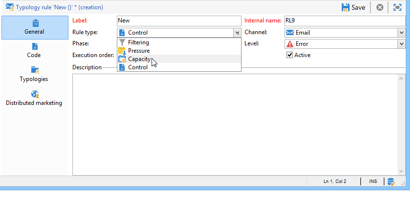
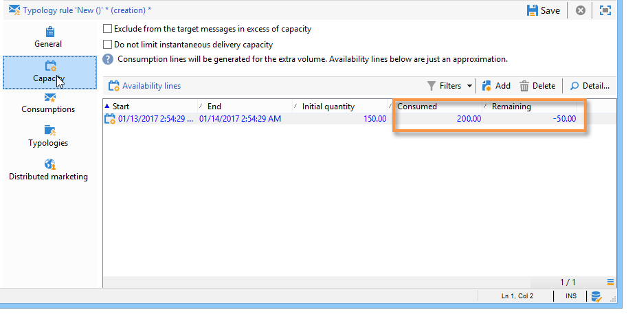
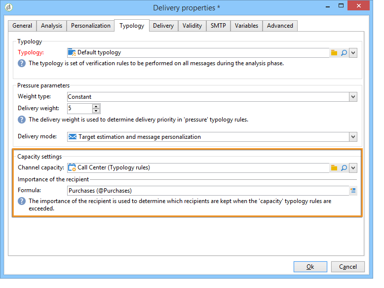

# 一致性规则{#consistency-rules}

## 关于一致性规则 {#about-consistency-rules}

Adobe Campaign通过营销活动类型中包含的一组规则，确保通信的连续性。 其目的是控制发送给收件人的投放，如数量、性质、相关性等。

例如，**容量**&#x200B;规则可以避免消息投放所关注的平台过载。 例如，包含下载链接的特殊优惠不得同时发送给太多人，以免服务器饱和；电话营销活动不得超出呼叫中心的处理能力等。 有关详情，请参阅[控制容量](#controlling-capacity)。

## 控制能力 {#controlling-capacity}

在投放消息之前，您需要确保贵组织有能力处理投放（物理基础架构）、投放可能生成的响应（入站消息）以及联系订阅者的呼叫次数（呼叫中心处理能力），例如。

为此，您需要创建&#x200B;**[!UICONTROL Capacity]**&#x200B;分类规则。

在以下示例中，我们为电话忠诚度营销活动创建分类规则。 我们将消息数量限制为每天20条，即呼叫中心的每日处理能力。 将规则应用于两个投放后，我们可以通过日志监控使用情况。

要设计新容量规则，请执行以下步骤：

1. 在&#x200B;**[!UICONTROL Administration > Campaign management > Typology management > Typology rules]**&#x200B;节点下，单击&#x200B;**[!UICONTROL New]**。
1. 选择&#x200B;**[!UICONTROL Capacity]**&#x200B;规则类型。

   

1. 在&#x200B;**[!UICONTROL Capacity]**&#x200B;选项卡中，创建可用性行：在我们的示例中，这些是可进行调用的时间段。 选择24小时期间并在初始数量中输入150，这意味着呼叫中心每天可以处理150次呼叫。

   

   >[!NOTE]
   >
   >可用性行仅供参考。 如果达到容量限制时需要排除邮件，请参阅[此部分](#exclude-messages-when-capacity-limit-reached)。

1. 将此规则与分类关联，然后将该分类引用到您的投放以应用此容量规则。 如需详细信息，请参阅[此小节](applying-rules.md#applying-a-typology-to-a-delivery)。
1. 您可以从规则&#x200B;**[!UICONTROL Consumptions]**&#x200B;和&#x200B;**[!UICONTROL Capacity]**&#x200B;选项卡中监视消耗。

   在投放中使用规则时，**[!UICONTROL Consumed]**&#x200B;和&#x200B;**[!UICONTROL Remaining]**&#x200B;列提供有关加载的信息，如下所示：

   

   如需详细信息，请参阅[此小节](#monitoring-consumption)。

## 定义最大负载 {#defining-the-maximum-load}

要定义最大负荷，您需要定义可用性行。 为此，有两个可用选项：您可以手动创建一个或多个可用性行（请参阅[逐一添加可用性行](#adding-availability-lines-one-by-one)）或创建可用性范围。 这些时间段的频率可以自动进行（请参阅[添加一组可用性行](#add-a-set-of-availability-lines)）。

### 逐一添加可用性行 {#adding-availability-lines-one-by-one}

要创建可用性行，请单击&#x200B;**[!UICONTROL Add]**&#x200B;按钮并选择&#x200B;**[!UICONTROL Add an availability line]**。 输入可用性期间和可用负荷。

根据需要添加任意数量的行以适合您的处理能力。

### 添加一组可用性行 {#add-a-set-of-availability-lines}

要定义给定时间的可用时段，请单击&#x200B;**[!UICONTROL Add]**&#x200B;按钮并选择&#x200B;**[!UICONTROL Add a set of availability lines]**&#x200B;选项。 指示每个时段的持续时间以及要创建的期间数。

要自动设置页面创建频率，请单击&#x200B;**[!UICONTROL Change]**&#x200B;按钮并定义时间段计划。

例如，我们定义一个时间表，为所有工作日创建可用性时段，在上午9点到下午5点之间，每小时接听10次呼叫。 要执行此操作，请应用以下步骤：

1. 选择周期类型以及有效期间的天数和小时：

   

1. 指示有效日期：

   

1. 在批准计划之前检查计划：

   

**[!UICONTROL Forecasting]**&#x200B;工作流会自动创建所有匹配的行。

>[!NOTE]
>
>我们建议通过文件导入创建可用性行。 通过此选项卡，可以查看和检查消耗行。

## 达到容量限制时排除消息 {#exclude-messages-when-capacity-limit-reached}

可用性行仅供参考。 要排除超出的消息，请选中&#x200B;**[!UICONTROL Exclude from the target messages in excess of capacity]**&#x200B;选项。 这样可防止超出容量。 对于与上例相同的人口，冲减和剩余能力不能超过初始数量：

可处理的最大消息数在定义的可用性范围内平均细分。 这尤其与呼叫中心相关，因为它们每天的最大呼叫数是有限的。 对于电子邮件投放，**[!UICONTROL Do not limit instantaneous delivery capacity]**&#x200B;选项允许您忽略此可用性范围，同时发送电子邮件。

>[!NOTE]
>
>在过载的情况下，将根据投放属性中定义的公式选择已保存的消息。

## 监测消耗 {#monitoring-consumption}

默认情况下，容量规则仅用于指示用途。 选择&#x200B;**[!UICONTROL Exclude messages in excess of capacity from the target]**&#x200B;选项可防止超出定义的负载。 在这种情况下，使用此分类规则将自动从投放中排除多余的消息。

要监视使用，请查看类型规则中&#x200B;**[!UICONTROL Capacity]**&#x200B;选项卡的&#x200B;**[!UICONTROL Consumed]**&#x200B;列中显示的值。

要查看消耗行，请单击规则中的&#x200B;**[!UICONTROL Consumptions]**&#x200B;选项卡。
