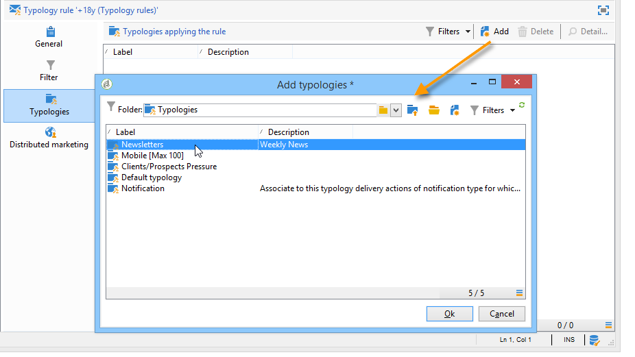
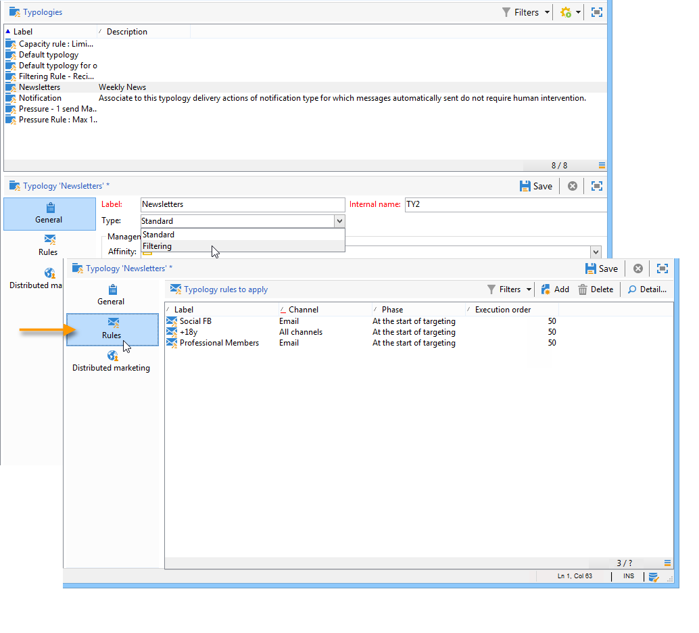

# 筛选规则{#filtering-rules}

过滤规则允许您根据查询中定义的条件定义要排除的消息。 这些规则链接到定向维度。

筛选规则可以链接到其他类型的规则（控制、压力等） 按类型分组，或分组到专用的 **正在筛选** 类型。 有关详细信息，请参见 [创建和使用过滤类型](#creating-and-using-a-filtering-typology).

## 创建筛选规则 {#creating-a-filtering-rule}

例如，您可以筛选新闻稿订阅者，以阻止将通信发送给未成年的收件人。

要定义此过滤器，请应用以下步骤：

1. 创建 **[!UICONTROL Filtering]** 适用于所有通信渠道的类型规则。

   

1. 更改默认定位维度并选择订阅(**nms：subscription**)。

   

1. 使用以下方式创建过滤器 **[!UICONTROL Edit the query from the targeting dimension...]** 链接。

   

1. 将此规则链接到营销活动类型并保存。

   

在投放中使用此规则时，将自动排除未成年订阅者。 特定消息指示规则应用：

## 为筛选规则设置条件 {#conditioning-a-filtering-rule}

您可以根据链接的投放或投放大纲限制筛选规则的应用程序字段。

为此，请转到 **[!UICONTROL General]** 类型规则的选项卡中，选择要应用的限制类型并创建过滤器，如下所示：

在这种情况下，即使该规则链接到所有投放，它也只应用于与所定义过滤器的条件匹配的投放。

>[!NOTE]
>
>可以在工作流的中使用类型和筛选规则 **[!UICONTROL Delivery outline]** 活动。 如需详细信息，请参阅[此小节](../../workflow/using/delivery-outline.md)。

## 创建和使用过滤类型 {#creating-and-using-a-filtering-typology}

您可以创建 **[!UICONTROL Filtering]** 类型：仅包含筛选规则。

选择目标后，这些特定分类可以链接到投放：在投放向导中，单击 **[!UICONTROL To]** 链接，然后单击 **[!UICONTROL Exclusions]** 选项卡。

然后，选择要应用于投放的筛选类型。 要执行此操作，请单击 **[!UICONTROL Add]** 按钮并选择要应用的类型。

您还可以通过此选项卡直接链接筛选规则，而无需将它们分组到分类中。 要实现此目的，请使用窗口的下半部分。

>[!NOTE]
>
>只有类型和筛选规则在选择窗口中可用。
>
>这些配置可以在投放模板中定义，以自动应用于使用该模板创建的所有新投放。
>

## 默认可投放性排除规则 {#default-deliverability-exclusion-rules}

默认情况下，有两种筛选规则可用： **[!UICONTROL Exclude addresses]** ( **[!UICONTROL addressExclusions]** )和 **[!UICONTROL Exclude domains]** ( **[!UICONTROL domainExclusions]** )。 在电子邮件分析期间，这些规则将收件人电子邮件地址与包含在可投放性实例中管理的加密全局禁止列表中的禁止地址或域名进行比较。 如果存在匹配项，则不会将该消息发送给该收件人。

列入阻止列表这是为了避免由于恶意活动（特别是使用Spamtrap）而添加到。 列入阻止列表例如，如果使用Spamtrap通过某个Web窗体进行订阅，则会自动向该Spamtrap发送确认电子邮件，这会导致您的地址自动添加到中。

>[!NOTE]
>
>全局隐藏列表中包含的地址和域名是隐藏的。 投放分析日志中仅指示排除的收件人的数量。
