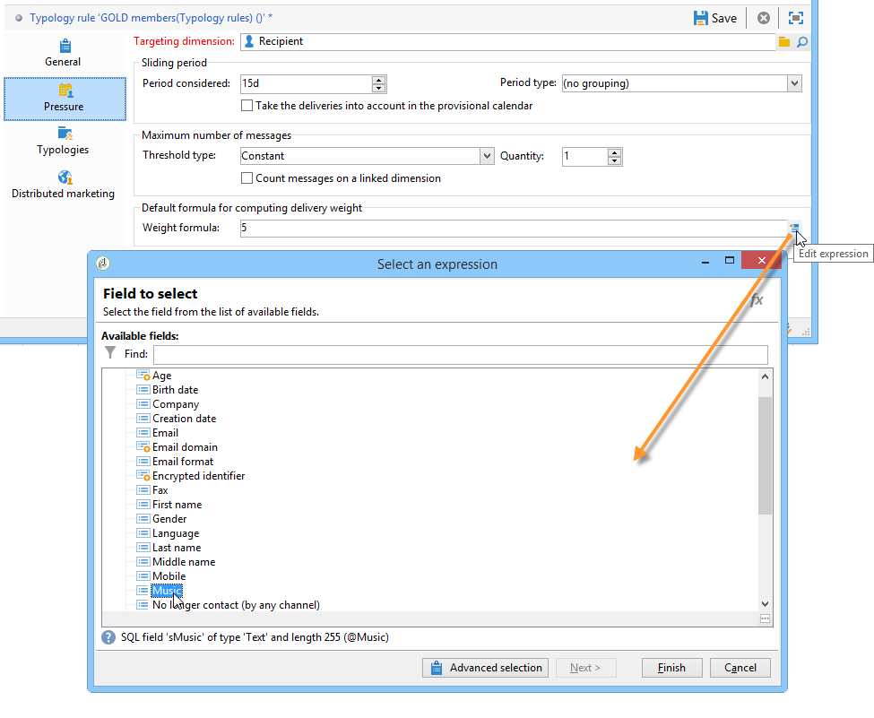
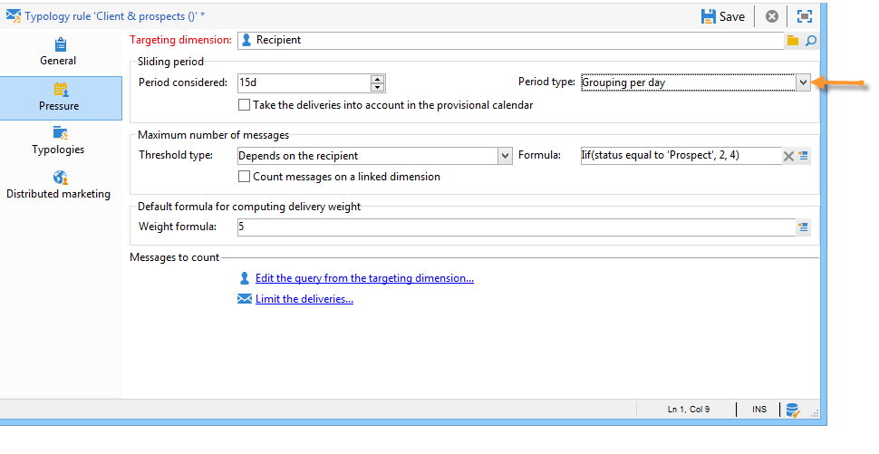
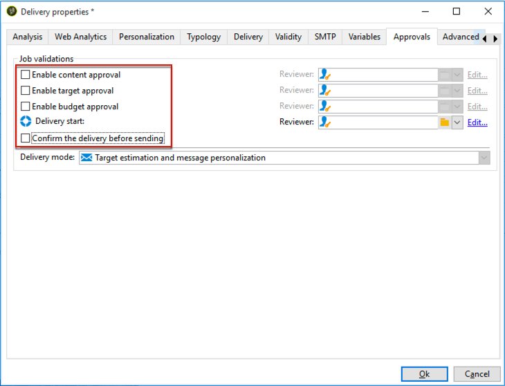

# 压力规则{#pressure-rules}

## 关于营销疲劳度 {#about-marketing-fatigue}

通过实施销售压力管理，您可以避免在数据库中过度招徕顾客，这也称为营销疲劳度。 为此，您可以定义每个收件人的最大消息数。 它还允许您在营销活动之间实施仲裁规则，以将最佳消息发送给目标受众。

**压力** 例如，为了管理营销疲劳度，将要发送给一个群体的信件数量限制为两个、选择最符合一组订户的利益的通信、避免向不满意的客户发送SMS等。

根据定义的阈值和消息权重选择营销活动。

* 阈值是在给定时段内为给定收件人授权的最大投放数量。 它可以为set或variable。 在分类规则设置中对其进行设置或计算。 请参阅 [最大消息数](#maximum-number-of-messages).
* 利用投放权重，您可以确定压力管理框架内的优先级最高的投放。具有最高权重的消息优先。请参阅 [消息权重](#message-weight).

仲裁包括确保权重大于正在进行的营销活动的计划营销活动不会导致过多的用户档案请求：如果是这种情况，则将从投放中排除用户档案。

仲裁标准（消息权重和/或阈值）可能因两种类型的信息而异：

* 收件人首选项，它是声明性信息：新闻稿订阅、收件人状态（客户或潜在客户）、
* 收件人行为：购买、访问的链接等。

用于定义符合条件的消息的仲裁规则在分析阶段应用。 对于相关期间的每个收件人和收件人，如果以下公式为true，则将发送消息： **（发送的消息数）+ （权重较大的消息数）&lt;阈值**.

否则，收件人将 **[!UICONTROL Excluded by arbitration]**. 有关详细信息，请参见 [仲裁后排除](#exclusion-after-arbitration).

## 创建压力规则 {#creating-a-pressure-rule}

要使用Adobe Campaign在活动之间设置仲裁，首先要创建活动类型并定义链接类型规则(**压力** 规则)。

要创建和配置 **[!UICONTROL Pressure]** 分类规则，请应用以下步骤：

1. 在活动类型规则列表中，单击 **[!UICONTROL New]** 图标。

   

1. 在 **[!UICONTROL General]** 选项卡中，选择 **压力** 键入rule并为其输入名称和说明。

   

1. 根据需要更改执行顺序。 将多个分类规则应用为 **[!UICONTROL Typology]** 设置时，首先应用排序较低的规则。 有关详细信息，请参见 [执行顺序](applying-rules.md#execution-order).
1. 在 **[!UICONTROL Calculation parameters]** 部分，定义频率，以保存下一个每日重新仲裁执行之后的定位。 有关详细信息，请参见 [调整计算频率](applying-rules.md#adjusting-calculation-frequency).
1. 单击 **[!UICONTROL Pressure]** 选项卡，然后选择应用分类规则的日历期间。

   

   该规则将应用于联系日期包含在相关时间段的投放。

   >[!NOTE]
   >
   >仅当满足以下条件时，才会考虑已计划的投放 **[!UICONTROL Take the deliveries into account in the provisional calendar]** 已选中选项。 有关详细信息，请参见 [设置期间](#setting-the-period).
   >

1. 定义计算最大消息数的方法。

   阈值表示在相关时段内可发送给收件人的消息的最大数量。

   默认情况下，阈值为常量，您需要指定规则授权的消息数量上限。

   

   要定义变量阈值，请选择 **[!UICONTROL Depends on the recipient]** 中的值 **[!UICONTROL Type of threshold]** 字段，并使用右侧的图标打开表达式编辑器。

   

   有关详细信息，请参见 [最大消息数](#maximum-number-of-messages).

1. 指定计算交货重量的方法。

   每个投放都有一个权重，即表示其优先级的值：这支持在营销活动之间进行仲裁。 权重是使用分类规则和/或其属性中定义的公式来计算的。 有关详细信息，请参见 [消息权重](#message-weight).

1. 默认情况下，所有消息都会考虑阈值计算式。此 **[!UICONTROL Restriction]** 选项卡允许您过滤由分类规则关注的消息：

   * 利用此选项卡的上半部分，可限制相关的收件人。
   * 利用此选项卡的下半部分，可筛选要计数的消息。

     在以下示例中，只有收件人保存在 **新建联系人** 考虑文件夹，并从开始投放 **新闻稿** 很担心。

   

1. 此 **[!UICONTROL Typologies]** 选项卡允许您查看应用此规则的促销活动类型，或将规则链接到一个或多个现有类型。 有关详细信息，请参见 [应用分类](about-campaign-typologies.md#applying-typologies).

## 定义阈值和权重 {#defining-thresholds-and-weights}

### 最大消息数 {#maximum-number-of-messages}

每个压力规则定义一个阈值，即在给定时间段内可以向一个收件人发送的最大消息数。 达到此阈值后，只有在所考虑的时段结束后，才会再进行投放。通过此流程，您可以在消息数量超过设置的阈值时自动将收件人从投放中排除，从而避免过度通信。

阈值可以是常量，也可以通过带有变量的公式来计算。 这意味着在给定的时间段内，阈值可能因收件人而异，甚至对于同一收件人也可能有所不同。

>[!CAUTION]
>
>正在进入 **0** 作为阈值，会阻止在所考虑时段内向目标群体投放所有内容。

**示例:**

您可以根据收件人所属的区段索引授权消息的数量。 这意味着属于Web区段的收件人可能会收到比其他收件人更多的消息。 An **[!UICONTROL Iif (@origin='Web', 5, 3)]** type formula授权向收件人投放5条消息，为其他区段投放3条消息。 配置将如下所示：

要定义阈值，您可以使用链接到定向维度的维度：例如，要包含投放到访客表中存储的收件人用户档案的消息(有关访客表的更多信息，请参阅 [本节](../../surveys/using/use-case--creating-a-refer-a-friend-form.md))，或避免每周向同一家庭发送多条消息（可能指多个电子邮件地址），这些消息在与收件人链接的维度中识别。

要执行此操作，请选择 **[!UICONTROL Count messages on a linked dimension]** 选项，然后选择访客或contact表。

### 消息权重 {#message-weight}

每个投放都有一个代表其优先级的权重。默认情况下，投放权重设置为 5。压力规则允许您定义将应用这些规则的投放的权重。

可以通过公式设置或计算权重以满足收件人的需求。例如，您可以根据收件人兴趣来定义投放权重。

>[!CAUTION]
>
>对于每种投放，在类型规则中定义的权重可单独过载，具体情况如下： **[!UICONTROL Properties]** 选项卡。 单击 **[!UICONTROL Typology]** 选项卡以选择营销活动类型，并根据需要指定要应用的权重。\
>但是，在A分类规则中声明的权重不会用于计算B分类规则：此权重将仅涉及使用A规则的投放。

**示例:**

在以下示例中，我们希望将新闻稿在音乐中的权重与其收件人的倾向分数关联起来。 操作步骤：

1. 创建新字段以存储收件人倾向分数。 字段， **@Music** 在这种情况下，将通过使用调查和在线投票的答案、收集的跟踪数据等来丰富数据。
1. 创建分类规则以根据此字段计算消息权重。

   

1. 将此规则应用于包含以下主题的消息：新闻稿、特殊优惠等。 这些投放的权重，因此其优先级将取决于每个收件人的倾向分数。

## 设置期间 {#setting-the-period}

压力规则在中定义 **n** — 天滚动周期。

周期配置于 **[!UICONTROL Pressure]** 选项卡中。 您可以指定天数，并根据需要选择要应用的分组类型（日、周、月、季度等）。

分组类型允许您扩展 **[!UICONTROL Period considered]** 字段到期间日期的整天、日历周、日历月或日历年。

例如，如果压力规则规定每周发送2条消息的阈值并对每个日历月进行分组，则将阻止在同一周内和同一日历月内发送超过2条消息。 警告：如果时段与两个月重叠，则计算阈值将考虑这两个日历月内的投放情况，因此可能会阻止第二个月内的所有新投放情况。

请注意，默认情况下，计算阈值时只考虑已发送的投放。 在Campaign Classicv7中，检查 **[!UICONTROL Take the deliveries into account in the provisional calendar]** 选项。 在这种情况下，考虑的时段会加倍，以便将未来投放与之前投放整合在一起。

要将考虑的投放限制在2周内，您可以：

1. 输入 **15天** 在 **[!UICONTROL Concerned period]** 字段：在计算时，将考虑在应用规则的投放日期前两周发送的投放，

或者

1. 输入 **7天** 在 **[!UICONTROL Period considered]** 字段并检查 **[!UICONTROL Take the deliveries into account in the provisional calendar]** 选项：在计算时，将考虑在应用规则的投放日期之前7天内发送的投放数量和之后7天内计划发送的投放数量。

期间开始日期取决于数据库的配置方式。

例如，如果您对日期为12/11的投放应用了15天压力规则，但没有将其分组，则会考虑11/27至12/12之间的投放。 如果压力规则考虑临时日程表中的交付，则会考虑计划于11/27至12/27之间的所有交付。 最后，如果您在规则中为每个日历月配置分组，则计算阈值时将考虑11月和12月的所有投放（从11/1到12/31）。

**常见案例**

为了确保不考虑当前日历周的投放，以及为了不冒风险也考虑计算阈值的前一周的投放，请指定 **[!UICONTROL Period considered]** 在“0”并选择“按日历周分组”作为 **[!UICONTROL Period type]**.

当时段高于0（例如1）时，计算阈值可能会考虑前天的投放。 因此，如果前一天对应于上一个日历周，并且所选的期间类型是“按日历周分组”，则将考虑所有上一周的计算阈值。

**示例:**

我们希望创建一个压力规则，将每两周的请求限制为3条消息，并将分组限制在日历月份。

我们来看看预定在05/30、06/3、06/8、06/12、06/22和06/30出版的6份相同重量的通讯。

预定在6月12日和30日进行的投放将不会发送：06/12投放将超过每两周发送3条消息的阈值，第30次投放将超过每个日历月授权通信的阈值。

在分析阶段，仲裁会排除这些投放的所有收件人：

对于同一规则，如果您按季度对投放进行分组，则收件人 **新闻稿第5号** 也将被排除，并且不会被发送。

最后，如果未选择分组，则仅 **新闻稿第4号** 将不会发送，因为它与前三份新闻通讯安排在相同的两周时间。

>[!NOTE]
>
>在更改分类规则的定义时，您可以创建 **模拟** 为了控制它对应用它的投放产生的影响，并监控投放彼此产生的影响。 有关详细信息，请参见 [活动模拟](campaign-simulations.md).

## 仲裁后排除 {#exclusion-after-arbitration}

仲裁每晚通过 **[!UICONTROL Forecasting]** 技术工作流和 **[!UICONTROL Campaign jobs]** 工作流。

此 **[!UICONTROL Forecasting]** 工作流会预计算当前时段（从其开始日期到当前日期）的数据，从而可在分析期间应用分类规则。 它还每晚重新计算用于仲裁的排除计数器。

因此，对于每个收件人，Adobe Campaign会检查要发送的消息数是否不超过阈值，并会考虑在相关时间段内已发送的消息数。 此信息是 **指示器**，因为所有计算都会在交付时更新。

如果此数字超过阈值，则会应用营销活动类型中定义的仲裁规则，并从权重较低的营销活动中排除收件人。

>[!NOTE]
>
>如果多个投放具有相等分数，则将发送为最早日期计划的营销活动。

## 压力规则用例 {#use-cases-on-pressure-rules}

### 根据标准调整阈值 {#adapting-the-threshold-based-on-criterion}

我们希望创建一个分类规则，防止每周向客户投放超过4条消息，每周向潜在客户投放2条消息。

要识别客户和潜在客户，请使用 **[!UICONTROL Status]** 字段，其中的0表示潜在客户，1表示客户。

要创建规则，请应用以下步骤：

1. 新建 **压力** 类型分类规则。
1. 编辑 **[!UICONTROL Pressure]** 选项卡：在 **[!UICONTROL Maximum number of messages]** 部分，创建一个公式以根据每个收件人计算阈值。 选择 **[!UICONTROL Depends on the recipient]** 中的值 **[!UICONTROL Threshold type]** 字段，然后单击 **[!UICONTROL Edit expression]** 右侧 **[!UICONTROL Formula]** 字段。

   单击 **[!UICONTROL Advanced parameters]** 按钮以定义计算公式。

   

1. 选择 **[!UICONTROL Edit the formula using an expression]** 选项并单击 **[!UICONTROL Next]**.

   

1. 在函数列表中，双击 **Iif** 中的函数 **[!UICONTROL Others]** 节点。

   然后选择收件人 **状态** 在 **[!UICONTROL Available fields]** 部分。

   

   输入以下公式： **Iif(@status=0,2，4)**

   

   使用此公式后，如果 Status 等于 0，则分配值“2”；对于所有其他 Status，则分配值“4”。

   单击 **[!UICONTROL Finish]** 以批准公式。

1. 指示应用规则的时段：在本例中为7天，用于计算每周的消息数量。

   

1. 保存规则以批准创建。

现在，可将之前创建的规则链接到分类，以将其应用于投放。 操作步骤：

1. 创建活动类型。
1. 转到 **[!UICONTROL Rules]** 选项卡，单击 **[!UICONTROL Add]** 按钮并选择之前创建的规则。

   

1. 保存分类：是否将其添加到现有分类的列表。

要在投放中使用此分类，请在投放属性的以下位置选择它： **[!UICONTROL Typology]** 选项卡，如下所示：

>[!NOTE]
>
>可以在投放模板中定义分类，以自动应用至使用此模板创建的所有投放。

在投放分析期间，会根据已发送给投放收件人的投放数量，将符合条件的投放收件人从投放中排除。 要查看此信息，您可以：

* 查看分析结果：

  

* 编辑投放并单击 **[!UICONTROL Delivery]** 选项卡和 **[!UICONTROL Exclusions]** 子选项卡：

  

* 单击 **[!UICONTROL Audit]** 选项卡，然后 **[!UICONTROL Causes of exclusions]** 子选项卡，用于显示排除项数和应用的分类规则：

  

### 根据行为计算投放权重 {#calculating-the-delivery-weight-based-on-behavior}

您可以根据收件人行为定义压力规则：因此，投放的权重可以适应因收件人而异的标准。 例如，您可以决定发送消息，这取决于收件人是否访问了您的互联网网站、点击了最新新闻稿的特定部分、订阅了信息服务，甚至取决于对调查、在线游戏等的回答。

在以下示例中，我们要创建权重为5的投放。 此权重中根据收件人行为加入了倾向分数：已从此网站订购的客户得分将为5，而从未在线订购的客户得分将为4。

要执行此类型的配置，需要使用公式来定义消息权重。 有关倾向分数和调查答案的信息必须在数据模型中可访问。 在我们的示例中， **倾向** 字段已添加。

应用以下配置步骤：

1. 新建 **压力** 类型分类规则。
1. 编辑 **[!UICONTROL Pressure]** 选项卡。 我们要创建一个基于每个收件人的阈值公式：单击 **[!UICONTROL Edit expression]** 图标（位于页面右侧） **[!UICONTROL Weight formula]** 字段。

   

1. 默认情况下，值 **5** 显示在表达式编辑器的上半部分。 我们希望将每个收件人的倾向分数添加到此权重中：将光标置于5的右侧，输入 **+** 字符并选择 **倾向** 字段。

   

1. 然后，为已购买的收件人添加更高的值。 对于他们，投放的重量必须增加5，而对于其他人，仅增加4。

   

1. 单击 **[!UICONTROL Finish]** 以保存此规则。
1. 将规则链接到活动分类，并在投放中引用此分类以进行批准。

### 仅发送权重最高的消息 {#sending-only-the-highest-weighted-messages}

您想在同一周内向每位收件人发送不超过2封邮件，限制每天发送2封邮件，并且只希望投放权重较高的邮件。

为此，您需要为同一收件人计划多个具有不同权重的投放，并应用压力规则以排除权重较低的投放。

首先，配置压力规则。

1. 创建压力规则。 有关详细信息，请参见 [创建压力规则](#creating-a-pressure-rule).
1. 在 **[!UICONTROL General]** 选项卡，选择 **[!UICONTROL Re-apply the rule at the start of personalization]** 选项。

   

   此选项会覆盖 **[!UICONTROL Frequency]** 字段，并在个性化阶段自动应用规则。 有关详细信息，请参见 [调整计算频率](applying-rules.md#adjusting-calculation-frequency).

1. 在 **[!UICONTROL Pressure]** 选项卡，选择 **[!UICONTROL 7d]** 作为 **[!UICONTROL Period considered]** 和 **[!UICONTROL Grouping per day]** 作为 **[!UICONTROL Period type]**.
1. 选择 **[!UICONTROL Take the deliveries into account in the provisional calendar]** 用于包含计划投放的选项。

   

   计算时，将考虑在投放日期前7天发送的投放以及投放日期后7天计划的投放。 有关详细信息，请参见 [设置期间](#setting-the-period).

1. 在 **[!UICONTROL Typologies]** 选项卡，将规则链接到营销活动类型。
1. 保存您的更改。

现在，为要应用压力规则的每个投放创建和配置工作流。

1. 创建营销策划. 如需详细信息，请参阅[此部分](../../campaign/using/setting-up-marketing-campaigns.md#creating-a-campaign)。
1. 在 **[!UICONTROL Targeting and workflows]** 选项卡，添加 **查询** 活动添加到工作流。 有关使用此活动的更多信息，请参阅 [本节](../../workflow/using/query.md).
1. 添加 **[!UICONTROL Email delivery]** 活动以打开工作流。 有关使用此活动的更多信息，请参阅 [本节](../../workflow/using/delivery.md).
1. 转到 **[!UICONTROL Approvals]** 选项卡 **[!UICONTROL Delivery properties]** 并禁用所有审批。

   

1. 在 **[!UICONTROL Typology]** 选项卡 **[!UICONTROL Delivery properties]**，引用要应用规则的营销活动类型。 定义投放的权重。

   

1. 在投放中，单击 **[!UICONTROL Scheduling]** 并选择 **[!UICONTROL Schedule delivery (automatic execution when the scheduled date is reached)]**. 在此示例中，选择 **[!UICONTROL Use a calculation formula]** 选项。
1. 将提取日期设置为10分钟（当前日期+ 10分钟）。
1. 将联系日期设置为第二天（当前日期+ 1天）。

   

   为了成功实施压力规则排除，请确保在联系日期和时间之前以及重新应用夜间仲裁之前设置提取日期和时间。 有关详细信息，请参见 [仲裁后排除](#exclusion-after-arbitration).

1. 取消选择 **[!UICONTROL Confirm the delivery before sending]** 选项并保存更改。
1. 对要发送的每个投放以类似方式继续。 确保为每个投放设置所需的权重。
1. 运行相关工作流以准备和发送投放。

应用夜间仲裁时，将排除对同一收件人具有较低权重的投放。 只考虑具有最高权重的投放进行发送。 有关详细信息，请参见 [消息权重](#message-weight).

考虑到本周早些时候已向相关收件人发送了电子邮件，下表显示了可以再应用于两次投放的配置示例。

<table> 
 <thead> 
  <tr> 
   <th> 投放  </th> 
   <th> 审批  </th> 
   <th> 权重  </th> 
   <th> 提取日期/时间  </th> 
   <th> 联系日期  </th> 
   <th> 投放开始日期/时间  </th> 
   <th> 仲裁工作流执行日期/时间  </th> 
   <th> 投放状态  </th> 
   <th> 投放已发送（日期/时间）  </th> 
  </tr> 
 </thead> 
 <tbody> 
  <tr> 
   <td> 投放1  </td> 
   <td> 已禁用  </td> 
   <td> 5  </td> 
   <td> 3pm  </td> 
   <td> 上午8点（第二天）  </td> 
   <td> 2pm  </td> 
   <td> 每晚  </td> 
   <td> 已排除  </td> 
   <td> 已排除  </td> 
  </tr> 
  <tr> 
   <td> 交付2  </td> 
   <td> 已禁用  </td> 
   <td> 10  </td> 
   <td> 4pm  </td> 
   <td> 上午9:00（第二天）  </td> 
   <td> 2pm  </td> 
   <td> 每晚  </td> 
   <td> 已发送  </td> 
   <td> 上午9:00（第二天）  </td> 
  </tr> 
 </tbody> 
</table>

超过两个投放的提取日期后，将在两个投放的联系日期之前重新应用夜间仲裁。 这样可查找已发送（为其处理投放、通过宽泛日志进行记录）或计划发送的所有投放（有资格接收投放的收件人，通过预测日志进行记录）的所有投放。

在压力规则定义的时间段内列出所有已发送和潜在投放后，Adobe Campaign会按权重对它们进行排序，权重最高的排在前。 达到压力规则中设置的阈值后（同一周内不超过2封电子邮件），将从投放中排除收件人。
