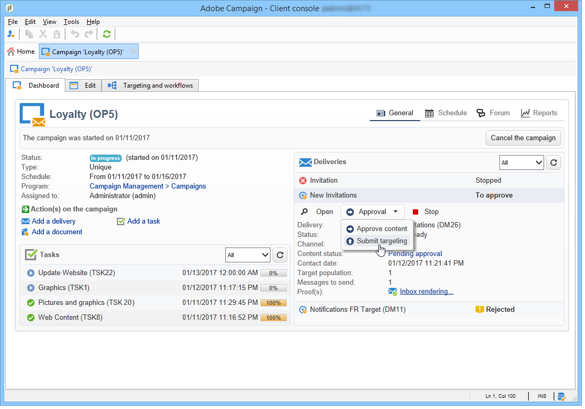

# 访问营销活动{#accessing-marketing-campaigns}

Adobe Campaign允许您创建、配置、执行和分析营销活动。 所有营销活动都可从统一的控制中心进行管理。

## 工作区基础知识 {#workspace-basics}

### 主页 {#home-page}

连接到Adobe Campaign后，使用导航栏中的链接浏览各种功能。

营销活动元素可在 **[!UICONTROL Campaigns]** 选项卡：在此，您可以查看营销项目、营销策划及其子集的概述。 营销计划由营销策划组成，营销策划由投放、任务、链接的资源等组成。 在使用Campaign进行营销活动管理的上下文中，营销活动中提供了有关投放、预算、审阅人和链接文档的信息。

的 **[!UICONTROL Browsing]** 块 **[!UICONTROL Campaigns]** 选项卡提供了各种条目，具体取决于实例上安装的模块。 例如，您可以访问：

* **营销活动日历**:计划、营销计划、投放和营销活动日历。 请参阅 [营销活动日历](#campaign-calendar).
* **促销活动**:访问所有营销项目中包含的营销活动。
* **投放**:对链接到营销策划的投放的访问权限。
* **Web应用程序**:访问web应用程序（表单、登陆页面等）。

>[!NOTE]
>
>有关Adobe Campaign整体人机工程学、权限和用户档案管理功能的更多信息，请参阅 [此部分](../../platform/using/adobe-campaign-workspace.md).
>
>有关渠道和投放的所有功能详情，请参阅 [此部分](../../delivery/using/steps-about-delivery-creation-steps.md).

### 营销活动日历 {#campaign-calendar}

每个营销活动都属于一个项目，而该项目又属于一个计划。 通过 **[!UICONTROL Campaign calendar]** 菜单 **促销活动** 选项卡。

要编辑计划、项目群、营销活动或投放，请在日历中单击其名称，然后单击 **[!UICONTROL Open...]**. 随后，它会显示在新选项卡中，如下所示：

您可以过滤营销活动日历中显示的信息：单击 **[!UICONTROL Filter]** 链接，然后选择筛选条件。

>[!NOTE]
>
>当您按日期过滤时，所有开始日期晚于指定日期和/或结束日期早于指定日期的营销活动都会显示。 使用每个字段右侧的日历选择日期。

您还可以使用 **[!UICONTROL Search]** 字段来筛选显示的项目。

链接到每个项目的图标允许您查看其状态：已完成、正在进行、正在编辑等。

### 在营销计划中浏览 {#browsing-in-a-marketing-program}

Campaign允许您管理由各种营销活动组成的一组项目。 每个营销活动都包含投放以及关联的流程和资源。

#### 浏览程序 {#browsing-a-program}

编辑程序时，请使用下面描述的选项卡浏览并配置该程序。

* 的 **计划** 选项卡显示月、周或日的项目日历，具体取决于您在日历标题中单击的选项卡。

   如有必要，您可以通过此页面创建营销策划、项目或任务。

   

* 的 **编辑** 选项卡，您可以个性化项目：名称、开始和结束日期、预算、链接的文档等。

   

#### 浏览营销活动 {#browsing-campaigns}

营销活动可通过营销活动日历( **[!UICONTROL Schedule]** 选项卡，或营销策划列表。

1. 通过营销活动日历，选择要显示的营销活动，然后单击 **[!UICONTROL Open]** 链接。

   

   营销活动在新选项卡中进行编辑，如下所示：

   

1. 通过 **[!UICONTROL Schedule]** 选项卡时，编辑模式与通过营销活动日历相同。
1. 通过 **[!UICONTROL Campaigns]** 链接 **[!UICONTROL Campaigns]** 选项卡，单击要编辑的营销活动的名称。

   

### 控制活动 {#controlling-a-campaign}

#### 仪表板 {#dashboard}

对于每个营销活动，作业、资源和投放都集中在单个屏幕（功能板）中，让您能够与他人协作管理营销操作。

营销活动的仪表板用作控制界面。 它直接访问营销活动创建和管理的主要阶段：投放、提取文件、通知、预算等。

借助Adobe Campaign，您可以设置协作流程，以创建和批准营销和沟通活动的各个阶段：预算、目标、内容等的审批

>[!NOTE]
>
>营销活动模板的配置请参见 [营销活动模板](../../campaign/using/marketing-campaign-templates.md#campaign-templates).

#### 计划 {#schedule}

营销活动可集中化一组投放。 对于每个营销活动，计划提供所有组件的全局视图：您可以显示任务和投放，并轻松访问它们。

#### 论坛 {#forum}

对于每个营销活动，运营商都可以通过专用论坛交换消息。

在 [论坛](../../mrm/using/discussion-forums.md).

#### 报告 {#reports}

的 **[!UICONTROL Reports]** 链接可让您访问营销活动报表。

>[!NOTE]
>
>有关报表的详情，请参阅 [此部分](../../reporting/using/about-adobe-campaign-reporting-tools.md).

#### 配置 {#configuration}

营销活动通过营销活动模板创建。 您可以配置可重复使用的模板，其中已为其选择某些选项并保存其他设置。 对于每个营销活动，都提供以下功能：

* 的引用 [文档和资源](../../campaign/using/marketing-campaign-deliveries.md#managing-associated-documents):您可以将文档与营销活动（简介、报告、图像等）关联。 支持所有文档格式。
* 定义成本：对于每个营销活动，Adobe Campaign允许您 [成本分录和成本计算结构](../../campaign/using/providers--stocks-and-budgets.md#defining-cost-categories) 可在创建营销活动时使用。 例如：印刷成本、使用外部代理、租房。
* 定义目标：您可以为营销活动定义可量化的目标，例如订阅者数量、业务量等。 此信息稍后会用在营销活动报表中。
* 管理 [种子地址](../../delivery/using/about-seed-addresses.md) 和 [控制组](../../campaign/using/marketing-campaign-deliveries.md#defining-a-control-group).
* 管理批准：您可以选择要批准的处理，并根据需要选择审核运算符或运算符组。 [了解详情](../../campaign/using/marketing-campaign-approval.md#checking-and-approving-deliveries)

>[!NOTE]
>
>要访问营销活动配置并对其进行更改，请单击 **[!UICONTROL Advanced campaign parameters...]** 链接 **[!UICONTROL Edit]** 选项卡。

## 使用Web界面 {#using-the-web-interface-}

您可以通过Internet浏览器访问Adobe Campaign控制台屏幕，以查看所有营销活动和投放，以及有关数据库中用户档案的报告和信息。 此访问不启用记录创建。 根据操作员权限，您可以查看和/或对数据库中的数据执行操作。 例如，您可以批准营销活动内容和定位、重新启动或停止投放等。

1. 与往常一样，通过https://登录`<your instance>:<port>/view/home`.
1. 使用菜单访问概述。

   

除了在营销活动中导航和查看外，您还可以执行以下类型的任务：

* 监控实例上的活动
* 参与验证流程，例如批准或拒绝投放内容
* 执行其他快速操作，例如暂停工作流
* 访问所有报表功能
* 参加论坛讨论

此表汇总了您可以通过浏览器对营销活动执行的操作：

| 页面  | 操作 |
| --- | --- |
| 营销活动、投放、选件等的列表。 | 删除列表项 |
| 营销活动 | 取消营销活动 |
| 投放 | 批准投放内容和目标 提交投放内容 确认投放 暂停和停止投放 |
| Web 应用程序 | 创建Web应用程序 编辑应用程序内容和属性 将应用程序内容另存为模板 发布应用程序 |
| 优惠 | 批准选件内容和资格 禁用在线选件 |
| 任务 | 完成任务 取消任务 |
| 营销资源 | 批准资源 锁定和解锁资源 |
| Campaign 包 | 提交资源包以供审批 批准或拒绝资源包 取消资源包 |
| Campaign 订单 | 创建订单 接受或拒绝订单 <!-- Je n'ai pas pu créer de campaign order pour vérifier cela. Peut-on accéder à ces fonctionnalités depuis l'accès web ? --> |
| 库存 | 删除库存行 |
| 优惠模拟 | 启动和停止模拟 |
| 定位工作流 | 启动、暂停和停止工作流 |
| 报告 | 在报表历史记录中保存当前数据 |
| 论坛 | 添加讨论 在讨论中回复留言 进行讨论并退订 |

### 审批

批准（例如，对目标或投放内容）可以通过Web访问进行。

您还可以使用通知消息中包含的链接。 有关更多信息，请参阅 [检查和批准投放](../../campaign/using/marketing-campaign-approval.md#checking-and-approving-deliveries).
