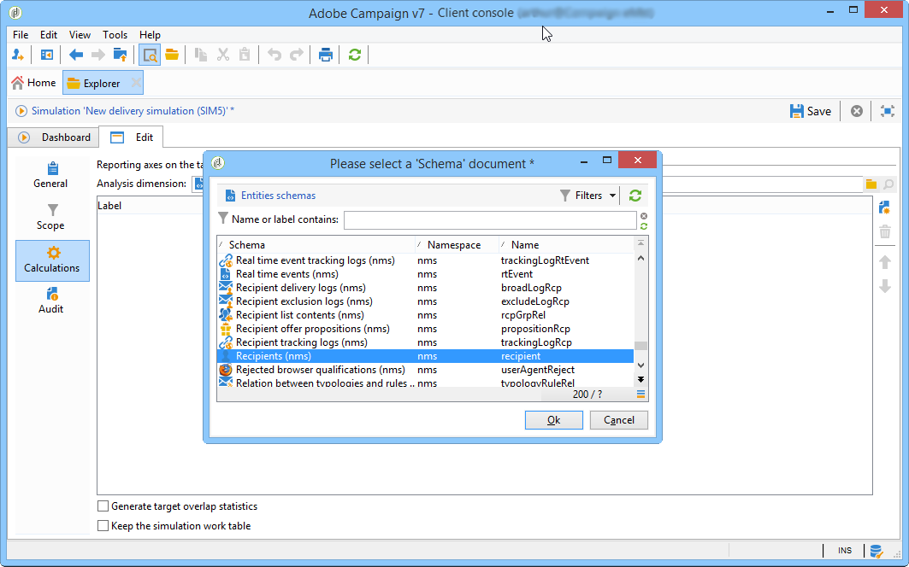
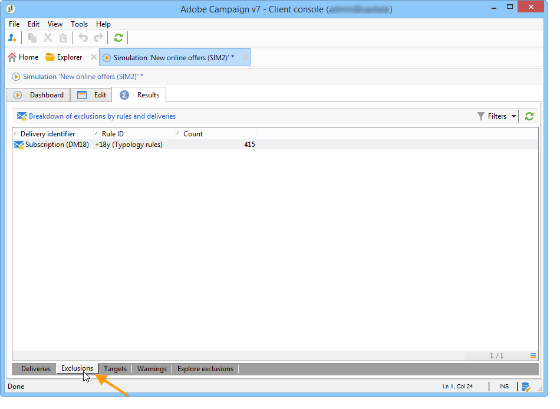

# 活动模拟{#campaign-simulations}

## 关于模拟{#about-simulations}

活动优化允许您使用模拟测试活动计划的效率。 这样，您就可以衡量活动的潜在成功：产生的收入、基于所应用目标的类型规则量等。

模拟可让您监视和比较投放的影响。

>[!NOTE]
>
>在“测试”模式下准备的投放互不影响，例如，在分布式营销中评估活动时，或在临时日历中未计划投放时。\
>这意味着压力和容量规则仅应用于&#x200B;**[!UICONTROL Target estimation and message personalization]**&#x200B;模式中的投放。 **[!UICONTROL Estimation and approval of the provisional target]**&#x200B;和&#x200B;**[!UICONTROL Target evaluation]**&#x200B;模式中的投放未被考虑在内。\
>在投放属性的&#x200B;**[!UICONTROL Typology]**&#x200B;子选项卡中选择投放模式。

## 设置模拟{#setting-up-a-simulation}

### 创建模拟{#creating-a-simulation}

要创建模拟，请应用以下步骤：

1. 打开&#x200B;**[!UICONTROL Campaigns]**&#x200B;选项卡，单击&#x200B;**[!UICONTROL Create]**&#x200B;部分中的&#x200B;**[!UICONTROL More]**&#x200B;链接，然后选择&#x200B;**[!UICONTROL Simulation]**&#x200B;选项。

   

1. 输入模板和模拟的名称。 单击&#x200B;**[!UICONTROL Save]**&#x200B;以创建模拟。

   

1. 单击&#x200B;**[!UICONTROL Edit]**&#x200B;选项卡进行配置。

   

1. 在&#x200B;**[!UICONTROL Scope]**&#x200B;选项卡中，指定要考虑此投放的模拟。 要执行此操作，请单击&#x200B;**[!UICONTROL Add]**&#x200B;按钮并指定要考虑的投放选择模式。

   

   您可以逐个选择每个投放，或按活动、项目或计划对它们排序。

   >[!NOTE]
   >
   >如果您通过计划、项目或活动选择投放，则Adobe Campaign可以自动刷新投放列表，以便在启动模拟时考虑。 要执行此操作，请选中&#x200B;**[!UICONTROL Refresh the selection of deliveries each time the simulation is started]**&#x200B;选项。
   >  
   >如果不这样做，则不会考虑计划、项目或活动中未提供的任何创建模拟的投放:稍后添加的投放将被忽略。

   

1. 选择要包含在模拟范围中的元素。 如有必要，请使用SHIFT和CTRL键选择多个元素。

   

   单击&#x200B;**[!UICONTROL Finish]**&#x200B;批准选择。

   您可以手动组合属于计划、项目或活动的选定投放和投放。

   

   如有必要，可通过&#x200B;**[!UICONTROL Edit the dynamic condition...]**&#x200B;链接使用动态条件。

   单击&#x200B;**[!UICONTROL Save]**&#x200B;批准此配置。

   >[!NOTE]
   >
   >在计算投放时，只考虑已计算目标的模拟(状态：**目标就绪**&#x200B;或&#x200B;**准备交付**)。

1. 在&#x200B;**[!UICONTROL Calculations]**&#x200B;选项卡中，选择分析维，例如收件人模式。

   

1. 然后，您可以添加表达式。

   

### 执行设置 {#execution-settings}

在模拟的&#x200B;**[!UICONTROL General]**&#x200B;选项卡中，可以输入执行设置：

* **[!UICONTROL Schedule execution for down-time]**&#x200B;选项根据所选的优先级将模拟启动时间定义为较忙的时段。 模拟使用大量模拟库资源，这就是为什么非紧急数据库应安排在夜间运行的原因。
* **[!UICONTROL Priority]**&#x200B;是应用于模拟以延迟其触发的级别。
* **[!UICONTROL Save SQL queries in the log]**.SQL日志允许您诊断模拟（如果它以错误结尾）。 它们还可以帮助您找出模拟速度太慢的原因。 这些消息将在&#x200B;**[!UICONTROL Audit]**&#x200B;选项卡的&#x200B;**[!UICONTROL SQL logs]**&#x200B;子选项卡中的模拟后显示。

## 执行模拟{#executing-a-simulation}

### 启动模拟{#starting-a-simulation}

定义模拟范围后，即可执行它。

要执行此操作，请打开模拟仪表板，然后单击&#x200B;**[!UICONTROL Start simulation]**。

执行完成后，打开模拟并单击&#x200B;**[!UICONTROL Results]**&#x200B;选项卡，以视图为每个投放计算的目标。

1. **[!UICONTROL Deliveries]**&#x200B;子标签列表模拟考虑的所有投放。 它显示了两个计数：

   * **[!UICONTROL Initial count]**&#x200B;是目标，在投放中进行估计时计算。
   * **[!UICONTROL Final count]**&#x200B;是模拟后计数的收件人数。

      初始计数和最终计数之间的差异反映了在模拟之前配置的各种规则或过滤器的应用。

      要了解有关此计算的详细信息，请编辑&#x200B;**[!UICONTROL Exclusions]**&#x200B;子选项卡。

1. 使用&#x200B;**[!UICONTROL Exclusions]**&#x200B;子选项卡可以视图排除划分。

   

1. **[!UICONTROL Alerts]**&#x200B;子选项卡将模拟期间生成的所有警报消息分组。 在容量超载时(例如，如果目标收件人数超过设置容量)，可以发送警报消息。
1. 使用&#x200B;**[!UICONTROL Exploration of the exclusions]**&#x200B;子选项卡可以创建结果分析表。 用户需要指示横坐标/纵坐标轴中的变量。

   有关创建分析表的示例，请参阅[浏览结果](#exploring-results)的结尾。

### 查看结果{#viewing-results}

#### 审核{#audit}

使用&#x200B;**[!UICONTROL Audit]**&#x200B;选项卡可以监视模拟执行。 **[!UICONTROL SQL Logs]**&#x200B;子选项卡对专家用户很有用。 它列表SQL格式的执行日志。 仅当在执行模拟之前在&#x200B;**[!UICONTROL General]**&#x200B;选项卡中选择了&#x200B;**[!UICONTROL Save SQL queries in the log]**&#x200B;选项时，才显示这些日志。

#### 浏览结果{#exploring-results}

使用&#x200B;**[!UICONTROL Exploration of the exclusions]**&#x200B;子选项卡可以分析由模拟生成的数据。

描述性分析详见[本节](../../reporting/using/about-adobe-campaign-reporting-tools.md)。

## 模拟{#results-of-a-simulation}的结果

**[!UICONTROL Log]**&#x200B;和&#x200B;**[!UICONTROL Results]**&#x200B;选项卡中的指示器提供模拟结果的首个概述。 有关结果的更详细视图，请打开&#x200B;**[!UICONTROL Reports]**&#x200B;选项卡。

### 报告 {#reports}

要分析模拟的结果，请编辑其报告：它们显示排除和原因。

默认情况下提供以下报告：

* **[!UICONTROL Detail of simulation exclusions]** :本报告详细列出了所有相关投放的排除原因。
* **[!UICONTROL Simulation summary]** :此报表显示了在各个投放中被排除在模拟之外的人口。
* **[!UICONTROL Summary of exclusions linked to the simulation]** :此报表显示由模拟引起的排除的图表以及已应用的类型规则，以及显示每个规则的排除率的图表。

>[!NOTE]
>
>您可以创建新报表并将其添加到提供的报表。 如需详细信息，请参阅[此部分](../../reporting/using/about-adobe-campaign-reporting-tools.md)。

要访问报告，请通过其仪表板单击目标模拟的&#x200B;**[!UICONTROL Reports]**&#x200B;链接。

您还可以使用从模拟仪表板访问的&#x200B;**[!UICONTROL Reports]**&#x200B;链接编辑报告。

### 比较模拟{#comparing-simulations-}

每次执行模拟时，结果将替换以前的任何结果：您无法显示结果并将结果从一个执行操作比较到另一个执行操作。

要比较结果，您需要使用报表。 事实上，Adobe Campaign允许您保存报表历史记录，以便日后再次视图它。 这段历史在模拟的整个生命周期中得以保存。

**示例:**

1. 在应用了类型学&#x200B;**A**&#x200B;的投放上创建模拟。
1. 在&#x200B;**[!UICONTROL Reports]**&#x200B;选项卡中，编辑其中一个可用报表，例如&#x200B;**[!UICONTROL Detail of simulation exclusions]**。
1. 在报表的右上角部分，单击该图标以创建新历史记录。

   

1. 关闭模拟并更改类型&#x200B;**A**&#x200B;的配置。
1. 再次执行模拟，并将结果与创建历史记录的报表中显示的结果进行比较。

   

   您可以根据需要保存任意数量的报表历史记录。

### 报告轴{#reporting-axes}

使用&#x200B;**[!UICONTROL Calculations]**&#x200B;选项卡可以定义目标上的报告轴。 在结果分析期间将使用这些轴（请参阅[浏览结果](#exploring-results)）。

>[!NOTE]
>
>我们建议在模拟模板中定义计算轴，而不是为每个模拟单独定义。\
>模拟模板保存在Adobe Campaign树的&#x200B;**[!UICONTROL Resources > Templates > Simulation templates]**&#x200B;节点中。

**示例:**

在以下示例中，我们要根据报告的状态(“收件人”、“潜在客户”或“无”)创建额外的客户轴。

1. 要定义报告轴，请选择包含要在&#x200B;**[!UICONTROL Analysis dimension]**&#x200B;字段中处理的信息的表。 此信息是强制性的。
1. 在此，我们要选择收件人表的区段字段。

   

1. 可以使用以下选项：

   * **[!UICONTROL Generate target overlap statistics]** 允许您恢复“模拟”报表中的所有重叠统计信息。重叠是指在一个模拟内至少两个投放中的收件人。

      >[!IMPORTANT]
      >
      >选择此选项会显着增加模拟执行时间。

   * **[!UICONTROL Keep the simulation work table]** 可以保留模拟跟踪。

      >[!IMPORTANT]
      >
      >自动保存这些表需要大量存储容量：确保数据库足够大。

显示模拟结果时，选定表达式的信息将显示在&#x200B;**[!UICONTROL Overlaps]**&#x200B;子选项卡中。

投放目标重叠表示一个模拟的至少两投放中的目标收件人。

>[!NOTE]
>
>仅当&#x200B;**[!UICONTROL Generate target recovery statistics]**&#x200B;选项已启用时，才显示此子选项卡。

在在&#x200B;**[!UICONTROL Exploring exclusions]**&#x200B;子选项卡中创建的排除分析报告中可以处理报告轴上的信息。 有关详细信息，请参阅[探索结果](#exploring-results)。
