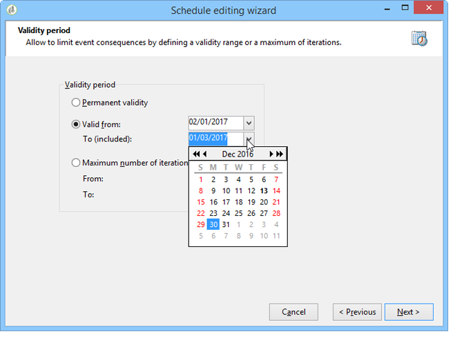

# 一致性规则{#consistency-rules}

## 关于一致性规则{#about-consistency-rules}

Adobe Campaign保证了一致的通信，这要归功于活动类型中包含的一套规则。 其目标是控制发送给收件人的投放，如数量、性质、相关性等。

**例** 如，Capacity规则可以避免消息投放引起的平台过载。例如，包含下载链接的特殊优惠不得同时发送给太多人，以避免服务器饱和；电话活动不得超过呼叫中心等的处理能力。 有关详细信息，请参阅[控制容量](#controlling-capacity)。

## 控制容量{#controlling-capacity}

在传送消息之前，您需要确保您的组织具有处理投放（物理基础结构）的能力，投放可以生成的响应（入站消息），以及要与订阅者联系的呼叫数（呼叫中心处理能力）。

为此，您需要创建&#x200B;**[!UICONTROL Capacity]**&#x200B;类型规则。

在以下示例中，我们为电话忠诚度类型规则创建活动。 我们将消息数限制为每天20个，即呼叫中心的日处理能力。 一旦将规则应用到两个投放，我们就可以通过日志来监控消费情况。

要设计新的容量规则，请按照以下步骤操作：

1. 在&#x200B;**[!UICONTROL Administration > Campaign management > Typology management > Typology rules]**&#x200B;节点下，单击&#x200B;**[!UICONTROL New]**。
1. 选择&#x200B;**[!UICONTROL Capacity]**&#x200B;规则类型。

   

1. 在&#x200B;**[!UICONTROL Capacity]**&#x200B;选项卡中，创建可用性行：在我们的示例中，这些是可以进行调用的时间段。 选择24小时的时段，然后输入150作为初始数量，这意味着呼叫中心每天可处理150个呼叫。

   

   >[!NOTE]
   >
   >可用性行仅供参考。 如果在达到容量限制时需要排除消息，请参阅[本节](#exclude-messages-when-capacity-limit-reached)。

1. 将此规则与类型学关联，然后将类型学引用到您的投放以应用此容量规则。 如需详细信息，请参阅[此部分](../../campaign/using/applying-rules.md#applying-a-typology-to-a-delivery)。
1. 您可以监视规则&#x200B;**[!UICONTROL Consumptions]**&#x200B;和&#x200B;**[!UICONTROL Capacity]**&#x200B;选项卡的使用情况。

   在投放中使用规则时，**[!UICONTROL Consumed]**&#x200B;和&#x200B;**[!UICONTROL Remaining]**&#x200B;列提供有关负载的信息，如下所示：

   

   如需详细信息，请参阅[此部分](#monitoring-consumption)。

## 定义最大负载{#defining-the-maximum-load}

要定义最大负荷，您需要定义可用性行。 为此，有两个选项可用：您可以手动创建一个或多个可用性行（请参阅[逐个添加可用性行）或创建可用性范围。 ](#adding-availability-lines-one-by-one)这些时段的频率可以自动化（请参阅[添加一组可用行](#add-a-set-of-availability-lines)）。

### 逐行添加可用性行{#adding-availability-lines-one-by-one}

要创建可用性行，请单击&#x200B;**[!UICONTROL Add]**&#x200B;按钮并选择&#x200B;**[!UICONTROL Add an availability line]**。 输入可用期和可用负荷。

根据需要添加多行以适合您的处理能力。

### 添加一组可用行{#add-a-set-of-availability-lines}

要定义给定时间的可用期，请单击&#x200B;**[!UICONTROL Add]**&#x200B;按钮并选择&#x200B;**[!UICONTROL Add a set of availability lines]**&#x200B;选项。 指示每个时间段的持续时间和要创建的期间数。

要自动创建页面的频率，请单击&#x200B;**[!UICONTROL Change]**&#x200B;按钮并定义时间段计划。

例如，让我们定义一个计划，以每小时10次呼叫的速率为所有工作日创建可用时间，时间从上午9点到下午5点。 为此，请应用以下步骤：

1. 选择周期类型以及有效的天数和小时数：

   

1. 指明有效日期：

   

1. 在批准计划之前先检查它：

   

**[!UICONTROL Forecasting]**&#x200B;工作流会自动创建所有匹配行。

>[!NOTE]
>
>我们建议通过文件导入创建可用性行。 此标签允许您视图和检查冲减行。

## 达到容量限制时排除消息{#exclude-messages-when-capacity-limit-reached}

可用性行仅供参考。 要排除多余消息，请选中&#x200B;**[!UICONTROL Exclude from the target messages in excess of capacity]**&#x200B;选项。 这可防止超出容量。 对于与上一个实例相同的人口，消耗和剩余能力不能超过初始数量：

要处理的邮件数在定义的可用范围内平均细分。 这对于呼叫中心尤为重要，因为其每天的最大呼叫数有限。 对于电子邮件投放，使用&#x200B;**[!UICONTROL Do not limit instantaneous delivery capacity]**&#x200B;选项可以忽略此可用范围并同时发送电子邮件。

>[!NOTE]
>
>在过载的情况下，根据在投放属性中定义的公式选择保存的消息。

## 监视使用情况{#monitoring-consumption}

默认情况下，容量规则仅用于指示目的。 选择&#x200B;**[!UICONTROL Exclude messages in excess of capacity from the target]**&#x200B;选项可防止超出定义的负载。 在这种情况下，使用此类型规则的投放将自动排除多余消息。

要监视消费情况，请视图类型规则中&#x200B;**[!UICONTROL Capacity]**&#x200B;选项卡的&#x200B;**[!UICONTROL Consumed]**&#x200B;列中显示的值。

要视图冲减行，请单击规则中的&#x200B;**[!UICONTROL Consumptions]**&#x200B;选项卡。
