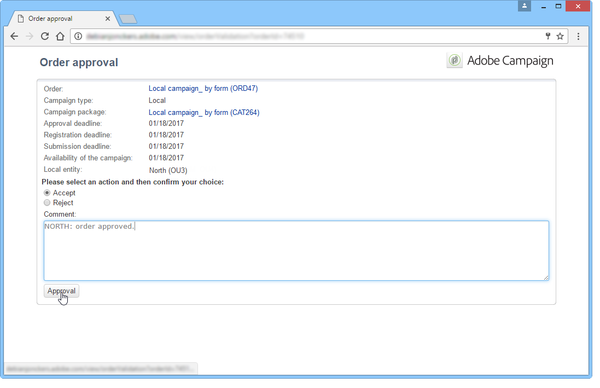

# 创建本地活动{#creating-a-local-campaign}

本地活动是从&#x200B;**[!UICONTROL campaign packages]**&#x200B;列表中引用的具有&#x200B;**特定执行计划**&#x200B;的模板创建的实例。 其目标是使用由中央实体设置和配置的活动模板来满足本地通信需求。 实施本地操作的主要阶段如下：

**对于中央实体**

1. 创建本地活动模板。
1. 从模板创建活动包。
1. 发布活动包。
1. 批准订单。

**对于本地实体**

1. 订购活动。
1. 执行活动。

## 创建本地活动模板{#creating-a-local-campaign-template}

要创建活动包，必须首先通过&#x200B;**[!UICONTROL Resources > Templates]**&#x200B;节点创建&#x200B;**活动模板**。

要创建新的本地模板，请重复默认的&#x200B;**[!UICONTROL Local campaign (opLocal)]**&#x200B;模板。

命名活动模板并填写可用字段。

在活动窗口中，单击&#x200B;**[!UICONTROL Edit]**&#x200B;选项卡，然后单击&#x200B;**[!UICONTROL Advanced campaign settings...]**&#x200B;链接。

### Web接口{#web-interface}

在&#x200B;**分布式营销**&#x200B;选项卡中，您可以选择Web界面的类型，并指定本地实体下订单时要输入的默认值和参数。

Web界面与本地实体在订购活动时要填写的表单相对应。

选择要应用于从模板创建的活动的Web界面类型：

可用的Web界面有四种类型：

* **[!UICONTROL By brief]** :本地实体必须提供描述活动配置。一旦该订单获得批准，中央实体就会整体配置并执行活动。

   

* **[!UICONTROL By form]** :本地实体可以访问Web表单，根据所使用的模板，他们可以在该表单中编辑内容、目标、最大大小以及使用个性化字段创建和提取日期。本地实体可以评估此Web表单中的目标和预览内容。

   

   提供的表单是在Web应用程序中指定的，必须从模板&#x200B;**[!UICONTROL Advanced campaign settings...]**&#x200B;链接的&#x200B;**[!UICONTROL web Interface]**&#x200B;字段的下拉列表中选择该表单。 请参阅[创建本地活动（按表单）](../../campaign/using/examples.md#creating-a-local-campaign--by-form-)。

   >[!NOTE]
   >
   >此示例中使用的Web应用程序是一个示例。 您必须创建特定的Web应用程序才能使用表单。 请参阅[API](../../configuration/using/about-web-services.md)。

   

* **[!UICONTROL By external form]** :本地实体有权访问其外部网(而非Adobe Campaign)中的活动参数。这些参数与&#x200B;**局部活动（按形式）**&#x200B;的参数相同。
* **[!UICONTROL Pre-set]** :本地实体使用默认表单订购活动，而不对其进行本地化。

   

### 默认值{#default-values}

选择要由本地实体完成的&#x200B;**[!UICONTROL Default values]**。 例如：

* 联系和提取日期，
* 目标特征（年龄段等）。

填写&#x200B;**[!UICONTROL Parent marketing program]**&#x200B;和&#x200B;**[!UICONTROL Charge]**&#x200B;字段。

### 批准{#approvals}

在&#x200B;**[!UICONTROL Advanced parameters for campaign entry]**&#x200B;链接中，可以指定审阅者的最大数量。

本地实体在订购活动时将输入审阅者。

如果不想为活动命名审阅者，请输入0。

### 文档{#documents}

您可以允许本地实体运算符链接文档(文本文件、电子表格、图像、活动说明等) 到本地活动。 **[!UICONTROL Advanced parameters for campaign entry...]**&#x200B;链接允许您限制文档数。 为此，只需在&#x200B;**[!UICONTROL Number of documents]**&#x200B;字段中输入允许的最大数。

对活动包进行排序时，表单建议链接模板中相应字段中指示的任意数量文档。

如果您不希望显示文档上载字段，请在&#x200B;**[!UICONTROL Number of documents]**&#x200B;字段中输入&#x200B;**[!UICONTROL 0]**。

>[!NOTE]
>
>可通过检查&#x200B;**[!UICONTROL Do not display the page used to enter the campaign parameters]**&#x200B;来取消激活&#x200B;**[!UICONTROL Advanced parameters for campaign entry]**。

### 工作流{#workflow}

在&#x200B;**[!UICONTROL Targeting and workflows]**&#x200B;选项卡中，创建用于收集&#x200B;**[!UICONTROL Advanced campaign settings...]**&#x200B;中指定的&#x200B;**[!UICONTROL Default values]**&#x200B;并创建活动的投放工作流。

多次单击&#x200B;**[!UICONTROL Query]**&#x200B;活动以根据指定的&#x200B;**[!UICONTROL Default values]**&#x200B;对其进行配置。

### 投放 {#delivery}

在&#x200B;**[!UICONTROL Audit]**&#x200B;选项卡中，单击&#x200B;**[!UICONTROL Detail...]**&#x200B;图标以视图选定投放的&#x200B;**[!UICONTROL Scheduling]**。

通过&#x200B;**[!UICONTROL Scheduling]**&#x200B;图标可配置投放的联系和执行日期。

如有必要，请配置投放的最大大小：

找到投放的HTML。 例如，在&#x200B;**[!UICONTROL Delivery > Current order > Additional fields]**&#x200B;中，使用&#x200B;**[!UICONTROL Age segment]**&#x200B;字段根据投放的年龄定位目标。

保存活动模板。 现在，您可以通过单击&#x200B;**[!UICONTROL Create]**&#x200B;按钮，从&#x200B;**[!UICONTROL Campaigns]**&#x200B;选项卡的&#x200B;**[!UICONTROL Campaign packages]**&#x200B;视图使用它。

>[!NOTE]
>
>活动模板及其常规配置详见[活动模板](../../campaign/using/marketing-campaign-templates.md#campaign-templates)。

## 创建活动包{#creating-the-campaign-package}

要使活动模板对本地实体可用，需要将其添加到列表。 为此，中央机构需要创建新的一揽子计划。

应用以下步骤：

1. 在&#x200B;**活动**&#x200B;页面的&#x200B;**[!UICONTROL Navigation]**&#x200B;部分，单击&#x200B;**[!UICONTROL Campaign packages]**&#x200B;链接。
1. 单击 **[!UICONTROL Create]** 按钮。

   

1. 窗口上方的部分允许您选择[以前](#creating-a-local-campaign-template)指定的活动包模板。

   默认情况下，**[!UICONTROL New local campaign package (localEmpty)]**&#x200B;模板用于本地活动。

1. 指定活动包的标签、文件夹和执行计划。

### 日期{#dates}

开始和结束日期定义活动在活动包列表中的可见性期。

发布日期是活动对本地实体（订购）可用的日期。

>[!CAUTION]
>
>如果本地实体在截止日期之前未保留活动，则无法使用。

此信息可在发送给本地机构的通知消息中找到，如下所示：

### 受众 {#audience}

对于本地活动,中央实体可以通过检查&#x200B;**[!UICONTROL Limit the package to a set of local entities]**&#x200B;来指定涉及的本地实体。

### 其他设置{#additional-settings}

保存包后，中央实体可以从&#x200B;**[!UICONTROL Edit]**&#x200B;选项卡编辑它。

在&#x200B;**[!UICONTROL General]**&#x200B;选项卡中，中央实体可以：

* 从&#x200B;**[!UICONTROL Approval parameters...]**&#x200B;链接配置活动包审阅者，
* 查看执行计划,
* 添加或删除本地实体。

>[!NOTE]
>
>默认情况下，每个实体只能对&#x200B;**本地活动**&#x200B;排序一次。
>   
>选中&#x200B;**[!UICONTROL Enable multiple creation]**&#x200B;选项，允许从活动包创建多个本地活动。

### 通知{#notifications}

当活动可用或到达注册截止日期时，将向本地通知组的操作员发送消息。 有关详细信息，请参阅[组织实体](../../campaign/using/about-distributed-marketing.md#organizational-entities)。

## 排序活动{#ordering-a-campaign}

活动包一旦获得批准并且其实施期已开始，本地实体便可以访问它们。 本地实体会收到一封电子邮件，告知他们有新的活动包可用（一旦到达其发布日期）。

>[!NOTE]
>
>如果在创建活动包时指定了某些本地实体，则只有这些才会收到通知。 如果未指定本地实体，则所有本地实体都将收到通知。

要使用中央实体提供的活动,本地实体必须订购。

要订购活动:

1. 单击通知消息中的&#x200B;**[!UICONTROL Order campaign]**&#x200B;或Adobe Campaign中的相应按钮。

   输入您的ID和密码以对活动排序。 该界面由在Web应用程序中定义的一组页面组成。

   >[!NOTE]
   >
   >Web 应用程序详见[本节](../../web/using/about-web-applications.md)。

1. 在第一页（订单标签和注释）中输入必要信息，然后单击&#x200B;**[!UICONTROL Next]**。

   

1. 完成可用参数并批准订单。

1. 系统会向本地实体所属组织实体的经理发送通知以批准此订单。

   

1. 信息将返回给本地和中央实体。 虽然本地实体只能视图自己的订单，但中央实体可以按任何本地实体视图所有订单，如下所示：

   

   操作员可以显示订单详细信息：

   

   **[!UICONTROL Edit]**&#x200B;选项卡包含本地实体在订购活动时输入的信息。

   

1. 订单必须经中央实体批准才能最终确定。

   

   有关详细信息，请参阅[批准流程](#approval-process)部分。

1. 然后，将通知本地运算符该活动可用：活动可在&#x200B;**活动**&#x200B;选项卡中活动包的列表中找到。 然后可以使用活动。 有关详细信息，请参阅[访问活动](../../campaign/using/accessing-campaigns.md)。

   **[!UICONTROL Start targeting with order approval]**&#x200B;选项允许本地实体在订单获得批准后立即运行活动。

   

## 批准订单{#approving-an-order}

要确认活动订单，中央实体必须批准订单。

通过&#x200B;**活动**&#x200B;选项卡访问的&#x200B;**[!UICONTROL Campaign orders]**&#x200B;概述允许您视图活动订单的状态并批准订单。

>[!NOTE]
>
>本地实体可以更改订单，直到订单获得批准。

### 批准流程{#approval-process}

#### 电子邮件通知{#email-notification}

当活动由本地实体订购时，其审阅者会通过电子邮件通知，如下所示：

>[!NOTE]
>
>选择审阅者显示在[审阅者](#reviewers)部分。 他们可以接受或拒绝订单。

#### 通过Adobe Campaign控制台{#approving-via-the-adobe-campaign-console}进行批准

订单也可以通过控制台在活动订单概览中进行批准。 要批准订单，请选择订单，然后单击&#x200B;**[!UICONTROL Approve the order]**。

>[!NOTE]
>
>在活动发布日期之前，仍可以编辑和重新配置活动。 本地实体还可以单击&#x200B;**[!UICONTROL Cancel]**&#x200B;按钮拒绝活动。

#### 创建营销策划{#creating-a-campaign}

活动订单一经批准，即可由本地实体配置和执行。

有关详细信息，请参阅[访问活动](../../campaign/using/accessing-campaigns.md)。

### 拒绝批准{#rejecting-an-approval}

负责审批的运营商可以拒绝订单或活动包。

如果审阅人拒绝订单，则相关通知会自动发送给相关本地实体:它将显示由拒绝审批的操作员输入的注释。

信息显示在活动包的列表页或活动订单页。 如果本地实体有权访问Adobe Campaign控制台，则会通知他们此拒绝。

他们可以视图活动包&#x200B;**[!UICONTROL Edit]**&#x200B;选项卡中的相关注释。

### 审阅者{#reviewers}

每次需要批准时，审阅者都会通过电子邮件通知。

对于每个本地实体，会选择审阅者进行活动订单审批和活动审批。 有关选择本地审阅者的详细信息，请参阅[组织实体](../../campaign/using/about-distributed-marketing.md#organizational-entities)。

>[!NOTE]
>
>要使此选择成为可能，订单批准必须尚未生效。

### 取消订单{#canceling-an-order}

中央机构可以使用订单仪表板上的&#x200B;**[!UICONTROL Delete]**&#x200B;按钮取消订单。

这会取消&#x200B;**[!UICONTROL Campaign orders]**&#x200B;视图中的活动。
