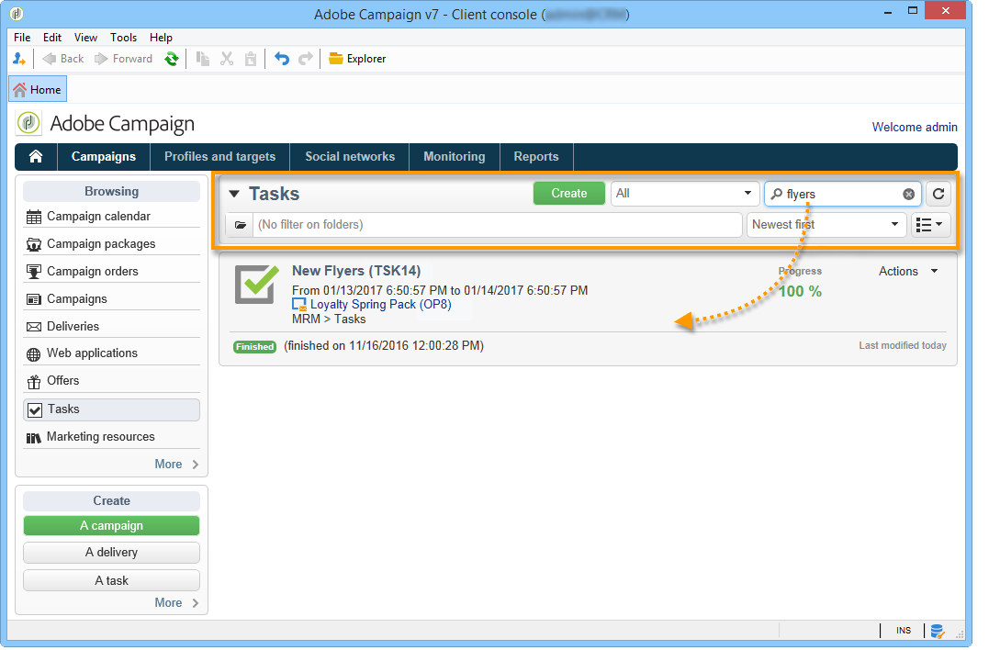
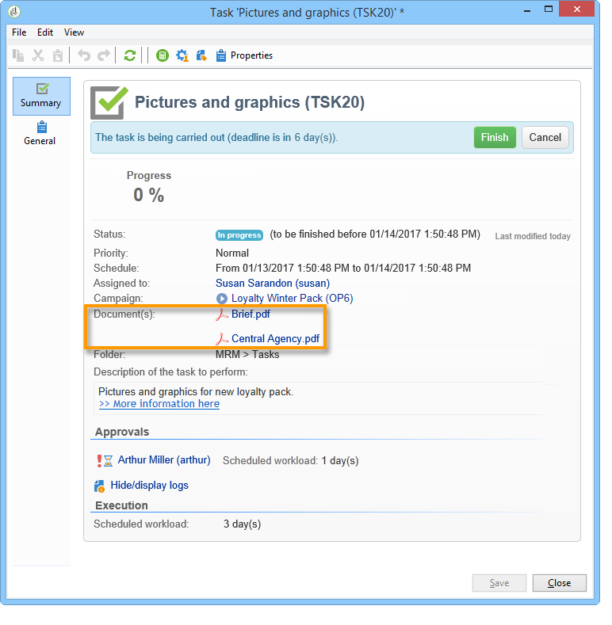
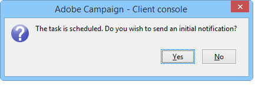
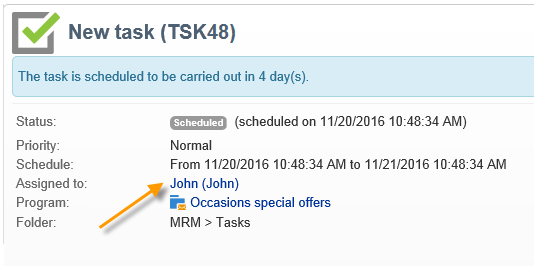
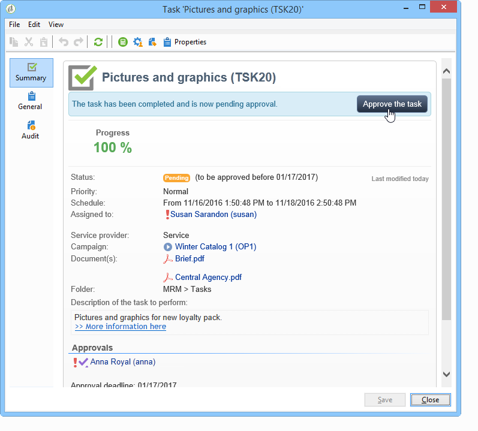

# 创建和管理任务{#creating-and-managing-tasks}

## 关于任务{#about-tasks}

Adobe Campaign允许您创建任务并直接在应用程序中管理其整个生命周期。 项目和活动实现可分为分配给Adobe Campaign运算符或外部服务提供商的任务。 通过此操作模式，您可以创建一个包含所有项目参加者和外部参加者的开放协作环境。

任务可以从任务的列表或活动仪表板创建、查看和监视。 还可以在营销计划、项目和活动的计划中查看和跟踪它们。

任务会附加到活动，并且可以具有相关性，即关联任务。 每个任务都有状态、优先级、估计负载和相关成本。

所有任务都以可通过&#x200B;**活动**&#x200B;选项卡访问的列表进行分组。 有关详细信息，请参阅[访问任务](#accessing-tasks)。

它们可以显示在它们所属项目的计划中。

## 访问任务{#accessing-tasks}

### 显示任务{#displaying-tasks}

任务显示在可通过&#x200B;**[!UICONTROL Campaigns]**&#x200B;选项卡访问的任务列表中。

您可以在此处视图所连接运算符的所有任务。

有关详细信息，请参阅[任务的执行状态](#execution-status-of-a-task)和[任务的进度状态](#progress-status-of-a-task)。

### 筛选任务{#filtering-tasks}

当您显示此视图时，系统会自动过滤它，以便仅显示&#x200B;**[!UICONTROL operator tasks]**。 您还可以使用窗口上半部分的字段过滤任务。

### 编辑任务{#editing-tasks}

单击任务进行编辑。

## 创建新任务{#creating-a-new-task}

要创建任务，请单击&#x200B;**[!UICONTROL Campaigns]**&#x200B;选项卡中的&#x200B;**[!UICONTROL Tasks]**&#x200B;链接，然后选择&#x200B;**[!UICONTROL Create]**。

至少输入任务的名称，并选择与之链接的活动。 您还必须指定开始和结束日期。 这三条信息是强制性的。

单击&#x200B;**[!UICONTROL Save]**&#x200B;以创建任务。

您还可以通过任务的仪表板创建活动:在这种情况下，它会自动链接到创建它时所使用的活动。

创建任务后，该计划会添加到活动和任务列表。 要编辑任务，请从计划中选择它或在任务概述中单击其名称，然后单击&#x200B;**[!UICONTROL Open]**&#x200B;链接。

要配置它，您必须指示：

* 管理者和参加者：请参阅[管理器和参加者](#manager-and-participants)。
* 创建计划:请参阅[执行计划](#execution-schedule)。
* 承诺成本：请参阅[支出和收入](#expenses-and-revenues)。

还可以为审阅人添加广告（参阅[审阅人](#reviewers)）和引用文档(参阅[引用的文档](#documents-referenced))。

任务生命周期在[生命周期](#life-cycle)中表示。

### 管理者和参加者{#manager-and-participants}

只有负责任务的运营商有权关闭它。

默认情况下，当Adobe Campaign运算符创建任务时，会自动将其分配给它们。 要选择其他运算符，请使用&#x200B;**[!UICONTROL Assigned to]**&#x200B;字段。

>[!NOTE]
>
>运算符管理显示在[此部分](../../platform/using/access-management.md)中。

您可以指定执行任务时涉及的运算符。 这些运营商无权关闭任务。 他们只能批准分配给他们的任务。

使用“任务”工具栏中的&#x200B;**[!UICONTROL Resources]**&#x200B;图标选择它们。 单击&#x200B;**[!UICONTROL Add]**&#x200B;并选择相关的运算符。

单击&#x200B;**[!UICONTROL Ok]**，然后输入使用率：这表示在任务执行期间分配给运算符的负载。 该比率仅指示，以百分比表示。

例如，对于其执行计划设置为10天的任务，将在此任务上调动其使用率为50%的运算符，其10天工作时间的一半。

对于每个操作员，您可以输入计划工作量和实际工作量。 这些持续时间也仅用于信息用途。

可以配置提醒，提醒将在任务结束日期之前自动发送给参与提醒的所有操作员。

您可以通过&#x200B;**[!UICONTROL Edit link]**&#x200B;图标视图Adobe Campaign运算符用户档案。

运算符仪表板允许您检查其工作量(其他正在进行的任务)。

### 审阅者{#reviewers}

除了参加者之外，您还可以定义操作员，在任务被负责人关闭后，操作员将审核它。 要执行此操作，请单击&#x200B;**[!UICONTROL Resources]**&#x200B;窗口左下方的&#x200B;**[!UICONTROL Enable task approval]**&#x200B;选项。 这可以是单个运算符、操作员组或运算符列表。

要指定运算符的列表，请单击第一个审阅者右侧的&#x200B;**[!UICONTROL Edit...]**&#x200B;链接，并根据需要添加任意数量的运算符，如下所示：

您可以在审阅者配置窗口的下半部分为任务定义审批计划。 默认情况下，审阅人从提交日期开始有三天时间批准任务。 可以配置提醒，提醒将在批准截止日期之前自动发送给相关运营商。

任务负责人可以自行分配批准该应用程序的任务，即使已指派其他操作员这样做也是如此。 如果未定义审阅者，则通知将发送给负责任务的人员。 所有具有&#x200B;**[!UICONTROL Administrator]**&#x200B;权限的其他Adobe Campaign运算符也可以批准任务。 但是，他们不会接收通知。

### 文档引用{#documents-referenced}

可以向任务添加文档和营销资源(有关详细信息，请参阅[管理营销资源](../../campaign/using/managing-marketing-resources.md))。 要执行此操作，请打开任务，然后单击任务工具栏中的&#x200B;**[!UICONTROL Documents]**&#x200B;图标。

单击&#x200B;**[!UICONTROL Add]**&#x200B;并选择要添加到任务的文档。 对营销资源应用相同的流程。

被引用的文档将显示在发送给任务中涉及的操作员的通知中以及任务仪表板中。

### 执行计划{#execution-schedule}

**[!UICONTROL Start]**&#x200B;和&#x200B;**[!UICONTROL End]**&#x200B;字段中指示任务的有效期。 计划的负载表示在该期间要执行的工作量。 以天或小时表示。

>[!NOTE]
>
>任务的生命周期在[生命周期](#life-cycle)中显示。

**[!UICONTROL Workload performed]**&#x200B;字段也以天和小时表示，允许您手动更新与计划工作量相关的任务进度。

任务的&#x200B;**[!UICONTROL Progress status]**&#x200B;以百分比表示，会根据相关操作符执行的任务自动更新。 可以手动输入。

此信息可在任务仪表板中查看。

它也显示在“活动”选项卡中。

如果任务执行计划结束日期已达，但任务尚未完成，则任务将为&#x200B;**[!UICONTROL Late]**。 还将向警报运算符显示警告消息。

有关详细信息，请参阅[任务的进度状态](#progress-status-of-a-task)。

### 支出和收入{#expenses-and-revenues}

您可以定义每个任务的相关费用和预测收入。 这些值将计算，然后合并到任务所附加的活动。

要指定此信息，请单击任务工具栏中的&#x200B;**[!UICONTROL Expenses and revenue]**&#x200B;图标。

默认情况下，已支付预算是附加活动的任务预算。 它将显示在任务详细信息中。

>[!NOTE]
>
>有关费用和预算的更多信息，请参阅[成本承诺、计算和费用](../../campaign/using/controlling-costs.md#cost-commitment--calculation-and-charging)。

在此窗口中，您还可以定义要达到的目标。 目标以该任务的预测收入表示。

### 服务提供商{#service-providers}

外部服务提供商可以参与任务管理。

要执行此操作，请编辑任务属性并选择相关服务提供商。 与服务提供商关联的成本类别会自动列在窗口的中央部分。

有关详细信息，请参阅[创建服务提供商及其成本类别](../../campaign/using/providers--stocks-and-budgets.md#creating-a-service-provider-and-its-cost-categories)。

选择与执行任务相关的成本类别。 为此，请选择成本类型，并根据需要添加附加费金额。

>[!NOTE]
>
>用于管理预算和成本的方法在[控制成本](../../campaign/using/controlling-costs.md)中列出。

选择服务提供商后，该仪表板将显示在任务中：

### 延迟任务{#late-tasks}

如果任务在状态更改为&#x200B;**[!UICONTROL Finished]**&#x200B;的情况下达到其结束日期，则该订阅会延迟。 默认情况下，当任务迟到时，不会警告任何运算符。 您可以配置通知电子邮件的投放:即使所有运营商不参与任务，也可以通知它们。

转到&#x200B;**[!UICONTROL Resources]**&#x200B;框，并将运算符添加到&#x200B;**[!UICONTROL Assignation]**&#x200B;字段。 要通知多个人，请选择操作员组。

### 初始通知{#initial-notifications}

当您在将来创建或修改具有开始日期的任务时，Adobe Campaign优惠会向任务负责人发送电子邮件，告知他们何时开始。

但是，如果您要创建的任务距离很远，则最好计划要在任务开始之前发送的通知。 例如，如果任务开始在一个月内，您可以在开始前一周通知负责此事的人。

要计划通知，请转到&#x200B;**[!UICONTROL Resources]**&#x200B;框并使用&#x200B;**[!UICONTROL Initial notification]**&#x200B;字段。

* 对于活动中的任务，请选择特定的日期和时间。
* 对于活动模板内的任务，通知时间表示为任务开始之前的剩余时间(例如，如果您在&#x200B;**[!UICONTROL Initial notification]**&#x200B;字段中输入2d，则电子邮件将在任务开始日期前2天发送)。

如果您已计划通知，则在保存任务时，Adobe Campaign会停止优惠以立即发送通知。 您可以决定发送它，但不会替换计划的通知。

### 任务链接到项目{#task-linked-to-a-program}

您可以直接在项目中创建任务，以管理与其整体组织而非特定活动相关的操作(例如，讨论项目中即将进行的活动主题的会议)。 任务将显示在项目计划中。

要创建直接链接到任务的项目，请执行以下操作：

1. 打开项目计划:在主页上，转到&#x200B;**[!UICONTROL Campaigns > Browse > Other choices > Programs]**。 整个项目计划将在窗口的右侧部分打开。
1. 在计划中，单击所需的项目:窗子里有项目。
1. 在此窗口中，单击&#x200B;**[!UICONTROL Open]**。 项目计划打开。
1. 单击右侧计划上方的&#x200B;**[!UICONTROL Add]**&#x200B;按钮，然后单击&#x200B;**[!UICONTROL Add a task]**。

### 操作员可用性{#operator-availability}

在任务仪表板中，运算符名称旁边的图标表示在任务所涵盖的时间段内，它们已经在使用其他任务或事件。 (经营者负责或参与的任务:它出现在&#x200B;**[!UICONTROL Assigned to]**&#x200B;字段或任务&#x200B;**[!UICONTROL Resources]**&#x200B;框中。

### 任务工作流{#task-in-a-workflow}

在活动工作流中使用&#x200B;**[!UICONTROL Task]**&#x200B;元素可以定义两种情况，具体取决于任务是否获得批准。

在活动工作流中，**[!UICONTROL Task]**&#x200B;活动位于&#x200B;**[!UICONTROL Flow control]**&#x200B;选项卡中。

## 任务类型{#types-of-task}

通过任务创建活动时，您可以创建特定任务。 任务类型在选定的模板中定义。

可以计划以下任务:

* [控制任务](#control-tasks),
* [分组任务](#grouping-task),
* [分组任务](#grouping-task),
* [通知任务](#notification-task)。

>[!NOTE]
>
>**[!UICONTROL Control task]** 和 **[!UICONTROL Grouping]** 任务只能通 **** 过活动仪表板创建。\
>它们显示在为其分配了它们的运算符的任务图中。 请参阅[访问任务](#accessing-tasks)。

### 控制任务{#control-tasks}

**[!UICONTROL Control task]**&#x200B;链接到投放批准：批准定位、内容、提取文件、预算或验证。

创建任务后，该仪表板即添加到活动。

然后，您可以编辑它并指定其参数。

### 营销资源创建任务{#marketing-resource-creation-task}

营销资源创建任务可用于管理营销资源的创建和发布。 如果您通过任务而不是通过资源本身管理资源，您可以：

* 通过活动控制资源创建过程。
* 视图计划中的资源创建过程。
* 管理资源创建过程（提醒、通知）。
* 计算并控制与资源创建相关的成本。
* 通过任务批准和发布资源（如果启用了相关选项）。

#### 任务与其链接资源{#interaction-between-the-task-and-its-linked-resource}之间的交互

营销资源创建任务与链接到它的资源交互。 这意味着：

* 资源创建计划和与其关联的成本通过任务进行管理。
* 操作员可以处理资源，如正常（下载或上传、锁定和解锁）：这不会影响任务。
* 可以通过以下任务进行资源审批和发布：如果&#x200B;**[!UICONTROL Publish the marketing resource]**&#x200B;选项处于启用状态，则在任务完成后，资源将自动获得批准并发布。 如果未启用该选项，则任务和资源不进行交互：对一个不会影响另一个。

   您可以使用一系列链接任务来定义完整的审批周期。 仅选中最后一个任务的&#x200B;**[!UICONTROL Publish the marketing resource]**&#x200B;选项：需要完成所有任务才能发布资源。 此外，当您创建子营销资源任务时，将在子任务中自动选择资源。

   * **通过资源**:如果您提交资源进行审批或批准，则这些操作不会影响任务。
   * **通过任务**:如果 **[!UICONTROL Publish the marketing resource]** 在任务中选中了该选项，则任务完成后，资源将自动获得批准并发布（请参阅上文）。如果未选中此选项，则任务与资源不会交互：对一个不会影响另一个。

#### 配置营销资源创建任务{#configuring-a-marketing-resource-creation-task}

审阅任务的人与审阅资源中定义的内容的人不同。 但是，如果选中&#x200B;**[!UICONTROL Publish the marketing resource]**&#x200B;选项（请参阅下文），则任务审阅者有权批准资源内容，一旦完成任务，将自动批准资源(如果未定义审阅者，则授权任务管理者)。

在&#x200B;**[!UICONTROL Marketing resource]**&#x200B;字段中，定义要通过此任务管理的资源。 您可以：

* 选择现有资源：下拉列表将优惠状态为&#x200B;**[!UICONTROL Being edited]**&#x200B;的所有资源。
* 创建资源：单击&#x200B;**[!UICONTROL Select the link]**&#x200B;图标，然后单击&#x200B;**[!UICONTROL Create]**&#x200B;图标。

使用&#x200B;**[!UICONTROL Publish the marketing resource]**&#x200B;选项可以自动发布资源：一旦任务为&#x200B;**[!UICONTROL Finished]**，资源的状态将自动切换到&#x200B;**[!UICONTROL Published]**，即使它既未提交批准也未获得批准，包括完成任务的审阅者不是资源中定义的内容审阅者。

**[!UICONTROL Publish the resource]**&#x200B;按钮可用，资源发布审阅者会收到通知电子邮件，告知他已准备好发布。 在&#x200B;**[!UICONTROL Edit > Tracking]**&#x200B;选项卡中，任务审阅者的审阅和发布变得可见。 如果已定义资源后处理工作流，则立即执行该工作流。

### 分组任务{#grouping-task}

**[!UICONTROL Grouping task]**&#x200B;类型任务允许您对多个任务进行分组，并同步对其进度和审批的管理。

分组任务没有关联的费用或资源。

分组到分组任务的所有任务都可以在其自己的仪表板上查看。 这样，您可以过滤任务的列表，以仅显示您感兴趣的内容。

分组任务具有可让您轻松创建分组任务的链接。

要创建基于分组任务的分组任务，请转到活动仪表板，单击分组任务的名称以显示其说明，然后单击&#x200B;**[!UICONTROL Add a task]**。

但是，如果已创建要链接到分组任务的任务，则可以通过&#x200B;**[!UICONTROL Properties]**&#x200B;框的&#x200B;**[!UICONTROL Linked to]**&#x200B;字段执行此操作。

### 通知任务{#notification-task}

通知任务允许您计划电子邮件投放(发送给操作员、操作员组、服务提供商等)。 这允许您计划提醒，例如通知某人活动即将完成，或在活动开始之前发送文档，以便操作员可以准备。 这意味着您可以跟踪活动或项目内的通信，并更密切地关注所执行的操作。

#### 生命周期{#life-cycle}

通知任务不需要批准。 这意味着他们的生命周期比标准任务更简单：

通知任务可以具有以下状态：

* **[!UICONTROL Scheduled]** 直到电子邮件被发送
* **[!UICONTROL In progress]** 发送电子邮件后，直到到达结束日期
* **[!UICONTROL Finished]** 到达结束日期后。

#### 配置{#configuration}

在创建过程中，必须在任务中输入以下元素：

* **[!UICONTROL Assigned to]** :接收电子邮件的运营商或操作员组。如果在发送电子邮件后重新分配任务，则不会将电子邮件发送给新操作员(要发生这种情况，您需要重新初始化任务并更改其开始日期)。
* **任务开始日期**:发送通知电子邮件的日期。此日期必须在将来记录任务时发生。
* **任务结束日期**:任务状态更改为的日 **[!UICONTROL Finished]**&#x200B;期默认情况下，结束日期与开始日期相同。 但是，为任务指定持续时间可让您象征操作员在计划中必须执行的时间量（如果需要）。
* **[!UICONTROL Description]** :在此处输入的文本将显示在通知电子邮件的正文中。

   

您可以向任务和通知电子邮件中添加附件。 要执行此操作，请单击右上角工具栏中的&#x200B;**[!UICONTROL Documents]**&#x200B;图标。

## 生命周期{#life-cycle-1}

### 任务{#links-between-tasks}之间的链接

每个任务中的&#x200B;**[!UICONTROL Properties]**&#x200B;按钮允许您定义活动中任务之间的链接。 您可以使用分组任务将任务拆分为子任务(请参阅[链接任务](#linked-tasks))，或定义任务之间的依赖关系(请参阅[分组任务](#grouping-tasks))。

#### 链接任务{#linked-tasks}

使用&#x200B;**[!UICONTROL Linked task]**&#x200B;字段将任务与分组任务关联。 请参阅[任务类型](#types-of-task)。

在以下示例中，定位的批准分为四个子任务。

每个子任务都是链接到主任务的标准任务。

#### 分组任务{#grouping-tasks}

使用&#x200B;**[!UICONTROL Grouped to]**&#x200B;字段可以使任务的执行取决于其他任务的执行。

任务之间的依赖关系由活动仪表板中的箭头表示。

对于分组任务,Adobe Campaign会自动将父任务的结束日期指定给子任务，作为开始日期。 例如，如果&#x200B;**创建邀请**&#x200B;任务于10月15日下午3:30结束，则&#x200B;**发送邀请电子邮件**&#x200B;子任务将于10月15日下午3:30开始。

此外，如果您推迟父母任务的结束，其某些子任务可能会受到影响：这些是状态为&#x200B;**[!UICONTROL Scheduled]**&#x200B;且其开始日期早于父任务的新结束日期的子任务。 任务的持续时间保持不变。 如果子任务的开始日期晚于父任务的新结束日期，则子任务不受影响。

**示例**

计划于10月9日下午5时结束的父任务有两个子任务,任务A和任务B。任务A定于10月10日下午2时开始,任务B定于10月12日上午8时开始。

让我们推迟父任务:现在10月11日下午1点结束。 只有任务A被推迟，将于10月11日下午1点开始。

### 任务{#execution-status-of-a-task}的执行状态

任务状态可以是任务映射中的视图。 根据操作符操作自动更新任务的执行状态。

任务可以是：**[!UICONTROL Scheduled]**、**[!UICONTROL In progress]**、**[!UICONTROL Finished]**、**[!UICONTROL Canceled]**、**[!UICONTROL Pending approval]**&#x200B;或&#x200B;**[!UICONTROL Rejected]**。

* 创建任务时，如果开始日期是将来，则该日期为&#x200B;**[!UICONTROL Scheduled]**。 它将保持此状态，直到达到其开始日期。
* 启动后，任务为&#x200B;**[!UICONTROL In progress]**。 当任务负责人关闭它时，它将变为&#x200B;**[!UICONTROL Finished]**。
* 如果已定义审阅者，则任务在其负责人关闭审阅者之后，并在审阅者批准之前为&#x200B;**[!UICONTROL Pending approval]**。 如果审阅人拒绝，则任务将为&#x200B;**[!UICONTROL Rejected]**。
* 任务可由负责该仪表板的人通过或&#x200B;**[!UICONTROL Task map]**&#x200B;单击&#x200B;**[!UICONTROL Cancel]**&#x200B;按钮来取消。
* 要计划任务，请输入开始日期。 然后，您可以向执行Adobe Campaign时涉及的任务操作符发送第一个通知。 请参阅[完成任务生命周期](#complete-task-life-cycle)。

>[!NOTE]
>
>* 任务状态将自动更新。
>* 即使有效期已结束，尚未关闭的任务仍显示在进行中的列表中。 警告将通知运算符任务已延迟。

>

### 任务{#progress-status-of-a-task}的进度状态

除了执行状态之外，任务还可与进度状态关联：**[!UICONTROL Late]**、**[!UICONTROL To approve]**、**[!UICONTROL To do today]**&#x200B;或&#x200B;**[!UICONTROL To do this week]**。 此信息将根据任务计划自动输入。

您可以按进程或进度状态筛选任务的列表。

有关详细信息，请参阅[访问任务](#accessing-tasks)。

### 完整的任务生命周期{#complete-task-life-cycle}

以下是整个任务生命周期的各个阶段，负责人为这些阶段定义了参与者和审阅者。

1. 负责人创建任务并进入各个字段。 有关详细信息，请参阅[创建新任务](#creating-a-new-task)。

   在创建和编辑计划在将来&#x200B;**中安排的任务**&#x200B;时(只要未达到任务开始日期)，可以向参加者和管理者发送通知，让他们知道已安排了新任务。

   

   要发送此第一个通知，请单击&#x200B;**[!UICONTROL Yes]**。 此通知会告诉他们下一个任务，并包括有关内容的详细信息以及截止日期前剩余天数。

   创建任务并计划在将来时，其状态为&#x200B;**[!UICONTROL Scheduled]**。

1. 在任务开始日期，负责人和参加者将收到通知，告知他们任务已启动。 其状态更改为&#x200B;**[!UICONTROL In progress]**。
1. 完成分配给他们的部分后，参加者可以批准任务，其中一种方式：

   * 通知。
   * 通过控制台或web界面，在任务仪表板中。

      

1. 每次参与者批准作业时，任务的进度状态都会更新。

   

1. 审阅者收到通知电子邮件，告知他操作员已完成分配给他们的部分。

   他们可以跟踪任务仪表板的进展。

   

1. 任务负责人一旦确定该应用程序已完成，便可使用任务启动时发送的通知电子邮件中的链接、控制台或界面将其关闭。

   

   >[!NOTE]
   >
   >任务负责人可以随时关闭它，即使没有批准。 进度状态自动更改为100%。

1. 任务状态将更改为&#x200B;**[!UICONTROL To approve]**，并向审阅者发送通知。

   他们通过通知电子邮件、控制台或Web界面批准任务。

   他们可以通过活动仪表板采取行动：

   

   他们还可以使用任务批准按钮：

   

   >[!NOTE]
   >
   >只有在任务的&#x200B;**[!UICONTROL Resources]**&#x200B;窗口中启用了&#x200B;**[!UICONTROL Enable task validation]**&#x200B;选项，任务状态才会更改为&#x200B;**[!UICONTROL To approve]**。\
   >如果审阅者拒绝任务，则其状态将更改为&#x200B;**[!UICONTROL Rejected]**，并再次自动重新任务生命周期开始。

1. 任务状态将更改为&#x200B;**[!UICONTROL Finished]**。 将向所有相关人员发送通知。

   >[!NOTE]
   >
   >任务完成后，其生命周期可由其负责人重新初始化。 要执行此操作，请打开任务并单击仪表板底部的&#x200B;**[!UICONTROL Reset task to execute it again...]**&#x200B;链接。

