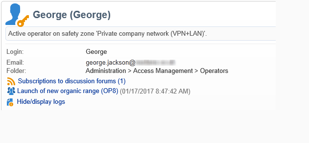

# 论坛{#discussion-forums}

Adobe Campaign操作员可以使用论坛来共享信息。 以下元素各有其论坛：计划、项目、活动、资源、模拟、股票。 每家运营商还设有个人论坛。 所有讨论都是公开的，甚至在个人论坛上。

运营商可订阅论坛，以在每次发布消息时接收通知电子邮件。

## 访问论坛 {#accessing-a-forum}

要访问活动、操作员等的论坛，请转到其仪表板，然 **[!UICONTROL Forum]** 后单击右上角的链接。 此链接还为您提供论坛中消息的总数。

## 使用论坛 {#using-a-forum}

消息及其响应按时间顺序显示（从最新到最旧）。

要显示消息的内容，请单击其标题。

**开始新讨论**

要开始新讨论，请 **[!UICONTROL Add a discussion]** 单击右上角的按钮。 包装 **[!UICONTROL Discussion forum]** 盒出现（请参见下文）。

**向现有讨论发布消息**

要将消息发布到现有讨论，请打开要回答的消息，然 **[!UICONTROL Reply]** 后单击左上角的链接。 包装 **[!UICONTROL Discussion forum]** 盒出现（请参见下文）。

当您回复邮件时，发布原始邮件的人将收到通知。

**编写消息**

包装 **[!UICONTROL Discussion forum]** 中：

1. 在字段中输入 **[!UICONTROL Message]** 文本，在字段中输入讨论 **[!UICONTROL Subject]** 标题。

   

1. 如有必要：

   * 如果希望某人参加未订阅论坛的讨论，请使用该字 **[!UICONTROL Operator to notify]** 段。 操作员将收到此特定消息的通知电子邮件（他们将不订阅论坛）。 要通知多个运算符，请选择操作员组。
   * 要向邮件中添加附件，请单击 **[!UICONTROL Browse]**。 附件还将包含在通知电子邮件中。 附件只能单独发送：要发送多个文件，您需要将其压缩。

1. 单击 **[!UICONTROL Create the message]** 以将其发布到论坛。

>[!NOTE]
>
>在将消息发布到论坛后，便无法再更改或删除该消息。

## 发布到运营商的个人论坛 {#posting-to-the-personal-forum-of-an-operator}

例如，如果您的消息与特定活动无关，但您仍希望跟踪Adobe Campaign中的对话，则可以向操作员的论坛发布消息。 个人论坛是公开的，所有运营商都将看到您的信息。 操作员每次向其个人论坛发帖时都会收到一条消息。

要访问运营商论坛，请执行以下操作：

* 如果您具有访问资源管理器 **[!UICONTROL Administration > Access management > Operators]** 节点的必要权限，请打开所需运算符的仪表板，然 **[!UICONTROL Forum]** 后单击右上角的链接。
* 如果没有，请在Adobe Campaign中查找操作员的姓名(通过此操作员发布到论坛的消息，将任务分配给他)，然后单击该姓名以访问他们的仪表板。 您还可以要求管理员创建操作员文件夹的视图。

## 订阅论坛 {#subscribing-to-a-forum}

订阅论坛可让您关注讨论。 每次向论坛发布消息时，您都会收到电子邮件通知。 此电子邮件将包含邮件正文和任何附件。 要回答邮件，请单击电子邮件正文，然后登录到Adobe CampaignWeb界面。 订阅论坛时，所有人都可以看到此信息。

* 要订阅论坛，请单 **[!UICONTROL Follow discussions]** 击消息列表上方右上部分的按钮。

   

   该部分呈蓝色，显示您已订阅论坛。

* 要取消订阅论坛，请单击 **[!UICONTROL Unsubscribe]** 按钮。

   

* 您的个人仪表板列表您订阅的论坛。 单击链 **[!UICONTROL Subscription to discussion forums]** 接以显示列表，然后单击您感兴趣的项目以访问其论坛。

   

   有关个人仪表板的详细信息，请参 [阅本部分](../../platform/using/access-management.md#operators)。

* 要查看谁订阅了论坛，请单击 **[!UICONTROL List of subscribers to this discussion forum]** 消息列表上方的链接。

   

## 检查通知投放 {#checking-notification-delivery}

如果订阅论坛的操作员没有按预期方式接收通知：

* 检查是否在操作员的用户档案中输入电子邮件地址。
* 转到节 **[!UICONTROL Administration > Production > Technical workflows > Campaign processes]** 点并检查工作流 **[!UICONTROL Jobs in discussion forums]** 是否已启动且没有错误。
* 视图投放日志:

   * 在Adobe Campaign主页中，转 **[!UICONTROL Campaigns > Navigation > Deliveries]**&#x200B;到，然后打开 **[!UICONTROL Discussion forum notification]** 投放。
   * 在资源管理器中，转 **[!UICONTROL Administration > Production > Objects created automatically > Technical deliveries > Workflow notifications]**&#x200B;到，然后单击 **[!UICONTROL Discussion forum notifications]**。

   在框 **[!UICONTROL Discussion forum notifications]** 中，投放日志位于选项卡 **[!UICONTROL Edit > Delivery]** 中。 您还可以视图 **[!UICONTROL Tracking > Log]** 选项卡 **[!UICONTROL Exclusion causes]** 和选项卡。

