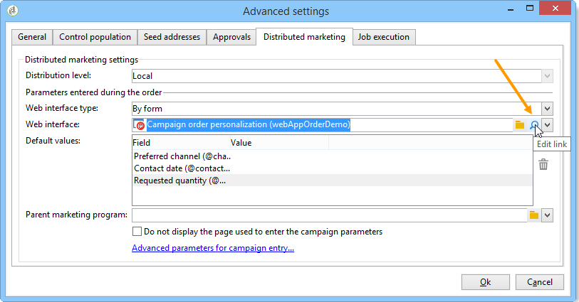

# 示例{#examples}

## 创建本地活动（按表单）{#creating-a-local-campaign--by-form-}

**By form**&#x200B;类型的web接口涉及使用&#x200B;**web应用程序**。 根据其配置，此Web应用程序可以包含任何类型的已定义个性化元素。 例如，您可以建议链接来评估目标、预算、内容等。 通过专用API。

>[!NOTE]
>
>API在专用文档中详细介绍，具体访问方式取决于您的合同。 请参阅[API](../../configuration/using/about-web-services.md)。
>
>此示例中使用的Web 应用程序不是附带Adobe Campaign的现成Web应用程序。 要在活动中使用表单，您必须创建专用的Web应用程序。

创建活动模板时，单击&#x200B;**[!UICONTROL Advanced campaign settings...]**&#x200B;链接的&#x200B;**[!UICONTROL Web interface]**&#x200B;选项中的&#x200B;**[!UICONTROL Zoom]**&#x200B;图标可访问Web应用程序的详细信息。



>[!NOTE]
>
>Web 应用程序参数仅在活动模板中可用。

在&#x200B;**[!UICONTROL Edit]**&#x200B;选项卡中，选择&#x200B;**活动顺序**&#x200B;活动并打开它以访问其内容。


在此示例中，**活动顺序**&#x200B;活动包括：

* 要由本地实体在订单中输入的字段，

   

* 允许本地实体评估活动(例如目标、预算、内容等)的链接，

   

* 可用于计算和显示这些评估结果的脚本。

   

在此示例中，使用了以下API:

* 对于目标评估，

   ```
   var res = nms.localOrder.EvaluateTarget(ctx.localOrder);
   ```

* 对于预算评估，

   ```
   var res = nms.localOrder.EvaluateDeliveryBudget(ctx.@deliveryId, NL.XTK.parseNumber(ctx.@compt));
   ```

* 对于内容评估，

   ```
   var res = nms.localOrder.EvaluateContent(ctx.localOrder, ctx.@deliveryId, "html", resSeed.@id);
   ```

## 创建协作活动(通过目标批准){#creating-a-collaborative-campaign--by-target-approval-}

### 简介 {#introduction}

你是一家大型服装品牌的营销经理，该品牌在美国各地设有一家网上商店和几家精品店。 春天来临后，您决定创建一个特殊优惠，让您的最佳客户将目录中所有服装的折扣降低50%。

此优惠针对的是你美国商店中最好的客户，即那些自年初以来已花费超过300美元的客户。

因此，您决定使用分布式营销创建协作活动(通过目标批准)，这允许您选择您商店的最佳客户（按区域分组），这些客户将收到包含特殊优惠的电子邮件投放。

此示例的第一部分说明了接收活动创建通知的本地实体，以及他们如何使用通知来评估活动和对其排序。

此示例的第二部分介绍如何创建活动。

步骤如下：

**对于本地实体**

1. 使用活动创建通知访问中央实体选择的联系人的列表。
1. 选择联系人并批准参与。

**对于中央实体:**

1. 创建&#x200B;**[!UICONTROL Data distribution]**&#x200B;活动。
1. 创建协作活动。
1. 发布活动。

### 本地实体端{#local-entity-side}

1. 已选择参与活动的本地实体将收到电子邮件通知。

   

1. 单击&#x200B;**[!UICONTROL Access your contact list and approve targeting]**&#x200B;链接，即可（通过Web浏览器）访问为本地实体选择的客户端的列表。

   

1. 本地实体将取消检查列表中的某些联系人，因为自今年开始以来，已联系他们进行类似优惠。

   

检查获得批准后，活动可以自动开始。

### 中央实体端{#central-entity-side}

#### 创建数据分发活动{#creating-a-data-distribution-activity}

1. 要设置协作活动(通过目标批准)，您必须首先创建&#x200B;**[!UICONTROL Data distribution activity]**。 单击&#x200B;**[!UICONTROL Resources > Campaign management > Data distribution]**&#x200B;节点中的&#x200B;**[!UICONTROL New]**&#x200B;图标。

   

1. 在&#x200B;**[!UICONTROL General]**&#x200B;选项卡中，必须指定：

   * **[!UICONTROL Targeting dimension]**。 这里，在&#x200B;**收件人**&#x200B;上执行&#x200B;**数据分发**。
   * **[!UICONTROL Distribution type]**。 可以选择&#x200B;**固定大小**&#x200B;或&#x200B;**大小作为百分比**。
   * **[!UICONTROL Assignment type]**。 选择&#x200B;**本地实体**&#x200B;选项。
   * **[!UICONTROL Distribution type]**。 此处，您可以通过收件人表中的&#x200B;**[!UICONTROL Origin (@origin)]**&#x200B;字段来识别联系人与本地实体之间的关系。
   * **[!UICONTROL Approval storage]**&#x200B;字段。 选择&#x200B;**收件人的本地批准**&#x200B;选项。

1. 在&#x200B;**[!UICONTROL Breakdown]**&#x200B;选项卡中，指定：

   * **[!UICONTROL Distribution field value]**，它与即将进行的活动中涉及的本地实体相对应。
   * 本地实体&#x200B;**[!UICONTROL label]**。
   * **[!UICONTROL Size]**（固定或百分比）。 **0默认值**&#x200B;涉及选择链接到该本地实体的所有收件人。

   

1. 保存新数据分发。

#### 创建协作活动 {#creating-a-collaborative-campaign}

1. 从&#x200B;**[!UICONTROL Campaign management > Campaign]**&#x200B;节点中，新建一个&#x200B;**[!UICONTROL collaborative campaign (by target approval)]**。
1. 在&#x200B;**[!UICONTROL Targeting and workflows]**&#x200B;选项卡中，为您的活动创建工作流。 它必须包含&#x200B;**Split**&#x200B;活动，其中&#x200B;**[!UICONTROL Record count limitation]**&#x200B;由&#x200B;**[!UICONTROL Data distribution]**&#x200B;活动定义。

   

1. 添加&#x200B;**[!UICONTROL Local approval]**&#x200B;动作，您可以在其中指定：

   * 将发送给通知中本地实体的消息内容，
   * 批准提醒，
   * 活动的预期处理。

   

1. 保存您的记录。

#### 发布活动{#publishing-the-campaign}

您现在可以从&#x200B;**[!UICONTROL Campaigns]**&#x200B;选项卡中添加&#x200B;**活动包**。

1. 选择&#x200B;**[!UICONTROL Reference campaign]**。 在包的&#x200B;**[!UICONTROL Edit]**&#x200B;选项卡中，可以选择&#x200B;**[!UICONTROL Approval mode]**&#x200B;用于活动:

   * 在&#x200B;**手动**&#x200B;模式中，如果本地实体接受中央实体的邀请，则他们将参与活动。 如果客户希望，并且需要经理批准，以确认其参与活动，他们可以删除预先选择的联系人。
   * 在&#x200B;**自动**&#x200B;模式中，本地实体必须参与活动，除非他们注销自己。 他们无需批准即可删除联系人。

   

1. 在&#x200B;**[!UICONTROL Description]**&#x200B;选项卡中，可以添加活动的说明以及要发送给本地实体的任何文档。

   

1. 批准您的活动包，然后开始您的工作流以发布该包，并使它可用于列表包的所有本地实体。

   

## 创建协作活动（按表单）{#creating-a-collaborative-campaign--by-form-}

### 简介 {#introduction-1}

你是一家大型化妆品品牌的营销经理，该品牌在美国各地设有一家网上商店和几家精品店。 要卸载冬季库存并腾出新库存空间，您决定创建一个特殊优惠，以目标两个客户类别:30岁以上的人，你将优惠年龄敏感护肤产品的人，以及30岁以下的人，你将优惠更基本的护肤产品。

因此，您决定使用分布式营销创建协作活动（按表单），这样您可以根据年龄范围从不同商店选择客户。 这些客户将收到一封电子邮件投放，其中包含一个特殊优惠，该特殊将根据其年龄范围进行个性化。

此示例的第一部分说明了接收活动创建通知的本地实体，以及他们如何使用通知来评估活动和对其排序。

此示例的第二部分介绍如何创建活动。

步骤如下：

**对于本地实体**

1. 使用活动创建通知访问联机表单。
1. 个性化活动(目标、内容、投放量)。
1. 检查这些字段，并根据需要更改它们。
1. 批准您的参与。
1. 本地实体(或中央实体)经理批准您的配置和参与。

**对于中央实体:**

1. 创建协作活动。
1. 像配置本地活动一样配置&#x200B;**[!UICONTROL Advanced campaign settings...]**。
1. 像配置本地活动一样配置投放工作流和活动。
1. 更新Web表单。
1. 创建活动包并发布它。

### 本地实体端{#local-entity-side-1}

1. 选择参与活动的本地实体会收到电子邮件通知，通知他们参与活动。

   

1. 这些本地实体填写了个性化表单，然后：

   * 评估目标和预算，
   * 预览投放内容，
   * 批准他们的参与。

      

1. 负责验证订单的运营商批准其参与。

   

### 中央实体端{#central-entity-side-1}

1. 要实现协作活动（按表单），必须使用&#x200B;**协作活动（按表单）**&#x200B;模板创建活动。

   

1. 在活动的&#x200B;**[!UICONTROL Edit]**&#x200B;选项卡中，单击&#x200B;**[!UICONTROL Advanced campaign settings...]**&#x200B;链接以将其配置为本地活动。 请参阅[创建本地活动（按表单）](#creating-a-local-campaign--by-form-)。

   

1. 配置活动工作流和Web表单。 请参阅[创建本地活动（按表单）](#creating-a-local-campaign--by-form-)。
1. 通过指定执行计划和所涉及的活动，创建您的本地实体包。

   

1. 通过在&#x200B;**[!UICONTROL Edit]**&#x200B;选项卡中选择批准模式来完成包配置。

   

1. 在&#x200B;**[!UICONTROL Description]**&#x200B;选项卡中，您可以输入活动包描述、发布包时要发送给本地实体的通知消息，以及将任何信息文档附加到活动包。

   

1. 批准要发布的包。

   

