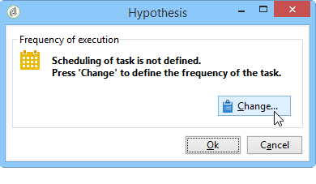
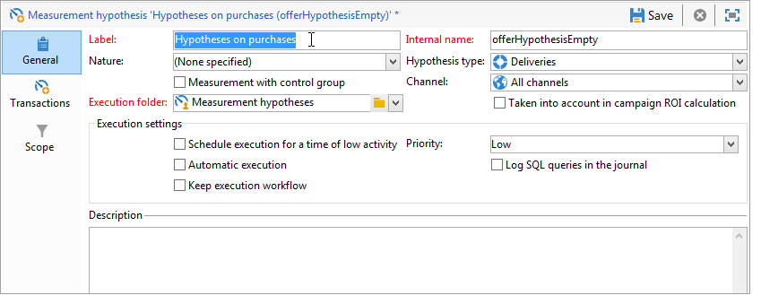
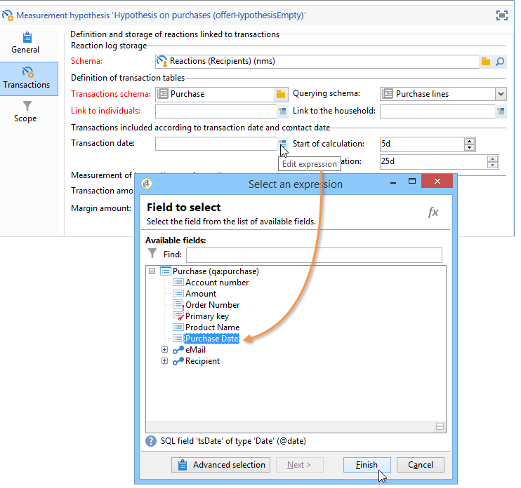

# 假设验证模板{#hypothesis-templates}

## 创建假设验证模型 {#creating-a-hypothesis-model}

通过配置假设验证模板，您可以定义用于测量反应的上下文，无论是投放还是优惠。 这里引用了各种度量表，包括用于定义个人、假设验证和事务表之间关系的度量表。

要创建假设验证模板，请应用以下步骤：

1. 在Adobe Campaign资源管理器中，单击 **[!UICONTROL Resources>Templates>Hypothesis templates]**。

   

1. 单 **[!UICONTROL New]** 击或右键单击模板列表，然后 **[!UICONTROL New]** 在下拉列表中选择。
1. 输入假设验证标签。
1. 指定模板是通过假设验证还是投放发往优惠 **[!UICONTROL Hypothesis type]**。
1. 对 **[!UICONTROL Delivery]** 于类型模板，指定是否应使用对照组或不使用假设验证进行测量(有关详细信息，请参 [阅模板的属性](#properties-of-a-hypothesis-template))。
1. 对 **[!UICONTROL Delivery]** 于类型模板，您可以选择特定渠道，或决定使用下拉列表将模板应用于Adobe Campaign中的所有可用渠道(有关详细信息， **[!UICONTROL Channel]** 请参阅假设验证模板的属性 )。
1. 选择 **[!UICONTROL Execution folder]** 要在其中创建并自动执行将从此模板创建的假设验证。
1. 选择执行设置(有关详细信息，请参阅 [假设验证模板执行设置](#hypothesis-template-execution-settings))。
1. 指定假设验证计算期(有关详细信息，请参阅 [假设验证模板执行设置](#hypothesis-template-execution-settings))。

   >[!CAUTION]
   >
   >此期间由联系日期确定。

1. 在标 **[!UICONTROL Transactions]** 签中，指定假设验证计算所需的表和字段(有关详细信息，请参阅 [事务](#transactions))。
1. 如果您的模板已配置 **[!UICONTROL Offer]** 为类型假设验证，则可以启用 **[!UICONTROL Update offer proposition status]** 选项：在这种情况下，选择要更改的优惠建议的状态。
1. 指定假设验证应用程序的范围(有关详细信息，请参阅 [假设验证周长](#hypothesis-perimeter))。
1. 如有必要，请使用脚本完成筛选(有关详细信息，请参阅 [假设验证周](#hypothesis-perimeter)长)。

### 假设验证模板的属性 {#properties-of-a-hypothesis-template}

在模板的选项 **[!UICONTROL General]** 卡中，可以指定常规模板选项。 可用字段包括：

* **[!UICONTROL Hypothesis type]**:允许您确定模板是否应用于假设验证或优惠。

   您还可以选择创建同时适用于假设验证和优惠的投放。

   >[!NOTE]
   >
   >如果模板适用于优惠，则 **[!UICONTROL Update offer proposition status]** 选项卡中会显示该 **[!UICONTROL Transactions]** 选项。

* **[!UICONTROL Measurement with control group]**:允许您声明是已为对照组定义投放还是活动，并将其包含在度量指示器中。 对照组不接收投放，它允许您通过将活动与接收投放的目标群体进行比较来衡量投放后的影响。

   >[!NOTE]
   >
   >如果将模板配置为考虑对照组，但在假设验证所关注的投放中未定义组，则结果将仅基于目标收件人。

   有关定义和配置对照组的详细信息，请参 [阅定义对照组](../../campaign/using/marketing-campaign-deliveries.md#defining-a-control-group)。

* **[!UICONTROL Channel]**:您可以选择特定渠道，或通过在下拉列表中选择，使假设验证模板可用于Adobe Campaign控 **[!UICONTROL All channels]** 制台中的所有渠道。 如果为特定渠道配置模板，则允许您在创建假设验证时按渠道自动筛选投放(请参阅创 [建假设验证](../../campaign/using/creating-hypotheses.md))。

   

* **[!UICONTROL Execution folder]**:允许您为假设验证指定执行文件夹。
* **[!UICONTROL Taken into account in campaign ROI calculation]**:在计算相关假设验证的ROI时，会考虑活动结果。

### 假设验证模板执行设置 {#hypothesis-template-execution-settings}

模板的选项卡 **[!UICONTROL General]** 还允许您指定假设验证执行参数。 可用选项如下：

* **[!UICONTROL Schedule execution for a time of low activity]**:允许您计划假设验证启动以优化Adobe Campaign性能。 选中此选项后，活动的处理工作流会在停机期间执行假设验证计算。

   

* **[!UICONTROL Priority]**:应用于假设验证的级别，以在同时执行假设验证计算顺序时将其排除在外。

   

* **[!UICONTROL Automatic execution]**:如有必要，允许您计划假设验证重新计算(例如，如果您要定期更新指标，直到投放结束)。

   

   要指定计划，请应用以下流程：

   1. 单击链 **[!UICONTROL Frequency of execution...]** 接，然后单击 **[!UICONTROL Change...]** 按钮。

      

   1. 配置频率、相关事件和有效期。

      

   1. Click **[!UICONTROL Finish]** to save the schedule.

      

* **[!UICONTROL Log SQL queries in journal]**:此函数保留给专家用户。 它允许您向测量假设验证审计添加一个选项卡，以显示SQL查询。 这允许在模拟完成错误时检测可能的故障。
* **[!UICONTROL Keep execution workflow]**:允许您保留在假设验证计算开始自动生成的工作流。 在从选中了此选项的模板创建的假设验证中，可以使用生成的工作流来遵循该过程。

   >[!CAUTION]
   >
   >仅当运行假设验证时出错时，才能为调试目的激活此选项。\
   >此外，不得修改自动生成的工作流。 在以后的计算中，任何最终的修改都不会考虑在其他地方。\
   >如果已选中此选项，请在执行该工作流后将其删除。

### 交易 {#transactions}

此选项卡包含各种字段和表，它们允许您按事务记录保存收件人反应的历史记录。 有关专用 [于响应](../../configuration/using/about-schema-reference.md) 管理的表的更多信息，请参阅配置指南。

* **[!UICONTROL Schema (reaction log storage)]**:选择收件人反应表。 Adobe Campaign中的现成表是 **NmsRemaMatchRcp**。
* **[!UICONTROL Transaction schema]**:选择假设验证将关注的表，即事务或购买表。
* **[!UICONTROL Querying schema]**:选择筛选假设验证的条件。
* **[!UICONTROL Link to individuals]**:选择个人和用作事务模式的表之间的链接。
* **[!UICONTROL Link to the household]**:如果希望将家庭的所有成员包括在模式中，请选择在交易假设验证中指向家庭的链接。 此字段为可选字段。
* **[!UICONTROL Transaction date]**:此字段为可选字段，但建议使用此字段，因为它允许您定义假设验证计算范围。
* **[!UICONTROL Measurement period]**:允许您配置执行开始和恢复采购行的假设验证和终止日期。

   当假设验证链接到投放时，会在直邮投放的联系日期后几天或电子邮件或短信投放的投放日期后自动触发测量。

   

   如果假设验证是在飞机上发射的，如果想立即触发，就可以强制发射。 否则，系统会根据配置的计算结束日期(基于假设验证创建日期)自动触发该(请参 [阅在投放上动态创建假设验证](../../campaign/using/creating-hypotheses.md#creating-a-hypothesis-on-the-fly-on-a-delivery))。

* **[!UICONTROL Transaction/Margin amount]**:这些字段是可选字段，使您可以自动计算周转指示符(请参 [阅指示](../../campaign/using/hypothesis-tracking.md#indicators)符)。
* **[!UICONTROL Unit amount]**:允许您设置用于计算收入的金额(请参阅 [指标](../../campaign/using/hypothesis-tracking.md#indicators))。

   

* **[!UICONTROL Additional measures and data]**:允许您指定其他报告度量或来自不同表中字段的轴。
* **[!UICONTROL Update offer proposition status]**:允许您在优惠收件人由假设验证标识时更改优惠建议的状态。

   

### 假设验证周长 {#hypothesis-perimeter}

一旦定义了事务表和假设验证将关注的字段，您就可以通过使用过滤器指定目标事务和投放来细化假设验证的范围。 还可以使用JavaScript脚本显式指向事务表中引用的产品。

* **筛选事务**:在选 **[!UICONTROL Scope]** 项卡中，可以在假设验证上配置过滤器。 操作步骤：

   1. 单击链 **[!UICONTROL Edit query]** 接。

      

   1. 指定筛选条件。

      

   1. 选择假设验证将关注的事务。

      

* **筛选收件人**:在选 **[!UICONTROL Scope]** 项卡中，您可以将假设验证限制为与消息(投放、收件人、电子邮件地址、服务等)链接的任何信息：

   1. 单击链 **[!UICONTROL Add a filter]** 接，然后 **[!UICONTROL Edit query]**。

      

   1. 指定筛选条件。

      

   1. Click **[!UICONTROL Finish]** to save your query.

      

* **脚本**:您可以使用JavaScript脚本在假设验证设置执行过程中动态过载。

   为此，请单击链 **[!UICONTROL Advanced settings]** 接，然后输入所需的脚本。

   >[!NOTE]
   >
   >此选项适用于专家用户。

   

## 示例：在假设验证上创建投放模板 {#example--creating-a-hypothesis-template-on-a-delivery}

在此示例中，我们将在直接邮件类型假设验证上创建投放模板。 假设验证将基&#x200B;**于的事** 务处理表（示例中的购买）包含链接到文章或产品的购买行。 我们要配置模型，以在购买表中为文章或产品创建假设验证。

1. 在Adobe Campaign资源管理器中，转到节 **[!UICONTROL Resources > Templates > Hypothesis templates]** 点。
1. 单击 **[!UICONTROL New]** 以创建模板。

   

1. 更改模板标签。

   

1. 选择 **[!UICONTROL Deliveries]** 为假设验证类型。
1. 通过选中相关框，指定投放可以包含对照组。
1. 选择 **[!UICONTROL Direct mail]** 渠道。

   >[!NOTE]
   >
   >由于模板特定于直接邮件投放，因此使用此模型创建的假设验证可能不会链接到任何其他投放类型。

1. 在选项卡 **[!UICONTROL Transactions]** 中，选择收件人反应表。

   

1. 在字段 **[!UICONTROL Transactions schema]** 中，选择购买表。

   

1. 在字段中选择采购 **[!UICONTROL Querying schema]** 行。

   

1. 选择链接到购买表的收件人。

   

1. 选择链接到购买日期的字段。

   这允许您为假设验证定义时间范围。 此阶段不是强制的，但建议使用。

   

1. 配置5到25天的计算期。

   

1. 在选项 **[!UICONTROL Scope]** 卡中，单 **[!UICONTROL Edit query]** 击以创建假设验证过滤器。

   

   因此，创建的模板使您能够对购买表中的产品或文章运行假设验证。

1. 单击 **[!UICONTROL Save]** 以记录模板。

