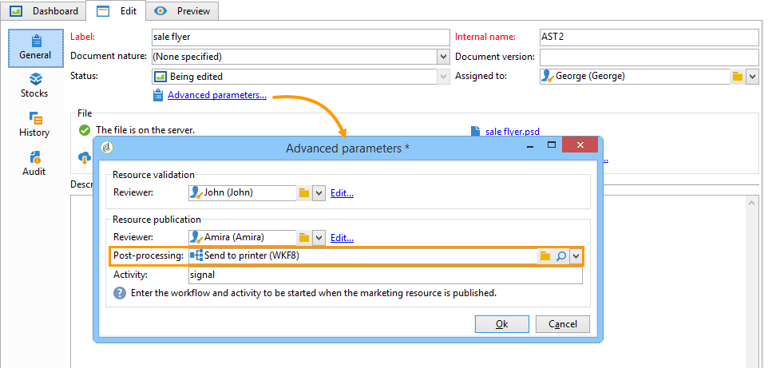

# 管理营销资源{#managing-marketing-resources}

Adobe Campaign允许您管理和跟踪活动生命周期中涉及的营销资源。 这些营销资源可以是手册、视觉辅助工具或涉及多个运营商的任何其他通信介质。

对于通过Adobe Campaign管理的每个营销资源，您可以随时跟踪其状态和历史记录并视图当前版本。

## 添加营销资源{#adding-a-marketing-resource}

营销资源可通过&#x200B;**[!UICONTROL Campaigns]**&#x200B;选项卡访问。

要添加资源，请单击&#x200B;**[!UICONTROL Create]**&#x200B;按钮。

要使资源在Adobe Campaign服务器上可用，您必须通过将所需资源拖放到编辑器的中间区域来添加该资源。 您还可以单击&#x200B;**[!UICONTROL Upload file to server...]**&#x200B;链接。

通过确认消息可启动上传。

上载完成后，资源将添加到可用资源的列表。 Adobe Campaign运营商可以访问它。 他们可以视图它（通过&#x200B;**[!UICONTROL Preview]**&#x200B;选项卡），制作一个副本以修改它，或在服务器上更新文件（使用&#x200B;**[!UICONTROL Edit]**&#x200B;选项卡）。

单击&#x200B;**[!UICONTROL General]**&#x200B;选项卡，选择负责监视、跟踪和批准此资源的操作员或操作员组。 通过&#x200B;**[!UICONTROL Advanced parameters]**&#x200B;链接选择审阅者。

* 为其分配资源的运算符负责跟踪它。
* 批准运营商负责批准营销资源。 在启动资源验证过程时，会通知这些用户。

   如果未选择审阅者，则资源&#x200B;**[!UICONTROL cannot be]**&#x200B;需要批准。

* 如有必要，您还可以指定校对器。

您可以为资源指定（指示性）可用日期。 在此日期之后，它将显示为&#x200B;**[!UICONTROL Late]**&#x200B;状态。

## 资源协作工作{#collaborative-work-on-resources}

您可以修改和更新营销资源，并在必要时通知其他Adobe Campaign运算符。 您可以：

* 本地下载资源以对其进行修改。
* 更新服务器上的文件，使其他操作员能够访问它。
* 锁定资源，以禁止其他运营商修改它。

>[!NOTE]
>
>**[!UICONTROL History]**&#x200B;选项卡包含资源的下载和更新日志。 通过&#x200B;**[!UICONTROL Details]**&#x200B;按钮可以视图所选版本：

### 锁定/解锁资源{#locking-unlocking-a-resource}

创建后，资源便可在营销资源仪表板中使用，操作员可以编辑和修改它们。

当操作者希望处理某个资源时，最好在开始工作之前锁定该资源，以防止其他操作者同时修改它。 然后保留资源；它仍然可访问，但无法由其他运算符在服务器上发布或更新。

将显示一条特殊消息，通知任何尝试访问它的操作员：

**[!UICONTROL Tracking]**&#x200B;选项卡指示锁定资源的操作员的名称和计划的更新日期。

要锁定资源，必须单击资源，然后单击资源仪表板中的&#x200B;**[!UICONTROL Lock]**&#x200B;按钮。

您可以在资源的&#x200B;**[!UICONTROL Tracking]**&#x200B;选项卡中指示计划的返回日期。

通过此信息，您可以通知其他Adobe Campaign操作员资源的解锁日期。

更新资源后，将自动解锁该资源，并使所有操作符再次可用。

如有必要，您还可以从仪表板手动解锁它。

>[!NOTE]
>
>只有锁定资源的操作员和具有管理员权限的操作员才能解锁资源。

### 论坛 {#discussion-forums}

对于每个资源，**[!UICONTROL Forum]**&#x200B;选项卡允许参加者交换信息。

[讨论](../../campaign/using/discussion-forums.md) 论坛阐述论坛在Adobe Campaign中的运作方式。

## 营销资源的生命周期{#life-cycle-of-a-marketing-resource}

创建资源时，将指定Adobe Campaign操作员来设计、校对、批准和发布资源。 可以为这些活动确定持续时间。

使用&#x200B;**[!UICONTROL Tracking]**&#x200B;选项卡可以监视在资源上执行的任何操作：批准、批准拒绝、相关评论或出版物。

**[!UICONTROL History]**&#x200B;选项卡显示为此资源执行的文件传输。

### 批准流程{#approval-process}

如果在&#x200B;**[!UICONTROL Tracking]**&#x200B;选项卡中指定了预期发布日期，则该日期将显示在资源详细信息中。 到达此日期后，您可以使用资源仪表板中的&#x200B;**[!UICONTROL Submit for approval]**&#x200B;按钮执行批准过程。 资源状态随后将更改为&#x200B;**[!UICONTROL Approval in progress]**。

资源可以通过其仪表板上的&#x200B;**[!UICONTROL Approve resource]**&#x200B;按钮批准。

授权的运营商随后可以接受或拒绝批准。 此操作可以：（通过单击通知消息中的链接）或通过控制台（通过单击&#x200B;**[!UICONTROL Approve]**）按钮)发送。

在审批窗口中可以输入评论。

**[!UICONTROL Tracking]**&#x200B;选项卡使所有操作员都能够跟踪审批过程的各个阶段。

>[!NOTE]
>
>除了为每个营销资源指定的审阅者之外，具有管理员权限的操作员和资源管理器也被授权批准营销资源。

### 发布资源{#publishing-a-resource}

批准后，必须发布营销资源。 出版过程必须根据公司要求具体实施。 这意味着资源可以发布到外部网或任何其他服务器上，特定信息可以发送到外部服务提供商等。

要发布资源，请单击营销资源仪表板编辑区域中的&#x200B;**[!UICONTROL Publish]**&#x200B;按钮。

您还可以通过工作流自动发布资源。

发布资源意味着(例如，由其他任务)使其可用。 根据资源的性质，发布内容会有所不同：对于传单，发布可能意味着将文件发送到打印机，对于Web代理，发布可能意味着将其发布到网站等。

为了让Adobe Campaign进行发布，您需要创建一个适当的工作流并将其链接到资源。 为此，请打开资源的&#x200B;**[!UICONTROL Advanced settings]**&#x200B;框，然后在&#x200B;**[!UICONTROL Post-processing]**&#x200B;字段中选择所需的工作流。

将执行该工作流：

* 当审阅者单击&#x200B;**[!UICONTROL Publish resource]**&#x200B;链接时（或者，如果未定义审阅者，则单击资源负责人）。
* 如果通过营销资源创建任务管理资源，则只要任务中选中&#x200B;**[!UICONTROL Publish the marketing resource]**&#x200B;框，任务设置为&#x200B;**[!UICONTROL Finished]**&#x200B;时将执行该资源(请参阅[营销资源创建任务](../../campaign/using/creating-and-managing-tasks.md#marketing-resource-creation-task))

如果工作流未立即启动（如果工作流已停止，例如），则资源的状态将更改为&#x200B;**[!UICONTROL Pending publication]**。 启动工作流后，资源的状态将更改为&#x200B;**[!UICONTROL Published]**。 此状态未考虑发布过程中可能出现的错误。 检查工作流的状态，确保它已正确执行。

## 将资源链接到活动{#linking-a-resource-to-a-campaign}

### 引用营销资源{#referencing-a-marketing-resource}

营销资源可以与活动关联，前提是在活动模板中选择了此功能。

>[!NOTE]
>
>有关如何创建和配置活动模板的详细信息，请参阅[活动模板](../../campaign/using/marketing-campaign-templates.md#campaign-templates)。

单击“活动”仪表板中的&#x200B;**[!UICONTROL Documents > Resources]**&#x200B;选项卡，然后单击&#x200B;**[!UICONTROL Add]**&#x200B;以选择相关资源。

您可以按状态、自然或类型筛选资源，也可以应用个性化筛选。

单击&#x200B;**[!UICONTROL OK]**&#x200B;将资源添加到此活动引用的营销资源列表。

通过&#x200B;**[!UICONTROL Details]**&#x200B;按钮可编辑和视图它。

添加的资源将显示在仪表板中。 也可以在那里编辑。

### 将营销资源添加到投放概要{#adding-a-marketing-resource-to-a-delivery-outline}

营销资源可以通过投放概要与投放关联。

>[!NOTE]
>
>有关投放概要的详细信息，请参阅[关联和构造通过投放概要](../../campaign/using/marketing-campaign-deliveries.md#associating-and-structuring-resources-linked-via-a-delivery-outline)链接的资源。

## 库存管理{#stock-management}

您可以将营销资源与一个或多个库存关联，以便管理您的供应并在库存不足事件中对仪表板显示警告。

>[!NOTE]
>
>有关Adobe Campaign中库存管理的详细信息，请参阅[库存管理](../../campaign/using/providers--stocks-and-budgets.md#stock-management)。

要将营销资源与库存关联，请编辑库存图并编辑或创建库存。 添加一条库存线，然后选择相应的营销资源。

如有必要，您可以通过资源右侧的&#x200B;**[!UICONTROL Edit the link]**&#x200B;图标（放大镜）编辑选定的资源，当它被选定后。

指定初始库存和警报库存，然后保存。

资源详细信息中会指示库存。

当股票不足时，向有关经营者发出警告。

## 高级功能 {#advanced-functions}

“营销资源”仪表板允许您执行常见类型的操作：添加、编辑、锁定/解锁、批准、发布。 您可以创建其他类型的营销资源，并通过Adobe Campaign树访问高级功能。 要执行此操作，请单击Adobe Campaign主页中的&#x200B;**[!UICONTROL Explorer]**。

默认情况下，营销资源存储在树的&#x200B;**[!UICONTROL MRM > Marketing resources]**&#x200B;节点中。

您可以从此视图添加以下资源：

* 文件
* HTML
* 文本
* URL

