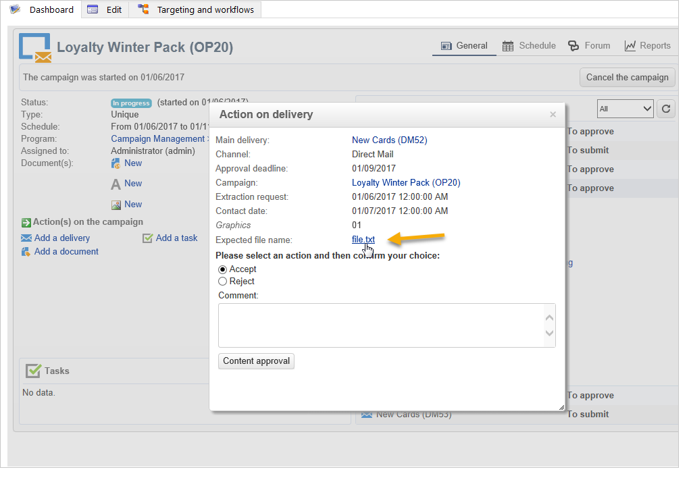
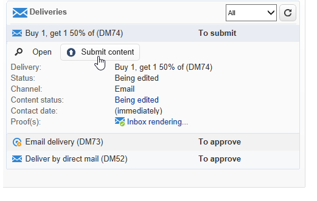
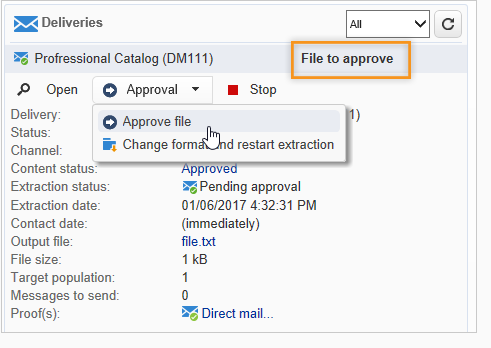

# 建立和管理审批流程 {#approving-marketing-campaigns}

投放的每个步骤都可获得批准，以确保对营销活动的各个流程进行全面监控和控制：定位、内容、预算、提取和发送校样。

通知消息将发送给指定审阅人的Adobe Campaign操作员，以通知他们批准请求。 检查审阅人是否具有 **适当的权限** ，且其安全区域已正确定义。 [了解详情](#selecting-reviewers)。

审批程序于 [此部分](#checking-and-approving-deliveries).

>[!NOTE]
>
>只有投放所有者才能启动投放。 要使其他运算符（或运算符组）能够开始投放，您必须将它们添加为 **[!UICONTROL Delivery start:]** 字段。\
>[了解详情](#selecting-reviewers)。

## 操作原则 {#operating-principle-}

例如，预算审批的标准消息如下：

然后，审核人员操作员可以选择是否批准预算。

操作员验证后，作业的批准或拒绝将转发给投放仪表板。

营销活动的批准日志中也提供该信息。通过 **[!UICONTROL Edit > Tracking > Approvals]** 选项卡。

这些通知将发送给受影响的操作员，这些操作员会收到启用审批的每个流程。

可以为营销活动模板、每个营销活动单独或投放启用批准。

在营销活动模板中选择所有需要批准的作业( **[!UICONTROL Properties]** > **[!UICONTROL Advanced campaign settings...]** > **[!UICONTROL Approvals]** 选项卡)，负责审批的操作员（他们将收到通知，除非未启用此选项）。 如需详细信息，请参阅[此部分](#approving-processes)。

可以使用此模板创建的每个营销活动都可以覆盖这些设置，每个营销活动投放也可分别覆盖这些设置：单击 **[!UICONTROL Properties]** 按钮，然后 **[!UICONTROL Approvals]** 选项卡。

在以下示例中，投放内容不需要批准：

## 选择审阅人 {#selecting-reviewers}

对于每种类型的批准，从投放的下拉列表中选择负责批准的操作员或操作员组。 可以使用 **[!UICONTROL Edit...]** 链接。 此窗口还允许您编辑审批截止时间。

如果未指定审核者，营销活动经理将负责审批并接收通知。 营销活动管理器在 **[!UICONTROL Edit > Properties]** 选项卡：

>[!NOTE]
>
>所有其他Adobe Campaign运算符 **[!UICONTROL Administrator]** 权限也可以批准作业，但不会收到通知。\
>默认情况下，如果定义了批准运算符，则营销活动管理器无法执行批准或开始投放。 您可以通过创建 **NmsCampaign_Activate_OwnerConfirmation** 选项 **1** 值。

## 审批模式 {#approval-modes}

### 通过功能板进行批准 {#approval-via-the-dashboard}

要通过控制台或Web界面批准作业，请单击营销活动仪表板上的相应链接。 也可以通过投放跟踪或投放仪表板批准作业。

检查要批准的信息，选择是接受还是拒绝批准，并根据需要输入评论。 单击 **[!UICONTROL Ok]** 保存。

>[!NOTE]
>
>如果某个流程已经由其他操作员批准，则该批准链接不可用。

### 通过通知消息批准 {#approval-via-notification-messages}

单击通知消息中可用的链接(请参阅 [通知](#notifications))。 您需要登录，如下所示：

选择 **[!UICONTROL Accept]** 或 **[!UICONTROL Reject]** 并根据需要输入评论。

单击 **[!UICONTROL Validate]**。

>[!NOTE]
>
>如果在该过程中引发警告，则通知中会显示警告。

### 批准跟踪 {#approval-tracking}

该信息可在以下几处获得：

* 在营销活动批准日志中， **[!UICONTROL Approvals]** 的子选项卡 **[!UICONTROL Edit > Tracking]** 选项卡：

   

* 在营销活动投放日志中， **[!UICONTROL Deliveries]** 的子选项卡 **[!UICONTROL Edit > Tracking]** 选项卡：

   

* 单击 **[!UICONTROL Hide/show log]** 的 **[!UICONTROL Summary]** 选项卡。

   

* 此信息也可以通过 **[!UICONTROL Tracking > Approvals]** 每个投放的选项卡：

   

>[!NOTE]
>
>一旦操作员批准或拒绝了工作，其他审核操作员就无法再对批准执行操作。

### 自动和手动审批 {#automatic-and-manual-approval}

在创建定位工作流程时，如果批准是自动的（默认模式），则Adobe Campaign会显示批准链接或在需要批准时立即发送通知。

要选择批准模式（手动或自动），请单击 **[!UICONTROL Edit > Properties]** 选项卡，然后单击 **[!UICONTROL Advanced campaign settings...]** 最后 **[!UICONTROL Approvals]** 选项卡。

>[!NOTE]
>
>所选批准模式将应用于营销活动的所有投放。

构建定向工作流程时，手动批准可让您避免创建批准链接或自动发送通知。 然后，营销活动仪表板提供 **[!UICONTROL Submit targeting for approval]** 链接以手动启动批准流程。

通过确认消息，您可以授权对此投放选择的作业进行批准。

然后，批准按钮会显示在营销活动仪表板（用于此投放）、投放仪表板和投放跟踪中。 如果启用了通知，则将并行发送它们。

这种启用批准的方法可让您处理定位，而无需向审阅人发送虚假通知。

## 通知 {#notifications}

通知是发送给审阅人的特定电子邮件，用于通知审阅人某个流程正在等待批准。 当操作员单击消息中的链接时，将显示验证页面，登录后，操作员可以查看信息并批准或拒绝作业。 也可以在审批窗口中输入评论。

通知电子邮件的内容可以个性化。 请参阅 [通知内容](#notification-content).

### 启用/禁用通知 {#enabling-disabling-notification}

默认情况下，如果在营销活动模板、营销活动或投放中启用了相关作业的批准，则会发送通知消息。 但是，可以禁用通知，以便仅从控制台授权批准。

为此，请编辑营销活动或营销活动模板的批准窗口( **[!UICONTROL Edit > Properties]** > **[!UICONTROL Advanced campaign settings...]** > **[!UICONTROL Approvals]** ) **[!UICONTROL Do not enable notification sending]**.

### 通知内容 {#notification-content}

通知内容在特定模板中定义： **[!UICONTROL Notification of validations for the marketing campaign]**. 此模板保存在 **[!UICONTROL Administration > Campaign management > Technical delivery templates]** 文件夹。

## 审核和批准投放 {#checking-and-approving-deliveries}

Adobe Campaign允许您以协作模式为营销活动的主要阶段设置审批流程。

对于直邮投放，Adobe Campaign操作员可以在提取文件发送到路由器之前查看提取文件，如有必要，他们可以更改格式并重新启动提取。 请参阅 [批准提取文件](#approving-an-extraction-file).

对于每个营销活动，您可以批准投放目标、内容(请参阅 [批准内容](#approving-content))和成本。 负责审批工作的 Adobe Campaign 操作员收到电子邮件通知后，可通过控制台或 Web 连接批准或拒绝批准相关请求。请参阅 [批准投放的步骤](#approving-processes).

完成这些验证阶段后，即可启动投放。 [了解详情](../../campaign/using/marketing-campaign-deliveries.md#starting-a-delivery)。

### 批准投放的步骤 {#approving-processes}

需要批准的阶段显示在营销活动仪表板（通过Web界面的控制台）上。 它们还会显示在投放跟踪表和投放仪表板中。

此时，营销活动的状态为 **[!UICONTROL To validate]**.

>[!NOTE]
>
>要选择需要批准的流程，请修改营销活动模板。 有关更多信息，请参阅 [营销活动模板](../../campaign/using/marketing-campaign-templates.md#campaign-templates).

>[!NOTE]
>
>在定位工作流中，如果在消息准备期间发生链接到配置问题的错误，则 **[!UICONTROL Restart message preparation]** 链接。 更正错误并单击此链接，以在绕过定位阶段时重新开始消息准备。

对于营销活动中的每个投放，您可以批准以下流程：

* **定位、内容和预算**

   当 **[!UICONTROL Enable target approval]**, **[!UICONTROL Enable content approval]** 或 **[!UICONTROL Enable budget approval]** 选项，相关链接会显示在有关投放的营销活动仪表板中。

   >[!NOTE]
   >
   >只有在“审批设置”窗口中启用了定向审批后，才可进行预算审批。 仅在分析目标后，才会显示用于预算审批的链接。 此外，此链接会与要批准目标的链接一起显示。

   如果 **[!UICONTROL Assign content editing]** 或 **[!UICONTROL External content approval]** 选项，功能板将显示 **[!UICONTROL Available content]** 和 **[!UICONTROL External content approval]** 链接。

   内容批准允许您访问发送的校样。

* **提取批准（直邮投放）**

   When **[!UICONTROL Enable extraction approval]** 在“批准设置”窗口中选择，则必须先批准提取的文件，然后才能通知路由器。

   安 **[!UICONTROL Approve content]** 营销活动功能板上提供了链接，如下所示：

   

   提取文件可通过批准框预览，然后接受或拒绝。

   

   >[!NOTE]
   >
   >提取文件预览仅涉及数据示例。 不会加载整个输出文件。

* **批准关联的投放**

   的 **[!UICONTROL Enable individual approval of each associated delivery]** 选项用于与辅助投放关联的主投放。 默认情况下，不会选择此选项，以便能够对主投放进行整体批准。 如果选择此选项，则必须单独批准每个投放。

   

### 选择流程批准 {#choosing-the-processes-to-be-approved}

使用与营销活动关联的模板来定义批准阶段。 您必须从模板中选择要批准的元素，并指定负责这些批准的Adobe Campaign运算符。 有关营销活动模板的更多信息，请参阅 [此部分](../../campaign/using/marketing-campaign-templates.md#campaign-templates).

>[!NOTE]
>
>营销活动（或营销活动模板）的批准配置适用于链接到此营销活动的所有未来投放。 任何配置更改都不会应用于以前的投放。

可以覆盖每个营销活动和每个投放的此信息。

对于营销活动，请单击 **[!UICONTROL Edit > Properties]** 选项卡，然后 **[!UICONTROL Advanced campaign settings...]** 链接，最后 **[!UICONTROL Approvals]** 子选项卡访问“批准配置”页。

您可以选择和取消选择流程以批准和指定负责审批的Adobe Campaign操作员。 这些运算符可以是单个运算符、一组运算符或运算符列表。

要选择运算符列表，请单击 **[!UICONTROL Edit...]** 指定第一个审阅者的字段右侧的链接，并根据需要添加任意数量的运算符，如下所示：

>[!NOTE]
>
>* 如果定义了审阅人列表，则当一个审阅人接受了某个作业时，该作业即被批准。 随后，相关批准链接将不再在功能板中提供。 在启用通知发送后，如果其他审阅人单击通知消息中的批准链接，则系统会通知他们其他操作员已经批准了该作业。
>* 您可以在审阅人编辑窗口的下半部分定义营销活动的批准计划。 默认情况下，审阅人自提交日期起有3天时间批准流程。 可以配置提醒，该提醒会在批准截止日期之前自动发送给相关操作员。
>* 您可以从此部分添加提醒。
>

对于每个投放，单击 **[!UICONTROL Audit]** 按钮 **[!UICONTROL Approvals]** 选项卡，以查看和编辑批准日期和自动提醒。

>[!NOTE]
>
>内容批准流程启动后，此选项卡即可用。

### 批准内容 {#approving-content}

>[!CAUTION]
>
>要批准内容，必须进行校样循环。 通过校样，您可以批准信息显示、个性化数据并检查链接是否正常工作。 了解如何在 [此部分](../../delivery/using/steps-validating-the-delivery.md#sending-a-proof).
>
>下面详述的内容批准功能与校样投放相关。

可以配置内容批准周期。 为此，请选择 **[!UICONTROL Enable content approval]** 选项。 内容批准周期的主要步骤是：

1. 创建新投放后，营销活动经理单击 **[!UICONTROL Submit content]** 链接以开始内容批准周期。

   

   >[!NOTE]
   >
   >如果 **[!UICONTROL Enable the sending of proofs]** 选项（用于电子邮件投放）或 **[!UICONTROL Enable the sending and approval of proofs]** （对于直邮投放）选项时，将会自动发送校样。

1. 系统会向负责内容的人员发送通知电子邮件，该人员可以选择是否批准该内容：

   * 通过通知电子邮件：

      

      >[!NOTE]
      >
      >通知电子邮件包含指向已发送校样的链接，如果 **投放能力** 选项。

   * 通过控制台或web界面、投放跟踪、投放仪表板或营销活动仪表板：

      

      >[!NOTE]
      >
      >利用此营销活动功能板，可通过单击 **[!UICONTROL Inbox rendering...]** 链接。 要查看其内容，请单击 **[!UICONTROL Detail]** 图标。

      

1. 系统会向负责营销活动的人员发送通知电子邮件，通知他们内容是否已获得批准。

   >[!NOTE]
   >
   >负责营销活动的人员可以随时重新启动内容批准周期。 为此，请单击 **[!UICONTROL Content status]** 行（在投放级别），然后单击 **[!UICONTROL Reset content approval to submit it again]**.

   

#### 分配内容编辑 {#assign-content-editing}

利用此选项，可定义负责内容编辑的人员，如网站管理员。 如果 **[!UICONTROL Assign content editing]** 在“批准设置”窗口中选择“选项”，在创建投放和将通知电子邮件发送给内容负责人之间添加了多个批准步骤：

1. 创建新投放后，营销活动负责人点击 **[!UICONTROL Submit content editing]** 链接，以开始内容编辑周期。

   

1. 负责内容编辑的人员将收到一封电子邮件，告知他们内容可用。

   

1. 然后，他们可以登录到控制台，打开投放并使用简化的向导对其进行编辑，以更改主题、HTML和文本内容，并发送校样。

   

   >[!NOTE]
   >
   >如果 **[!UICONTROL Enable the sending of proofs]** 选项（用于电子邮件投放）或 **[!UICONTROL Enable the sending and approval of proofs]** （对于直邮投放）选项时，将会自动发送校样。

1. 负责内容编辑的人员完成对投放内容所做的任何更改后，便可以使内容可用。

   为此，他们可以：

   * 单击 **[!UICONTROL Available content]** 链接。

      

   * 单击通知消息中的链接，然后批准内容可用性。

      

      操作员在将内容提交给营销活动负责人之前可以添加评论。

      

      通知消息允许审阅人批准或拒绝内容。

      

#### 外部内容审批 {#external-content-approval}

利用此选项，可定义负责批准投放渲染的外部操作员，如品牌通信一致性、费率等。 当 **[!UICONTROL External content approval]** 在“批准设置”窗口中选择“选项”，在内容批准和将通知发送给营销活动负责人之间添加多个批准步骤：

1. 外部内容管理器收到通知电子邮件，告知其内容已获得批准并请求外部批准。
1. 通知电子邮件包含指向已发送校样的链接（用于查看投放渲染）以及用于批准或拒绝投放内容的按钮。

   >[!NOTE]
   >
   >仅当发送了一个或多个校样时，这些链接才可用。 否则，投放渲染仅可通过控制台或Web界面来使用。

   

### 批准提取文件 {#approving-an-extraction-file}

对于脱机投放，Adobe Campaign会生成一个提取文件，根据其设置，该文件将发送到路由器。 其内容取决于所使用的导出模板。

在内容、定位和预算获得批准后，投放会更改为 **[!UICONTROL Extraction pending]** 直到启动营销活动的提取工作流。

在提取请求日期，将创建提取文件，并将投放状态更改为 **[!UICONTROL File to approve]**.

您可以查看提取的文件的内容（通过单击其名称）、批准该文件，或根据需要更改格式，然后使用功能板上的链接重新启动提取。

文件获得批准后，即可向路由器发送通知电子邮件。 有关更多信息，请参阅 [启动离线投放](../../campaign/using/marketing-campaign-deliveries.md#starting-an-offline-delivery).
