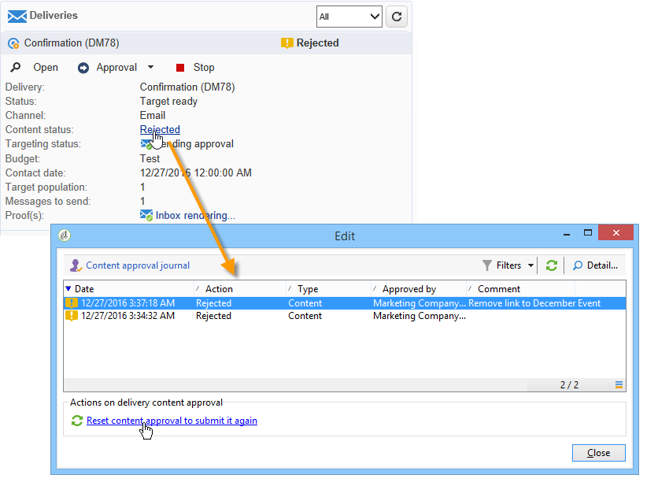

# 设置和管理批准流程{#approving-marketing-campaigns}

投放的每一步均须经过批准，以确保全面监控和控制活动的各个流程：定位、内容、预算、提取和发送验证。

通知消息被发送给作为指定审阅者的Adobe Campaign操作员，以通知他们批准请求。 检查审阅者是否具有批准的&#x200B;**适当权限**，以及其安全区域是否已正确定义。 [了解详情](#selecting-reviewers)。

审批过程见[本节](#checking-and-approving-deliveries)。

>[!NOTE]
>
>只有投放所有者可以开始投放。 要使其他运算符（或运算符组）能够开始投放，您必须在&#x200B;**[!UICONTROL Delivery start:]**&#x200B;字段中将其添加为审阅者。\
>[了解详情](#selecting-reviewers)。

## 工作原理 {#operating-principle-}

例如，预算审批的标准消息如下：

然后，审阅人操作员可以选择是否批准预算。

一旦操作员进行验证，就会将作业的批准或拒绝转发给投放仪表板。

活动的批准日志中也提供该信息。这些日志可通过&#x200B;**[!UICONTROL Edit > Tracking > Approvals]**&#x200B;选项卡进行访问。

这些通知将发送给受启用审批的每个流程影响的操作员。

可以为活动模板、单独为每个活动或投放启用批准。

在活动模板（**[!UICONTROL Properties]** > **[!UICONTROL Advanced campaign settings...]** > **[!UICONTROL Approvals]**&#x200B;选项卡）中选择所有需要批准的作业，负责批准的操作员也选择了这些作业（除非未启用此选项，否则他们将接收通知）。 如需详细信息，请参阅[此部分](#approving-processes)。

可以使用此模板创建的每个活动都可以覆盖这些设置，对于每个活动投放，可分别覆盖这些设置：单击&#x200B;**[!UICONTROL Properties]**&#x200B;按钮，然后单击&#x200B;**[!UICONTROL Approvals]**&#x200B;选项卡。

在以下示例中，投放内容不需要批准：

## 选择审阅者{#selecting-reviewers}

对于每种类型的批准，负责批准的操作员或操作员组从投放的下拉列表中被选择。 可以使用&#x200B;**[!UICONTROL Edit...]**&#x200B;链接添加更多运算符。 此窗口还允许您编辑审批截止日期。

如果未指定审阅者，活动经理将负责批准并接收通知。 活动管理器在活动的&#x200B;**[!UICONTROL Edit > Properties]**&#x200B;选项卡中指定：

>[!NOTE]
>
>所有具有&#x200B;**[!UICONTROL Administrator]**&#x200B;权限的其他Adobe Campaign运算符也可以批准作业，但它们不会接收通知。\
>默认情况下，如果已定义审批操作符，则活动管理器无法执行投放或开始。 您可以修改此行为，并授权活动管理器批准/开始投放，方法是创建&#x200B;**** 1 **的NmsCampaign_Activate_OwnerConfirmation**&#x200B;选项。

## 批准模式{#approval-modes}

### 通过仪表板{#approval-via-the-dashboard}进行批准

要通过控制台或Web界面批准作业，请单击活动仪表板上的相应链接。 还可以通过投放跟踪或投放仪表板批准作业。

选中要批准的信息，选择是接受还是拒绝批准，并根据需要输入评论。 单击&#x200B;**[!UICONTROL Ok]**&#x200B;进行保存。

>[!NOTE]
>
>如果某个流程已经由其他运营商批准，则该批准链接不可用。

### 通过通知消息{#approval-via-notification-messages}进行批准

单击通知消息中可用的链接（请参阅[Notifications](#notifications)）。 您需要登录，如下所示：

选择&#x200B;**[!UICONTROL Accept]**&#x200B;或&#x200B;**[!UICONTROL Reject]**，然后根据需要输入注释。

单击 **[!UICONTROL Validate]**.

>[!NOTE]
>
>如果在此过程中引发警告，则通知中会显示警告。

### 批准跟踪{#approval-tracking}

信息可在以下几个地方获得：

* 在活动批准日志中，**[!UICONTROL Edit > Tracking]**&#x200B;选项卡的&#x200B;**[!UICONTROL Approvals]**&#x200B;子选项卡：

   

* 在活动投放日志中，**[!UICONTROL Edit > Tracking]**&#x200B;选项卡的&#x200B;**[!UICONTROL Deliveries]**&#x200B;子选项卡：

   

* 单击&#x200B;**[!UICONTROL Summary]**&#x200B;选项卡的&#x200B;**[!UICONTROL Hide/show log]**&#x200B;选项可查看每个投放的批准状态。

   

* 此信息也可通过每个投放的&#x200B;**[!UICONTROL Tracking > Approvals]**&#x200B;选项卡访问：

   

>[!NOTE]
>
>一旦运营商批准或拒绝了某个作业，其他审核运营商便无法再对批准采取行动。

### 自动和手动批准{#automatic-and-manual-approval}

在创建定位工作流时，如果批准是自动的（默认模式），Adobe Campaign将显示批准链接或在需要批准时发送通知。

要选择批准模式（手动或自动），请单击活动或活动模板的&#x200B;**[!UICONTROL Edit > Properties]**&#x200B;选项卡，然后单击&#x200B;**[!UICONTROL Advanced campaign settings...]**，最后单击&#x200B;**[!UICONTROL Approvals]**&#x200B;选项卡。

>[!NOTE]
>
>选定的审批模式将应用于活动的所有投放。

在构建定位工作流时，手动批准可让您避免创建批准链接或自动发送通知。 然后，活动仪表板将优惠&#x200B;**[!UICONTROL Submit targeting for approval]**&#x200B;链接，以手动启动批准过程。

通过确认消息，您可以对为此投放选择的作业授权批准。

然后，活动仪表板(对于此投放)、投放仪表板和投放跟踪中会显示批准按钮。 如果启用通知，将并行发送。

这种启用审批的方法可让您处理定位，而不向审阅者发送虚假通知。

## 通知{#notifications}

通知是发送给审阅者的特定电子邮件消息，用于通知审阅者某个进程正在等待批准。 当操作员单击消息中的链接时，将显示一个身份验证页，登录后，操作员可以视图信息并批准或拒绝作业。 也可以在审批窗口中输入评论。

可以个性化通知电子邮件的内容。 请参阅[通知内容](#notification-content)。

### 启用/禁用通知{#enabling-disabling-notification}

默认情况下，如果在活动模板、活动或投放中启用了相关作业的批准，则会发送通知消息。 但是，可以禁用通知，以便仅从控制台授权批准。

为此，请编辑活动或活动模板的批准窗口（**[!UICONTROL Edit > Properties]** > **[!UICONTROL Advanced campaign settings...]** > **[!UICONTROL Approvals]**&#x200B;选项卡），然后选择&#x200B;**[!UICONTROL Do not enable notification sending]**。

### 通知内容{#notification-content}

通知内容在特定模板中定义：**[!UICONTROL Notification of validations for the marketing campaign]**。 此模板保存在Adobe Campaign树的&#x200B;**[!UICONTROL Administration > Campaign management > Technical delivery templates]**&#x200B;文件夹中。

## 审查和批准投放{#checking-and-approving-deliveries}

Adobe Campaign允许您以协作模式为营销活动的主要阶段设置审批流程。

对于直邮投放,Adobe Campaign操作员可以在将提取文件发送到路由器之前对其进行视图，如有必要，他们可以更改格式并重新启动提取。 请参阅[批准提取文件](#approving-an-extraction-file)。

对于每个活动，您都可以批准投放目标、内容（请参阅[批准内容](#approving-content)）和成本。 负责审批的Adobe Campaign运营商可以通过电子邮件通知，并可以从控制台或通过Web连接接受或拒绝审批。 请参阅[批准投放的步骤](#approving-processes)。

当这些验证阶段完成时，可以启动投放。 [了解详情](../../campaign/using/marketing-campaign-deliveries.md#starting-a-delivery)。

### 批准投放{#approving-processes}的步骤

需要批准的阶段将显示在活动仪表板上（通过Web界面的控制台）。 它们还显示在投放跟踪表和投放仪表板中。

此时，活动的状态为&#x200B;**[!UICONTROL To validate]**。

>[!NOTE]
>
>要选择需要审批的流程，请修改活动模板。 有关详细信息，请参阅[活动模板](../../campaign/using/marketing-campaign-templates.md#campaign-templates)。

>[!NOTE]
>
>在定位工作流中，如果在准备消息时出现链接到配置问题的错误，则&#x200B;**[!UICONTROL Restart message preparation]**&#x200B;链接会显示在仪表板上。 更正错误并单击此链接，以在绕过定位阶段时重新开始消息准备。

对于活动中的每个投放，您可以批准以下流程：

* **定位、内容和预算**

   当在作业批准设置窗口中选择&#x200B;**[!UICONTROL Enable target approval]**、**[!UICONTROL Enable content approval]**&#x200B;或&#x200B;**[!UICONTROL Enable budget approval]**&#x200B;选项时，相关投放的活动仪表板中将显示相关链接。

   >[!NOTE]
   >
   >只有在批准设置窗口中启用了定位批准后，才可进行预算批准。 仅在分析目标后，才会显示用于预算审批的链接。 此外，此链接会与用于目标审批的链接一起显示。

   如果在批准设置窗口中选择了&#x200B;**[!UICONTROL Assign content editing]**&#x200B;或&#x200B;**[!UICONTROL External content approval]**&#x200B;选项，仪表板将显示&#x200B;**[!UICONTROL Available content]**&#x200B;和&#x200B;**[!UICONTROL External content approval]**&#x200B;链接。

   通过内容审批，您可以访问发送的验证。

* **提取批准(直邮投放)**

   当在批准设置窗口中选择&#x200B;**[!UICONTROL Enable extraction approval]**&#x200B;时，必须先批准提取的文件，然后才能通知路由器。

   **[!UICONTROL Approve content]**&#x200B;链接可用于活动仪表板，如下所示：

   

   提取文件可通过审批框预览，然后接受或拒绝。

   

   >[!NOTE]
   >
   >提取文件预览仅涉及数据示例。 不加载整个输出文件。

* **批准关联投放**

   **[!UICONTROL Enable individual approval of each associated delivery]**&#x200B;选项用于与辅助投放关联的一个主投放。 默认情况下，不选择此选项，以便能够执行主投放的整体批准。 如果选择此选项，则必须单独批准每个投放。

   

### 选择批准{#choosing-the-processes-to-be-approved}的进程

审批阶段是使用与活动关联的模板来定义的。 您必须从模板中选择要批准的元素，并指定负责这些批准的Adobe Campaign操作员。 有关活动模板的详细信息，请参阅[此部分](../../campaign/using/marketing-campaign-templates.md#campaign-templates)。

>[!NOTE]
>
>活动(或活动模板)的批准配置适用于链接到此活动的所有将来投放。 任何配置更改都不会应用到以前的投放。

此信息可以覆盖每个活动和每个投放。

对于活动，单击&#x200B;**[!UICONTROL Edit > Properties]**&#x200B;选项卡，然后单击&#x200B;**[!UICONTROL Advanced campaign settings...]**&#x200B;链接，最后单击&#x200B;**[!UICONTROL Approvals]**&#x200B;子选项卡以访问批准配置页。

您可以选择和取消选择要批准和指定负责批准的Adobe Campaign操作员的流程。 这些运算符可以是单个运算符、操作员组或运算符列表。

要选择运算符的列表，请单击指定第一个审阅者的字段右侧的&#x200B;**[!UICONTROL Edit...]**&#x200B;链接，并根据需要添加任意数量的运算符，如下所示：

>[!NOTE]
>
>* 如果定义了审阅者列表，则当某个审阅者接受了该作业时，将批准该作业。 相关批准链接随后便不再在仪表板中提供。 当启用通知发送时，如果其他审阅者单击通知消息中的批准链接，则通知他们其他操作员已经批准了作业。
>* 您可以在审阅者编辑窗口的下半部分为活动定义审批计划。 默认情况下，审阅人从提交日期开始有三天时间批准流程。 可以配置在批准截止日期之前自动发送给相关运营商的提醒。
>* 您可以从此部分添加提醒。

>

对于每个投放，单击&#x200B;**[!UICONTROL Audit]**&#x200B;按钮和&#x200B;**[!UICONTROL Approvals]**&#x200B;选项卡以视图和编辑批准日期以及自动提醒。

>[!NOTE]
>
>内容批准过程启动后，此选项卡即可用。

### 批准内容{#approving-content}

>[!CAUTION]
>
>要批准内容，必须执行验证周期。 验证允许您批准信息显示、个性化数据，并检查链接是否有效。 了解如何在[此部分](../../delivery/using/steps-validating-the-delivery.md#sending-a-proof)中创建验证。
>
>下文详述的内容批准功能与验证投放相关。

可以配置内容审批周期。 要执行此操作，请在批准设置窗口中选择&#x200B;**[!UICONTROL Enable content approval]**&#x200B;选项。 内容审批周期的主要步骤是：

1. 创建新投放后，活动管理器单击活动仪表板上的&#x200B;**[!UICONTROL Submit content]**&#x200B;链接以开始内容审批周期。

   

   >[!NOTE]
   >
   >如果在批准设置窗口中选择了&#x200B;**[!UICONTROL Enable the sending of proofs]**&#x200B;选项(用于电子邮件投放)或&#x200B;**[!UICONTROL Enable the sending and approval of proofs]**&#x200B;选项(用于直接邮件投放)，则会自动发送验证。

1. 系统会向负责内容的人员发送通知电子邮件，此人可以选择是否批准该内容：

   * 通过通知电子邮件：

      

      >[!NOTE]
      >
      >通知电子邮件包含指向已发送的验证的链接，如果为此实例启用了&#x200B;**Deliverability**&#x200B;选项，则可能包含指向各种电子邮件消息呈现的链接。

   * 通过控制台或Web界面、投放跟踪、投放仪表板或活动仪表板:

      

      >[!NOTE]
      >
      >此活动仪表板允许您通过单击&#x200B;**[!UICONTROL Inbox rendering...]**&#x200B;链接视图已发送验证的列表。 要视图其内容，请单击列表右侧的&#x200B;**[!UICONTROL Detail]**&#x200B;图标。

      

1. 系统会向负责活动的人员发送通知电子邮件，通知他们内容是否已被批准。

   >[!NOTE]
   >
   >负责活动的人员可以随时重新开始内容审批周期。 要执行此操作，请单击活动仪表板的&#x200B;**[!UICONTROL Content status]**&#x200B;行(投放级别)上的链接，然后单击&#x200B;**[!UICONTROL Reset content approval to submit it again]**。

   

#### 指定内容编辑{#assign-content-editing}

此选项允许您定义负责内容编辑的人员，如Web站点管理员。 如果在批准设置窗口中选择了&#x200B;**[!UICONTROL Assign content editing]**&#x200B;选项，则在投放创建和向负责内容的人员投放通知电子邮件之间会添加几个批准步骤：

1. 创建新投放后，负责活动的人员单击活动仪表板中的&#x200B;**[!UICONTROL Submit content editing]**&#x200B;链接以开始内容编辑周期。

   

1. 负责内容编辑的人员将收到一封电子邮件，告知他们内容可用。

   

1. 然后，他们可以登录到控制台，打开投放，并使用简化的向导编辑它以更改主题、HTML和文本内容，并发送验证。

   

   >[!NOTE]
   >
   >如果在批准设置窗口中选择了&#x200B;**[!UICONTROL Enable the sending of proofs]**&#x200B;选项(用于电子邮件投放)或&#x200B;**[!UICONTROL Enable the sending and approval of proofs]**&#x200B;选项(用于直接邮件投放)，则会自动发送验证。

1. 负责内容编辑的人员完成对投放内容所做的任何更改后，即可使内容可用。

   为此，他们可以：

   * 通过Adobe Campaign控制台单击&#x200B;**[!UICONTROL Available content]**&#x200B;链接。

      

   * 单击通知消息中的链接，然后批准内容可用性。

      

      操作员可以在将内容提交给活动负责人之前添加评论。

      

      通知消息允许审阅者批准或拒绝内容。

      

#### 外部内容批准{#external-content-approval}

通过此选项，您可以定义负责批准投放呈现的外部运营商，如品牌通信一致性、费率等。 当在批准设置窗口中选择&#x200B;**[!UICONTROL External content approval]**&#x200B;选项时，在内容批准和通知投放给活动负责人之间会添加几个批准步骤：

1. 外部内容管理器收到通知电子邮件，告知他们内容已被批准，并请求外部批准。
1. 通知电子邮件包含指向所发送验证的链接，可让您视图投放渲染，以及用于批准或拒绝投放内容的按钮。

   >[!NOTE]
   >
   >这些链接仅在发送了一个或多个验证时才可用。 否则，投放渲染只能通过控制台或Web界面使用。

   

### 批准提取文件{#approving-an-extraction-file}

对于脱机投放,Adobe Campaign会生成一个提取文件，根据设置方式，该文件将发送到路由器。 其内容取决于所使用的导出模板。

批准内容、定位和预算后，投放将更改为&#x200B;**[!UICONTROL Extraction pending]**，直到启动活动的提取工作流。

在提取请求日期，将创建提取文件，投放状态将更改为&#x200B;**[!UICONTROL File to approve]**。

您可以视图提取的文件的内容（通过单击其名称）、批准它，或者根据需要更改格式并使用仪表板上的链接重新启动提取。

文件获得批准后，您可以向路由器发送通知电子邮件。 有关详细信息，请参阅[开始脱机投放](../../campaign/using/marketing-campaign-deliveries.md#starting-an-offline-delivery)。
