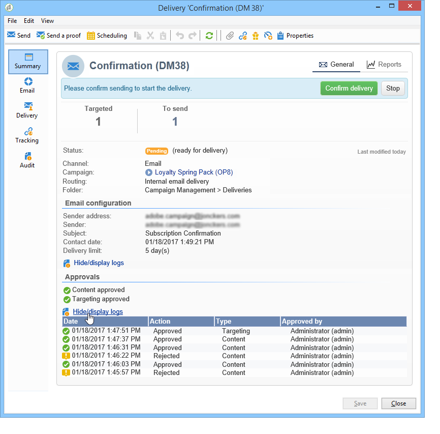
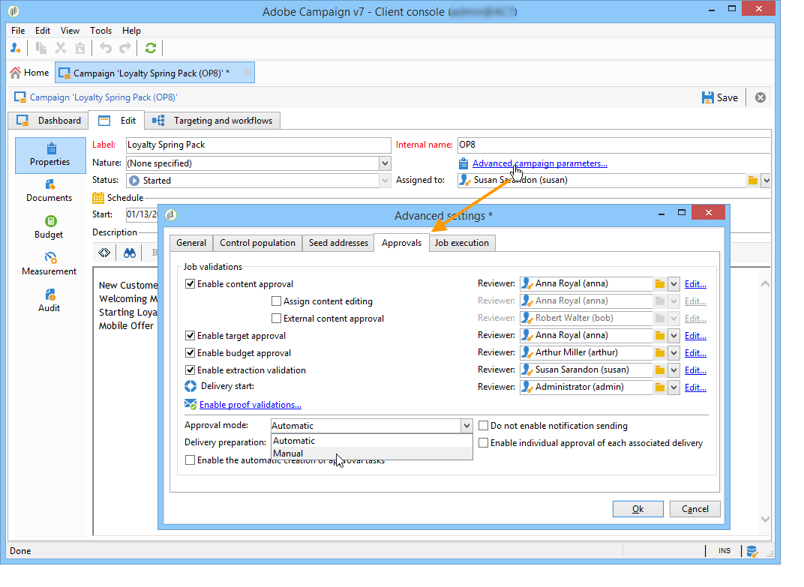
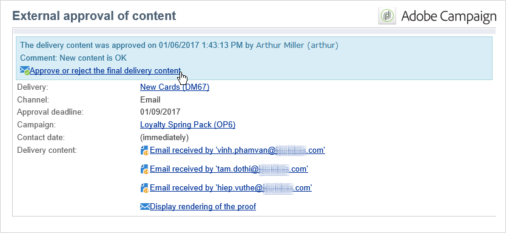

# 批准营销活动 {#approving-marketing-campaigns}

## 批准流程 {#approval-process}

交付的每个步骤都可获得批准，以确保对营销活动的各种流程进行全面监控：定位、内容、预算、提取和发送证明。

>[!NOTE]
>
>您需要检查审阅者是否拥有批准的适当权限。 同时检查其安全区是否已正确定义。

通知电子邮件会发送给指定审阅者的Adobe Campaign运营商，以通知他们申请批准。

审批过程显示在检查 [和批准交货中](#checking-and-approving-deliveries)。

>[!NOTE]
>
>只有交付所有者才能开始交付。 为了使其他运算符（或运算符组）能够开始交付，您必须在字段中将其添加为审阅 **[!UICONTROL Delivery start:]** 者。\
>另请参阅选 [择审阅者](#selecting-reviewers)。

### 工作原理 {#operating-principle-}

例如，用于预算审批的标准电子邮件将如下：

然后，审阅者操作员可以选择是否批准相关步骤。

一旦运营商批准其选择，作业的批准或拒绝将转发给交付仪表板。

该信息也可在营销活动的批准日志中找到(通过选项卡访 **[!UICONTROL Edit > Tracking > Approvals]** 问):

这些通知将发送给受影响的操作员，这些操作员的每个进程都启用了批准。

可以为营销活动模板、每个营销活动单独或分发启用批准。

所有需要批准的作业均在营销活动模板( **[!UICONTROL Properties]** > **[!UICONTROL Advanced campaign settings...]** > **[!UICONTROL Approvals]** tab)中选择，负责批准的运营商也是如此（除非未启用此选项，否则他们将收到通知）。 For more on this, refer to [Approving processes](#approving-processes).

可以使用此模板创建的每个营销活动都可以覆盖这些设置，并且每个营销活动分发都可以分别覆盖这些设置：单击按 **[!UICONTROL Properties]** 钮，然后单击选 **[!UICONTROL Approvals]** 项卡。

在以下示例中，交付内容将不需要批准：

### 选择审阅者 {#selecting-reviewers}

对于每种类型的批准，负责批准的运营商或运营商组从交付的下拉列表中被选择。 可以使用链接添加其他运 **[!UICONTROL Edit...]** 算符。 此窗口还允许您编辑批准截止日期。

如果未指定审阅人，营销活动管理者将负责批准并接收通知。 系列活动管理器在系列活动的 **[!UICONTROL Edit > Properties]** 选项卡中指定：

>[!NOTE]
>
>所有其他具有权限的Adobe Campaign运 **[!UICONTROL Administrator]** 营商也可以批准作业，但不会收到通知。\
>默认情况下，如果已定义批准操作符，营销活动管理者将无法执行批准或开始提交。 您可以修改此行为并授权营销活动管理器批准／开始分发，方法是创建 **NmsCampaign_Activate_OwnerConfirmation** 选项， **将** 1作为值。

### 批准模式 {#approval-modes}

#### 通过仪表板进行批准 {#approval-via-the-dashboard}

要通过控制台或Web界面批准作业，请单击营销活动功能板上的相应链接。 作业也可以通过交付跟踪或交付功能板进行批准。

检查要批准的信息，选择是接受还是拒绝批准，并在必要时输入评论。 单击 **[!UICONTROL Ok]** 以保存。

>[!NOTE]
>
>如果某个流程已经由其他运营商批准，则该批准链接不可用。

#### 通过通知消息批准 {#approval-via-notification-messages}

单击通知消息中可用的链接(请参阅 [通知](#notifications))。 系统会要求您识别自己的身份，如下所示：

选择 **[!UICONTROL Accept]** 或 **[!UICONTROL Reject]** 根据需要输入评论。

单击 **[!UICONTROL Validate]**.

>[!NOTE]
>
>如果在该过程中引发警告，则通知中会显示警告。

#### 批准跟踪 {#approval-tracking}

该信息在以下几个位置可用：

* 在营销活动批准日志中， **[!UICONTROL Approvals]** 选项卡的子选 **[!UICONTROL Edit > Tracking]** 项卡：

   

* 在营销活动交付日志中， **[!UICONTROL Deliveries]** 选项卡的子选 **[!UICONTROL Edit > Tracking]** 项卡：

   

* 单击选项卡的选项可查看每个交付 **[!UICONTROL Hide/show log]** 的批准状 **[!UICONTROL Summary]** 态。

   

* 此信息也可通过每个分发的 **[!UICONTROL Tracking > Approvals]** 选项卡访问：

   

>[!NOTE]
>
>经营者批准或者拒绝工作后，其他审核经营者便无法再对批准采取行动。

#### 自动和手动批准 {#automatic-and-manual-approval}

在创建定位工作流时，如果批准是自动的（默认模式）,Adobe Campaign会显示批准链接或在需要批准时立即发送通知。

要选择批准模式（手动或自动），请单击系列活动或系 **[!UICONTROL Edit > Properties]** 列活动模板的选项卡，然后单 **[!UICONTROL Advanced campaign settings...]** 击，最后单击 **[!UICONTROL Approvals]** 选项卡。

>[!NOTE]
>
>选定的批准模式将适用于营销活动的所有提交。

在构建定位工作流时，手动批准可让您避免创建批准链接或自动发送通知。 然后，营销活动控制板会提 **[!UICONTROL Submit targeting for approval]** 供一个链接，用于手动启动批准过程。

系统会显示一条确认消息，允许您对为此传送选择的作业进行批准。

然后，批准按钮会显示在营销活动仪表板（用于此分发）、分发仪表板和分发跟踪中。 如果通知已启用，则它们将并行发送。

通过启用批准的方法，您无需向审阅者发送虚假通知即可进行定位。

### 通知 {#notifications}

通知是发送给审阅者的特定电子邮件，用于通知审阅者某个流程正在等待批准。 当操作员单击消息中的链接时，将显示验证页面，在登录后，操作员可以查看信息并批准或拒绝作业。 也可以在批准窗口中输入评论。

通知电子邮件的内容可以个性化。 请参阅 [通知内容](#notification-content)。

#### 启用／禁用通知 {#enabling-disabling-notification}

默认情况下，如果在营销活动模板、营销活动或分发中启用了相关作业的批准，则会发送通知消息。 但是，可以禁用通知，以便仅从控制台授权批准。

为此，请编辑营销活动或营销活动模板的批准窗口( **[!UICONTROL Edit > Properties]** > **[!UICONTROL Advanced campaign settings...]** >选 **[!UICONTROL Approvals]** 项卡)并选择 **[!UICONTROL Do not enable notification sending]**。

#### 通知内容 {#notification-content}

通知内容在特定模板中定义： **[!UICONTROL Notification of validations for the marketing campaign]**. 此模板保存在Adobe Campaign树 **[!UICONTROL Administration > Campaign management > Technical delivery templates]** 的文件夹中。

## 检查和批准交付 {#checking-and-approving-deliveries}

Adobe Campaign允许您在协作模式下为营销活动的主要阶段设置审批流程。

对于直邮发送，Adobe Campaign运营商可以在提取文件发送到路由器之前查看它，如有必要，他们可以更改格式并重新启动提取。 请参阅 [批准提取文件](#approving-an-extraction-file)。

对于每个营销活动，您都可以批准分发目标、内容(请参 [阅批准内容](#approving-content))和成本。 负责批准工作的 Adobe Campaign 操作员收到电子邮件通知后，可通过控制台或 Web 连接批准或拒绝批准相关请求。请参阅 [批准流程](#approving-processes)。

当这些验证阶段完成时，可以启动交付。 请参 [阅开始交付](../../campaign/using/marketing-campaign-deliveries.md#starting-a-delivery)。

>[!NOTE]
>
>有关批准模式和跟踪的更多信息，请参阅 [批准过程](#approval-process)。

### 批准流程 {#approving-processes}

需要批准的阶段显示在营销活动仪表板上（通过Web界面的控制台）。 它们还显示在交付跟踪表和交付功能板中。

此时，营销活动的状态为 **[!UICONTROL To validate]**。

>[!NOTE]
>
>* 要选择要审批的流程，请修改营销活动模板。 For more on this, refer to [Campaign templates](../../campaign/using/marketing-campaign-templates.md#campaign-templates).
   >
   >
* 另请参阅“批准”流程 [的部分](#approval-process)。

>[!NOTE]
>
>在定位工作流中，如果在准备消息时出现与配置问题链接的错误，则该链 **[!UICONTROL Restart message preparation]** 接会显示在功能板上。 更正错误并单击此链接以在绕过定位阶段时重新开始消息准备。

对于营销活动中的每个分发，您可以批准以下流程：

* **定位、内容和预算**

   在任务 **[!UICONTROL Enable target approval]**&#x200B;批准设 **[!UICONTROL Enable content approval]** 置窗 **[!UICONTROL Enable budget approval]** 口中选择或选项后，相关交货的相关链接将显示在营销活动功能板中。

   >[!NOTE]
   >
   >只有在批准设置窗口中启用了定位批准后，预算批准才可用。 仅在分析目标后，才会显示预算批准链接。 此外，此链接与用于目标批准的链接一起显示。

   如果在审 **[!UICONTROL Assign content editing]** 批设置 **[!UICONTROL External content approval]** 窗口中选择了或选项，控制板将显示 **[!UICONTROL Available content]** 和链 **[!UICONTROL External content approval]** 接。

   内容批准允许您访问发送的校样。

* **提取批准（直邮递送）**

   当在 **[!UICONTROL Enable extraction approval]** 批准设置窗口中选择时，解压缩的文件必须经过批准，才能通知路由器。

   营销 **[!UICONTROL Approve content]** 活动功能板上提供了以下链接：

   

   提取文件可通过批准框预览，然后接受或拒绝。

   

   >[!NOTE]
   >
   >提取文件预览仅涉及数据样本。 不加载整个输出文件。

* **批准关联的交付**

   该选 **[!UICONTROL Enable individual approval of each associated delivery]** 项用于与辅助分发关联的一个主分发。 默认情况下，不选择此选项，以便能够执行主交付的整体批准。 如果选择此选项，则每个交付必须单独批准。

   

#### 选择要批准的流程 {#choosing-the-processes-to-be-approved}

批准阶段使用与营销活动关联的模板进行定义。 您必须从模板中选择要批准的元素，并指定负责这些批准的Adobe Campaign运营商。 For more on this, refer to [Campaign templates](../../campaign/using/marketing-campaign-templates.md#campaign-templates).

>[!NOTE]
>
>营销活动或营销活动模板的批准配置将应用于链接到此营销活动的所有未来交付。 任何配置更改都不会应用到以前的分发。

可以覆盖每个营销活动和每个分发的此信息。

对于营销活动，单 **[!UICONTROL Edit > Properties]** 击选项卡、链 **[!UICONTROL Advanced campaign settings...]** 接，最后单击子选项卡以访 **[!UICONTROL Approvals]** 问批准配置页面。

您可以选择和取消选择批准流程，并指定负责批准的Adobe Campaign运营商。 这些运算符可以是单个运算符、一组运算符或运算符列表。

要选择操作符列表，请单击指定 **[!UICONTROL Edit...]** 第一个审阅者的字段右侧的链接，并根据需要添加任意数量的操作符，如下所示：

>[!NOTE]
>
>* 如果定义了审阅者列表，则一旦一个审阅者接受了某个作业，就会批准该作业。 然后，仪表板中不再提供相关的批准链接。 启用通知发送后，如果其他审阅人单击通知消息中的批准链接，则通知他们其他操作员已批准作业。
>* 您可以在审阅人编辑窗口的下半部分为营销活动定义批准计划。 默认情况下，审阅者从提交日期开始有三天时间批准流程。 可以配置提醒，该提醒在批准截止日期前自动发送给相关运营商。
>* 您可以从此部分添加提醒。
>

对于每个分发，单击按 **[!UICONTROL Audit]** 钮和选项卡 **[!UICONTROL Approvals]** 以查看和编辑批准日期以及自动提醒。

>[!NOTE]
>
>内容批准流程启动后，此选项卡即可使用。

### 批准内容 {#approving-content}

>[!CAUTION]
>
>要批准内容，必须执行“证明”周期。 通过校样，您可以批准信息显示、个性化数据，并检查链接是否有效。 有关创建证明及其生命周期的详细信息，请参阅“发 [送消息](../../delivery/using/steps-validating-the-delivery.md#sending-a-proof) ”部分。
>
>下面详述的内容批准功能旨在添加到证明交付中。

可以配置内容批准周期。 为此，请在批准设 **[!UICONTROL Enable content approval]** 置窗口中选择选项。 内容审批周期的主要步骤是：

1. 创建新分发后，营销活动管理器单击营销 **[!UICONTROL Submit content]** 活动控制板上的链接以开始内容审批周期。

   

   >[!NOTE]
   >
   >如果在审 **[!UICONTROL Enable the sending of proofs]** 批设置窗口中选择了选项( **[!UICONTROL Enable the sending and approval of proofs]** 用于电子邮件发送)或（用于直接邮件发送）选项，则将自动发送校样。

1. 系统会向负责内容的人员发送通知电子邮件，该人员可以选择是否批准该内容：

   * 通过通知电子邮件：

      

      >[!NOTE]
      >
      >通知电子邮件包含指向已发送的证明的链接，如果为此实例启用了“可交付性 **** ”选项，则可能还包含指向各种电子邮件消息呈现的链接。

   * 通过控制台或Web界面、交付跟踪、交付控制板或营销活动控制板：

      

      >[!NOTE]
      >
      >通过此系列活动仪表板，您可以通过单击链接来查看已发送的校样列 **[!UICONTROL Inbox rendering...]** 表。 要查看其内容，请单 **[!UICONTROL Detail]** 击列表右侧的图标。

      

1. 系统会向负责营销活动的人员发送通知电子邮件，通知他们内容是否已获得批准。

   >[!NOTE]
   >
   >负责营销活动的人员可以随时重新启动内容批准周期。 为此，请单击营销活动功能板 **[!UICONTROL Content status]** 行（在交付级别）上的链接，然后单击 **[!UICONTROL Reset content approval to submit it again]**。

   

#### 分配内容编辑 {#assign-content-editing}

通过此选项，您可以定义负责内容编辑的人员，如网站管理员。 如果在 **[!UICONTROL Assign content editing]** 批准设置窗口中选择了此选项，则在将通知电子邮件发送给负责内容的人员的分发创建和分发之间会添加几个批准步骤：

1. 创建新分发后，负责营销活动的人员单击营销活 **[!UICONTROL Submit content editing]** 动控制板中的链接以开始内容编辑周期。

   

1. 负责内容编辑的人员将收到一封电子邮件，告知他们内容可用。

   

1. 然后，他们可以登录到控制台，打开分发并使用简化的向导编辑它以更改主题、HTML和文本内容并发送校样。

   

   >[!NOTE]
   >
   >如果在审 **[!UICONTROL Enable the sending of proofs]** 批设置窗口中选择了选项( **[!UICONTROL Enable the sending and approval of proofs]** 用于电子邮件发送)或（用于直接邮件发送）选项，则将自动发送校样。

1. 内容编辑负责人完成对交付内容的任何更改后，他们可以使内容可用。

   为此，他们可以：

   * 单击通 **[!UICONTROL Available content]** 过Adobe Campaign控制台的链接。

      

   * 单击通知消息中的链接，然后批准内容可用性。

      

      操作员可以在将内容提交给营销活动负责人之前添加评论。

      

      通知消息允许审阅人批准或拒绝内容。

      

#### 外部内容批准 {#external-content-approval}

通过此选项，您可以定义负责批准交付渲染的外部运营商，如品牌通信一致性、费率等。 在批准 **[!UICONTROL External content approval]** 设置窗口中选择此选项后，在内容批准和向营销活动负责人发送通知之间会添加几个批准步骤：

1. 外部内容管理器收到通知电子邮件，告知他们内容已被批准并请求外部批准。
1. 通知电子邮件包含指向已发送的校样的链接，您可以通过它查看分发呈现，以及一个用于批准或拒绝分发内容的按钮。

   >[!NOTE]
   >
   >这些链接仅在发送了一个或多个校样时才可用。 否则，交付渲染只能通过控制台或Web界面使用。

   

### 批准提取文件 {#approving-an-extraction-file}

对于脱机交付，Adobe Campaign会生成提取文件，根据设置方式将其发送到路由器。 其内容取决于所使用的导出模板。

当内容、定位和预算获得批准后，交付将更改为，直 **[!UICONTROL Extraction pending]** 到营销活动的提取工作流启动。

在提取请求日期，将创建提取文件，并将提交状态更改为 **[!UICONTROL File to approve]**。

您可以查看提取的文件的内容（通过单击其名称）、批准它，或根据需要更改格式并使用功能板上的链接重新启动提取。

文件获得批准后，您可以向路由器发送通知电子邮件。 有关详细信息，请参 [阅启动脱机交付](../../campaign/using/marketing-campaign-deliveries.md#starting-an-offline-delivery)。
