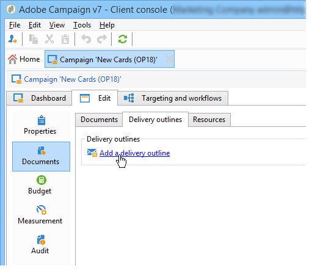

# 管理关联的文档{#managing-associated-documents}

您可以将各种文档与活动关联：报告、照片、网页、图表等。 这些文档可以采用任何格式(Microsoft Word、PowerPoint、PNG、JPG、Acrobat PDF等)。

>[!IMPORTANT]
>
>此功能专为小资产和文档保留。

在活动中，您还可以参考其他项目，例如促销优惠券、与特定品牌或商店相关的特殊优惠等。 当这些元素包含在大纲中时，它们可以与直邮投放关联。 请参阅[关联和结构通过投放概要](#associating-and-structuring-resources-linked-via-a-delivery-outline)链接的资源。

>[!NOTE]
>
>如果您使用活动营销资源管理模块，则还可以管理可供多个用户协作工作的营销资源库。 [了解详情](../../campaign/using/managing-marketing-resources.md)。

## 添加文档{#adding-documents}

文档可以在活动级别(上下文文档)或项目级别(一般文档)关联。

**[!UICONTROL Documents]**&#x200B;选项卡包含：

* 列表内容（模板、图像等）所需的所有文档 由具有适当权限的Adobe Campaign运营商本地下载，
* 文档包含路由器信息（如果有）。

文档通过&#x200B;**[!UICONTROL Edit > Documents]**&#x200B;选项卡链接到项目或活动。

您还可以通过文档中提供的链接将仪表板添加到活动。

单击&#x200B;**[!UICONTROL Details]**&#x200B;图标以视图文件内容并添加信息：

在仪表板中，与活动关联的文档在&#x200B;**[!UICONTROL Document(s)]**&#x200B;部分进行分组，如下例所示：

也可以通过此视图编辑和修改它们。

## 通过{#associating-and-structuring-resources-linked-via-a-delivery-outline}投放概要链接的资源关联和结构

>[!NOTE]
>
>投放概要仅用于直接邮件活动的上下文。

投放概要表示一组结构化元素(文档、商店、优惠券等) 为特定公司创建。

这些元素按投放概要分组，每个投放概要都与投放关联；它将在发送到&#x200B;**服务提供商**&#x200B;的提取文件中引用，以便附加到投放。 例如，您可以创建引用分支及其使用的营销小册子的投放概要。

对于活动,投放概要允许您根据特定条件构造要与投放关联的外部元素：相关分支、授予的促销优惠、向当地事件发出的邀请等。

### 创建大纲{#creating-an-outline}

要创建大纲，请单击相关活动&#x200B;**[!UICONTROL Edit > Documents]**&#x200B;选项卡中的&#x200B;**[!UICONTROL Delivery outlines]**&#x200B;子选项卡。

>[!NOTE]
>
>如果此选项卡不存在，则此功能对此活动不可用。 请参阅活动模板配置。
>   
>有关模板的详细信息，请参阅[本节](../../campaign/using/marketing-campaign-templates.md#campaign-templates)。

接下来，单击&#x200B;**[!UICONTROL Add a delivery outline]**&#x200B;并创建活动的轮廓层次：

1. 右键单击树的根，然后选择&#x200B;**[!UICONTROL New > Delivery outlines]**。
1. 右键单击刚刚创建的大纲，然后选择&#x200B;**[!UICONTROL New > Item]**&#x200B;或&#x200B;**[!UICONTROL New > Personalization fields]**。

大纲可以包含项目和个性化字段、资源和优惠:

* 项目可以是物理文档，例如，此处引用和描述的项目将附加到投放。
* 个性化字段使您能够创建与投放相关的个性化元素，而不是收件人。 因此，可以创建要在特定目标(欢迎优惠、折扣等)的投放中使用的值。 它们以Adobe Campaign创建，并通过&#x200B;**[!UICONTROL Import personalization fields...]**&#x200B;链接导入到大纲中。

   

   也可以通过单击列表区域右侧的&#x200B;**[!UICONTROL Add]**&#x200B;图标直接在大纲中创建它们。

   

* 资源是在通过&#x200B;**[!UICONTROL Campaigns]**&#x200B;宇宙的&#x200B;**[!UICONTROL Resources]**&#x200B;链接访问的营销资源仪表板中生成的营销资源。

   

   >[!NOTE]
   >
   >有关营销资源的详细信息，请参阅[此部分](../../campaign/using/managing-marketing-resources.md)。

### 选择大纲{#selecting-an-outline}

对于每个投放，您可以从为提取大纲保留的部分中选择要关联的大纲，如下例所示：

选定的轮廓随后将显示在窗口的下部。 可以使用字段右侧的图标进行编辑或使用下拉式列表更改：

投放的&#x200B;**[!UICONTROL Summary]**&#x200B;选项卡还显示以下信息：

### 提取结果{#extraction-result}

在提取并发送到服务提供商的文件中，大纲的名称，并在适当时，其特征（费用、描述等） 将根据与服务提供商关联的导出模板中的信息添加到内容。

在以下示例中，将与投放关联的大纲的标签、估计成本和说明将添加到提取文件。

导出模型必须与为相关服务提供商选择的投放关联。 请参阅[此章节](../../campaign/using/providers--stocks-and-budgets.md#creating-service-providers-and-their-cost-structures)。

>[!NOTE]
>
>有关导出的详细信息，请参阅[此部分](../../platform/using/get-started-data-import-export.md)部分。
