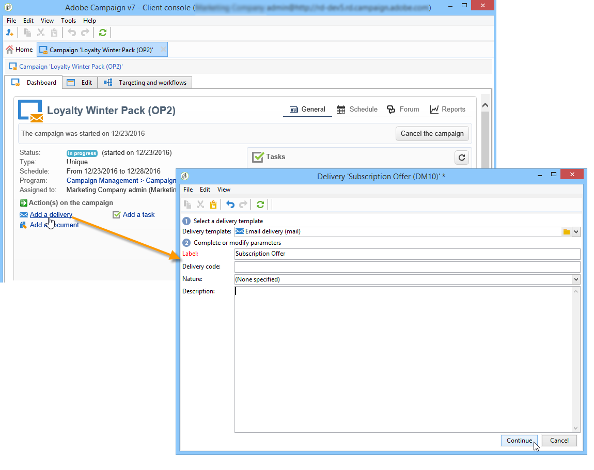
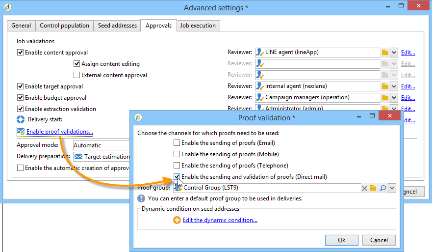
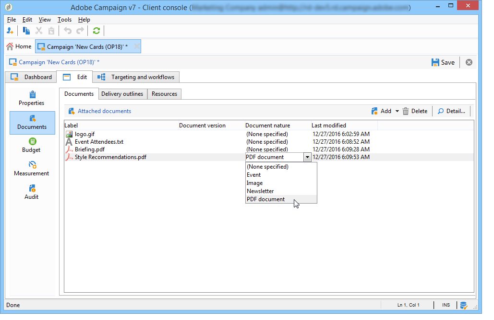
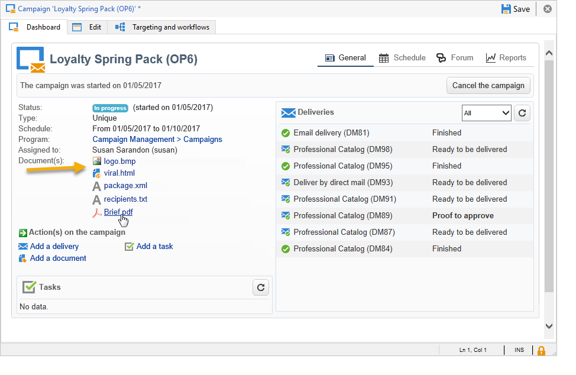

# 营销活动投放 {#marketing-campaign-deliveries}

可通过活动功能板、活动工作流或直接通过投放概述来创建投放。

从营销活动创建投放时，会将投放链接到此营销活动，并在营销活动级别进行合并。

[ 在视频中发现此功能](#create-email-video)

## 创建投放 {#creating-deliveries}

要创建链接到营销策划的投放，请单击 **[!UICONTROL Add a delivery]** 活动仪表板中的链接。

建议的配置适用于不同类型的投放：直邮、电子邮件、移动渠道。 [了解详情](../../delivery/using/steps-about-delivery-creation-steps.md)。

## 开始投放 {#starting-a-delivery}

获得所有批准后，即可开始投放。 然后，投放过程取决于投放类型。 有关电子邮件或移动渠道投放，请参阅 [开始在线投放](#starting-an-online-delivery)，对于直邮投放，请参阅 [开始离线投放](#starting-an-offline-delivery).

### 启动在线投放 {#starting-an-online-delivery}

批准所有审批请求后，投放状态将更改为 **[!UICONTROL Pending confirmation]** 并且可以由操作员启动。 在适当的情况下，被指定为开始投放的审阅者的Adobe Campaign操作员（或操作员组）会收到投放已准备就绪的通知。

>[!NOTE]
>
>如果指定了特定操作员或操作员组来在投放的属性中开始投放，您还可以允许负责投放的操作员确认发送。 为此，请激活 **NMS_ActivateOwnerConfirmation** 选项，方法是输入 **1** 作为值。 这些选项是从 **[!UICONTROL Administration]** > **[!UICONTROL Platform]** > **[!UICONTROL Options]** Adobe Campaign节点。
>  
>要取消激活此选项，请输入 **0** 作为值。 然后，发送确认流程将默认运行：只有投放属性中为发送指定的操作员或操作员组（或管理员）才能确认并执行发送。

该信息也会显示在促销活动信息板上。 此 **[!UICONTROL Confirm delivery]** 链接可让您开始投放。

确认消息可让您确保此操作的安全性。

### 开始离线投放 {#starting-an-offline-delivery}

获得所有批准后，投放状态将更改为 **[!UICONTROL Pending extraction]**. 提取文件是通过特殊工作流创建的，在默认配置中，当直邮投放挂起提取时，会自动启动该工作流。 当流程正在进行时，它将显示在仪表板中，并可通过其链接进行编辑。

>[!NOTE]
>
>中介绍了与Campaign包相关的技术工作流 [技术工作流列表](../../workflow/using/about-technical-workflows.md).

**步骤1 — 文件审批**

成功执行提取工作流后，必须批准提取文件（前提是在投放设置中选择了提取文件批准）。

有关更多信息，请参阅 [批准提取文件](../../campaign/using/marketing-campaign-approval.md#approving-an-extraction-file).

**第2步 — 批准向服务提供商发送报文**

* 提取文件获得批准后，即可生成路由器通知电子邮件的证明。 此电子邮件基于投放模板构建。 它必须获得批准。

   >[!NOTE]
   >
   >仅当在审批窗口中启用验证发送和审批时，此步骤才可用。

* 单击 **[!UICONTROL Send a proof]** 按钮以创建验证。

   必须预先定义验证目标。

   您可以创建所需数量的验证。 这些权限可通过 **[!UICONTROL Direct mail...]** 投放详细信息的链接。

   

* 投放状态更改为 **[!UICONTROL To submit]**. 单击 **[!UICONTROL Submit proofs]** 按钮以启动审批流程。

   

* 投放状态更改为 **[!UICONTROL Proof to validate]** 和按钮可让您接受或拒绝审批。

   

   您可以接受或拒绝此批准，或返回提取步骤。

   

* 提取文件将发送到路由器，并且完成投放。

### 成本和库存的计算 {#calculation-of-costs-and-stocks}

文件提取将启动两项操作：预算计算和库存计算。 更新预算条目。

* 此 **[!UICONTROL Budget]** 选项卡允许您管理营销活动的预算。 成本条目的总数显示在 **[!UICONTROL Calculates cost]** 营销活动的主要选项卡及其所属项目的字段。 这些金额也反映在营销活动预算中。

   实际成本最终将根据路由器提供的信息计算。 只有实际发送的消息才会开票。

* 库存定义于 **[!UICONTROL Administration > Campaign management > Stocks]** 树中的节点，以及成本结构 **[!UICONTROL Administration > Campaign management > Service providers]** 节点。

   坯件线在坯件区中可见。 要定义初始坯件，请打开坯件线。 每次进行交货时，库存都会减少。 您可以定义警报级别和通知。

>[!NOTE]
>
>有关成本计算和库存管理的详细信息，请参阅 [供应商、库存和预算](../../campaign/using/providers--stocks-and-budgets.md).

## 管理关联文档 {#managing-associated-documents}

您可以将各种文档与活动关联起来：报表、照片、网页、图表等。这些文档可以是任何格式(Microsoft Word、PowerPoint、PNG、JPG、AcrobatPDF等)。 了解如何将文档与营销活动关联 [在此部分中](../../campaign/using/marketing-campaign-assets.md).

>[!IMPORTANT]
>
>此模式为小文档保留。

在营销策划中，您还可以参考其他项目，例如促销优惠券、与特定分支或商店相关的特殊优惠等。 当这些元素包含在大纲中时，它们可以与直邮投放相关联。 [了解详情](#associating-and-structuring-resources-linked-via-a-delivery-outline)。

>[!NOTE]
>
>如果您使用的是MRM，您还可以管理营销资源库，该库可用于多名参与者进行协作工作。 参见 [管理营销资源](../../mrm/using/managing-marketing-resources.md).

### 添加文档 {#adding-documents}

文档可以在营销活动级别（上下文文档）或项目群级别（常规文档）关联。

此 **[!UICONTROL Documents]** 选项卡包含：

* 内容所需的所有文档（模板、图像等）的列表 Adobe Campaign操作员通过适当权限可本地下载的广告文件、
* 包含路由器信息的文档（如果有）。

这些文档通过以下方式链接到项目或营销策划 **[!UICONTROL Edit > Documents]** 选项卡。

您还可以通过信息板中提供的链接将文档添加到营销活动。

单击 **[!UICONTROL Details]** 图标以查看文件内容和添加信息：

在功能板中，与活动关联的文档将分组到 **[!UICONTROL Document(s)]** 部分，如以下示例所示：

也可以从此视图编辑和修改它们。

### 关联和构建通过投放概要链接的资源 {#associating-and-structuring-resources-linked-via-a-delivery-outline}

>[!NOTE]
>
>投放大纲仅用于直邮营销活动。

投放概要表示一组结构化元素（文档、分支/商店、促销优惠券等） 在公司中为特定营销活动创建。

这些元素在投放大纲中进行分组，并且特定的投放大纲将与投放相关联；将在发送到的提取文件中引用该投放。 **服务提供商** 以便附加到投放中。 例如，您可以创建一个投放概要，其中引用分支及其使用的营销手册。

对于营销活动，利用投放概要，可根据特定条件构建要与投放关联的外部元素：相关分支、授予的促销优惠、本地活动邀请函等。

#### 创建大纲 {#creating-an-outline}

要创建大纲，请单击 **[!UICONTROL Delivery outlines]** 中的子选项卡 **[!UICONTROL Edit > Documents]** 相关营销活动的选项卡。

>[!NOTE]
>
>如果此选项卡不存在，则此功能不适用于此营销活动。 请参阅营销活动模板配置。
>   
>有关更多信息，请参阅 [营销活动模板](../../campaign/using/marketing-campaign-templates.md#campaign-templates).

接下来，单击 **[!UICONTROL Add a delivery outline]** 并为营销活动创建大纲的层次结构：

1. 右键单击树的根并选择 **[!UICONTROL New > Delivery outlines]**.
1. 右键单击刚刚创建的大纲，然后选择 **[!UICONTROL New > Item]** 或 **[!UICONTROL New > Personalization fields]**.

大纲可以包含项目和个性化字段、资源和选件：

* 项目可以是物理文档，例如，此处引用和描述的文档，并将附加到投放。
* 通过个性化字段，您可以创建与投放而非收件人相关的个性化元素。 因此，可以创建值以用于特定目标的投放（欢迎优惠、折扣等） 它们在Adobe Campaign中创建，并通过导入到大纲中 **[!UICONTROL Import personalization fields...]** 链接。

   

   也可以通过单击 **[!UICONTROL Add]** 图标（位于列表区域的右侧）。

   

* 资源是营销资源仪表板中生成的营销资源，可通过访问 **[!UICONTROL Resources]** 链接 **[!UICONTROL Campaigns]** 选项卡。

   

   >[!NOTE]
   >
   >有关营销资源的更多信息，请参阅 [管理营销资源](../../mrm/using/managing-marketing-resources.md).

#### 选择大纲 {#selecting-an-outline}

对于每个投放，您可以从为提取大纲保留的部分中选择要关联的大纲，如下例所示：

然后，所选轮廓将显示在窗口的下部。 可使用字段右侧的图标编辑或使用下拉列表进行更改：

此 **[!UICONTROL Summary]** 投放的选项卡也会显示以下信息：

#### 提取结果 {#extraction-result}

在提取并发送到服务提供商的文件中，大纲的名称以及适当时其特征（成本、描述等） 根据与服务提供商关联的导出模板中的信息添加到内容中。

在以下示例中，与投放关联的大纲的标签、预计成本和描述将添加到提取文件中。

导出模型必须与为相关投放选择的服务提供商关联。 参见 [创建服务提供商及其成本结构](../../campaign/using/providers--stocks-and-budgets.md#creating-service-providers-and-their-cost-structures).

>[!NOTE]
>
>有关导出的更多信息，请参阅 [快速入门](../../platform/using/get-started-data-import-export.md) 部分。

#### 教程视频 {#create-email-video}

此视频介绍如何在Adobe Campaign中创建活动和电子邮件。

>[!VIDEO](https://video.tv.adobe.com/v/25604?quality=12)

提供了其他Campaign操作方法视频 [此处](https://experienceleague.adobe.com/docs/campaign-classic-learn/tutorials/overview.html?lang=zh-Hans).
