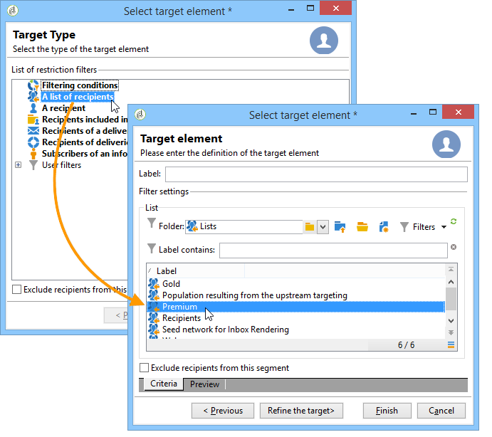
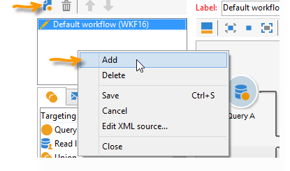
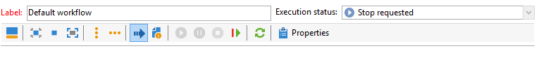
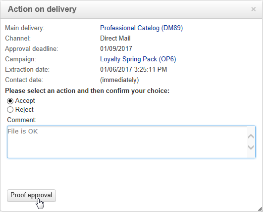

# Marketing campaign deliveries {#marketing-campaign-deliveries}

投放可以通过活动仪表板、活动工作流或直接通过投放概述创建。

[在视频中发现此功能](#create-email-video)

## 创建投放{#creating-deliveries}

要创建链接到投放的活动，请单 **[!UICONTROL Add a delivery]** 击活动仪表板中的链接。

建议的配置适用于不同类型的投放:直邮、电子邮件、移动渠道

>[!NOTE]
>
>有关创建和配置投放的详细信息，请参阅 [发送消息](../../delivery/using/steps-about-delivery-creation-steps.md) 。

## 选择目标群 {#selecting-the-target-population}

对于每个投放,活动管理器将定义：

* 主目标。 有关此问题的详细信息，请 [参阅在工作流中构建主目标](#building-the-main-target-in-a-workflow)[和选择目标填充](#selecting-the-target-population)。
* 对照组。 有关此内容的详细信息，请参 [阅定义对照组](#defining-a-control-group)。
* 种子地址。 如需详细信息，请参阅[此部分](../../delivery/using/about-seed-addresses.md)。

其中一些信息是从模板继承的。

>[!NOTE]
>
>活动模板以 [活动模板显示](../../campaign/using/marketing-campaign-templates.md#campaign-templates)。

要构建投放目标，您可以为数据库中的收件人定义过滤条件。 此收件人选择模式显示在“发送消 [息”部分](../../delivery/using/steps-defining-the-target-population.md) 。

### 示例：交付给一组收件人 {#example--delivering-to-a-group-of-recipients}

您可以将人口导入列表，然后以投放目标此列表。

1. 为此，请编辑相关投放，并单 **[!UICONTROL To]** 击链接以更改目标人群。

1. 在选 **[!UICONTROL Main target]** 项卡中，选 **[!UICONTROL Defined via the database]** 择选项并单 **[!UICONTROL Add]** 击选择收件人。

1. 选择 **[!UICONTROL A list of recipients]** 并单击 **[!UICONTROL Next]** 以选择它。

### 在工作流中构建主目标 {#building-the-main-target-in-a-workflow}

投放的主目标也可以在定位工作流中定义：此图形环境允许您使用查询、测试和运算符构建目标:合并、外部重复数据删除、共享等。

“使 [用工作流自动](../../workflow/using/architecture.md) ”指南包含工作流模块操作方式的详细说明。

>[!IMPORTANT]
>
>在同一活动下，设置的工作流数不能超过28个。 超出此限制后，其他工作流在接口中不可见，并且可能生成错误。

### 如何在活动中创建电子邮件 {#create-email-video}

此视频介绍如何在 Adobe Campaign Classic 中创建活动和电子邮件。

>[!VIDEO](https://video.tv.adobe.com/v/25604?quality=12)

#### 创建定位工作流 {#creating-a-targeting-workflow}

可以通过工作流中图形序列中的过滤条件组合来创建定位。 您可以创建根据您的需求定位的人口和子人口。 要显示工作流编辑器，请单击 **[!UICONTROL Targeting and workflows]** 活动仪表板中的选项卡。

通过放置在工作流中的一个或多个目标从Adobe Campaign数据库提取查询群。 要了解如何构建查询，请参 [阅本节](../../workflow/using/query.md)。

您可以通过查询、交叉、共享、排除等框启动合并并共享人口。

从工作区左侧的列表中选择对象，并将其链接以构建目标。

在图中，在图中链接目标构建所需的定位和计划查询。 在施工过程中，您可以执行定位，以检查从数据库提取的人口。

>[!NOTE]
>
>本节介绍了定义查询的示 [例和过程](../../workflow/using/query.md)。

编辑器的左侧部分包含表示活动的图形对象库。 第一个选项卡包含定位活动，第二个选项卡包含流控制活动，流控制活动偶尔用于协调定位。

可以通过图编辑器工具栏访问定位工作流执行和格式设置功能。

>[!NOTE]
>
>可用于构建图的活动以及所有显示和布局功能在“使用工作流自动 [化”指南中有](../../workflow/using/architecture.md) 详细说明。

您可以为单个工作流创建多个定位活动。 要添加工作流，请执行以下操作：

1. 转到工作流创建区域的左上部，右键单击并选择 **[!UICONTROL Add]**。 您还可以使用位 **[!UICONTROL New]** 于此区域上方的按钮。

   

1. 选择模 **[!UICONTROL New workflow]** 板并命名此工作流。
1. 单 **[!UICONTROL OK]** 击以确认创建工作流，然后创建此工作流的图。

#### 执行工作流 {#executing-a-workflow}

定位工作流可以通过工具栏中 **[!UICONTROL Start]** 的按钮手动启动，前提是您具有相应权限。

可以根据计划(调度程序)或事件（外部信号、文件导入等）对目标进行编程以自动执行。

与执行定位工作流（启动、停止、暂停等）相关的操作 是异 **步进** 程：命令将保存，并在服务器可用时生效。

工具栏图标允许您执行定位工作流。

* 开始或重新启动

   * 通过 **[!UICONTROL Start]** 该图标可启动定位工作流。 单击此图标时，将激活所有没有输入过渡的活动（终点跳转除外）。

      

      服务器会考虑请求，如其状态所示：

      

      进程状态将更改为 **[!UICONTROL Started]**。

   * 您可以通过相应的工具栏图标重新启动定位工作流。 如果图标不可用， **[!UICONTROL Start]** 例如当定位工作流正在停止时，此命令可能很有用。 在这种情况下，请单击 **[!UICONTROL Restart]** 图标以预测重新启动。 服务器会考虑请求，如其状态所示：

      

      然后，该进程进入 **[!UICONTROL Started]** 状态。

* 停止或暂停

   * 工具栏图标允许您停止或暂停正在进行的定位工作流。

      单击时， **[!UICONTROL Pause]**&#x200B;正在进行的操 **[!UICONTROL are not]** 作已暂停，但直到下次重新启动后，才会启动其他活动。

      

      服务器会考虑该命令，如其状态所示：

      

      您还可以在定位工作流执行到达特定活动时自动暂停该工作流。 为此，请右键单击要暂停定位工作流的活动，然后选择 **[!UICONTROL Enable but do not execute]**。

      

      此配置由特殊图标显示。

      

      >[!NOTE]
      >
      >此选项在高级定位活动设计和测试阶段非常有用。

      单击 **[!UICONTROL Start]** 以恢复执行。

   * 单击图 **[!UICONTROL Stop]** 标以停止正在执行的操作。

      

      服务器会考虑该命令，如其状态所示：

      
   您还可以在执行到达活动时自动停止定位工作流。 为此，请右键单击要停止定位工作流的活动，然后选择 **[!UICONTROL Do not activate]**。

   

   

   此配置由特殊图标显示。

   >[!NOTE]
   >
   >此选项在高级定位活动设计和测试阶段非常有用。

* 无条件停止

   在资源管理器中，选 **[!UICONTROL Administration > Production > Object created automatically > Campaign workflows]** 择以访问每个活动工作流并对其执行操作。

   单击该图标并选择“停止”，即可 **[!UICONTROL Actions]** 无条件停止您的 **[!UICONTROL Unconditional]** 工作流。 此操作将终止您的活动工作流。

   

### Defining a control group {#defining-a-control-group}

对照组是不接受投放的人；它通过与已接收投放的目标群体的行为进行比较来跟踪活动后行为和投放影响。

对照组可从主目标提取和／或来自特定组或查询。

#### 激活对照组以活动 {#activating-the-control-group-for-a-campaign}

您可以在对照组级别定义对照组，在这种情况下，活动将应用于相关活动的每个投放。

1. 编辑相关活动，然后单击选 **[!UICONTROL Edit]** 项卡。
1. 单击 **[!UICONTROL Advanced campaign settings]**.

   

1. 选择选 **[!UICONTROL Enable and edit control group configuration]** 项。
1. 单击 **[!UICONTROL Edit...]** 以配置对照组。

   

配置过程在从主对照组 [中提取目标和添加对照组](#extracting-the-control-group-from-the-main-target)[中介绍](#adding-a-population)。

#### 激活对照组以投放 {#activating-the-control-group-for-a-delivery}

您可以在对照组级别定义对照组，在这种情况下，投放将应用于相关活动的每个投放。

默认情况下，在对照组级别定义的活动配置适用于该活动的每个投放。 但是，您可以调整对照组以适应单个投放。

>[!NOTE]
>
>如果您为活动定义了对照组，并且还为链接到此活动的投放配置了该对照组，则只会应用为该投放定义的。

1. 编辑相关投放，然后单 **[!UICONTROL To]** 击部分中的链 **[!UICONTROL Email parameters]** 接。

   

1. 单击选 **[!UICONTROL Control group]** 项卡，然后选择 **[!UICONTROL Enable and edit control group configuration]**。
1. 单击 **[!UICONTROL Edit...]** 以配置对照组。

配置过程在从主对照组 [中提取目标和添加对照组](#extracting-the-control-group-from-the-main-target)[中介绍](#adding-a-population)。

#### 从主对照组提取目标 {#extracting-the-control-group-from-the-main-target}

您可以从收件人的主目标中提取投放。 在这种情况下，将从受此配置影响的投放操作的目标中进行收件人。 此提取可以是随机的，也可以是对收件人进行排序的结果。

要提取对照组，请为活动或投放启用对照组，然后选择以下选项之一： **[!UICONTROL Activate random sampling]** 或 **[!UICONTROL Keep only the first records after sorting]**&#x200B;者

* **[!UICONTROL Activate random sampling]** :此选项将随机采样应用于目标群体中的收件人。 如果您随后将阈值设置为100，则对照组将由从目标人群中随机选择的100个收件人组成。 随机采样取决于数据库引擎。
* **[!UICONTROL Keep only the first records after sorting]**：通过此选项可根据一个或多个排序顺序定义限制。如果选择字 **[!UICONTROL Age]** 段作为排序标准，然后将100定义为阈值，则对照组将由100个最年轻的收件人组成。 例如，定义一个包含购买量很少的对照组或频繁购买的收件人的收件人，并将其行为与联系的收件人进行比较，这可能会很有意思。

单 **[!UICONTROL Next]** 击以定义排序顺序（如有必要）并选择收件人限制模式。

此配置等效于工作流中的共享活动，它允许您将目标分解为子集。 对照组是这些子集之一。 Refer to the [this section](../../workflow/using/architecture.md) for more information.

### 添加控制组 {#adding-a-population}

您可以定义要用作对照组的新人口。 此群体可以来自一组收件人，也可以通过特定查询创建。

>[!NOTE]
>
>Adobe Campaign查询编辑器显示 [在本节中](../../workflow/using/query.md)。

## 启动投放 {#starting-a-delivery}

一旦所有批准都获得批准，投放即可开始。 投放过程随后取决于投放类型。 有关电子邮件或移动渠道投放，请参 [阅启动在线投放](#starting-an-online-delivery)，有关直邮投放，请参 [阅启动脱机投放](#starting-an-offline-delivery)。

### 启动在线投放 {#starting-an-online-delivery}

一旦所有批准请求都被授予，投放状态将变 **[!UICONTROL Pending confirmation]** 为并可由操作员启动。 如果适用，将通知指定为Adobe Campaign开始的投放运算符(或操作员组),投放已准备好启动。

>[!NOTE]
>
>如果指定了特定的运算符或操作员组以在投放的属性中启动投放，则还可以允许负责投放的运算符确认发送。 为此，请输 **入1作为值** ，激活 **NMS** _ActivateOwnerConfirmation选项。 这些选项通过Adobe Campaign资 **[!UICONTROL Administration]** 源 **[!UICONTROL Platform]** 管理器 **[!UICONTROL Options]** 中的> >节点进行管理。
>  
>要取消激活此选项， **请输** 入0作为值。 然后，发送确认过程将作为默认过程：只有在投放属性（或管理员）中为发送指定的运算符或操作员组才能确认和执行发送。

该信息也会显示在活动仪表板上。 链接 **[!UICONTROL Confirm delivery]** 允许您开始投放。

通过确认消息，您可以保护此操作。

### 启动脱机投放 {#starting-an-offline-delivery}

一旦所有批准都获得批准，投放状态将变为 **[!UICONTROL Pending extraction]**。 提取文件通过特殊工作流创建，在默认配置中，当直接邮件投放挂起提取时，该工作流会自动开始。 进程进行中时，该进程会显示在仪表板中，并可通过其链接进行编辑。

>[!NOTE]
>
>在技术工作流过程列表中，提 [出了活动过程工作流](../../workflow/using/campaign.md)。

**步骤1 —— 文件批准**

成功执行提取工作流后，必须批准提取文件(前提是在投放设置中选择了提取文件批准)。

有关此内容的详细信息，请参 [阅批准提取文件](../../campaign/using/marketing-campaign-approval.md#approving-an-extraction-file)。

**第2步——批准发送给服务提供商的消息**

* 提取文件获得批准后，您就可以生成路由器通知电子邮件的验证。 此电子邮件基于投放模板构建。 必须获得批准。

   >[!NOTE]
   >
   >仅当在批准窗口中启用了验证的发送和批准时，此步骤才可用。

* Click the **[!UICONTROL Send a proof]** button to create the proofs.

   验证目标必须事先定义。

   您可以创建任意所需数量的验证。 这些资源可通过 **[!UICONTROL Direct mail...]** 投放详细信息链接访问。

   

* 投放状态将更改为 **[!UICONTROL To submit]**。 Click the **[!UICONTROL Submit proofs]** button to start the approval process.

   

* 投放状态将更 **[!UICONTROL Proof to validate]** 改为，您可以通过按钮接受或拒绝批准。

   

   您可以接受或拒绝此批准，或返回至提取步骤。

   

* 提取文件将发送到路由器，投放完成。

### 计算费用和库存 {#calculation-of-costs-and-stocks}

文件提取启动两个操作：预算计算和库存计算。 将更新预算条目。

* 通 **[!UICONTROL Budget]** 过选项卡可以管理活动的预算。 成本条目的总数显示在活动的 **[!UICONTROL Calculates cost]** 主标签和其所属项目的字段中。 金额也反映在活动预算中。

   实际成本最终将由路由器提供的信息计算。 只有实际发送的邮件才能开票。

* 库存在树的节 **[!UICONTROL Administration > Campaign management > Stocks]** 点中定义，成本结构在节点中 **[!UICONTROL Administration > Campaign management > Service providers]** 定义。

   库存行显示在库存部分中。 要定义初始库存，请打开一个库存行。 每次发生投放时，库存会减少。 您可以定义警报级别和通知。

>[!NOTE]
>
>有关成本计算和库存管理的更多信息，请参 [阅提供商、库存和预算](../../campaign/using/providers--stocks-and-budgets.md)。

## 管理关联文档 {#managing-associated-documents}

您可以将各种文档与活动关联：报告、照片、网页、图表等。 这些文档可以采用任何格式(Microsoft Word、PowerPoint、PNG、JPG、AcrobatPDF等)。 要将文档与活动关联，请参阅 [添加文档](#adding-documents)。

>[!IMPORTANT]
>
>此模式为小文档保留。

在活动中，您还可以参阅其他项目，如促销优惠券、与特定分店或商店相关的特殊优惠等。 当这些元素包含在大纲中时，它们可以与直邮投放关联。 请参 [阅关联和构造通过投放概要链接的资源](#associating-and-structuring-resources-linked-via-a-delivery-outline)。

>[!NOTE]
>
>如果您使用MRM，还可以管理可供多个参加者协作工作的营销资源库。 See [Managing marketing resources](../../campaign/using/managing-marketing-resources.md).

### 添加文档 {#adding-documents}

文档可以在活动级别(上下文文档)或项目级别(一般文档)进行关联。

该选 **[!UICONTROL Documents]** 项卡包含：

* 内容（模板、图像等）所需的所有文档的列表 由具有适当权限的Adobe Campaign运营商本地下载，
* 文档包含路由器信息（如果有）。

文档通过选项卡链接到项目或 **[!UICONTROL Edit > Documents]** 活动。

您还可以通过文档中提供的链接向活动添加仪表板。

单击该 **[!UICONTROL Details]** 图标以视图文件的内容并添加信息：

在仪表板中，与活动关联的文档在部 **[!UICONTROL Document(s)]** 分进行分组，如下例所示：

也可以通过此视图编辑和修改它们。

### 通过投放概要关联和组织链接的资源 {#associating-and-structuring-resources-linked-via-a-delivery-outline}

>[!NOTE]
>
>投放概要专门用于直接邮件活动的上下文。

投放概要表示一组结构化元素(文档、分店／商店、促销优惠券等) 为特定公司创建。

这些元素按投放概要进行分组，特定投放概要将与投放关联；它将在发送到提取的服务提供商文件 **中引用** ，以便附加到投放。 例如，您可以创建引用分支及其使用的营销小册子的投放概要。

对于活动,投放概要允许您根据特定条件构造要与投放关联的外部元素：相关分支、授予的促销优惠、向本地事件发出的邀请等。

#### 创建大纲 {#creating-an-outline}

要创建大纲，请单 **[!UICONTROL Delivery outlines]** 击相关活动 **[!UICONTROL Edit > Documents]** 选项卡中的子选项卡。

>[!NOTE]
>
>如果此选项卡不存在，则此功能对此活动不可用。 请参阅活动模板配置。
>   
>For more on this, refer to [Campaign templates](../../campaign/using/marketing-campaign-templates.md#campaign-templates).

然后，单 **[!UICONTROL Add a delivery outline]** 击并创建活动的轮廓层次结构：

1. 右键单击树的根，然后选择 **[!UICONTROL New > Delivery outlines]**。
1. 右键单击刚创建的大纲，然后选择 **[!UICONTROL New > Item]** 或 **[!UICONTROL New > Personalization fields]**。

大纲可以包含项目和个性化字段、资源和优惠:

* 项目可以是物理文档，例如，此处引用和描述这些投放，并将附加到该数据。
* 个性化字段使您能够创建与投放相关的个性化元素，而不是收件人。 因此，可以创建特定投放(欢迎优惠、折扣等)的目标值。 它们以Adobe Campaign创建，并通过链接导入到大 **[!UICONTROL Import personalization fields...]** 纲中。

   

   也可以通过单击列表区右侧的图 **[!UICONTROL Add]** 标直接在大纲中创建它们。

   

* 资源是在营销资源仪表板中生成的营销资源，通过宇宙 **[!UICONTROL Resources]** 的链接访问 **[!UICONTROL Campaigns]** 它们。

   

   >[!NOTE]
   >
   >有关营销资源的详细信息，请参阅 [管理营销资源](../../campaign/using/managing-marketing-resources.md)。

#### 选择大纲 {#selecting-an-outline}

对于每个投放，您可以从为提取大纲保留的部分中选择要关联的大纲，如下例所示：

选定的轮廓随后将显示在窗口的下部。 可以使用字段右侧的图标进行编辑，也可以使用下拉列表进行更改：

投放 **[!UICONTROL Summary]** 的选项卡还显示以下信息：

#### 提取结果 {#extraction-result}

在提取并发送到服务提供商的文件中，大纲的名称，并在适当时，其特征（费用、描述等）。 根据与服务提供商关联的导出模板中的信息添加到内容。

在以下示例中，与投放关联的大纲的标签、估计成本和说明将添加到提取文件。

导出模型必须与为相关服务提供商选择的投放关联。 请参 [阅创建服务提供商及其成本结构](../../campaign/using/providers--stocks-and-budgets.md#creating-service-providers-and-their-cost-structures)。

>[!NOTE]
>
>有关导出的详细信息，请参 [阅入门](../../platform/using/generic-imports-and-exports.md) 部分。
