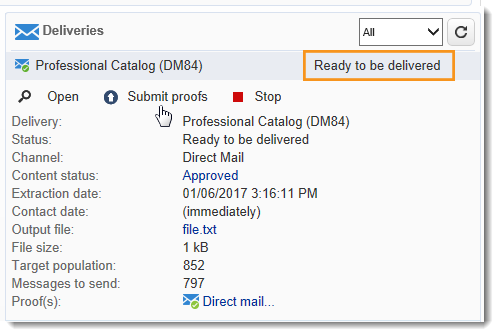

# 营销活动交付 {#marketing-campaign-deliveries}

可以通过营销活动仪表板、营销活动工作流或直接通过分发概述创建分发。

## 创建提交 {#creating-deliveries}

要创建链接到营销活动的分发，请单击营销 **[!UICONTROL Add a delivery]** 活动控制板中的链接。

建议的配置适用于不同类型的传送（直邮、电子邮件、移动渠道、传真或电话）。

>[!NOTE]
>
>有关创建和配置分发的详细信息，请参阅发 [送消息](../../delivery/using/communication-channels.md) 。

## 选择目标人群 {#selecting-the-target-population}

对于每个分发，营销活动管理器将定义：

* 主要目标。 有关详细信息，请参 [阅在工作流中构建主目标](#building-the-main-target-in-a-workflow) , [然后选择目标人群](#selecting-the-target-population)。
* 控制组。 有关详细信息，请参阅 [定义控制组](#defining-a-control-group)。
* 种子地址。 如需详细信息，请参阅[此部分](../../delivery/using/about-seed-addresses.md)。

这些信息中的某些信息是从模板继承的。

>[!NOTE]
>
>系列活动模板显示在系列 [活动模板中](../../campaign/using/marketing-campaign-templates.md#campaign-templates)。

要构建传送目标，您可以为数据库中的收件人定义过滤条件。 此收件人选择模式显示在发送消 [息部分](../../delivery/using/steps-defining-the-target-population.md) 。

### 示例：传送到一组收件人 {#example--delivering-to-a-group-of-recipients}

您可以将人口导入列表，然后在分发中定位此列表。

1. 为此，请编辑相关的交付，然后单击链 **[!UICONTROL To]** 接以更改目标人群。

1. 在选项卡 **[!UICONTROL Main target]** 中，选择选项， **[!UICONTROL Defined via the database]** 然后单击以 **[!UICONTROL Add]** 选择收件人。

1. 选择 **[!UICONTROL A list of recipients]** 并单 **[!UICONTROL Next]** 击以选择它。

### 在工作流中构建主目标 {#building-the-main-target-in-a-workflow}

还可以在定位工作流中定义分发的主要目标：此图形环境允许您使用查询、测试和运算符构建目标：联合、重复数据消除、共享等。

使用工 [作流自动化指南](../../workflow/using/executing-a-workflow.md#architecture) (Automating with workflows)包含工作流模块操作方式的详细说明。

>[!IMPORTANT]
>
>在同一营销活动中，不能设置28个以上的工作流。 超出此限制后，其他工作流在界面中不可见，并且可能生成错误。

#### 创建定位工作流 {#creating-a-targeting-workflow}

可以通过工作流中图形序列中的过滤条件组合来创建定位。 您可以根据需要创建目标群体和子群体。 要显示工作流编辑器，请单击系 **[!UICONTROL Targeting and workflows]** 列活动功能板中的选项卡。

目标人群是通过放置在工作流中的一个或多个查询从Adobe Campaign数据库中提取的。 要了解如何构建查询，请参阅 [此部分](../../workflow/using/query.md)。

您可以通过“联合”、“交叉”、“共享”、“排除”等框启动查询并共享人群。

从工作区左侧的列表中选择对象，并将其链接以构建目标。

在图中，在图中链接目标构建所需的定位和计划查询。 您可以在施工过程中执行定位，以检查从数据库提取的人群。

>[!NOTE]
>
>本节介绍定义查询的示例和 [过程](../../workflow/using/query.md)。

编辑器的左侧部分包含表示活动的图形对象库。 第一个选项卡包含定位活动，第二个选项卡包含流控制活动，这些活动偶尔用于协调定位活动。

可通过图编辑器工具栏访问定位工作流执行和格式设置功能。

>[!NOTE]
>
>构建图的可用活动以及所有显示和布局功能在工作流程自动化指南中 [有详细介绍](../../workflow/using/executing-a-workflow.md#architecture) 。

您可以为单个营销活动创建多个定位工作流。 要添加工作流，请执行以下操作：

1. 转到工作流创建区域的左上角部分，右键单击，然后选择 **[!UICONTROL Add]**。 您还可以使用位 **[!UICONTROL New]** 于此区域上方的按钮。

   

1. 选择模 **[!UICONTROL New workflow]** 板并命名此工作流。
1. 单 **[!UICONTROL OK]** 击以确认创建工作流，然后为此工作流创建图。

#### 执行工作流 {#executing-a-workflow}

定位工作流可通过工具栏中的 **[!UICONTROL Start]** 按钮手动启动，前提是您具有相应的权限。

可以对定位进行编程，以便根据调度（调度器）或事件（外部信号、文件导入等）自动执行。

与执行定位工作流（启动、停止、暂停等）相关的操作是异 **步进程** :将保存该命令，并在服务器可用以应用该命令后生效。

工具栏图标允许您对执行定位工作流采取操作。

* 启动或重新启动

   * 通过 **[!UICONTROL Start]** 该图标可启动定位工作流。 单击此图标时，将激活所有没有输入过渡的活动（终点跳转除外）。

      

      服务器会考虑请求，如其状态所示：

      

      进程状态将更改为 **[!UICONTROL Started]**。

   * 您可以通过相应的工具栏图标重新启动定位工作流。 如果图标不可用， **[!UICONTROL Start]** 例如，定位工作流正在停止时，此命令可能很有用。 在这种情况下，单击图 **[!UICONTROL Restart]** 标以预测重新启动。 服务器会考虑请求，如其状态所示：

      

      然后，该进程进入 **[!UICONTROL Started]** 状态。

* 停止或暂停

   * 工具栏图标允许您停止或暂停正在进行的定位工作流。

      单击时， **[!UICONTROL Pause]**&#x200B;正在进行的操作会暂 **[!UICONTROL are not]** 停，但直到下次重新启动后，才会启动其他活动。

      

      服务器会考虑该命令，如其状态所示：

      

      您还可以在定位工作流执行到达特定活动时自动暂停该工作流。 为此，请右键单击要从中暂停定位工作流的活动，然后选择 **[!UICONTROL Enable but do not execute]**。

      

      此配置由特殊图标显示。

      

      >[!NOTE]
      >
      >此选项在高级定位营销活动设计和测试阶段非常有用。

      单击 **[!UICONTROL Start]** 以继续执行。

   * 单击图 **[!UICONTROL Stop]** 标以停止正在执行的操作。

      

      服务器会考虑该命令，如其状态所示：

      
   您还可以在执行到达活动时自动停止定位工作流。 为此，请右键单击要从中停止定位工作流的活动，然后选择 **[!UICONTROL Do not activate]**。

   

   

   此配置由特殊图标显示。

   >[!NOTE]
   >
   >此选项在高级定位营销活动设计和测试阶段非常有用。

* 无条件停止

   在资源管理器中，选择以 **[!UICONTROL Administration > Production > Object created automatically > Campaign workflows]** 访问每个营销活动工作流并对其执行操作。

   单击图标并选择“停止”，即可无条件 **[!UICONTROL Actions]** 停止您的工 **[!UICONTROL Unconditional]** 作流。 此操作将终止您的营销活动工作流。

   

### 定义控制组 {#defining-a-control-group}

控制群是不会收到交货的人口；它用于通过与已收到交付的目标人群的行为进行比较来跟踪后期交付行为和营销活动影响。

控制组可从主目标中提取和／或来自特定组或查询。

#### 激活营销活动的控制组 {#activating-the-control-group-for-a-campaign}

您可以在营销活动级别定义控制组，在这种情况下，控制组将应用于相关营销活动的每个交付。

1. 编辑相关营销活动，然后单击选 **[!UICONTROL Edit]** 项卡。
1. 单击 **[!UICONTROL Advanced campaign settings]**.

   

1. 选择选 **[!UICONTROL Enable and edit control group configuration]** 项。
1. 单击 **[!UICONTROL Edit...]** 以配置控件组。

   

从主目标提取控 [制组和添加人群中介绍了配置](#extracting-the-control-group-from-the-main-target)[过程](#adding-a-population)。

#### 激活控制组以交付 {#activating-the-control-group-for-a-delivery}

您可以在交付层定义控制组，在这种情况下，控制组将应用于相关营销活动的每个交付。

默认情况下，在营销活动级别定义的控制组配置适用于该营销活动的每个交付。 但是，您可以调整控制组，使其适应单个交付。

>[!NOTE]
>
>如果您为营销活动定义了控制组，并且还为链接到此营销活动的分发配置了该组，则只会应用为该分发定义的控制组。

1. 编辑相关的交付，然后单击 **[!UICONTROL To]** 部分中的链 **[!UICONTROL Email parameters]** 接。

   

1. 单击选 **[!UICONTROL Control group]** 项卡，然后选择 **[!UICONTROL Enable and edit control group configuration]**。
1. 单击 **[!UICONTROL Edit...]** 以配置控件组。

从主目标提取控 [制组和添加人群中介绍了配置](#extracting-the-control-group-from-the-main-target)[过程](#adding-a-population)。

#### 从主目标提取控制组 {#extracting-the-control-group-from-the-main-target}

您可以从分发的主目标中提取收件人。 在这种情况下，收件人将从受此配置影响的交付操作的目标中获取。 此提取可以是随机的，也可以是对收件人进行排序的结果。

要提取控制组，请为营销活动或分发启用控制组，然后选择以下选项之一：或 **[!UICONTROL Activate random sampling]** 者 **[!UICONTROL Keep only the first records after sorting]**。

* **[!UICONTROL Activate random sampling]** :此选项将随机抽样应用于目标人群中的收件人。 如果您随后将阈值设置为100，则控制组将由从目标人群中随机选择的100个收件人组成。 随机采样取决于数据库引擎。
* **[!UICONTROL Keep only the first records after sorting]** :此选项允许您根据一个或多个排序顺序定义限制。 如果您选择字 **[!UICONTROL Age]** 段作为排序标准，然后将100定义为阈值，则控制组将由100个最年轻的收件人组成。 例如，定义一个控制组（包括购买次数很少的收件人或频繁购买的收件人）可能很有趣，并比较他们的行为与联系的收件人的行为。

单击 **[!UICONTROL Next]** 以定义排序顺序（如有必要），然后选择收件人限制模式。

此配置等效于工作流中的共享活动，该活动允许您将目标分成子集。 控制组是这些子集之一。 Refer to the [this section](../../workflow/using/executing-a-workflow.md#architecture) for more information.

### 添加人口 {#adding-a-population}

您可以定义要用作控制组的新人群。 此人群可以来自一组收件人，也可以通过特定查询创建。

>[!NOTE]
>
>Adobe Campaign查询编辑器显示在此 [部分中](../../workflow/using/query.md)。

## 开始交付 {#starting-a-delivery}

一旦所有批准都获得批准，交付即可开始。 然后，交货过程取决于交货的类型。 有关电子邮件或移动渠道发送，请参阅 [启动联机发送](#starting-an-online-delivery)，有关直接邮件发送 [，请参阅启](#starting-an-offline-delivery)动脱机发送。

### 开始在线交付 {#starting-an-online-delivery}

在所有批准请求都被授予后，交付状态将变为， **[!UICONTROL Pending confirmation]** 并且可以由运营商启动。 如果适用，将通知指定为审阅人的Adobe Campaign运营商（或运营商组）开始交付。

>[!NOTE]
>
>如果指定特定的操作员或一组操作员在交货的属性中开始交货，则您还可以允许负责交货的操作员确认发送。 为此，请输入 **1作为值，激活NMS_ActivateOwnerConfirmation****选项** 。 这些选项可从Adobe Campaign资源管理器 **[!UICONTROL Administration]** 的> **[!UICONTROL Platform]** > **[!UICONTROL Options]** 节点进行管理。
>  
>要取消激活此选项，请 **输入** 0作为值。 然后，发送确认过程将作为默认操作：只有在交付属性（或管理员）中为发送指定的操作员或操作员组才能确认和执行发送。

该信息也会显示在营销活动仪表板上。 通过 **[!UICONTROL Confirm delivery]** 该链接可开始分发。

通过确认消息，您可以保护此操作。

### 开始脱机交付 {#starting-an-offline-delivery}

在所有批准都获得批准后，交付状态将变为 **[!UICONTROL Pending extraction]**。 提取文件通过特殊的工作流创建，在默认配置中，当直邮递送处于待提取状态时，该工作流会自动启动。 进程进行中时，该进程会显示在功能板中，并可通过其链接进行编辑。

>[!NOTE]
>
>营销活动流程列表中显示了与营销活动流 [程相关的技术工作流](../../workflow/using/campaign.md)。

**第1步——文件批准**

成功执行提取工作流后，必须批准提取文件（前提是在提交设置中选择了提取文件批准）。

有关详细信息，请参阅批 [准提取文件](../../campaign/using/marketing-campaign-approval.md#approving-an-extraction-file)。

**第2步——批准发送给服务提供商的消息**

* 提取文件获得批准后，您就可以生成路由器通知电子邮件的证明。 该电子邮件消息基于传送模板构建。 必须批准。

   >[!NOTE]
   >
   >仅当在批准窗口中启用了校样的发送和批准时，此步骤才可用。

* 单击按 **[!UICONTROL Send a proof]** 钮以创建校样。

   证明目标必须事先确定。

   您可以创建所需数量的校样。 这些组件可通过交 **[!UICONTROL Direct mail...]** 付详细信息的链接访问。

   

* 交货状态将更改为 **[!UICONTROL To submit]**。 单击该 **[!UICONTROL Submit proofs]** 按钮以开始审批过程。

   

* 交付状态将更改为， **[!UICONTROL Proof to validate]** 并且您可以通过按钮接受或拒绝批准。

   

   您可以接受或拒绝此批准，或返回提取步骤。

   

* 提取文件发送到路由器，交付完成。

### 计算费用和库存 {#calculation-of-costs-and-stocks}

文件提取将启动两个操作：预算计算和库存计算。 此时会更新预算条目。

* 通过 **[!UICONTROL Budget]** 此选项卡可以管理营销活动的预算。 成本条目的总数显示在营销活动 **[!UICONTROL Calculates cost]** 的主选项卡及其所属的程序的字段中。 这些金额也会反映在营销活动预算中。

   实际成本最终将由路由器提供的信息计算。 只有实际发送的消息才能开票。

* 在树的节点中定 **[!UICONTROL Administration > Campaign management > Stocks]** 义库存，在节点中定义成本结 **[!UICONTROL Administration > Campaign management > Service providers]** 构。

   库存线在库存部分中可见。 要定义初始库存，请打开一条库存线。 每次进行交货时，库存都会减少。 您可以定义警报级别和通知。

>[!NOTE]
>
>有关成本计算和库存管理的更多信息，请参 [阅提供商、库存和预算](../../campaign/using/providers--stocks-and-budgets.md)。

## 管理关联文档 {#managing-associated-documents}

您可以将各种文档与营销活动关联：报告、照片、网页、图表等。 这些文档可以采用任何格式（Microsoft Word、PowerPoint、PNG、JPG、Acrobat PDF等）。 要将文档与营销活动关联，请参阅 [添加文档](#adding-documents)。

>[!IMPORTANT]
>
>此模式保留给小文档。

在营销活动中，您还可以参阅其他项目，如促销优惠券、与特定分店或商店相关的特价优惠等。 当这些元素包含在大纲中时，它们可以与直邮发送相关联。 请参 [阅关联和构造通过交付大纲链接的资源](#associating-and-structuring-resources-linked-via-a-delivery-outline)。

>[!NOTE]
>
>如果您使用MRM，则还可以管理可供多个参加者协作工作的营销资源库。 请参阅 [管理营销资源](../../campaign/using/managing-marketing-resources.md)。

### 添加文档 {#adding-documents}

文档可以在营销活动级别（上下文文档）或计划级别（一般文档）关联。

该选 **[!UICONTROL Documents]** 项卡包含：

* 内容（模板、图像等）所需的所有文档的列表Adobe Campaign运营商可以在本地下载这些内容，
* 包含路由器信息的文档（如果有）。

这些文档通过选项卡链接到程序或营销 **[!UICONTROL Edit > Documents]** 活动。

您还可以通过其仪表板中提供的链接将文档添加到营销活动。

单击 **[!UICONTROL Details]** 该图标可查看文件内容并添加信息：

在功能板中，与营销活动关联的文档在部 **[!UICONTROL Document(s)]** 分中进行分组，如下例所示：

也可以从此视图编辑和修改它们。

### 通过交付大纲关联和构造链接的资源 {#associating-and-structuring-resources-linked-via-a-delivery-outline}

>[!NOTE]
>
>交付大纲专门用于直邮营销活动的上下文中。

交付大纲表示一组结构化元素（文档、分支／商店、促销优惠券等）为特定营销活动创建。

这些元素按交付大纲分组，特定的交付大纲将与交付相关联；它将在发送给服务提供商的提取文件中引 **用** ，以便附加到交付中。 例如，您可以创建引用分支及其使用的营销小册子的分发大纲。

对于营销活动，交付大纲允许您根据特定条件构建要与交付关联的外部元素：相关分支、授予的促销优惠、本地活动的邀请等。

#### 创建大纲 {#creating-an-outline}

要创建大纲，请单击相 **[!UICONTROL Delivery outlines]** 关营销活动选项卡 **[!UICONTROL Edit > Documents]** 中的子选项卡。

>[!NOTE]
>
>如果此选项卡不存在，则此功能对此营销活动不可用。 请参阅系列活动模板配置。
>   
>For more on this, refer to [Campaign templates](../../campaign/using/marketing-campaign-templates.md#campaign-templates).

接下来，单 **[!UICONTROL Add a delivery outline]** 击并创建营销活动的大纲层次结构：

1. 右键单击树的根，然后选择 **[!UICONTROL New > Delivery outlines]**。
1. 右键单击刚刚创建的大纲，然后选择 **[!UICONTROL New > Item]** 或 **[!UICONTROL New > Personalization fields]**。

大纲可包含项目和个性化字段、资源和选件：

* 项目可以是物理文档，例如，此处引用和描述的项目将附加到交付中。
* 通过个性化字段，您可以创建与分发相关的个性化元素，而不是收件人。 因此，可以创建用于特定目标（欢迎优惠、折扣等）的分发的值。它们在Adobe Campaign中创建，并通过链接导入到大纲 **[!UICONTROL Import personalization fields...]** 中。

   

   也可以通过单击列表区域右侧的图 **[!UICONTROL Add]** 标直接在大纲中创建它们。

   

* 这些资源是在通过范围链接访问的营销资源控制板中生 **[!UICONTROL Resources]** 成的营销资 **[!UICONTROL Campaigns]** 源。

   

   >[!NOTE]
   >
   >有关营销资源的详细信息，请参阅 [管理营销资源](../../campaign/using/managing-marketing-resources.md)。

#### 选择大纲 {#selecting-an-outline}

对于每个传送，您可以从为提取大纲保留的部分中选择要关联的大纲，如下例所示：

选定的轮廓随后将显示在窗口的下部。 可以使用字段右侧的图标编辑该字段，或使用下拉列表更改该字段：

传送 **[!UICONTROL Summary]** 的选项卡还显示以下信息：

#### 提取结果 {#extraction-result}

在提取并发送给服务提供商的文件中，列出大纲的名称，并酌情说明其特征（费用、说明等）根据与服务提供商关联的导出模板中的信息添加到内容。

在以下示例中，与交付相关联的大纲的标签、估计成本和说明将添加到提取文件。

导出模型必须与为相关交付选择的服务提供商相关联。 请参阅 [创建服务提供商及其成本结构](../../campaign/using/providers--stocks-and-budgets.md#creating-service-providers-and-their-cost-structures)。

>[!NOTE]
>
>有关导出的详细信息，请参阅 [入门](../../platform/using/generic-imports-and-exports.md) 。
