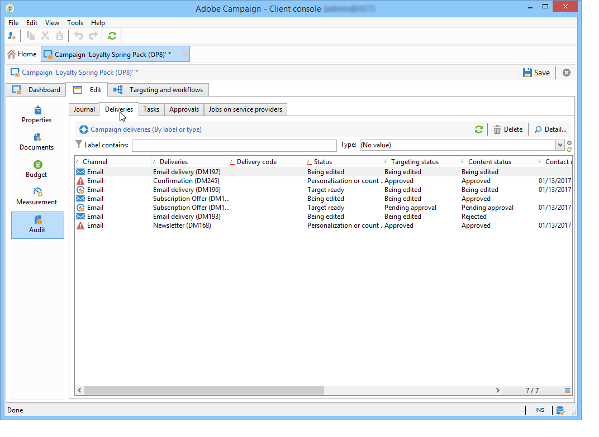

# 监测营销活动 {#monitoring-marketing-campaigns}

## 跟踪活动 {#tracking-a-campaign}

对于每个营销活动， **[!UICONTROL Tracking]** 选项卡用于查看所有作业及其状态。 以下信息可通过此子选项卡访问：

* 活动日志显示一般情况下对活动执行的作业：工作流创建或启动、批准、提取等。

   

* 此 **[!UICONTROL Deliveries]** 子选项卡包含可从此视图编辑的所有营销活动投放。 要执行此操作，请选择投放并单击 **[!UICONTROL Detail]** 图标。

   

* 此 **[!UICONTROL Tasks]** 子选项卡对链接到营销活动的所有任务进行分组。 通过此视图，您可以编辑或删除它们。 任务在MRM应用程序中可用。 有关详情，请参阅 [本节](../../mrm/using/creating-and-managing-tasks.md).

   

* 为生成服务提供商消息而创建的工作流显示在 **[!UICONTROL Jobs on service providers]** 子选项卡。 单击 **[!UICONTROL Detail]** 图标，以显示选定的工作流。

   

## 投放跟踪 {#delivery-tracking}

投放列表可通过 **[!UICONTROL Deliveries]** Campaign节点的链接。

对于每个投放，此列表允许您访问关键指标：状态、已定位的收件人数量、关联的营销活动等。

要检查投放的状态，请编辑该投放并查看其功能板和选项卡。

>[!NOTE]
>
>有关投放详细信息，请参阅 [本节](../../delivery/using/about-message-tracking.md) 部分。

## 执行追踪 {#execution-tracking}

您可以通过单击 **[!UICONTROL Deliveries]**，可通过Adobe Campaign主页访问它。 参见 [投放跟踪](#delivery-tracking).

有关活动中执行的流程的信息，请参阅 **[!UICONTROL Edit > Audit]** 选项卡中的选定内容进行标识。 在这里，您可以查看营销活动中的投放列表。 [了解详情](#tracking-a-campaign)。
