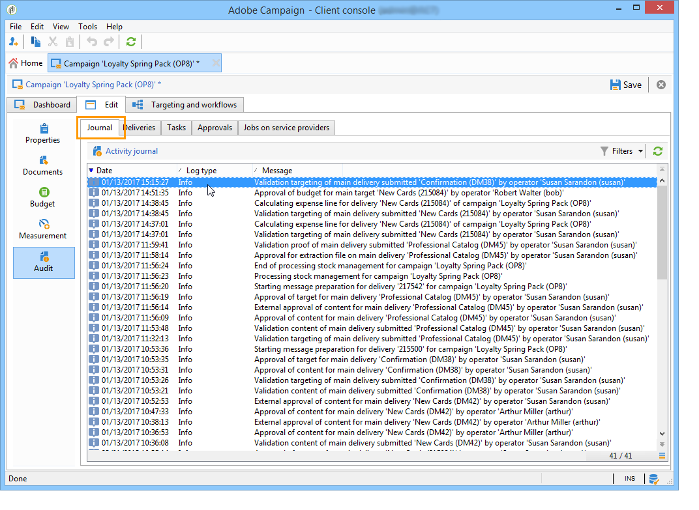

# 监测营销活动 {#monitoring-marketing-campaigns}

## 跟踪活动 {#tracking-a-campaign}

对于每个营销活动，**[!UICONTROL Tracking]**&#x200B;选项卡允许您查看所有作业及其状态。 可通过此子选项卡访问以下信息：

* 活动日志显示一般情况下对活动执行的作业：工作流创建或启动、批准、提取等。

  

* **[!UICONTROL Deliveries]**&#x200B;子选项卡包含可从此视图编辑的所有营销活动投放。 为此，请选择投放并单击&#x200B;**[!UICONTROL Detail]**&#x200B;图标。

  

* **[!UICONTROL Tasks]**&#x200B;子选项卡将所有链接到该营销活动的任务分组。 此视图允许您编辑或删除它们。 任务在MRM应用程序中可用。 在[此部分](../../mrm/using/creating-and-managing-tasks.md)中详细介绍了这些术语。

  

* 为生成服务提供商的消息而创建的工作流显示在&#x200B;**[!UICONTROL Jobs on service providers]**&#x200B;子选项卡中。 单击&#x200B;**[!UICONTROL Detail]**&#x200B;图标以显示选定的工作流。

  

## 投放跟踪 {#delivery-tracking}

可通过营销活动节点的&#x200B;**[!UICONTROL Deliveries]**&#x200B;链接访问投放列表。

对于每个投放，此列表可让您访问关键指标：状态、已定向的收件人数量、关联的营销活动等。

要检查投放的状态，请编辑该投放并查看其功能板和选项卡。

>[!NOTE]
>
>有关投放详细信息的信息，请参阅[此部分](../../delivery/using/about-message-tracking.md)部分。

## 执行追踪 {#execution-tracking}

您可以单击&#x200B;**[!UICONTROL Deliveries]**&#x200B;来查找投放的状态，通过Adobe Campaign主页可访问该设置。 请参阅[投放跟踪](#delivery-tracking)。

有关在营销活动中执行的进程的信息在营销活动的&#x200B;**[!UICONTROL Edit > Audit]**&#x200B;选项卡中收集。 在这里，您可以查看营销活动中的投放列表。 [了解详情](#tracking-a-campaign)。
