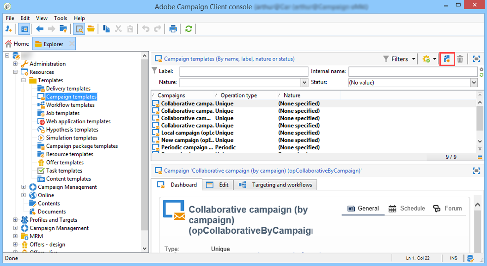
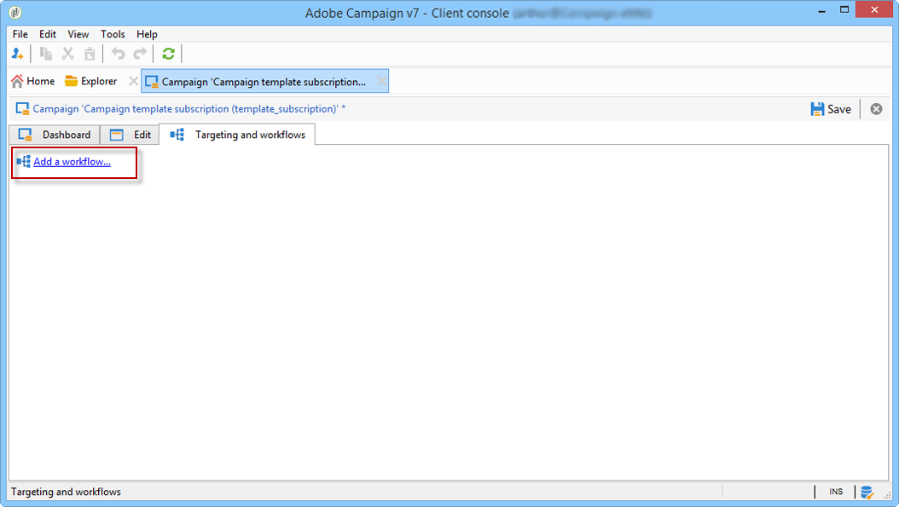

# 创建和配置营销活动模板 {#campaign-templates}

所有营销活动都基于存储主要特性和功能的模板。 营销活动模板集中在 **[!UICONTROL Resources > Templates > Campaign templates]** 节点。 默认模板作为标准模板提供。 虽然您可以使用所有可用模块（文档、任务、种子地址等）创建新营销活动，但提供的模块取决于您的权限和Adobe Campaign平台的配置。

>[!NOTE]
>
>当您单击 **[!UICONTROL Explorer]** 图标。

提供了内置模板以用于创建尚未定义特定配置的活动。您可以创建和配置活动模板，然后从这些模板创建活动。

 有关活动创建的更多信息，请参阅 [此视频](../../campaign/using/marketing-campaign-deliveries.md#create-email-video).

## 创建活动模板 {#creating-or-duplicating-a-campaign-template}

要创建营销活动模板，请执行以下步骤：

1. 打开营销活动 **资源管理器**.
1. 在 **资源>模板>营销活动模板**，单击 **新建** 位于模板列表上方的工具栏中。

   

1. 输入新活动模板的标签。
1. 单击 **保存** 然后重新打开您的模板。
1. 在 **编辑** 选项卡，输入 **内部名称** 和其他值（如果需要）。
1. 选择 **高级促销活动设置** 向活动模板添加工作流。

   

1. 更改 **定位和工作流** 值至 **是**.

   

1. 在 **定位和工作流** 选项卡，单击 **添加工作流……**.

   

1. 完成 **标签** 字段并单击 **确定**.
1. 根据您的要求创建工作流。
1. 单击&#x200B;**保存**。您的模板现在已准备好在营销活动中使用。

您还可以 **重复** 默认模板以重复使用并调整其配置。

利用活动模板的各种选项卡和子选项卡，可访问其设置，如中所述 [常规配置](#general-configuration).

## 选择模块 {#select-modules}

此 **[!UICONTROL Advanced campaign settings...]** 通过链接，您可以基于此模板为营销活动启用和禁用作业。 选择要在基于此模板创建的营销活动中启用的功能。

如果未选择某个功能，则将与流程相关的元素（菜单、图标、选项、选项卡、子选项卡等） 将不会显示在模板的界面中或基于此模板的营销活动中。 营销活动详细信息左侧的选项卡通常与模板中选择的流程一致。 例如，如果 **费用和目标** 未选中，则将 **[!UICONTROL Budget]** 选项卡不会显示在基于此模板的营销活动中。

此外，配置窗口的快捷方式已添加到营销活动仪表板。 启用某个功能后，可通过直接链接从Campaign仪表板访问该功能。

例如，使用以下配置：

以下链接将显示在营销活动仪表板中( **[!UICONTROL Add a task]** 缺少链接)：

并且只显示以下选项卡：

但是，对于此类配置：

将显示以下链接和选项卡：

## 模块类型 {#typology-of-enabled-modules}

* **对照组**

  选择此模块后，模板的高级设置以及基于此模板的营销活动会添加一个附加选项卡。 可以通过模板定义配置，也可以单独为每个营销活动定义配置。 在中了解有关控制组的更多信息 [本节](../../campaign/using/marketing-campaign-deliveries.md#defining-a-control-group).

  

* **种子地址**

  选择此模块后，模板的高级设置以及基于此模板的营销活动会添加一个附加选项卡。 可以通过模板定义配置，也可以单独为每个营销活动定义配置。 要了解有关种子地址的更多信息，请参阅 [本节](../../delivery/using/about-seed-addresses.md).

  

* **文档**

  选择此模块后，将向中添加一个附加选项卡 **[!UICONTROL Edition]** 选项卡中显示的模板和基于该模板的营销活动。 可从模板添加附加文档，或单独为每个营销活动添加附加文档。 了解中文档的更多信息 [本节](../../campaign/using/marketing-campaign-deliveries.md#managing-associated-documents).

  

* **概要**

  选择此模块时， **[!UICONTROL Delivery outlines]** 子选项卡将添加到 **[!UICONTROL Documents]** 选项卡，以定义营销活动的投放概要。 要了解有关投放概要的更多信息，请参阅 [本节](../../campaign/using/marketing-campaign-deliveries.md#associating-and-structuring-resources-linked-via-a-delivery-outline).

  

* **定位和工作流**

  当您选择 **[!UICONTROL Targeting and workflows]** 模块时，会添加一个选项卡，以允许您基于此模板为营销活动创建一个或多个工作流。 您还可以根据此模板为每个活动单独配置工作流。要了解有关活动工作流的更多信息，请参阅 [本节](../../campaign/using/marketing-campaign-deliveries.md#building-the-main-target-in-a-workflow).

  

  启用此模块后，将向营销活动的高级设置添加一个选项卡，以定义流程执行顺序。

  

* **批准**

  如果您选择 **[!UICONTROL Approval]**，您可以选择要批准的流程以及负责批准的操作员。 要了解有关批准的更多信息，请参阅 [本节](../../campaign/using/marketing-campaign-approval.md#selecting-reviewers).

  

  您可以选择是否通过 **[!UICONTROL Approvals]** 模板高级设置部分的选项卡。 对于选择批准的作业，邮件投放必须获得批准才能获得授权。

  必须将审阅人操作员或操作员组与每个启用的审批关联。

* **非劳动成本和目标**

  选择此模块时， **[!UICONTROL Budget]** 选项卡会添加到基于此模板的模板和营销活动的详细信息，以便可以选择关联的预算。

  

## 属性和执行 {#general-configuration}

### 模板属性 {#template-properties}

创建活动模板时，需要输入以下信息：

* 输入 **标签** 模板的：默认情况下，此标签将分配给通过此模板创建的所有营销活动。
* 选择活动 **自然** 下拉列表中。 此列表中可用的值是保存在 **[!UICONTROL natureOp]** 明细列表。

  >[!NOTE]
  >
  >有关枚举的详细信息，请参阅 [快速入门](../../platform/using/managing-enumerations.md) 部分。

* 选择 **营销活动类型**：唯一、定期或定期。 默认情况下，营销活动模板适用于独特营销活动。 有关循环和定期活动的详情，请参见 [本节](../../campaign/using/setting-up-marketing-campaigns.md#recurring-and-periodic-campaigns).
* 指定营销活动的持续时间，即营销活动将发生的天数。 基于此模板创建营销活动时，将自动填充营销活动开始和结束日期。

  如果促销活动是重复性的，则必须直接在模板中指定促销活动的开始和结束日期。

* 指定 **相关项目** 模板的：基于此模板的营销活动将链接到选定的项目。

### 模板执行参数 {#template-execution-parameters}

此 **[!UICONTROL Advanced campaign settings...]** 链接允许您配置用于处理投放目标的模板的高级选项（控制组、种子地址等） 以及活动测量和工作流执行的配置。

## 跟踪活动执行{#campaign-reverse-scheduling}

您可以为营销活动创建计划并跟踪成绩，例如，为特定日期准备事件计划。 现在，您可以通过营销活动模板根据营销活动的结束日期计算任务的开始日期。

在任务配置框中，转到 **[!UICONTROL Implementation schedule]** 区域并检查 **[!UICONTROL The start date is calculated based on the campaign end date]** 盒子。 （在此，“开始日期”是任务开始日期）。 转到 **[!UICONTROL Start]** 字段并输入时间间隔：任务将在营销活动结束日期之前很长时间开始执行。 如果输入的时段长于将营销活动设置为最后的时段，则任务将在营销活动之前开始。

使用此模板创建营销活动时，将自动计算任务开始日期。 但是，您以后始终可以对其进行更改。
