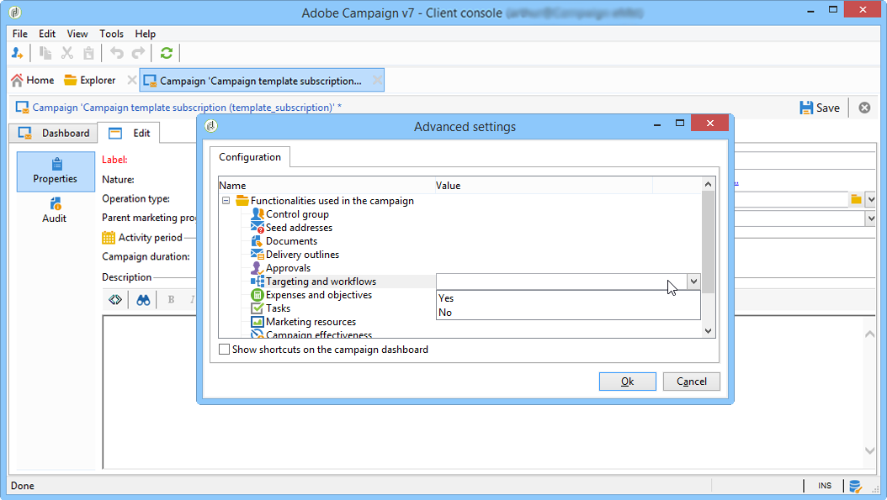

# Marketing Campaign templates {#campaign-templates}

活动模板集中在节 **[!UICONTROL Resources > Templates > Campaign templates]** 点中。 默认模板将作为标准提供。 它允许您使用所有可用模块(活动、任务、种子地址等)创建新的Adobe Campaign，但提供的模块取决于您的权限和文档平台的配置。

## 创建或复制活动模板 {#creating-or-duplicating-a-campaign-template}

要创建新模板，请执行以下步骤：

1. 打开活动 **浏览器**。
1. 在“ **资源”>“模板”>**“活动模板 **”中，** 单击模板列表上方的工具栏中的“新建”。

   

1. 输入新活动模板的标签。
1. 单击 **保存** ，然后重新打开模板。
1. 在“编 **辑** ”选项卡中， **根据需要输入** “内部名称”和其他值。
1. 选择 **高级活动设置** ，以向活动模板添加工作流。

   

1. 将“定 **位”和“工作流** ”值更 **改为“是”**。

   

1. 在“定 **位和工作流** ”选项卡中， **单击“添加工作流……”**.

   

1. 填写“标 **签** ”字段，然 **后单击**“确定”。
1. 根据您的要求创建您的工作流。
1. 单击&#x200B;**保存**。您的模板现已准备好在活动中使用。

您还可以重复默认模板以重复使用和调整其配置。

该活动模板的各种选项卡和子选项卡允许您访问其设置，如“常规”配 [置中所述](#general-configuration)。

## 配置活动模板 {#configuring-a-campaign-template}

活动基于共享一组预定义参数的模型。

在默认配置中，活动模板集中在 **[!UICONTROL Resources > Templates > Campaign templates]** Adobe Campaign树的节点中。

>[!NOTE]
>
>单击主页上的图标时 **[!UICONTROL Explorer]** 将显示树。

提供现成模板以创建尚未定义特定配置的活动。 您可以创建和配置活动模板，然后从这些模板创建活动。

活动模板的创建和配置以活动模板 [形式](#campaign-templates)。

 有关活动创建的详细信息，请参 [阅此视频](../../campaign/using/marketing-campaign-deliveries.md#create-email-video)。

## 可用模块的配置 {#configuration-of-the-available-modules}

### 模块选择 {#module-selection}

通过 **[!UICONTROL Advanced campaign settings...]** 链接，您可以启用和禁用基于此模板的活动的作业。 在根据此模板创建的活动中选择要启用的函数。

如果未选择某个功能，则与该过程相关的元素（菜单、图标、选项、选项卡、子选项卡等） 将不会显示在模板的界面中或基于此模板的活动中。 活动详细信息左侧的选项卡通常与模板中选定的进程一致。 例如，如果未 **选择“费用** ”和目标，则相应的标签 **[!UICONTROL Budget]** 将不会显示在基于此模板的活动中。

此外，配置窗口的快捷键被添加到活动仪表板。 启用某个功能后，直接链接将允许从活动仪表板访问该功能。

例如，使用以下配置：

活动仪表板中显示以下链接( **[!UICONTROL Add a task]** 缺少链接):

将只显示以下选项卡：

但是，使用这种配置：

将显示以下链接和选项卡：

### 已启用模块的类型 {#typology-of-enabled-modules}

* **对照组**

   选择此模块后，将在模板的高级设置和基于此模板的活动中添加一个附加选项卡。 配置可通过模板进行定义，也可针对每个活动单独进行定义。

   

* **种子地址**

   选择此模块后，将在模板的高级设置和基于此模板的活动中添加一个附加选项卡。 配置可通过模板进行定义，也可针对每个活动单独进行定义。

   

* **文档**

   选择此模块后，将在模板的选项卡和基 **[!UICONTROL Edition]** 于此模板的活动中添加一个附加选项卡。 附加的文档可以从模板中添加，也可以为每个活动单独添加。

   

* **大纲**

   选择此模块后，会向 **[!UICONTROL Delivery outlines]** 选项卡中添加一个子选 **[!UICONTROL Documents]** 项卡，以定义活动的投放概要。

   

* **定位和工作流**

   当您选择模 **[!UICONTROL Targeting and workflows]** 块时，会添加一个选项卡，以便您根据此模板为活动创建一个或多个工作流。 工作流还可以根据此模板为每个活动单独配置。

   

   启用此模块后，将在活动的高级设置中添加一个选项卡以定义进程执行顺序。

   

* **批准**

   如果选择 **[!UICONTROL Approval]**&#x200B;了，则可以选择要批准的流程以及负责批准的操作员。

   

* **支出和目标**

   选择此模块后，会向模 **[!UICONTROL Budget]** 板详细信息中添加一个选项卡，并根据此模板添加活动，以便选择关联的预算。

   

### 任务批准 {#approval-of-jobs}

您可以通过模板高级设置部分的选项卡 **[!UICONTROL Approvals]** 选择是否启用流程审批。 必须批准已选择批准的作业，才能对邮件投放进行授权。

必须将审阅人操作员或操作员组关联到每个启用的批准。

## 常规配置 {#general-configuration}

### 模板属性 {#template-properties}

创建活动模板时，您需要输入以下信息：

* 输入 **模板** 的标签：默认情况下，此标签将分配给通过此模板创建的所有活动。
* 从下拉 **活动** 中选择列表性质。 此列表中可用的值是保存在明细列表中的 **[!UICONTROL natureOp]** 值。

   >[!NOTE]
   >
   >有关明细列表的详细信息，请参阅 [入门](../../platform/using/managing-enumerations.md) 部分。

* 选择 **活动类型**:唯一、循环或周期。 默认情况下，活动模板应用于唯一活动。 定期和定期活动详见： [定期和定期活动](../../campaign/using/setting-up-marketing-campaigns.md#recurring-and-periodic-campaigns)。
* 指定活动的持续时间，即活动发生的天数。 创建基于此模板的活动时，将自动填充活动开始和结束日期。

   如果活动是重复的，则必须直接在模板中指定活动开始和结束日期。

* 指定模 **板的相** 关项目:基于此模板的活动将链接到所选项目。

### 模板执行参数 {#template-execution-parameters}

通 **[!UICONTROL Advanced campaign settings...]** 过链接，可以配置模板的高级选项以处理投放目标(对照组、种子地址等) 活动测量和工作流执行的配置。

## 活动逆向调度 {#campaign-reverse-scheduling}

您可以为活动创建反向计划，例如，准备其日期预先已知的事件。 活动模板现在允许您根据任务的结束日期计算开始的活动日期。

在任务配置框中，转到区 **[!UICONTROL Implementation schedule]** 域并选中该 **[!UICONTROL The start date is calculated based on the campaign end date]** 框。 (此处，“开始日期”是任务开始日期)。 转到字段 **[!UICONTROL Start]** 并输入间隔：任务将在活动结束日期之前开始这一天。 如果输入的期间长于活动设置为最后，任务将在活动之前开始。

使用此模板创建活动时，将自动计算任务开始日期。 但是，您随时可以在以后更改它。
