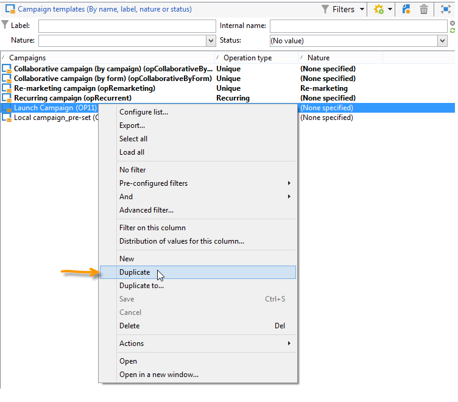

# 创建和配置营销活动模板 {#campaign-templates}

所有营销活动都基于存储主要特征和功能的模板。 营销活动模板集中在&#x200B;**[!UICONTROL Resources > Templates > Campaign templates]**&#x200B;节点中。 默认模板将作为标准模板提供。 它允许您使用所有可用模块（文档、任务、种子地址等）创建新营销活动，但提供的模块取决于您的权限和Adobe Campaign平台的配置。

>[!NOTE]
>
>单击主页上的&#x200B;**[!UICONTROL Explorer]**&#x200B;图标时，将显示树。

提供了内置模板以用于创建尚未定义特定配置的活动。您可以创建和配置活动模板，然后从这些模板创建活动。

 有关营销活动创建的更多信息，请参 [阅此视频](../../campaign/using/marketing-campaign-deliveries.md#create-email-video)。

## 创建营销活动模板{#creating-or-duplicating-a-campaign-template}

要创建营销活动模板，请执行以下步骤：

1. 打开Campaign **Explorer**。
1. 在&#x200B;**资源>模板>营销活动模板**&#x200B;中，单击模板列表上方工具栏中的&#x200B;**新建**。

   

1. 输入新营销活动模板的标签。
1. 单击&#x200B;**Save**&#x200B;并重新打开模板。
1. 在&#x200B;**Edit**&#x200B;选项卡中，根据需要输入&#x200B;**Internal name**&#x200B;和其他值。
1. 选择&#x200B;**高级营销活动设置**&#x200B;以向营销活动模板添加工作流。

   

1. 将&#x200B;**定位和工作流**&#x200B;值更改为&#x200B;**Yes**。

   

1. 在&#x200B;**定位和工作流**&#x200B;选项卡中，单击&#x200B;**添加工作流……**。

   

1. 填写&#x200B;**Label**&#x200B;字段，然后单击&#x200B;**Ok**。
1. 根据您的要求创建工作流。
1. 单击&#x200B;**保存**。您的模板现已准备就绪，可在营销活动中使用。

您还可以&#x200B;**复制**&#x200B;默认模板以重复使用和调整其配置。

利用营销活动模板的各种选项卡和子选项卡，可访问其设置，如[常规配置](#general-configuration)中所述。

## 选择模块{#select-modules}

通过&#x200B;**[!UICONTROL Advanced campaign settings...]**&#x200B;链接，您可以基于此模板启用和禁用营销活动的作业。 选择要在基于此模板创建的营销活动中启用的功能。

如果未选择某项功能，则与该过程相关的元素（菜单、图标、选项、选项卡、子选项卡等） 不会显示在模板的界面中或基于此模板的营销活动中。 营销活动详细信息左侧的选项卡通常与模板中选择的流程一致。 例如，如果未选择&#x200B;**支出和目标**，则相应的&#x200B;**[!UICONTROL Budget]**&#x200B;选项卡将不会显示在基于此模板的营销活动中。

此外，配置窗口的快捷方式也添加到营销活动仪表板。 启用功能后，通过直接链接可从营销活动仪表板访问该功能。

例如，使用以下配置：

营销活动功能板中显示以下链接（缺少&#x200B;**[!UICONTROL Add a task]**&#x200B;链接）：

此时将仅显示以下选项卡：

但是，使用此类配置：

将显示以下链接和选项卡：

## 模块{#typology-of-enabled-modules}的分类

* **控制组**

   选择此模块后，会在模板的高级设置和基于此模板的营销活动中添加一个额外的选项卡。 配置可通过模板进行定义，也可单独为每个营销活动定义。 在[此部分](../../campaign/using/marketing-campaign-deliveries.md#defining-a-control-group)中了解有关控制组的更多信息。

   

* **种子地址**

   选择此模块后，会在模板的高级设置和基于此模板的营销活动中添加一个额外的选项卡。 配置可通过模板进行定义，也可单独为每个营销活动定义。 在[此部分](../../delivery/using/about-seed-addresses.md)中了解有关种子地址的更多信息。

   

* **文档**

   选择此模块后，会在模板的&#x200B;**[!UICONTROL Edition]**&#x200B;选项卡和基于此模板的营销活动中添加一个额外的选项卡。 可以从模板添加附加的文档，也可以单独为每个营销活动添加附加的文档。 了解有关[此部分](../../campaign/using/marketing-campaign-deliveries.md#managing-associated-documents)中文档的更多信息。

   

* **大纲**

   选择此模块后，**[!UICONTROL Delivery outlines]**&#x200B;子选项卡会添加到&#x200B;**[!UICONTROL Documents]**&#x200B;选项卡，以定义营销活动的投放大纲。 在[此部分](../../campaign/using/marketing-campaign-deliveries.md#associating-and-structuring-resources-linked-via-a-delivery-outline)中了解有关投放大纲的更多信息。

   

* **定位和工作流**

   当您选择&#x200B;**[!UICONTROL Targeting and workflows]**&#x200B;模块时，会添加一个选项卡，以便您根据此模板为营销活动创建一个或多个工作流。 也可以根据此模板为每个营销活动单独配置工作流。在[此部分](../../campaign/using/marketing-campaign-deliveries.md#building-the-main-target-in-a-workflow)中了解有关营销活动工作流的更多信息。

   

   启用此模块后，会在营销活动的高级设置中添加一个选项卡，以定义流程执行顺序。

   

* **批准**

   如果选择&#x200B;**[!UICONTROL Approval]**，则可以选择要批准的流程以及负责审批的运算符。 在[此部分](../../campaign/using/marketing-campaign-approval.md#selecting-reviewers)中了解有关批准的更多信息。

   

   您可以通过模板高级设置部分的&#x200B;**[!UICONTROL Approvals]**&#x200B;选项卡选择是否启用流程批准。 必须批准已选择批准的作业才能授权邮件投放。

   必须将审阅人操作员或操作员组关联到每个已启用的批准。

* **费用和目标**

   选择此模块后，会在模板和基于此模板的营销活动的详细信息中添加&#x200B;**[!UICONTROL Budget]**&#x200B;选项卡，以便选择关联的预算。

   

## 属性和执行{#general-configuration}

### 模板属性{#template-properties}

创建营销活动模板时，需要输入以下信息：

* 输入模板的&#x200B;**标签**:默认情况下，此标签将分配给通过此模板创建的所有营销活动。
* 从下拉列表中选择营销活动&#x200B;**nature**。 此列表中可用的值是保存在&#x200B;**[!UICONTROL natureOp]**&#x200B;枚举中的值。

   >[!NOTE]
   >
   >有关枚举的更多信息，请参阅[快速入门](../../platform/using/managing-enumerations.md)一节。

* 选择&#x200B;**营销活动类型**:唯一、循环或定期。 默认情况下，促销活动模板适用于独特的促销活动。 [此部分](../../campaign/using/setting-up-marketing-campaigns.md#recurring-and-periodic-campaigns)中详细介绍了定期和定期营销活动。
* 指定营销活动的持续时间，即营销活动将发生的天数。 创建基于此模板的营销活动时，将自动填充营销活动开始和结束日期。

   如果营销活动是重复的，则必须直接在模板中指定营销活动开始和结束日期。

* 指定模板的&#x200B;**相关程序**:基于此模板的营销活动将链接到所选项目。

### 模板执行参数{#template-execution-parameters}

**[!UICONTROL Advanced campaign settings...]**&#x200B;链接允许您配置模板的高级选项以处理投放目标（控制组、种子地址等） 以及营销活动测量和工作流执行的配置。

## 跟踪促销活动执行{#campaign-reverse-scheduling}

您可以为营销活动创建计划并跟踪成绩，例如为特定日期准备事件计划。 营销活动模板现在允许您根据营销活动的结束日期计算任务的开始日期。

在任务配置框中，转到&#x200B;**[!UICONTROL Implementation schedule]**&#x200B;区域并选中&#x200B;**[!UICONTROL The start date is calculated based on the campaign end date]**&#x200B;框。 （此处，“开始日期”是任务开始日期）。 转到&#x200B;**[!UICONTROL Start]**&#x200B;字段并输入间隔：该任务将在营销活动结束日期之前很久开始。 如果输入的时段长于营销活动设置为最后的时段，则任务将在营销活动之前开始。

使用此模板创建营销活动时，将自动计算任务开始日期。 但是，您随时可以在以后进行更改。
