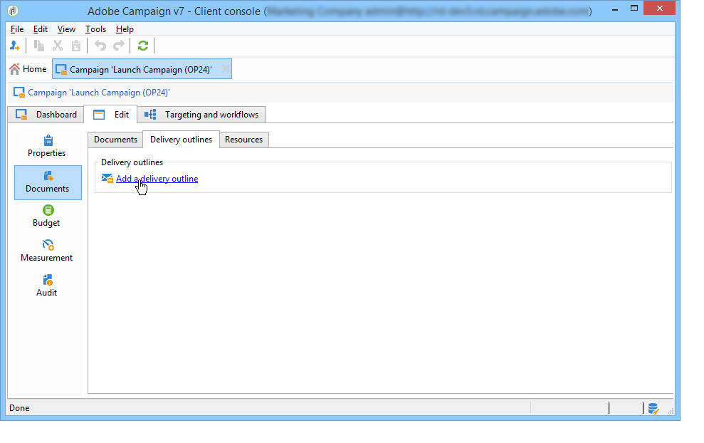
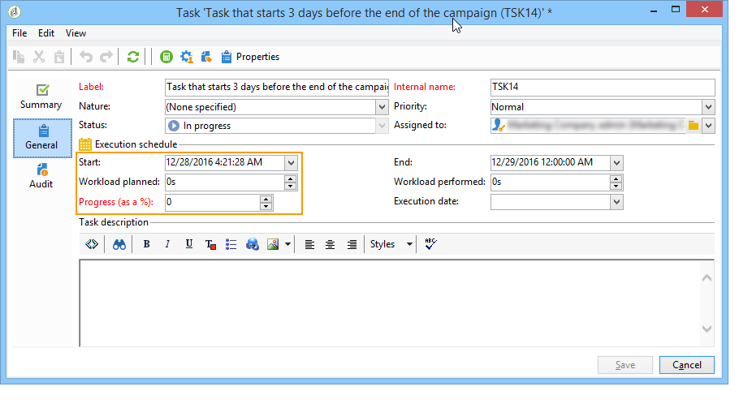

# 营销活动模板 {#campaign-templates}

营销活动模板集中在节 **[!UICONTROL Resources > Templates > Campaign templates]** 点中。 默认模板将作为标准提供。 它允许您使用所有可用模块（文档、任务、种子地址等）创建新的营销活动，但提供的模块取决于您的权限和Adobe Campaign平台的配置。

## 创建或复制营销活动模板 {#creating-or-duplicating-a-campaign-template}

要创建新模板，请执行以下步骤：

1. 打开营销活 **动浏览器**。
1. 在“ **资源”>“模板”>“营销活动模板**”中，单 **击模板列表上方的工具栏中的“新建** ”。

   

1. 输入新营销活动模板的标签。
1. 单击 **保存** ，然后重新打开模板。
1. 在“编 **辑** ”选项卡中，根据需要输 **入“内部名称** ”和其他值。
1. 选择 **高级营销活动设置** ，以向营销活动模板添加工作流。

   

1. 将“定位 **和工作流** ”值更改 **为“是”**。

   

1. **在“定位**&#x200B;和工作流&#x200B;**”选项卡中，单**&#x200B;击“添加工作流……”.

   

1. 完成“标 **签** ”字段，然后单 **击确定**。
1. 根据您的要求创建您的工作流。
1. 单击“ **保存**”。 您的模板现已准备好在营销活动中使用。

您还可以复制默认模板以重复使用和调整其配置。

系列活动模板的各种选项卡和子选项卡允许您访问其设置，如常规配置中 [所述](#general-configuration)。

## 配置营销活动模板 {#configuring-a-campaign-template}

营销活动基于共享一组预定义参数的模型。

在默认配置中，系列活动模板集中在Adobe系 **[!UICONTROL Resources > Templates > Campaign templates]** 列活动树的节点中。

>[!NOTE]
>
>单击主页上的图标 **[!UICONTROL Explorer]** 时将显示树。

提供现成模板，以创建尚未定义特定配置的营销活动。 您可以创建和配置营销活动模板，然后使用这些模板创建营销活动。

系列活动模板的创建和配置会显示在系 [列活动模板中](#campaign-templates)。

有关营销活动创建的详细信息，请参 [阅创建营销活动和电子邮件](https://docs.campaign.adobe.com/doc/AC/en/Videos/Videos.html) 视频。

## 可用模块的配置 {#configuration-of-the-available-modules}

### 模块选择 {#module-selection}

通过 **[!UICONTROL Advanced campaign settings...]** 该链接，您可以启用和禁用基于此模板的营销活动的作业。 选择要在基于此模板创建的营销活动中启用的功能。

如果未选择某个功能，则与该过程相关的元素（菜单、图标、选项、选项卡、子选项卡等）将不会显示在模板的界面中或基于此模板的营销活动中。 营销活动详细信息左侧的选项卡通常与模板中选定的进程一致。 例如，如果未选 **择“费用和目标** ”，则相应的标签将不会显示在 **[!UICONTROL Budget]** 基于此模板的营销活动中。

此外，配置窗口的快捷键会添加到营销活动功能板。 启用某个功能后，通过直接链接可以从营销活动仪表板访问该功能。

例如，使用以下配置：

系列活动功能板中显示以下链接(该 **[!UICONTROL Add a task]** 链接缺失):

并且只显示以下选项卡：

但是，使用此类配置：

此时将显示以下链接和选项卡：

### 已启用模块的类型 {#typology-of-enabled-modules}

* **控制组**

   选择此模块后，模板的高级设置和基于此模板的营销活动中会再添加一个选项卡。 配置可以通过模板进行定义，也可以单独为每个营销活动定义。

   

* **种子地址**

   选择此模块后，模板的高级设置和基于此模板的营销活动中会再添加一个选项卡。 配置可以通过模板进行定义，也可以单独为每个营销活动定义。

   

* **文档**

   选择此模块后，模板的选项卡和基于此模 **[!UICONTROL Edition]** 板的营销活动中会再添加一个选项卡。 附加的文档可以从模板中添加，也可以为每个营销活动单独添加。

   

* **轮廓**

   选择此模块后，会向该选 **[!UICONTROL Delivery outlines]** 项卡添加一个子选项卡，以 **[!UICONTROL Documents]** 便为营销活动定义分发大纲。

   

* **定位和工作流**

   当您选择模块时， **[!UICONTROL Targeting and workflows]** 会添加一个选项卡，以便您基于此模板为营销活动创建一个或多个工作流。 还可以基于此模板为每个营销活动单独配置工作流。

   

   启用此模块后，系统会向营销活动的高级设置中添加一个选项卡，以定义流程执行序列。

   

* **批准**

   如果您选择 **[!UICONTROL Approval]**&#x200B;了批准流程，则可以选择要批准的流程以及负责批准的操作员。

   

* **支出和目标**

   选择此模块后，会向模板和基于此模 **[!UICONTROL Budget]** 板的营销活动的详细信息中添加一个选项卡，以便选择关联的预算。

   

### 任务批准 {#approval-of-jobs}

您可以通过模板高级设置部分的选项卡选择 **[!UICONTROL Approvals]** 是否启用流程批准。 必须批准已选择批准的任务才能获得邮件传送的授权。

您必须将审阅人操作员或操作员组关联到每个已启用的批准。

## 常规配置 {#general-configuration}

### 模板属性 {#template-properties}

创建营销活动模板时，您需要输入以下信息：

* 输入模 **板的** 标签：默认情况下，此标签将分配给通过此模板创建的所有营销活动。
* 从下拉列 **表中** ，选择营销活动性质。 此列表中的可用值是在枚举中保存的 **[!UICONTROL natureOp]** 值。

   >[!NOTE]
   >
   >有关枚举的详细信息，请参阅 [入门部分](../../platform/using/managing-enumerations.md) 。

* 选择营 **销活动类型**:唯一、循环或周期。 默认情况下，营销活动模板适用于唯一的营销活动。 定期和定期营销活动详见：定期 [和定期营销活动](../../campaign/using/setting-up-marketing-campaigns.md#recurring-and-periodic-campaigns)。
* 指定营销活动的持续时间，即营销活动的发生天数。 在创建基于此模板的营销活动时，系列活动的开始日期和结束日期将自动填充。

   如果营销活动是重复的，则必须直接在模板中指定营销活动的开始日期和结束日期。

* 指定模 **板的相** 关程序：基于此模板的营销活动将链接到选定的计划。

### 模板执行参数 {#template-execution-parameters}

通过 **[!UICONTROL Advanced campaign settings...]** 该链接，您可以配置模板的高级选项以处理交付目标（控制组、种子地址等）以及营销活动评估和工作流执行的配置。

## 营销活动反向计划 {#campaign-reverse-scheduling}

您可以为营销活动创建反向计划，例如，准备其日期预先已知的活动。 营销活动模板现在允许您根据营销活动的结束日期计算任务的开始日期。

在任务配置框中，转到区 **[!UICONTROL Implementation schedule]** 域并选中该 **[!UICONTROL The start date is calculated based on the campaign end date]** 框。 （此处，“开始日期”是任务开始日期）。 转到字段 **[!UICONTROL Start]** 并输入间隔：任务将在营销活动结束日期之前很久开始。 如果输入的期间长于营销活动设置为最后一个，则任务将在营销活动之前开始。

当您使用此模板创建营销活动时，将自动计算任务开始日期。 但是，您始终可以稍后更改它。
