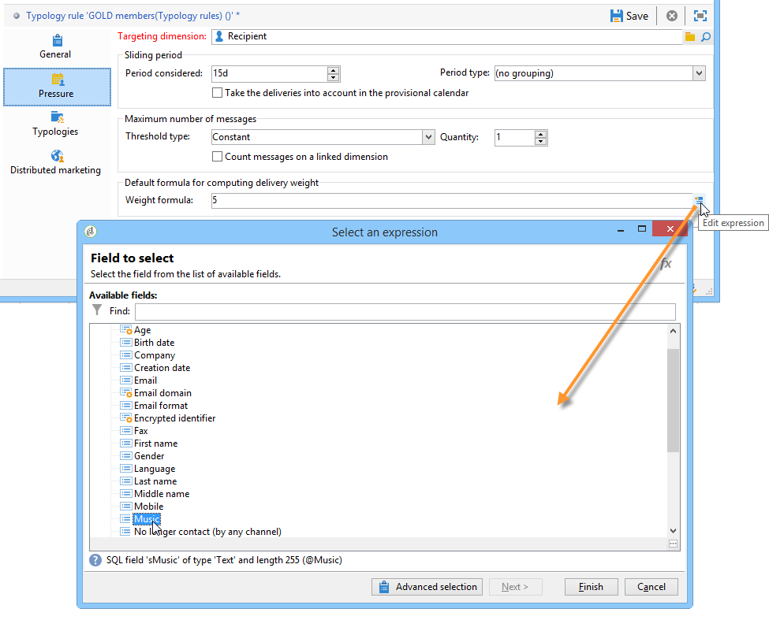
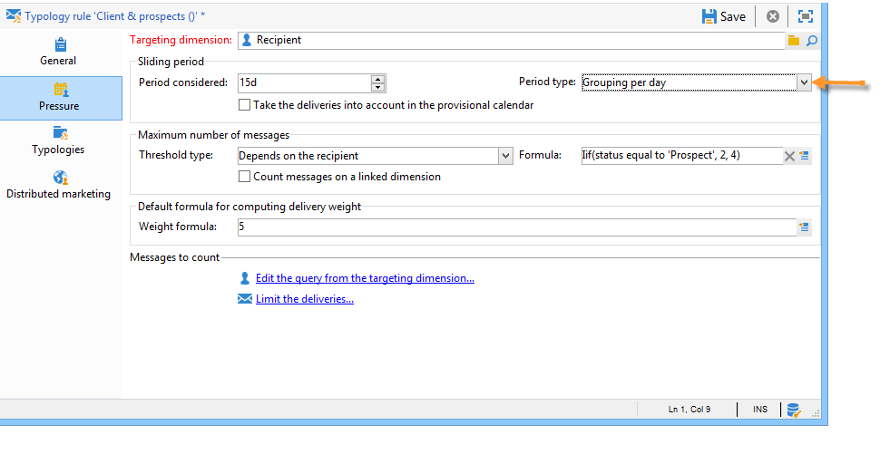
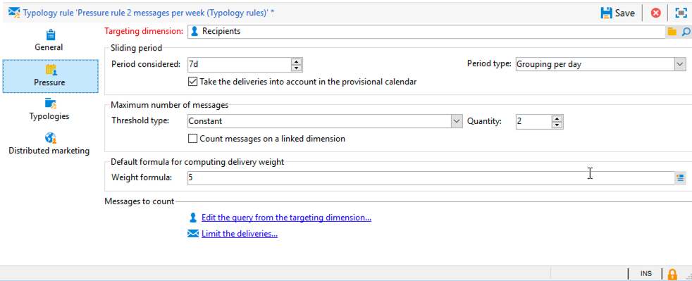

# 压力规则{#pressure-rules}

## 关于营销疲劳{#about-marketing-fatigue}

实施销售压力管理可以避免在数据库中过多地招募人员，也称为营销疲劳。 为此，您可以为每个收件人定义最大消息数。 它还允许您在活动之间执行仲裁规则，以便向目标受众发送最佳消息。

**压** 力规则，用于管理营销疲劳，例如，将发送给人群的信件数量限制为两个，选择最符合用户群利益的通信，避免向不满的客户发送短信等。

活动根据定义的阈值和消息权重来选择。

* 阈值是指定收件人在指定时间段内授权的最多投放数。 它可以是设置的，也可以是变量。 它是在类型规则设置中设置或计算的。 请参阅[最大消息数](#maximum-number-of-messages)。
* 投放权重使您能够在压力管理框架内确定最优先的投放。 具有最高权重的消息具有优先级。 请参阅[消息权重](#message-weight)。

仲裁包括确保权重大于进行中活动的计划活动不会导致过度用户档案请求：如果是，则用户档案将从投放中排除。

仲裁标准(消息权重和／或阈值)可能因以下两种信息而异：

* 收件人首选项，即声明性信息：新闻稿订阅,收件人状态(客户或潜在客户),
* 收件人行为：购买、访问的链接等。

在分析阶段，将应用用于定义合格消息的仲裁规则。 对于每个收件人和相关期间，如果以下公式为真，则将发送消息：**（已发送的消息数）+(权重较大的消息数)&lt; threshold**。

否则，收件人为&#x200B;**[!UICONTROL Excluded by arbitration]**。 有关详细信息，请参阅仲裁后排除。

## 创建压力规则{#creating-a-pressure-rule}

要使用Adobe Campaign在活动之间建立仲裁，请通过创建活动类型并定义链接类型规则（**压力**&#x200B;规则）进行开始。

要创建和配置 **[!UICONTROL Pressure]** 分类规则，请应用以下步骤：

1. 在活动类型规则列表中，单击列表上方的&#x200B;**[!UICONTROL New]**&#x200B;图标。

   

1. 在新规则的&#x200B;**[!UICONTROL General]**&#x200B;选项卡中，选择&#x200B;**压力**&#x200B;类型规则并输入其名称和说明。

   

1. 根据需要更改执行顺序。 当将多个类型规则作为&#x200B;**[!UICONTROL Typology]**&#x200B;集应用时，首先应用顺序较低的规则。 有关详细信息，请参阅[执行顺序](../../campaign/using/applying-rules.md#execution-order)。
1. 在&#x200B;**[!UICONTROL Calculation parameters]**&#x200B;部分中，如果您希望在下一次每日重新仲裁执行之后保存目标，请定义一个频率。 有关详细信息，请参阅[调整计算频率](../../campaign/using/applying-rules.md#adjusting-calculation-frequency)。
1. 单击&#x200B;**[!UICONTROL Pressure]**&#x200B;选项卡，选择应用类型规则的日历期间。

   

   该规则将适用于其联系日期已包括在相关期间的投放。

   >[!NOTE]
   >
   >只有选择了&#x200B;**[!UICONTROL Take the deliveries into account in the provisional calendar]**&#x200B;选项时，才会考虑计划投放。 有关详细信息，请参阅[设置句点](#setting-the-period)。

1. 定义计算最大消息数的方法。

   阈值表示在相关期间可发送到收件人的最大消息数。

   默认情况下，阈值为常量，您需要指定规则授权的消息数量上限。

   

   要定义变量阈值，请在&#x200B;**[!UICONTROL Type of threshold]**&#x200B;字段中选择&#x200B;**[!UICONTROL Depends on the recipient]**&#x200B;值，然后使用右侧的图标打开表达式编辑器。

   

   有关详细信息，请参阅[最大消息数](#maximum-number-of-messages)。

1. 指定计算投放权重的方法。

   每个投放都有一个权重，即表示其优先级的值：这允许活动之间进行仲裁。 权重使用在类型规则和／或其属性中定义的公式计算。 有关详细信息，请参阅[消息权重](#message-weight)。

1. 默认情况下，所有消息都会考虑阈值计算式。使用&#x200B;**[!UICONTROL Restriction]**&#x200B;选项卡可以过滤类型规则所关注的消息：

   * 在此选项卡的上半部分，您可以限制相关收件人。
   * 通过此选项卡的下半部分，可以过滤要计数的消息。

      在以下示例中，只考虑保存在&#x200B;**NewContacts**&#x200B;文件夹中的收件人，并考虑以&#x200B;**Newsletter**&#x200B;开头的投放。
   

1. 通过&#x200B;**[!UICONTROL Typologies]**&#x200B;选项卡，您可以视图应用此规则或将规则链接到一个或多个现有类型的活动类型。 有关详细信息，请参阅[应用类型](../../campaign/using/about-campaign-typologies.md#applying-typologies)。

## 定义阈值和权重{#defining-thresholds-and-weights}

### 消息的最大数量{#maximum-number-of-messages}

每个压力规则定义一个阈值，即在给定的时间段内可以发送到一个收件人的最大消息数。 达到此阈值后，只有在所考虑的时段结束后，才会再进行投放。此过程允许您在消息超过设置的阈值时自动从投放中排除收件人，从而避免过度请求。

阈值可以是常量，也可以是由具有变量的公式计算。 这意味着在给定的时间段内，阈值可能因收件人而异，甚至对于同一收件人也可能不同。

>[!CAUTION]
>
>输入&#x200B;**0**&#x200B;作为阈值可阻止在所考虑的时间段内对目标群进行所有投放。

**示例:**

您可以根据收件人所属的段索引授权消息数。 这意味着属于Web区段的收件人可能会收到比其他收件人更多的消息。 **[!UICONTROL Iif (@origin='Web', 5, 3)]**&#x200B;类型公式授权将5条消息投放给收件人，将3条消息分配给其他区段。 配置将如下：

要定义阈值，您可以使用链接到定位维度的维：例如，要包含发送给收件人用户档案的消息(有关访客表中的详细信息，请参阅[此部分](../../web/using/use-case--creating-a-refer-a-friend-form.md))或避免每周向同一家庭发送多条消息(可能指与收件人关联的维度中标识的多个电子邮件地址)。

要这样做，请选择&#x200B;**[!UICONTROL Count messages on a linked dimension]**&#x200B;选项，然后选择访客或联系人表。

### 消息权重{#message-weight}

每个投放都有一个权重，它代表其优先级。 默认情况下，投放的权重设置为5。 压力规则允许您定义要应用压力规则的投放的权重。

权重可以通过公式设置或计算，以适合收件人。 例如，您可以根据权重兴趣定义投放的收件人。

>[!CAUTION]
>
>在类型规则中定义的权重可以针对每个投放在&#x200B;**[!UICONTROL Properties]**&#x200B;选项卡中单独重载。 单击&#x200B;**[!UICONTROL Typology]**&#x200B;选项卡以选择活动类型，并根据需要指定要应用的权重。\
>但是，在A权重中声明的类型规则不会用于计算B类型规则:此权重仅涉及使用A规则的投放。

**示例:**

在以下示例中，我们要将音乐新闻稿的权重与其收件人的倾向得分相关联。 操作步骤：

1. 创建新字段以存储收件人倾向得分。 在本例中，该字段&#x200B;**@Music**&#x200B;将丰富调查和在线投票的答案、收集的跟踪数据等。
1. 创建类型规则以根据此字段计算消息权重。

   

1. 将此规则应用于包含以下主题的消息：新闻稿、特殊优惠等。 这些投放的权重，因此其优先级取决于每个收件人的倾向得分。

## 设置句点{#setting-the-period}

压力规则在&#x200B;**n**-day滚动周期中定义。

该期间在规则的&#x200B;**[!UICONTROL Pressure]**&#x200B;选项卡中配置。 您可以指定天数，并根据需要选择要应用的分组类型（天、周、月、季度等）。

分组类型允许您将&#x200B;**[!UICONTROL Period considered]**&#x200B;字段扩展到该期间日期的整天、日历周、日历月或日历年。

例如，压力规则定义每周2条消息的阈值，每个日历月分组，将阻止在同一周内投放多于2条消息，而在同一日历月内。 警告，如果期间与两个月重叠，则计算阈值将考虑这两个日历月的投放，因此可能阻止第二个月内的所有新投放。

>[!NOTE]
>
>默认情况下，在计算阈值时只考虑已发送的投放。 如果还要考虑在相关期间计划的投放，请选中&#x200B;**[!UICONTROL Take the deliveries into account in the provisional calendar]**&#x200B;选项。 在这种情况下，将审议期加倍，使未来投放和以前的能够融为一体。\
>要将考虑的投放限制为2周，您可以：
>
>* 在&#x200B;**[!UICONTROL Concerned period]**&#x200B;字段中输入&#x200B;**15d**:在计算时，将考虑在适用规则的投放之日前两周前发送的投放,
>
>  
或者
>
>* 在&#x200B;**[!UICONTROL Period considered]**&#x200B;字段中输入&#x200B;**7d**&#x200B;并检查&#x200B;**[!UICONTROL Take the deliveries into account in the provisional calendar]**\
   >选项：在计算中将考虑在投放日期前7天以及在应用规则的投放日期后7天以前计划的投放。
>
>
期间开始日期取决于数据库的配置方式。

例如，如果对日期为12/11的投放应用15天压力规则而不对其分组，则在11/27和12/12之间将考虑投放。 如果压力规则考虑临时日历中的投放，则将考虑11/27至12/27之间安排的所有投放。 最后，如果在规则中按日历月配置分组，则在计算阈值时（从11月1日到12月31日）将考虑11月和12月的所有投放。

>[!CAUTION]
>
>**常见案例**
>要确保不考虑当前日历周的投放，也不要考虑计算阈值上周的数据，请指定&#x200B;**[!UICONTROL Period considered]**&#x200B;为“0”，然后选择“按日历周分组”作为&#x200B;**[!UICONTROL Period type]**。
> 
>当期间大于0（例如1）时，计算阈值可以考虑前一天的投放。 因此，如果前一天与上一日历周对应，并且所选期间类型为“按日历周分组”，则将考虑计算阈值中所有上一周。

**示例:**

我们希望创建一个压力规则，该规则将每两周的请求限制为3条消息，并将分组限制为日历月。

我们使用同一权重接收6个新闻稿，计划于05/30、06/3、06/8、06/12、06/22和06/30。

原定于6月12日和30日的投放将不发送：06/12投放将超过每两周3条消息的阈值，第30个投放将超过每个日历月授权通信的阈值。

在分析阶段，仲裁会排除这些投放的所有收件人:

对于同一规则，如果按季度对投放进行分组，**newsletter no.5**&#x200B;的收件人也将被排除，并且不会发送。

最后，如果未选择分组，则只发送&#x200B;**新闻稿第4**&#x200B;号，因为该新闻稿与前三个新闻稿处于相同的2周时间段。

>[!NOTE]
>
>更改类型规则的定义时，可以创建&#x200B;**模拟**&#x200B;来控制其对其应用的投放的影响，并监视投放对彼此的影响。 有关详细信息，请参阅[活动模拟](../../campaign/using/campaign-simulations.md)。

## 仲裁后排除{#exclusion-after-arbitration}

每晚通过&#x200B;**[!UICONTROL Forecasting]**&#x200B;技术工作流和&#x200B;**[!UICONTROL Campaign jobs]**&#x200B;工作流重新应用仲裁。

**[!UICONTROL Forecasting]**&#x200B;工作流预计算进行中期间(从开始日期到当前日期)的数据，允许在分析期间应用类型规则。 它还重新计算每晚仲裁的排除计数器。

因此，对于每个收件人,Adobe Campaign检查要发送的消息数是否未超过阈值，同时考虑到在相关期间已发送的消息数。 此信息是&#x200B;**指示符**，因为所有计算都在投放时更新。

如果此数量超过阈值，则应用活动类型中定义的仲裁规则，并将收件人从权重较低的活动中排除。

>[!NOTE]
>
>如果多个投放的得分相等，则将发送计划在最早日期的活动。

## 压力规则{#use-cases-on-pressure-rules}的用例

### 根据标准{#adapting-the-threshold-based-on-criterion}调整阈值

我们希望创建一个类型规则，防止每周向客户投放4条以上邮件，每周向潜在客户发送2条邮件。

要识别客户和潜在客户，请使用&#x200B;**[!UICONTROL Status]**&#x200B;字段，该字段包含0表示潜在客户,1表示客户。

要创建规则，请应用以下步骤：

1. 新建一个&#x200B;**压力**&#x200B;类型类型规则。
1. 编辑&#x200B;**[!UICONTROL Pressure]**&#x200B;选项卡：在&#x200B;**[!UICONTROL Maximum number of messages]**&#x200B;部分，我们要创建一个公式来根据每个收件人计算阈值。 在&#x200B;**[!UICONTROL Threshold type]**&#x200B;字段中选择&#x200B;**[!UICONTROL Depends on the recipient]**&#x200B;值，然后单击&#x200B;**[!UICONTROL Formula]**&#x200B;字段右侧的&#x200B;**[!UICONTROL Edit expression]**。

   单击&#x200B;**[!UICONTROL Advanced parameters]**&#x200B;按钮定义计算公式。

   

1. 选择&#x200B;**[!UICONTROL Edit the formula using an expression]**&#x200B;选项，然后单击&#x200B;**[!UICONTROL Next]**。

   

1. 在函数列表中，多次单击&#x200B;**[!UICONTROL Others]**&#x200B;节点中的&#x200B;**Iif**&#x200B;函数。

   然后，在&#x200B;**[!UICONTROL Available fields]**&#x200B;部分选择收件人&#x200B;**状态**。

   

   输入以下公式：**Iif(@status=0,2,4)**

   

   使用此公式后，如果 Status 等于 0，则分配值“2”；对于所有其他 Status，则分配值“4”。

   单击 **[!UICONTROL Finish]** 以批准公式。

1. 指示应用规则的期间：在此情况下为计数每周的邮件数，需要7天。

   

1. 保存规则以批准创建。

现在将您刚刚创建的规则链接到类型学，以将其应用于投放。 操作步骤：

1. 创建活动类型。
1. 转到&#x200B;**[!UICONTROL Rules]**&#x200B;选项卡，单击&#x200B;**[!UICONTROL Add]**&#x200B;按钮并选择刚刚创建的规则。

   

1. 保存类型学：是否将其添加到现有字体的列表。

要在投放中使用此类型，请在投放属性的&#x200B;**[!UICONTROL Typology]**&#x200B;选项卡中选择它，如下所示：

>[!NOTE]
>
>可以在投放模板中定义分类，以自动应用至使用此模板创建的所有投放。

在投放分析期间，投放收件人会根据已发送给投放的投放数量从中排除（如果适用）。 要视图此信息，您可以：

* 视图分析结果：

   

* 编辑投放，然后单击&#x200B;**[!UICONTROL Delivery]**&#x200B;选项卡和&#x200B;**[!UICONTROL Exclusions]**&#x200B;子选项卡：

   

* 单击&#x200B;**[!UICONTROL Audit]**&#x200B;选项卡，然后单击&#x200B;**[!UICONTROL Causes of exclusions]**&#x200B;子选项卡以显示排除数和应用的类型规则:

   

### 根据行为{#calculating-the-delivery-weight-based-on-behavior}计算投放权重

您可以根据收件人行为定义压力规则：因此，权重的投放可以适应不同收件人的标准。 例如，您可以决定根据收件人是否访问过您的Internet站点、是否点击了上一份新闻稿的特定部分、订阅了信息服务，甚至基于调查的答案、在线游戏等，发送消息。

在以下示例中，我们要创建一个投放,权重为5。 此权重丰富了基于收件人行为的倾向得分：已从此站点订购的客户的得分为5，而从未在线订购的客户的得分为4。

要执行此类配置，您需要使用公式来定义消息权重。 倾向得分和调查答案的信息必须在数据模型中访问。 在我们的示例中，已添加&#x200B;**倾向**&#x200B;字段。

应用以下配置步骤：

1. 新建一个&#x200B;**压力**&#x200B;类型类型规则。
1. 编辑&#x200B;**[!UICONTROL Pressure]**&#x200B;选项卡。 我们希望创建一个阈值公式，该公式将基于每个收件人:单击&#x200B;**[!UICONTROL Weight formula]**&#x200B;字段右侧的&#x200B;**[!UICONTROL Edit expression]**&#x200B;图标。

   

1. 默认情况下，值&#x200B;**5**&#x200B;显示在表达式编辑器的上半部分。 我们要将每个收件人的倾向得分添加到此权重:将光标放在5的右侧，输入&#x200B;**+**&#x200B;字符，然后选择&#x200B;**倾向**&#x200B;字段。

   

1. 然后为已购买的收件人增加更高的价值。 对他们来说，投放的权重必须增加5，而对其他人来说，只增加4。

   

1. 单击&#x200B;**[!UICONTROL Finish]**&#x200B;以保存此规则。
1. 将规则链接到活动类型，并在投放中引用此类型以批准它。

### 仅发送加权最高的消息{#sending-only-the-highest-weighted-messages}

您希望在同一周内向每个收件人发送不超过2条消息（每天最多2条消息），并且您只希望向其发送权重较高的消息。

为此，您需要为同一收件人计划具有不同权重的多个投放，并应用压力规则以排除具有较低权重的投放。

首先，配置压力规则。

1. 创建压力规则。 有关详细信息，请参阅[创建压力规则](#creating-a-pressure-rule)。
1. 在&#x200B;**[!UICONTROL General]**&#x200B;选项卡中，选择&#x200B;**[!UICONTROL Re-apply the rule at the start of personalization]**&#x200B;选项。

   

   此选项会覆盖在&#x200B;**[!UICONTROL Frequency]**&#x200B;字段中定义的值，并在个性化阶段自动应用该规则。 有关详细信息，请参阅[调整计算频率](../../campaign/using/applying-rules.md#adjusting-calculation-frequency)。

1. 在&#x200B;**[!UICONTROL Pressure]**&#x200B;选项卡中，选择&#x200B;**[!UICONTROL 7d]**&#x200B;作为&#x200B;**[!UICONTROL Period considered]**，选择&#x200B;**[!UICONTROL Grouping per day]**&#x200B;作为&#x200B;**[!UICONTROL Period type]**。
1. 选择&#x200B;**[!UICONTROL Take the deliveries into account in the provisional calendar]**&#x200B;选项以包含计划投放。

   

   在计算中，将考虑在投放日期之前7天以及在投放日期之后7天之前计划的投放。 有关详细信息，请参阅[设置句点](#setting-the-period)。

1. 在&#x200B;**[!UICONTROL Typologies]**&#x200B;选项卡中，将规则链接到活动类型。
1. 保存更改。

现在，为要应用压力规则的每个投放创建并配置一个工作流。

1. 创建营销策划. 如需详细信息，请参阅[此部分](../../campaign/using/setting-up-marketing-campaigns.md#creating-a-campaign)。
1. 在活动的&#x200B;**[!UICONTROL Targeting and workflows]**&#x200B;选项卡中，向工作流中添加&#x200B;**查询**&#x200B;活动。 有关使用此活动的详细信息，请参阅[此部分](../../workflow/using/query.md)。
1. 将&#x200B;**[!UICONTROL Email delivery]**&#x200B;活动添加到工作流并将其打开。 有关使用此活动的详细信息，请参阅[此部分](../../workflow/using/delivery.md)。
1. 转到&#x200B;**[!UICONTROL Delivery properties]**&#x200B;的&#x200B;**[!UICONTROL Approvals]**&#x200B;选项卡并禁用所有批准。

   

1. 在&#x200B;**[!UICONTROL Delivery properties]**&#x200B;的&#x200B;**[!UICONTROL Typology]**&#x200B;选项卡中，引用要应用规则的活动类型。 定义权重。

   

1. 在投放中，单击&#x200B;**[!UICONTROL Scheduling]**&#x200B;并选择&#x200B;**[!UICONTROL Schedule delivery (automatic execution when the scheduled date is reached)]**。 在此示例中，选择&#x200B;**[!UICONTROL Use a calculation formula]**&#x200B;选项。
1. 将提取日期设置为10分钟（当前日期+ 10分钟）。
1. 将联系日期设置为下一天（当前日期+ 1天）。

   

   要成功实施压力规则排除，请确保在联系日期和时间之前以及重新应用晚间仲裁之前设置提取日期和时间。 有关详细信息，请参阅仲裁后排除。

1. 取消选择&#x200B;**[!UICONTROL Confirm the delivery before sending]**&#x200B;选项并保存更改。
1. 对于要发送的每个投放，以同样方式继续。 确保为每个权重设置所需的投放。
1. 运行相关工作流以准备和发送投放。

在应用晚间仲裁时，对于同一收件人具有较低权重的投放将被排除。 只有具有最高权重的投放才会被考虑发送。 有关详细信息，请参阅[消息权重](#message-weight)。

考虑到本周早些时候已经向相关收件人发送了电子邮件，下表显示了可再应用于两个投放的配置示例。

<table> 
 <thead> 
  <tr> 
   <th> 投放  </th> 
   <th> 批准  </th> 
   <th> 权重  </th> 
   <th> 提取日期／时间  </th> 
   <th> 联系日期  </th> 
   <th> 投放开始日期／时间  </th> 
   <th> 仲裁工作流执行日期／时间  </th> 
   <th> 投放状态  </th> 
   <th> 投放已发送（日期／时间）  </th> 
  </tr> 
 </thead> 
 <tbody> 
  <tr> 
   <td> 投放1  </td> 
   <td> 已禁用  </td> 
   <td> 5  </td> 
   <td> 3pm  </td> 
   <td> 上午8点（次日）  </td> 
   <td> 2pm  </td> 
   <td> Nightly  </td> 
   <td> 已排除  </td> 
   <td> 已排除  </td> 
  </tr> 
  <tr> 
   <td> 投放2  </td> 
   <td> 已禁用  </td> 
   <td> 10  </td> 
   <td> 4pm  </td> 
   <td> 上午9点（次日）  </td> 
   <td> 2pm  </td> 
   <td> Nightly  </td> 
   <td> 已发送  </td> 
   <td> 上午9点（次日）  </td> 
  </tr> 
 </tbody> 
</table>

在两个提取的投放日期过后，在两个投放的联系日期之前重新应用晚间仲裁。 这允许查找所有已发送的投放(对其处理投放、通过广泛日志记录的收件人)或计划发送的(有资格接收投放的收件人，通过预测日志记录)。

一旦所有投放都已发送，并且可能的Adobe Campaign已列在压力规则定义的时间段内，将按权重对它们进行排序，其中加权最高优先。 当达到压力规则中设置的阈值（在同一周内不超过2封电子邮件）时，收件人将从投放中排除。
