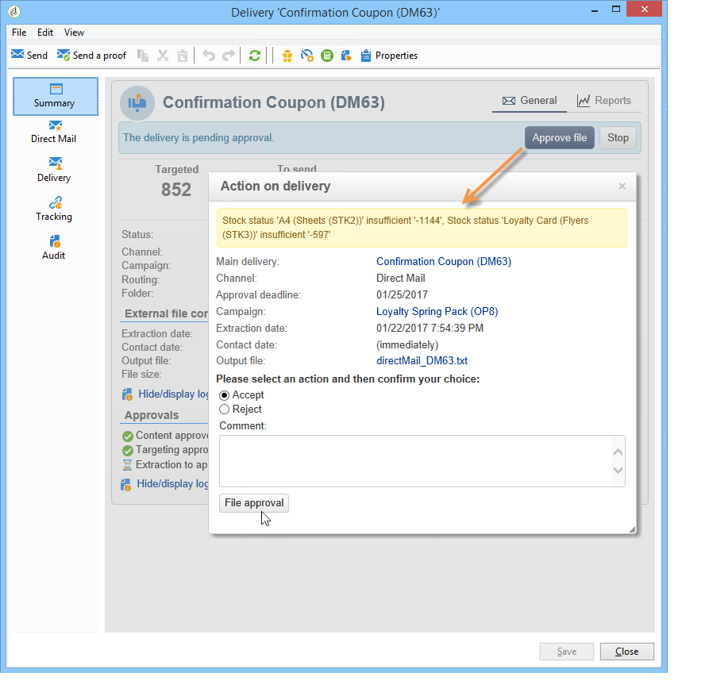
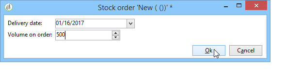

# 供应商、库存和预算{#providers-stocks-and-budgets}

Adobe Campaign允许您定义将参与营销活动中执行的作业的服务提供商。 有关服务提供者和相关成本结构的信息由Adobe Campaign管理员从主视图定义。 服务提供者从交货中引用，其成本结构允许计算与该交货相关的成本以及有关库存的管理。

## 创建服务提供商及其成本结构 {#creating-service-providers-and-their-cost-structures}

每个服务提供商都保存在包含联系详细信息、服务模板和相关作业的文件中。

在 **[!UICONTROL Administration > Campaign management]** 树的节点。

在投放期间执行的作业由服务提供商执行，特别是直邮和移动渠道的作业。 例如，这些服务提供商可以参与打印或分发消息。 这些作业涉及特定于每个服务提供商的配置和成本。 服务提供商的配置涉及四个阶段：

1. 在Adobe Campaign中创建服务提供商

   请参阅 [添加服务提供商](#adding-a-service-provider).

1. 定义相关服务模板的成本类别和结构

   请参阅 [定义成本类别](#defining-cost-categories) 和 [定义成本结构](#defining-the-cost-structure).

1. 流程配置

   请参阅 [配置与服务关联的进程](#configuring-processes-associated-with-a-service).

1. 在营销活动级别引用服务提供商

   请参阅 [将服务与促销活动关联](#associating-a-service-with-a-campaign).

### 创建服务提供商及其成本类别 {#creating-a-service-provider-and-its-cost-categories}

#### 添加服务提供商 {#adding-a-service-provider}

您可以根据需要为投放创建任意数量的服务提供商。 添加服务提供商的过程如下：

1. 右键单击服务提供商列表，然后选择 **[!UICONTROL New]**，或单击 **[!UICONTROL New]** 按钮。
1. 在窗口的下半部分，指定服务提供商的名称和联系人详细信息。

   

1. 单击 **[!UICONTROL Save]** 按钮将服务提供商添加到列表。

#### 定义成本类别 {#defining-cost-categories}

必须将服务模板与每个服务提供商关联。 在这些模板中，您必须首先确定成本类别，并在必要时确定相关库存。 然后，您必须通过成本结构为每个类别创建成本计算规则。

>[!NOTE]
>
>有关更多信息，请参阅 [定义成本结构](#defining-the-cost-structure).

成本类别是包含一组符合投放类型（电子邮件、直邮等）资格的成本的实体 或者为任务。 成本类别被分组到与服务提供商相关联的服务的模板中。 每个服务提供商可以引用一个或多个服务模板。

要创建服务模板并定义其内容，请应用以下步骤：

1. 在 **[!UICONTROL Services]** ，请单击 **[!UICONTROL Add]** 按钮并命名服务模板。

   

1. 为每种流程类型（通过直邮/电子邮件发送/等）创建成本类别。 或任务)。 为此，请单击 **[!UICONTROL Cost categories]** 选项卡，然后 **[!UICONTROL Add]** 按钮，然后输入每个成本类别的参数。

   

   * 为此成本类别输入标签，并选择相关流程类型：投放方式 **[!UICONTROL Direct mail]**, **[!UICONTROL Email]**, **[!UICONTROL Mobile]**, **[!UICONTROL Telephone]** 或 **[!UICONTROL Task]**.
   * 单击 **[!UICONTROL Add]** 按钮以定义与此类别关联的成本类型。
   * 如有必要，将库存行与每种成本类型关联，以便使用的数量将自动与现有库存相关联。

      >[!NOTE]
      >
      >库存行在 **[!UICONTROL Stock management]** 节点。\
      >有关更多信息，请参阅 [库存和订单管理](#stock-and-order-management).

1. 您可以为此成本类别预选一个值，默认情况下，该值将在服务提供商成本类别中提供（而不是空白）。 为此，请在 **[!UICONTROL Selected]** 列中的“相关类别”类型：

   

   在投放级别，默认情况下会选择该值：

   

### 定义成本结构 {#defining-the-cost-structure}

对于每种成本类型，成本结构都指定要应用的计算规则。

单击 **[!UICONTROL Cost structure]** 选项卡，以配置每个成本类别和类型的成本计算。 单击 **[!UICONTROL Add]** 并输入成本结构。

* 要创建成本结构，请从下拉列表中选择消息类型和相关的成本类别，以及将应用计算规则的成本类型。 这些下拉列表的内容来自通过 **[!UICONTROL Cost categories]** 选项卡。

   必须为成本结构分配标签。 默认情况下，它具有以下投放大纲： **成本类别 — 成本类型**.

   但是，您可以对其重命名：直接在 **[!UICONTROL Label]** 字段。

* 成本计算公式在窗口的下部定义。

   此公式可以是固定的（对于任意数量的消息），也可以根据消息数量计算。

   当取决于消息数量时，成本计算结构可以是 **[!UICONTROL Linear]**, **[!UICONTROL Linear by threshold]**&#x200B;或 **[!UICONTROL Constant by threshold]**.

#### 线性结构 {#linear-structure}

如果消息（或一批消息）的数量始终相同，而不考虑消息总数，请选择 **[!UICONTROL Linear]** 并输入每条消息的成本。

如果此数量适用于一批消息，请指定 **[!UICONTROL for]** 字段。

#### 基于阈值的线性结构 {#linear-structure-by-threshold}

如果金额按每条消息的阈值应用，则必须定义 **[!UICONTROL Linear by threshold]** 计算结构。 在此类成本结构中，每条消息的成本为0.13，例如，如果消息总数介于1到100之间，则成本为0.12，从100到1000条消息，或者从1000条消息的成本为0.11。

配置将如下所示：

要添加阈值，请单击 **[!UICONTROL Add]** 按钮。

#### 按阈值的常量结构 {#constant-structure-by-threshold}

最后，您可以根据消息总数配置成本计算。 为此，请选择 **[!UICONTROL Constant by threshold]** 计算结构。 例如，对于1到100条报文，成本将设置为固定金额12.00；对于101到1000条报文，成本将设置为100.00；对于1000条以上报文的任何投放，无论总数是多少，成本都将设置为500.00。

### 配置与服务关联的进程 {#configuring-processes-associated-with-a-service}

您可以通过 **[!UICONTROL Processes]** 选项卡。

为此，请单击 **[!UICONTROL Processes]** 选项卡来配置向路由器发送信息。

* 的 **[!UICONTROL File extraction]** 部分指示选择此服务时用于交付的导出模板。 您可以在 **[!UICONTROL Extraction file]** 字段。 利用字段右侧的按钮可插入变量。

   

* 的 **[!UICONTROL Notification email]** 部分允许您指定在发送文件后通知服务提供商的模板。 选择用于创建警报消息的模板和收件人组。

   默认情况下，通知消息的投放模板会保存在 **[!UICONTROL Administration > Campaign management > Technical delivery templates]** 节点，可从常规视图访问。

* 的 **[!UICONTROL Post-processing]** 部分，可让您选择要在投放获得批准后启动的工作流。 如果输入了工作流模板，则会自动创建工作流实例，然后在批准生效后立即启动该实例。 例如，此工作流可以将提取文件发送到外部服务提供商进行处理。

### 将服务与促销活动关联 {#associating-a-service-with-a-campaign}

服务通过投放或任务与营销活动关联。 服务提供商链接到投放模板，以在通过此模板创建的投放中提供其服务。

选择服务后，与投放类型（直邮、电子邮件等）对应的成本类别 中心表中会自动指示该参数，以及已定义的处理选项。

>[!NOTE]
>
>如果在选择服务时未显示任何成本类别，则表示未为此类流程定义任何成本类别。 例如，对于电子邮件投放，如果没有 **[!UICONTROL Email]** 类型成本类别已定义，将不显示任何类别，并且选择服务将不起作用。

* 对于直邮投放，您可以从配置窗口中选择服务。

   

* 对于在移动渠道或电话上投放，应用相同的选择模式。
* 对于电子邮件投放，将从 **[!UICONTROL Advanced]** 选项卡，如以下示例中所示：

   

的 **[!UICONTROL Amount to surcharge]** 列允许您在相关投放或任务的上下文中为此类别添加成本。

在定义交货的成本类别期间，您可以强制选择成本类型。 要执行此操作，请选择 **[!UICONTROL A cost type must be selected]**.

## 库存和订单管理 {#stock-and-order-management}

成本类型可以与库存行关联，以处理预警、跟踪供应和启动订单。

在Adobe Campaign设置库存和订单管理，并在供应不足时通知操作员以执行交货的程序如下：

1. 关联服务提供商的库存创建和引用

   请参阅 [创建股票](#creating-a-stock).

1. 添加库存行

   请参阅 [添加库存行](#adding-stock-lines).

1. 在出现警报时通知操作员

   请参阅 [警报运算符](#alerting-operators).

1. 订单和供应。

   请参阅 [订单数](#orders).

### 库存管理 {#stock-management}

如果库存不足或达到最低阈值，Adobe Campaign可以提醒一组运算符。 库存级别可通过 **[!UICONTROL Stocks]** 链接 **[!UICONTROL Campaigns]** 选项卡 **[!UICONTROL Other choices]** 链接。

#### 创建股票 {#creating-a-stock}

应用以下步骤以创建新库存：

1. 单击 **[!UICONTROL Create]** 按钮。
1. 输入库存的标签，并从下拉列表中选择与其关联的服务提供商。

   

   >[!NOTE]
   >
   >有关更多信息，请参阅 [创建服务提供商及其成本结构](#creating-service-providers-and-their-cost-structures).

#### 添加库存行 {#adding-stock-lines}

一种库存包括各种库存线。 库存行包含投放将使用的初始资源量。 每个库存行均指示已冲减的数量、库存数量和已订购数量。

创建库时，单击 **[!UICONTROL Stock lines]** 选项卡来添加新行。

创建库存后，单击该库存以进行编辑，然后使用其仪表板创建和查看库存行。

单击 **[!UICONTROL Create]** 按钮来定义库参数。

* 指示 **[!UICONTROL Initial stock]** 字段。 的 **[!UICONTROL Consumed]** 和 **[!UICONTROL In stock]** 字段会自动计算并根据促销活动进度进行更新。

   

* 指示应向操作员发出订单库存警报的阈值 **[!UICONTROL Alert level]** 字段。 达到警报级别时，使用此库的投放审批窗口中会显示一条警告消息。

#### 将库存与成本类别关联 {#associating-a-stock-with-cost-categories}

对于给定的服务提供商，在服务中，库存行可以被下列成本类别之一引用：

### 库存跟踪 {#stock-tracking}

#### 警报运算符 {#alerting-operators}

当投放中引用的库存不足时，会显示警报。 例如，提取文件获得批准后，将显示以下警报：

#### 订单数 {#orders}

的 **[!UICONTROL Orders]** 使用子标签可以查看当前订单并保存新订单。

要保存订单，请编辑目标库存行，单击 **[!UICONTROL Add]** 按钮，并指定交货日期和订购数量。

>[!NOTE]
>
>达到交货日期后，订购的库存行会自动消失，并在 **[!UICONTROL Volume on order]** 字段 **[!UICONTROL Tracking]** 选项卡。 此数量会自动添加到库存量中。

的 **[!UICONTROL Consumptions]** 选项卡包含每个营销活动使用的卷。 系统将根据执行的投放自动输入此选项卡中的信息。 单击 **[!UICONTROL Edit]** 按钮以打开相关的营销活动。

## 计算预算 {#calculating-budgets}

### 原则 {#principle}

投放和营销活动的成本均可管理。 根据进度，这些费用将分配给预算。

营销活动的投放成本在营销活动级别进行合并，并且项目的所有营销活动的成本都会传递到与其关联的项目。 通过专用报告，您可以跟踪整个平台或每个计划和每个计划的预算。

### 实施 {#implementation}

在营销活动中，选择预算时必须输入初始金额。 计算成本将根据所输入金额（支出、预期、保留、承诺）的承付水平自动更新。 请参阅 [计算金额](../../mrm/using/controlling-costs.md#calculating-amounts).

>[!NOTE]
>
>预算的编制程序于 [创建预算](../../mrm/using/controlling-costs.md#creating-a-budget).
