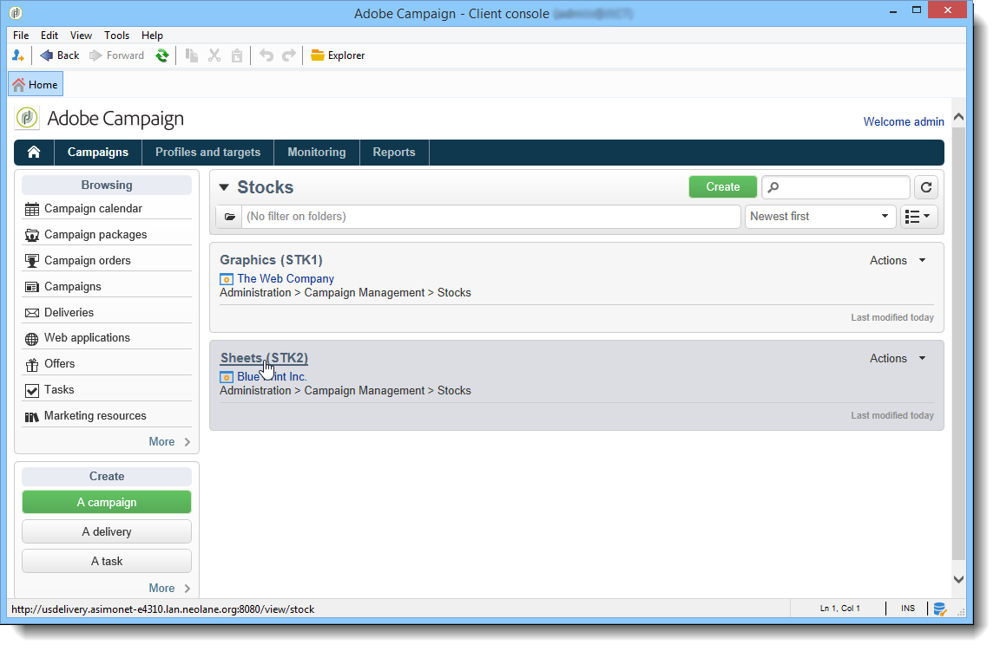

# 供应商、库存和预算{#providers-stocks-and-budgets}

Adobe Campaign允许您定义将参与在活动中执行的任务的服务提供商。 有关服务提供商和相关成本结构的信息由Adobe Campaign管理员从主视图定义。 该服务提供商是从投放引用的，其成本结构允许计算与该投放相关的成本以及管理有关库存。

## 创建服务提供商及其成本结构{#creating-service-providers-and-their-cost-structures}

每个服务提供商都保存在包含联系人详细信息、服务模板和相关作业的文件中。

服务提供商在树的&#x200B;**[!UICONTROL Administration > Campaign management]**&#x200B;节点中配置。

在投放期间执行的作业由服务提供商执行，特别是对于直邮和移动渠道。 例如，这些服务提供商可以参与打印或分发消息。 这些作业涉及特定于每个服务提供商的配置和成本。 服务提供商配置涉及四个阶段：

1. 在Adobe Campaign中创建服务提供商

   请参阅[添加服务提供商](#adding-a-service-provider)。

1. 定义相关服务模板的成本类别和结构

   请参阅[定义成本类别](#defining-cost-categories)和[定义成本结构](#defining-the-cost-structure)。

1. 进程配置

   请参阅[配置与服务关联的进程](#configuring-processes-associated-with-a-service)。

1. 在服务提供商级别引用活动

   请参阅[将服务与活动关联](#associating-a-service-with-a-campaign)。

### 创建服务提供商及其成本类别{#creating-a-service-provider-and-its-cost-categories}

#### 添加服务提供商{#adding-a-service-provider}

您可以为投放创建所需数量的服务提供商。 添加服务提供商的步骤如下：

1. 右键单击服务提供商的列表并选择&#x200B;**[!UICONTROL New]**，或单击服务提供商列表上方的&#x200B;**[!UICONTROL New]**&#x200B;按钮。
1. 在窗口的下半部分，指定服务提供商的名称和联系人详细信息。

   

1. 单击&#x200B;**[!UICONTROL Save]**&#x200B;按钮将服务提供商添加到列表。

#### 定义成本类别{#defining-cost-categories}

必须将服务模板与每个服务提供商关联。 在这些模板中，您必须首先确定成本类别和相关库存（如果需要）。 然后，您必须通过成本结构为每个类别创建成本计算规则。

>[!NOTE]
>
>有关详细信息，请参阅[定义成本结构](#defining-the-cost-structure)。

成本类别是包含一组符合投放类型（电子邮件、直邮等）资格的成本的实体 或任务。 成本类别在与服务提供商关联的服务模板中进行分组。 每个服务提供商都可以引用一个或多个服务模板。

要创建服务模板并定义其内容，请应用以下步骤：

1. 在服务提供商的&#x200B;**[!UICONTROL Services]**&#x200B;选项卡中，单击&#x200B;**[!UICONTROL Add]**&#x200B;按钮并命名服务模板。

   

1. 为每种流程类型创建成本类别(通过直接邮件/电子邮件/等进行投放)。 或任务)。 要执行此操作，请单击&#x200B;**[!UICONTROL Cost categories]**&#x200B;选项卡，然后单击&#x200B;**[!UICONTROL Add]**&#x200B;按钮，并输入每个成本类别的参数。

   

   * 为此成本类别输入标签，然后选择相关流程类型：由&#x200B;**[!UICONTROL Direct mail]**、**[!UICONTROL E-mail]**、**[!UICONTROL Mobile]**、**[!UICONTROL Telephone]**&#x200B;或&#x200B;**[!UICONTROL Task]**&#x200B;投放。
   * 单击&#x200B;**[!UICONTROL Add]**&#x200B;按钮，定义与此类别关联的成本类型。
   * 如有必要，将库存线与每种成本类型关联，以便使用的数量将自动与现有库存相关。

      >[!NOTE]
      >
      >库存行在&#x200B;**[!UICONTROL Stock management]**&#x200B;节点中定义。\
      >有关详细信息，请参阅[Stock and order management](#stock-and-order-management)。

1. 您可以预先为此成本类别选择一个值，默认情况下，该值将在服务提供商成本类别中提供（而不是空白）。 要执行此操作，请在&#x200B;**[!UICONTROL Selected]**&#x200B;列中选择相应类别类型的选项：

   

   在投放级别，默认情况下将选择该值：

   

### 定义成本结构{#defining-the-cost-structure}

对于每种类型的成本，成本结构指定要应用的计算规则。

单击&#x200B;**[!UICONTROL Cost structure]**&#x200B;选项卡，为每个成本类别和类型配置成本计算。 单击&#x200B;**[!UICONTROL Add]**&#x200B;并输入成本结构。

* 要创建成本结构，请从下拉式列表中选择消息类型和相关成本类别，以及将应用计算规则的成本类型。 这些下拉列表的内容来自通过&#x200B;**[!UICONTROL Cost categories]**&#x200B;选项卡输入的信息。

   您必须为成本结构分配标签。 默认情况下，它具有以下投放概要:**成本类别 — 成本类型**。

   但是，您可以重命名它：在&#x200B;**[!UICONTROL Label]**&#x200B;字段中直接输入所需的值。

* 成本计算公式在窗口的下半部分定义。

   此公式可以固定（对于任意数量的消息）或根据消息数计算。

   当它取决于消息数时，成本计算结构可以是&#x200B;**[!UICONTROL Linear]**、**[!UICONTROL Linear by threshold]**&#x200B;或&#x200B;**[!UICONTROL Constant by threshold]**。

#### 线性结构{#linear-structure}

如果无论消息总数如何，消息（或消息批）的金额始终相同，请选择&#x200B;**[!UICONTROL Linear]**&#x200B;并输入每条消息的成本。

如果此量适用于一批消息，请在&#x200B;**[!UICONTROL for]**&#x200B;字段中指定相关消息的数量。

#### 按阈值{#linear-structure-by-threshold}的线性结构

如果金额按阈值对每条消息应用，则必须定义&#x200B;**[!UICONTROL Linear by threshold]**&#x200B;计算结构。 在此类型的成本结构中，每条消息的成本为0.13，例如，如果消息总数在1到100之间，则成本为0.12，从100到1000条消息，或从1000条消息到0.11。

配置将如下所示：

要添加阈值，请单击列表右侧的&#x200B;**[!UICONTROL Add]**&#x200B;按钮。

#### 按阈值{#constant-structure-by-threshold}的常量结构

最后，您可以根据消息总数配置成本计算。 为此，请选择&#x200B;**[!UICONTROL Constant by threshold]**&#x200B;计算结构。 例如，无论总数如何，成本将设置为1到100封邮件的固定金额12.00,投放101到1000封邮件的固定金额100.00,投放超过1000封邮件的固定金额500.00。

### 配置与服务{#configuring-processes-associated-with-a-service}关联的进程

可以通过&#x200B;**[!UICONTROL Processes]**&#x200B;选项卡关联与服务关联的进程的信息。

为此，请单击&#x200B;**[!UICONTROL Processes]**&#x200B;选项卡以配置向路由器发送信息。

* **[!UICONTROL File extraction]**&#x200B;部分指示选择此服务时用于投放的导出模板。 可以在&#x200B;**[!UICONTROL Extraction file]**&#x200B;字段中指示输出文件的名称。 通过字段右侧的按钮可插入变量。

   

* 通过&#x200B;**[!UICONTROL Notification e-mail]**&#x200B;部分，可指定在发送文件后通知服务提供商的模板。 选择用于创建警报消息的模板和收件人组。

   默认情况下，通知消息的投放模板保存在&#x200B;**[!UICONTROL Administration > Campaign management > Technical delivery templates]**&#x200B;节点中，可从常规视图访问该节点。

* 通过&#x200B;**[!UICONTROL Post-processing]**&#x200B;部分，您可以选择在批准投放后启动的工作流。 如果输入了工作流模板，则系统将自动创建工作流实例，并在批准生效后立即启动。 例如，此工作流可以将提取文件发送到外部服务提供商进行处理。

### 将服务与活动{#associating-a-service-with-a-campaign}关联

服务通过投放或任务与活动关联。 服务提供商链接到投放模板，以在通过此模板创建的投放中优惠其服务。

选择服务时，与投放类型（直接邮件、电子邮件等）对应的成本类别 与已定义的处理选项一起自动在中心表中指示。

>[!NOTE]
>
>如果在选择服务时未显示任何成本类别，则表示未为此类流程定义任何成本类别。 例如，对于电子邮件投放，如果未定义&#x200B;**[!UICONTROL E-mail]**&#x200B;类型成本类别，则不会显示任何类别，而选择服务将不起作用。

* 对于直接邮件投放，您可以从配置窗口中选择服务。

   

* 对于移动渠道或电话上的投放，应用相同的选择模式。
* 对于电子邮件投放，从投放属性的&#x200B;**[!UICONTROL Advanced]**&#x200B;选项卡中选择该服务，如下例所示：

   

通过&#x200B;**[!UICONTROL Amount to surcharge]**&#x200B;列，可在相关投放或任务的上下文中为此类别添加费用。

在为投放定义成本类别时，您可以强制选择成本类型。 要执行此操作，请选择&#x200B;**[!UICONTROL A cost type must be selected]**。

## 库存和订单管理{#stock-and-order-management}

成本类型可与库存行关联，以处理警报、跟踪供应和启动订单。

在Adobe Campaign中设置库存和订单管理，并在投放供应不足时通知操作员，具体步骤如下：

1. 相关服务提供商的库创建和引用

   请参阅[创建库存](#creating-a-stock)。

1. 添加库存行

   请参阅[添加库存线](#adding-stock-lines)。

1. 通知事件中的操作员警报

   请参阅[警报运算符](#alerting-operators)。

1. 订单和供应。

   请参阅[订单](#orders)。

### 库存管理{#stock-management}

Adobe Campaign可以在库存不足或达到最低阈值时提醒操作员组。 库存级别可通过&#x200B;**[!UICONTROL Campaigns]**&#x200B;选项卡的&#x200B;**[!UICONTROL Stocks]**&#x200B;链接通过导航区域的&#x200B;**[!UICONTROL Other choices]**&#x200B;链接访问。

#### 创建库存{#creating-a-stock}

应用以下步骤以创建新库存：

1. 单击股票列表上方的&#x200B;**[!UICONTROL Create]**&#x200B;按钮。
1. 输入库存的标签，然后从下拉服务提供商中选择与库存关联的列表。

   

   >[!NOTE]
   >
   >有关详细信息，请参阅[创建服务提供商及其成本结构](#creating-service-providers-and-their-cost-structures)。

#### 添加库存线{#adding-stock-lines}

一种包括各种库存线的库存。 库存行包含将由投放消耗的资源的初始数量。 每个库存行均指示已消耗的数量、库存数量和订购数量。

创建库时，单击&#x200B;**[!UICONTROL Stock lines]**&#x200B;选项卡以添加新行。

创建库后，单击它即可进行编辑，并使用其仪表板创建和视图库线。

单击&#x200B;**[!UICONTROL Create]**&#x200B;按钮定义库存参数。

* 在&#x200B;**[!UICONTROL Initial stock]**&#x200B;字段中指示最初存货的数量。 **[!UICONTROL Consumed]**&#x200B;和&#x200B;**[!UICONTROL In stock]**&#x200B;字段将自动计算并作为活动进度进行更新。

   

* 在&#x200B;**[!UICONTROL Alert level]**&#x200B;字段中指示应从哪个阈值警告操作员订购库存。 达到警报级别时，使用此库存的投放的审批窗口中将显示警告消息。

#### 将库存与成本类别{#associating-a-stock-with-cost-categories}关联

对于给定服务提供商，在服务中，库存行可以由成本类别之一引用，如下所示：

### 库存跟踪{#stock-tracking}

#### 警报运算符{#alerting-operators}

当投放中引用的库存不足时，将显示警报。 例如，批准提取文件时，将显示以下警报：

#### 订单{#orders}

**[!UICONTROL Orders]**&#x200B;子标签允许您视图当前订单并保存新订单。

要保存订单，请编辑目标库存行，单击&#x200B;**[!UICONTROL Add]**&#x200B;按钮并指定投放日期和订购数量。

>[!NOTE]
>
>到达投放日期后，订购的库存行将自动消失，在&#x200B;**[!UICONTROL Volume on order]**&#x200B;字段中输入的数量将添加到&#x200B;**[!UICONTROL Tracking]**&#x200B;选项卡。 此数量会自动添加到库存量。

**[!UICONTROL Consumptions]**&#x200B;选项卡包含每个活动占用的卷。 系统会根据执行的投放自动输入此选项卡中的信息。 单击&#x200B;**[!UICONTROL Edit]**&#x200B;按钮以打开相关活动。

## 计算预算{#calculating-budgets}

### 原则{#principle}

成本乃按投放及活动管理。 根据进展情况，这些费用将分配到预算。

活动的投放成本按活动层面综合入账，而项目的所有活动成本均会转嫁至其相关项目。 专用报告可让您跟踪整个平台或每个计划和每个项目的预算。

### 实现{#implementation}

在活动中，选择预算时必须输入初始金额。 计算成本将根据所输入金额（支出、预期、保留、承诺）的承付水平自动更新。 请参阅[计算金额](../../campaign/using/controlling-costs.md#calculating-amounts)。

>[!NOTE]
>
>创建预算的过程在[创建预算](../../campaign/using/controlling-costs.md#creating-a-budget)中介绍。

