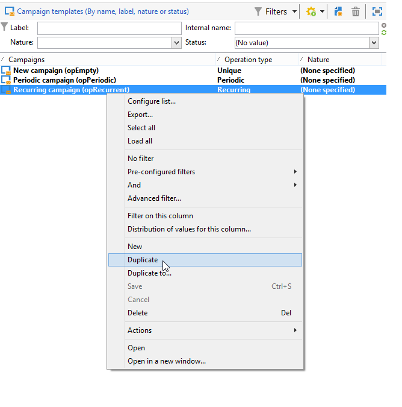
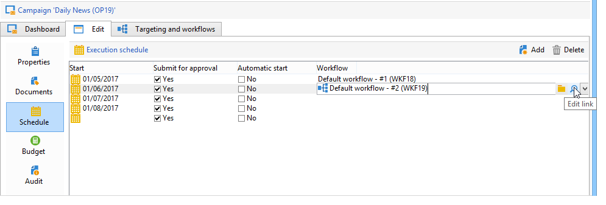
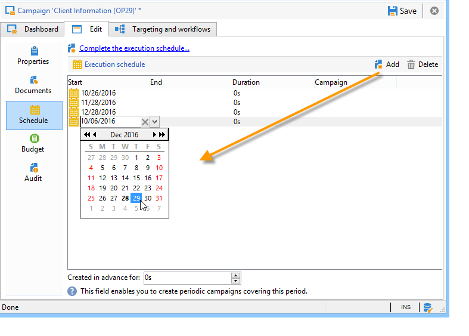

# 营销活动入门{#setting-up-marketing-campaigns}

活动包括操作（投放）和流程（导入或提取文件）以及资源（营销文档、投放概要）。 它们用于营销活动。活动是项目的一部分，项目包含在活动计划中。

在视频[&#128279;](#video)中了解如何创建营销计划、项目和营销活动

要创建营销活动，请执行以下操作：

1. 创建营销活动：了解营销活动及其特征：标签、类型、开始和结束日期、预算、相关资源、经理和参与者。 [了解详情](#creating-a-campaign)。

1. 定义目标群体：创建包含定向查询的工作流。 [了解详情](../../campaign/using/marketing-campaign-deliveries.md#selecting-the-target-population)。

1. 创建投放：选择渠道并定义要发送的内容。 [了解详情](../../campaign/using/marketing-campaign-deliveries.md#creating-deliveries)。

1. 批准投放。 [了解详情](../../campaign/using/marketing-campaign-approval.md)。

1. 监测投放。 [了解详情](../../campaign/using/marketing-campaign-monitoring.md)。

1. 计划活动和相关成本。 [了解详情](../../campaign/using/providers-stocks-and-budgets.md#creating-service-providers-and-their-cost-structures)。

完成这些步骤后，您可以开始投放（请参阅[此章节](../../campaign/using/marketing-campaign-deliveries.md#starting-a-delivery)），检查与投放相关的数据、流程和信息，并在必要时管理相关文档（请参阅[此章节](../../campaign/using/marketing-campaign-deliveries.md#managing-associated-documents)）。 您还可以跟踪营销活动和投放的处理阶段的执行（请参阅[此章节](../../campaign/using/marketing-campaign-monitoring.md)）。

## 创建计划和项目层次结构 {#creating-plan-and-program-hierarchy}

要为营销计划和项目配置文件夹层次结构，请执行以下操作：

1. 单击主页上的&#x200B;**资源管理器**&#x200B;图标。
1. 右键单击要在其中创建计划的文件夹。
1. 选择&#x200B;**添加新文件夹>促销活动管理>计划**。

   

1. 重命名计划。
1. 右键单击新创建的计划并选择&#x200B;**属性……**。

   

1. 在&#x200B;**常规**&#x200B;选项卡中，修改&#x200B;**内部名称**&#x200B;以避免在导出包期间出现重复项。
1. 单击&#x200B;**保存**。
1. 右键单击新创建的计划并选择&#x200B;**创建新的“项目”文件夹**。
1. 重复上述步骤以重命名新的程序文件夹及其内部名称。

## 创建营销活动 {#creating-a-campaign}

### 添加营销活动 {#adding-a-campaign}

您可以通过营销活动列表创建营销活动。 要显示此视图，请选择&#x200B;**[!UICONTROL Campaigns]**&#x200B;仪表板中的&#x200B;**[!UICONTROL Campaigns]**&#x200B;菜单。

**[!UICONTROL Program]**&#x200B;字段允许您选择营销策划将附加到的项目。 此信息是强制性的。

营销策划也可以通过项目创建。 为此，请单击相关程序&#x200B;**[!UICONTROL Schedule]**&#x200B;选项卡中的&#x200B;**[!UICONTROL Add]**&#x200B;按钮。

当您通过项目群的&#x200B;**[!UICONTROL Schedule]**&#x200B;选项卡创建营销策划时，该营销策划会自动链接到相关项目。 在这种情况下，**[!UICONTROL Program]**&#x200B;字段是隐藏的。

在营销策划创建窗口中，选择营销策划模板，并添加营销策划的名称和描述。 您还可以指定营销策划的开始和结束日期。

单击&#x200B;**[!UICONTROL OK]**&#x200B;以创建营销活动。 那个被加到节目表上了。

>[!NOTE]
>
>要筛选要显示的营销活动，请单击&#x200B;**[!UICONTROL Filter]**&#x200B;链接，然后选择要显示的营销活动状态。

### 编辑和配置营销活动 {#editing-and-configuring-a-campaign}

然后，您可以编辑之前创建的营销活动并定义其参数。

要打开并配置营销活动，请从计划中选择该营销活动，然后单击&#x200B;**[!UICONTROL Open]**。

这会将您转到营销活动仪表板。

## 循环和定期活动 {#recurring-and-periodic-campaigns}

周期性营销活动是基于特定模板的营销活动，其工作流配置为根据关联计划执行。 因此，工作流将在营销策划中重复出现。 每次执行时都会重复定位，并跟踪各种流程和目标群体。 此外，还可以在自动工作流创建期间提前执行未来目标，以便使用目标估计启动模拟。

定期活动是根据模板的执行计划自动创建的活动。

### 创建定期活动 {#creating-a-recurring-campaign}

循环活动是从定义要执行的工作流模板和执行计划的特定模板创建的。

#### 为定期活动创建模板 {#creating-the-campaign-template}

1. 创建&#x200B;**[!UICONTROL Recurring]**&#x200B;营销活动模板。

   >[!NOTE]
   >
   >建议您复制默认模板而不是创建空模板。

   

1. 输入模板名称和营销活动的持续时间。

   

1. 对于此类型的营销活动，添加了&#x200B;**[!UICONTROL Schedule]**&#x200B;选项卡以创建模板执行计划。

在此选项卡中，根据此模板指定营销活动的计划执行日期。

执行计划的配置模式与工作流的&#x200B;**[!UICONTROL Scheduler]**&#x200B;对象一致。 如需详细信息，请参阅[此小节](../../workflow/using/architecture.md)。

>[!IMPORTANT]
>
>必须仔细执行执行计划配置，以避免数据库过载。 定期活动会根据指定的计划复制其模板的工作流。 过于频繁的工作流创建的实现会阻碍数据库的操作。

1. 在&#x200B;**[!UICONTROL Create in advance for]**&#x200B;字段中指定一个值，以创建指定期间的相应工作流。
1. 创建要在基于此模板的营销活动中使用的工作流模板，以及定位参数和一个或多个通用投放。

   >[!NOTE]
   >
   >此工作流必须另存为定期工作流模板。 为此，请编辑工作流属性并在&#x200B;**[!UICONTROL Execution]**&#x200B;选项卡中选择&#x200B;**[!UICONTROL Recurring workflow template]**&#x200B;选项。

   

#### 创建定期活动 {#create-the-recurring-campaign}

要创建定期活动并根据模板中定义的计划执行其工作流，请应用以下过程：

1. 根据定期活动模板创建新活动。
1. 填写工作流执行计划。

   

1. 促销活动计划允许您为每个行输入自动工作流创建或执行起始日期。

   您可以为每行添加以下附加选项：

   * **[!UICONTROL To be approved]** ：用于在工作流中强制发送审批请求。
   * **[!UICONTROL To be started]** ：允许您在到达开始日期后启动工作流。

   **[!UICONTROL Create in advance for]**&#x200B;字段允许您创建涵盖输入期间的所有工作流。

   在执行&#x200B;**[!UICONTROL Jobs on campaigns]**&#x200B;工作流时，会根据营销活动计划中定义的发生次数创建专用工作流。 因此，将为每个执行日期创建工作流。

1. 定期工作流是自动从营销策划中存在的工作流模板创建的。 它们在营销活动的&#x200B;**[!UICONTROL Targeting and workflows]**&#x200B;选项卡中可见。

   

   定期工作流实例的标签由其模板标签和工作流编号组成，其中的#字符介于。

   根据计划创建的工作流会自动在&#x200B;**[!UICONTROL Schedule]**&#x200B;选项卡的&#x200B;**[!UICONTROL Workflow]**&#x200B;列中与其关联。

   

   可以从此选项卡中编辑每个工作流。

   

   >[!NOTE]
   >
   >与工作流关联的计划行的开始日期可从工作流的变量中获取，其语法如下：\
   >`$date(instance/vars/@startPlanningDate)`

### 创建定期活动 {#creating-a-periodic-campaign}

定期营销活动是基于特定模板的营销活动，通过该模板可根据执行计划创建营销活动实例。 根据模板计划中定义的频率，系统会根据定期活动模板自动创建Campaign实例。

#### 创建活动模板 {#creating-the-campaign-template-1}

1. 创建&#x200B;**[!UICONTROL Periodic]**&#x200B;营销活动模板，最好通过复制现有营销活动模板来实现。

   

1. 输入模板的属性。

   >[!NOTE]
   >
   >模板所分配到的操作员需要拥有在所选项目中创建营销策划的适当权限。

1. 创建与此模板关联的工作流。 模板创建的每个定期营销策划中都会复制该模板。

   

   >[!NOTE]
   >
   >此工作流是一个工作流模板。 无法从营销活动模板执行该操作。

1. 按照定期活动模板完成其执行计划：单击&#x200B;**[!UICONTROL Add]**&#x200B;按钮并定义开始和结束日期，或通过链接填写执行计划。

   

   >[!IMPORTANT]
   >
   >定期活动模板可根据以上定义的计划创建新活动。 因此，必须仔细完成此操作，以避免Adobe Campaign数据库过载。

1. 一旦达到执行开始日期，就会自动创建匹配的营销活动。 它具有模板的所有特征。

   可以通过模板计划编辑每个营销活动。

   

每个定期营销活动都包含相同的元素。 创建后，即作为标准营销活动进行管理。

## 教程视频 {#video}

本视频说明如何创建营销计划、项目和营销活动。

>[!VIDEO](https://video.tv.adobe.com/v/35132?quality=12)

[此处](https://experienceleague.adobe.com/docs/campaign-classic-learn/tutorials/overview.html?lang=zh-Hans)提供了其他Campaign操作方法视频。
