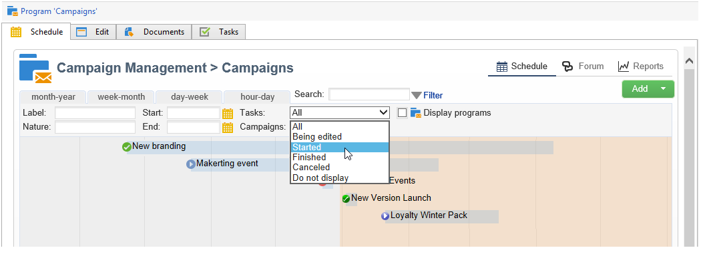
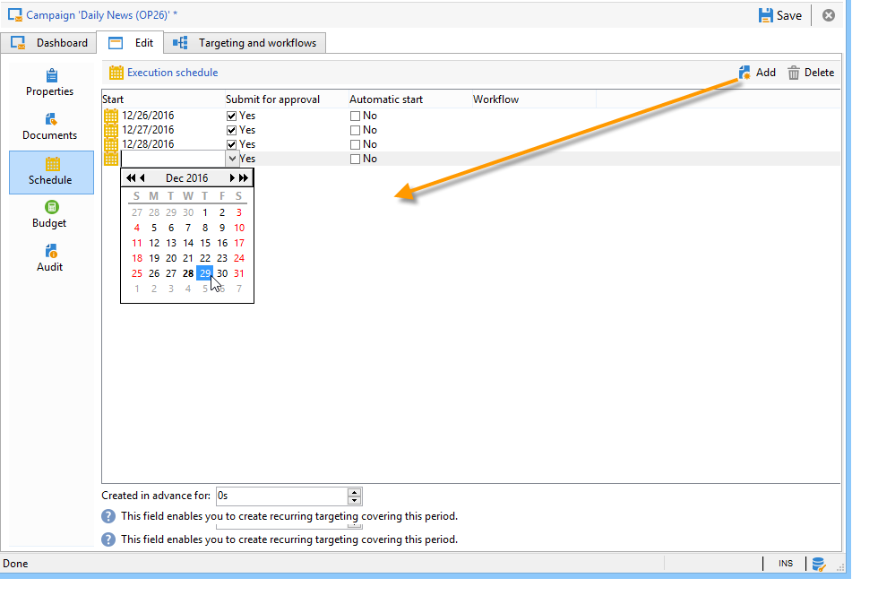

# 设置营销活动{#setting-up-marketing-campaigns}

活动包括操作(投放)和流程（导入或提取文件），以及资源(营销文档、投放概要)。 它们用于营销活动。 活动是项目的一部分，项目包含在活动计划中。

 了解如何在视频中创建营销计划、项目 [和活动](#video)

要创建营销活动，请执行以下操作：

1. 创建活动:发现活动及其特征：标签、类型、开始和结束日期、预算、关联资源、经理和参加者。

   请参阅[创建活动](#creating-a-campaign)。

1. 定义目标群：创建包含定位查询的工作流。

   请参阅[选择目标群](../../campaign/using/marketing-campaign-deliveries.md#selecting-the-target-population)。

1. 创建投放:选择渠道并定义要发送的内容。

   请参阅[创建投放](../../campaign/using/marketing-campaign-deliveries.md#creating-deliveries)。

1. 批准投放。

   请参阅[批准流程](../../campaign/using/marketing-campaign-approval.md#approval-process)。

1. 监控投放。

   请参阅[监视](../../campaign/using/marketing-campaign-monitoring.md)。

1. 计划活动和相关成本。

   请参阅[创建服务提供商及其成本结构](../../campaign/using/providers--stocks-and-budgets.md#creating-service-providers-and-their-cost-structures)。

完成这些步骤后，您可以开始投放(请参阅[启动投放](../../campaign/using/marketing-campaign-deliveries.md#starting-a-delivery))，检查与投放相关的数据、进程和信息，并在必要时管理相关文档(请参阅[管理相关文档](../../campaign/using/marketing-campaign-deliveries.md#managing-associated-documents))。 您还可以跟踪活动和投放的处理阶段的执行情况（请参阅[跟踪](../../campaign/using/marketing-campaign-monitoring.md)）。

## 创建计划和项目层次结构{#creating-plan-and-program-hierarchy}

要为营销计划和项目配置文件夹层次结构，请执行以下操作：

1. 单击主页上的&#x200B;**资源管理器**&#x200B;图标。
1. 右键单击要在其中创建计划的文件夹。
1. 选择&#x200B;**添加新文件夹>活动管理>计划**。

   

1. 重命名计划。
1. 右键单击新创建的计划，然后选择&#x200B;**属性……**。

   

1. 在&#x200B;**常规**&#x200B;选项卡中，修改&#x200B;**内部名称**&#x200B;以避免在包导出过程中发生重复。
1. 单击&#x200B;**保存**。
1. 右键单击新创建的计划，然后选择&#x200B;**创建新的“项目”文件夹**。
1. 重复上述步骤以重命名新的项目文件夹及其内部名称。

## 创建营销策划{#creating-a-campaign}

### 添加活动{#adding-a-campaign}

您可以通过活动创建活动列表。 要显示此视图，请选择&#x200B;**[!UICONTROL Campaigns]**&#x200B;仪表板中的&#x200B;**[!UICONTROL Campaigns]**&#x200B;菜单。

通过&#x200B;**[!UICONTROL Program]**&#x200B;字段，可以选择要附加项目的活动。 此信息是强制性的。

活动也可以通过项目创建。 为此，请单击相关项目的&#x200B;**[!UICONTROL Schedule]**&#x200B;选项卡中的&#x200B;**[!UICONTROL Add]**&#x200B;按钮。

当您通过活动的&#x200B;**[!UICONTROL Schedule]**&#x200B;选项卡创建项目时，活动会自动链接到相关项目。 此时&#x200B;**[!UICONTROL Program]**&#x200B;字段处于隐藏状态。

在活动创建窗口中，选择活动模板并添加活动的名称和说明。 您还可以指定活动开始和结束日期。

单击&#x200B;**[!UICONTROL OK]**&#x200B;以创建活动。 它被添加到项目计划。

>[!NOTE]
>
>要筛选要显示的活动，请单击&#x200B;**[!UICONTROL Filter]**&#x200B;链接，然后选择要显示的活动的状态。

### 编辑和配置活动{#editing-and-configuring-a-campaign}

然后，您可以编辑刚刚创建的活动并定义其参数。

要打开和配置活动，请从计划中选择它，然后单击&#x200B;**[!UICONTROL Open]**。

这会带你去活动仪表板。

## 循环和周期活动{#recurring-and-periodic-campaigns}

循环活动是基于特定模板的活动，其工作流被配置为根据关联计划执行。 因此，工作流将在活动中重复。 每次执行时都会重复定位，并跟踪各种进程和目标群体。 还可以在自动工作流创建期间通过覆盖期提前执行未来目标，以便使用目标估计启动模拟。

周期活动是根据模板的执行计划自动创建的活动。

### 创建循环活动{#creating-a-recurring-campaign}

循环活动是从定义要执行的工作流模板和执行计划的特定模板创建的。

#### 为重复活动{#creating-the-campaign-template}创建模板

1. 创建&#x200B;**[!UICONTROL Recurring]**&#x200B;活动模板。

   >[!NOTE]
   >
   >建议您重复默认模板，而不是创建空模板。

   

1. 输入模板的名称和活动持续时间。

   

1. 对于此类活动，将添加&#x200B;**[!UICONTROL Schedule]**&#x200B;选项卡以创建模板执行计划。

在此标签中，指定基于此模板的活动的计划执行日期。

执行计划的配置模式与工作流的&#x200B;**[!UICONTROL Scheduler]**&#x200B;对象一致。 如需详细信息，请参阅[此部分](../../workflow/using/architecture.md)。

>[!IMPORTANT]
>
>必须仔细执行执行计划配置，以避免数据库过载。 循环活动重复模板的工作流，具体取决于指定的计划。 过度频繁的工作流创建的实施会阻碍数据库的操作。

1. 在&#x200B;**[!UICONTROL Create in advance for]**&#x200B;字段中指定一个值，以便为指定的期间创建相应的工作流。
1. 根据此模板创建要在活动中使用的工作流模板，其中包含定位参数和一个或多个通用投放。

   >[!NOTE]
   >
   >此工作流必须保存为循环工作流模板。 为此，请编辑工作流属性，并在&#x200B;**[!UICONTROL Execution]**&#x200B;选项卡中选择&#x200B;**[!UICONTROL Recurring workflow template]**&#x200B;选项。

   

#### 创建循环活动{#create-the-recurring-campaign}

要创建循环活动并根据模板中定义的计划执行其工作流，请应用以下过程：

1. 根据重复活动创建新活动模板。
1. 填写工作流执行计划。

   

1. 活动计划允许您为每个行输入自动工作流创建或执行开始日期。

   对于每行，您可以添加以下附加选项：

   * **[!UICONTROL To be approved]** :允许您在工作流中强制投放批准请求。
   * **[!UICONTROL To be started]** :允许您在达到开始日期后开始工作流。

   通过&#x200B;**[!UICONTROL Create in advance for]**&#x200B;字段，可以创建涵盖所输入期间的所有工作流。

   执行&#x200B;**[!UICONTROL Jobs on campaigns]**&#x200B;工作流时，将根据在工作流计划中定义的实例创建专用活动。 因此，将为每个执行日期创建一个工作流。

1. 重复工作流是从活动中出现的工作流模板自动创建的。 它们可以从活动的&#x200B;**[!UICONTROL Targeting and workflows]**&#x200B;选项卡中显示。

   

   重复工作流实例的标签由其模板标签和工作流编号组成，其中间有#字符。

   从计划创建的工作流会自动与其关联在&#x200B;**[!UICONTROL Schedule]**&#x200B;选项卡的&#x200B;**[!UICONTROL Workflow]**&#x200B;列中。

   

   每个工作流都可通过此选项卡进行编辑。

   

   >[!NOTE]
   >
   >与工作流关联的开始行的计划日期可从工作流的变量中使用以下语法：\
   >`$date(instance/vars/@startPlanningDate)`

### 创建周期活动{#creating-a-periodic-campaign}

周期活动是基于特定模板的活动，允许您根据执行计划创建活动实例。 活动实例根据周期活动模板自动创建，具体取决于模板计划中定义的频率。

#### 创建活动模板{#creating-the-campaign-template-1}

1. 创建&#x200B;**[!UICONTROL Periodic]**&#x200B;活动模板，最好复制现有活动模板。

   

1. 输入模板的属性。

   >[!NOTE]
   >
   >分配了模板的运算符需要具有相应的权限才能在所选项目中创建活动。

1. 创建与此模板关联的工作流。 模板创建的每个定期活动中都会重复该模板。

   

   >[!NOTE]
   >
   >此工作流是工作流模板。 无法从活动模板执行。

1. 完成循环计划的执行活动模板:单击&#x200B;**[!UICONTROL Add]**&#x200B;按钮并定义开始和结束日期，或通过链接填写执行计划。

   

   >[!IMPORTANT]
   >
   >定期活动模板根据上面定义的计划创建新活动。 因此，必须仔细完成，以避免Adobe Campaign库过载。

1. 到达执行开始日期后，将自动创建匹配活动。 它具有模板的所有特性。

   每个活动都可以通过模板计划进行编辑。

   

每个周期活动包含相同的元素。 创建后，它将作为标准活动进行管理。

## 教程视频{#video}

此视频演示如何创建营销计划、项目和活动。

>[!VIDEO](https://video.tv.adobe.com/v/35132?quality=12)

此处[提供其他Campaign Classic操作方法视频。](https://experienceleague.adobe.com/docs/campaign-classic-learn/tutorials/overview.html?lang=zh-Hans)
