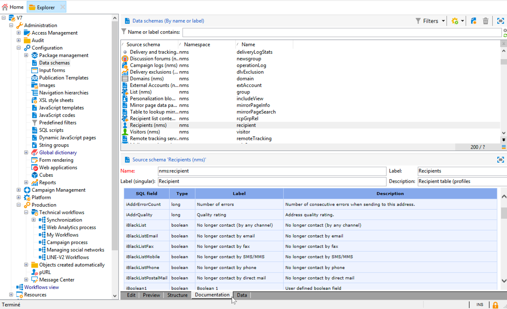

# 关于Campaign数据模型{#about-data-model}

本节介绍Adobe Campaign Classic数据模型的基础知识，以便更好地了解Campaign内置表及其交互。

Adobe Campaign数据库的概念数据模型由一组内置表及其交互组成。

要访问每个表的说明，请转到 **[!UICONTROL Admin > Configuration > Data schemas]**，从列表中选择一个资源，然后单击选 **[!UICONTROL Documentation]** 项卡。

有关默认营销活动经典数据模型描述的详细信息，请参阅此 [部分](../../configuration/using/data-model-description.md)。

XML描述了应用程序中所承载数据的物理和逻辑结构。 它遵循Adobe Campaign特有的语法（称为架构）。 有关Adobe Campaign架构的更多信息，请阅读此 [部分](../../configuration/using/about-schema-reference.md)。

## 概述 {#data-model-overview}

Adobe Campaign依赖于包含链接在一起的表的关系数据库。 Adobe Campaign数据模型的基本结构可以如下所述。

>[!NOTE]
>
>有关Campaign数据模型架构和相关最佳实践的详细信息，请参阅此 [部分](../../configuration/using/data-model-best-practices.md#data-model-architecture)。

### 收件人表 {#recipient-table}

数据模型依赖于主表，该主表默认为“收件人”表(**NmsRecipient**)。 此表可存储所有营销配置文件。

有关“收件人”表格的详细信息，请参阅此 [部分](#default-recipient-table)。

### 传送表 {#delivery-table}

数据模型还包括专用于存储所有营销活动的部件。 通常，它是“交付”表(**NmsDelivery**)。 此表中的每条记录都表示一个交付操作或一个交付模板。 它包含执行目标、内容等交付所需的所有参数。

### 日志表 {#log-tables}

数据模型的另一部分允许临时存储与执行营销活动相关的所有日志。

交付日志是所有渠道中发送给收件人或设备的所有消息。 主“交付日志”表(**NmsBroadLog**)包含所有收件人的交付日志。
主“跟踪日志”表(**NmsTrackingLog**)存储所有收件人的跟踪日志。 跟踪日志是指收件人的反应，如电子邮件打开次数和点击次数。 每个反应都对应一个跟踪日志。
交付日志和跟踪日志在特定时间段后被删除，该时间段在Adobe Campaign中指定，并可以修改。 因此，强烈建议定期导出日志。

### 技术表 {#technical-tables}

最后，部分数据模型包含用于应用程序过程的技术数据，包括操作员和用户权限(**NmsGroup**)、文件夹(**XtkFolder**)。

## 使用默认的“收件人”表 {#default-recipient-table}

Adobe Campaign中现成的“收件人”表为构建数据模型提供了良好的起点。 它有许多可轻松扩展的预定义字段和表链接。 当您主要针对收件人时，此功能特别有用，因为它适合一个以收件人为中心的简单数据模型。

使用标准收件人表的好处如下：

* 利用订阅、种子列表、调查、社交等功能开箱即用。
* 使用以收件人为中心的数据模型提供营销数据库。
* 更快的实施。
* 由支持和合作伙伴轻松维护。

但是，可以扩展“收件人”表，但不能减少表中字段或链接的数量。

>[!IMPORTANT]
>
>建议不要删除收件人表中的字段（即使这些字段没有用处），因为这可能会导致内置模块中的错误。

此外，由于“收件人”表是产品的一部分，因此表及其关联表单随着产品的更改而发展。 因此，需要额外的维护来检查升级后是否仍然有效。

## 扩展数据模型 {#extending-data-model}

从Adobe Campaign开始，您需要评估默认数据模型以检查哪个表最适合存储您的营销数据。

如果相关，您可以将默认的“收件人”表与现成字段一起使用，如本节中所述 。

如果需要，您可以使用两种机制扩展它：

* 使用新字段扩展现有表。 例如，您可以向“收件人”表添加新的“忠诚度”字段。
* 创建一个新表（例如，“购买”表），列出数据库每个配置文件所购买的所有数据，并将其链接到“收件人”表。

有关配置扩展架构以扩展概念数据模型的详细信息，请参 [阅关于架构版](../../configuration/using/about-schema-edition.md)。

>[!IMPORTANT]
>
>扩展数据模型是为高级用户保留的。

## 使用自定义收件人表 {#custom-recipient-table}

在设计Adobe Campaign数据模型时，您可以使用现成的“收件人” [表](#default-recipient-table)，或者决定创建非标准的“收件人”表来存储您的营销档案。

事实上，如果您的数据模型不符合以收件人为中心的结构，您可以在Adobe Campaign中将其他表设置为定位维度。 例如，当您需要锁定家庭、帐户（如手机）和公司／站点，而不是单纯的接收者时，这可能是相关的。

>[!NOTE]
>
>在这种情况下，您需要创建新的目 [标映射](../../configuration/using/target-mapping.md)。

本节详细介绍了使用自定义收件人表时所需的所有原则和步 [骤](../../configuration/using/about-custom-recipient-table.md)。

使用自定义收件人表的好处如下：

### 灵活的数据模型 {#flexible-data-model}

如果您不需要大多数“收件人”表字段，或者如果数据模型不是以收件人为中心，现成的“收件人”表将毫无用处。

### 可伸缩性 {#scalability}

大型卷需要简化的表格，并且字段很少，这样才能实现高效设计。 现成的“收件人”表将包含太多无用的字段，这可能会影响性能并且缺乏效率。

### 数据位置 {#data-location}

如果数据驻留在外部现有营销数据库上，则使用开箱即用的“收件人”表可能需要太多的工作。 基于现有结构创建新结构更简单。

### 轻松迁移 {#easy-migration}

无需维护即可检查所有扩展在升级后是否仍然有效。

>[!IMPORTANT]
>
>使用自定义收件人表是为高级用户保留的，并受某些限制。 有关此方面的详细信息，请参阅此部分。
