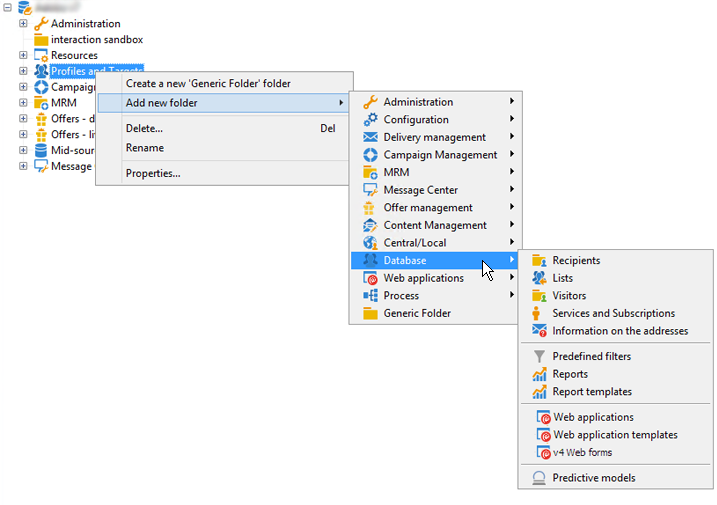

# 关于导航层次结构{#about-navigation-hierarchy}

导航层次结构的工作方式类似于文件浏览器（例如Windows资源管理器）。 文件夹可能包含子文件夹。 选择节点后，将显示与该节点对应的视图。

显示的视图是与模式和用于编辑所选行的输入表单相关联的列表。

要向树中添加新文件夹，请右键单击要插入文件夹的分支中的文件夹，然后选择&#x200B;**[!UICONTROL Add new folder]**。 在快捷菜单中，选择要创建的文件类型。

