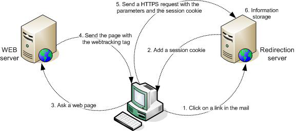

# 关于 Web 跟踪{#about-web-tracking}

除了可显示Internet用户点击电子邮件中链接的行为标准的跟踪之外，Adobe Campaign平台还允许您收集Internet用户浏览网站的方式信息。 此数据收集由Web跟踪模块执行。

当互联网用户单击来自给定投放的电子邮件中的跟踪链接时，所联系的重定向服务器会存储包含broadlog标识符(broadlogId)和投放标识符(deliveryId)的会话Cookie。

然后，Web客户端在用户每次访问包含Web跟踪标记的页面时向服务器发送此Cookie。 此过程将在整个会话期间持续进行，即直到Web客户端关闭。

重定向服务器通过这种方式收集以下数据：

* 已查看页面的URL，通过作为参数发送的标识符，
* 通过会话Cookie访问网页的投放，
* 通过会话Cookie单击的Internet用户的标识符
* 其他信息，如产生的业务量。

下图显示了客户端和各种服务器之间的对话阶段。

