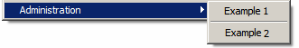

# 配置Campaign资源管理器导航树{#configuration}

作为专家级用户，您可以在资源管理器树中添加文件夹并对其进行自定义。

了解有关Campaign浏览器和导航层次结构的更多信息 [在此部分中](../../platform/using/adobe-campaign-explorer.md#about-navigation-hierarchy).

导航列表使用的文件夹类型在遵循语法的XML文档中进行了描述。 **xtk：navtree** 架构。

XML文档的结构如下所示：

```
<navtree name="name" namespace="name_space">
  <!-- Global commands -->
  <commands>
      ...
  </commands>
  
  <!-- Structured space for adding a folder -->
  <model name="<name>" label="<Label>">
    <!-- Folder type -->
    <nodeModel>
      ...
    </nodeModel>
<model name="<name>" label="<Sub model>">
      ...
    </model>
  </model> 
</navtree>
```

XML文档包含 **`<navtree>`** 根元素具有 **name** 和 **命名空间** 属性来指定文档名称和命名空间。 名称和命名空间构成了文档标识键。

应用程序的全局命令在文档中声明自 **`<commands>`** 元素。

文件类型声明在文档中进行结构化，包含以下元素： **`<model>`** 和 **`<nodemodel>`**.

## 全局命令 {#global-commands}

使用全局命令可启动操作。 此操作可以是输入表单或SOAP调用。

全局命令可从主控制台访问 **[!UICONTROL Tools]** 菜单。

命令配置结构如下：

```
<commands>
  <!-- Description of a command -->
  <command name="<name>" label="<label>" desc="<Description>" form="<form>" rights="<rights>">
    <soapCall name="<name>" service="<schema>">
      <param type="<type>" exprIn="<xpath>"/>  
        ...
    </soapCall>
    <enter>
      ...
    </enter>
  </command>
  <!-- Separator -->
  <command label="-" name="<name>"/>
  <!-- Command structure -->
  <command name="<name>" label="<Label>">
    <command...
  </command>
</commands>
```

全局命令的说明输入于 **`<command>`** 元素具有以下属性：

* **name**：命令的内部名称：名称必须输入且唯一
* **标签**：命令的标签。
* **desc**：从主屏幕的状态栏中显示的描述。
* **表单**：要启动的表单：要输入的值是输入表单的标识键（例如“cus：recipient”）
* **权限**：允许访问此命令的已命名权限列表（以逗号分隔）。 可用权限列表可从 **[!UICONTROL Administration > Access management > Named rights]** 文件夹。
* **提示标签**：在执行命令之前显示确认框。

A **`<command>`** 元素可以包含 **`<command>`** 子元素。 在这种情况下，父元素允许您显示由这些子元素组成的子菜单。

这些命令的显示顺序与它们在XML文档中声明的顺序相同。

使用命令分隔符可以在命令之间显示分隔条。 它由 **&#39;-&#39;** 命令标签中包含的值。

可选存在 **`<soapcall>`** 标记及其输入参数定义要执行的SOAP方法的调用。 有关SOAP API的更多信息，请参阅 [Campaign JSAPI文档](https://experienceleague.adobe.com/developer/campaign-api/api/index.html?lang=zh-Hans).

在初始化时，表单上下文可以从 **`<enter>`** 标记之前。 有关此标记的详细信息，请参阅有关输入表单的文档。

**示例**:

* 用于启动“xtk：import”表单的全局命令的声明：

   ```
   <command desc="Start the data import wizard" form="xtk:import" label="&amp;Data import..." name="import" rights="import,recipientImport"/>
   ```

   在“I”字符上声明键盘快捷键 **和** 在命令标签中。

* 带分隔符的子菜单示例：

   

   ```
   <command label="Administration" name="admin">
     <command name="cmd1" label="Example 1" form="cus:example1"/>
     <command name="sep" label="-"/>
     <command name="cmd1" label="Example 2" form="cus:example2">
       <enter>
         <set xpath="@type" expr="1"/>
       </enter>
     </command>
   </command>
   ```

* 执行SOAP方法：

   ```
   <command name="cmd3" label="Example 3" promptLabel="Do you really want to execute the command?">
     <soapCall name="Execute" service="xtk:sql"/>
   </command>
   ```

## 文件夹类型 {#folder-type}

通过文件夹类型，可授予对架构数据的访问权限。 与文件夹关联的视图由列表和输入表单组成。

文件夹类型配置结构如下：

```
<!-- Structured location to add the folder -->
<model name="name" label="Labelled">
  <!-- Type of folder -->
  <nodeModel name="<name>" label="<Labelled>" img="<image>">
    <view name="<name>" schema="<schema>" type="<listdet|list|form|editForm>">
      <columns>
        <node xpath="<field1>"/>
        ...
    </columns>
    </view> 
  </nodeModel>
  <model name="<name>" label="<Sous modèle>">
    ...
  </model>
</model>
```

文件夹类型声明必须输入在 **`<model>`** 元素。 利用此元素，可定义可从以下位置查看的层次结构组织： **[!UICONTROL Add new folder]** 菜单。 A **`<model>`** 元素必须包含 **`<nodemodel>`** 元素及其他 **`<model>`** 元素。

此 **name** 和 **标签** 属性会填充元素的内部名称以及 **[!UICONTROL Add new folder]** 菜单。

此 **`<nodemodel>`** 元素包含文件夹类型的描述，具有以下属性：

* **name**：内部名称
* **标签**：中使用的标签 **[!UICONTROL Add new folder]** 菜单和作为默认标签。
* **img**：文件夹插入时的默认图像。
* **hiddenCommand**：要遮罩的命令列表（以逗号分隔）。 可能的值： “adbnew”、“adbsave”、“adbcancel”和“adbdup”。
* **newFolderShortCut**：模型上的快捷键列表(**`<nodemodel>`** （以逗号分隔）。
* **插入右侧**， **编辑右侧**， **deleteRight**：插入、编辑和删除文件夹的权利。

此 **`<view>`** 下的元素 **`<nodemodel>`** 元素包含与视图关联的列表的配置。 列表的架构输入于 **架构** 的属性 **`<view>`** 元素。

要编辑列表的记录，隐式使用与列表架构同名的输入表单。 此 **type** 上的属性 **`<view>`** 元素会影响表单的显示。 可能的值包括：

* **列表代**：在列表底部显示表单。
* **列表**：单独显示列表。 通过双击或通过选择列表时的菜单中的“打开”来启动表单。
* **表单**：显示只读表单。
* **editForm**：在编辑模式下显示表单。

>[!NOTE]
>
>输入输入表单的名称可通过输入 **表单** 中的属性 **`<view>`** 元素。

列表列的默认配置是通过 **`<columns>`** 元素。 列声明于 **`<node>`** 元素包含 **xpath** 属性，其模式中要引用的字段作为其值。

**示例**：在“nms：recipient”架构上声明文件夹类型。

```
<model label="Profiles and targets" name="nmsProfiles">
  <nodeModel deleteRight="folderDelete" editRight="folderEdit" folderLink="folder"
             img="nms:folder.png" insertRight="folderInsert" label="Recipients"
             name="nmsFolder">
    <view name="listdet" schema="nms:recipient" type="listdet">
      <columns>
        <node xpath="@firstName"/>
        <node xpath="@lastName"/>
        <node xpath="@email"/>
        <node xpath="@account"/>
      </columns>
    </view>
  </nodeModel>
  <nodeModel name="nmsGroup" label="Groups"...
</model>
```

相应的文件夹插入菜单：


加载列表时可以应用筛选和排序：

```
<view name="listdet" schema="nms:recipient" type="listdet">
  <columns>
    ...
  </columns>

  <orderBy>
    <node expr="@lastName" desc="true"/>
</orderBy>
  <sysFilter>
    <condition expr="@type = 1"/>
  </sysFilter>
</view>  
```

### 快捷键命令 {#shortcut-commands}

使用快捷方式命令可在选择列表时启动操作。 该操作可以是输入表单或SOAP调用。

命令可从 **[!UICONTROL Action]** 列表菜单或关联的菜单按钮。

命令配置结构如下：

```
<nodeModel...
  ...
  <command name="<name>" label="<label>" desc="<Description>" form="<form>" rights="<rights>">
    <soapCall name="<name>" service="<schema>">
      <param type="<type>" exprIn="<xpath>"/>  
        ...
    </soapCall>
    <enter>
      ...
    </enter>
  </command>
</nodeModel>
```

命令说明输入在 **`<command>`** 元素具有以下属性：

* **name**：命令的内部名称：名称必须输入且唯一。
* **标签**：命令的标签。
* **desc**：从主屏幕的状态栏中显示的描述。
* **表单**：要启动的表单：要输入的值是输入表单的标识键（例如“cus：recipient”）。
* **权限**：允许访问此命令的已命名权限列表（以逗号分隔）。 可用权限列表可从 **[!UICONTROL Administration > Access management > Named rights]** 文件夹。
* **提示标签**：在执行命令之前显示确认框
* **单选**：强制进行单选（默认情况下为多选）。
* **refreshview**：强制在执行命令后重新加载列表。
* **enabledIf**：根据输入的表达式激活命令。
* **img**：输入允许从列表工具栏访问命令的图像。

A **`<command>`** 元素可以包含 **`<command>`** 子元素。 在这种情况下，父元素允许您显示由这些子元素组成的子菜单。

这些命令的显示顺序与它们在XML文档中声明的顺序相同。

使用命令分隔符可以在命令之间显示分隔条。 它由 **&#39;-&#39;** 命令标签中包含的值。

可选存在 **`<soapcall>`** 标记及其输入参数定义要执行的SOAP方法的调用。 有关SOAP API的更多信息，请参阅 [Campaign JSAPI文档](https://experienceleague.adobe.com/developer/campaign-api/api/index.html?lang=zh-Hans).

初始化时，可以通过以下方式更新表单上下文 **`<enter>`** 标记之前。 有关此标记的详细信息，请参阅输入表单文档。

**示例**:

```
<command desc="Cancel execution of the job" enabledIf="EV(@status, 'running')"
         img="nms:difstop.bmp" label="Cancel..." name="cancelJob" 
         promptLabel="Do you really want to cancel this job?" refreshView="true">
  <soapCall name="Cancel" service="xtk:jobInterface"/>
</command>
<command label="-" name="sep1"/>
<command desc="Execute selected template" form="cus:form" lmonoSelection="true" name="executeModel"
         rights="import,export,aggregate">
  <enter>
    <set expr="0" xpath="@status"/>
  </enter>
</command>
```

### 链接的文件夹 {#linked-folder}

有两种类型的文件夹管理操作：

1. 文件夹是一个视图：列表显示与架构关联的所有记录，并且可以在文件夹属性中输入系统筛选。
1. 已链接文件夹：列表中的记录将在文件夹链接上隐式筛选。

对于链接的文件夹， **folderlink** 上的属性 **`<nodemodel>`** 必须填充元素。 此属性包含数据架构中配置的文件夹上链接的名称。

数据架构中链接文件夹的声明示例：

```
<element default="DefaultFolder('nmsFolder', [@_folder-id])" label="Folder" name="folder" revDesc="Recipients in the folder" revIntegrity="define" revLabel="Recipients" target="xtk:folder" type="link"/>
```

的配置 **`<nodemodel>`** 文件夹上名为“folder”的链接如下所示：

```
<nodeModel deleteRight="folderDelete" editRight="folderEdit" folderLink="folder"
  img="nms:folder.png" insertRight="folderInsert" label="Recipients" name="nmsFolder">
...
</nodeModel>
```
