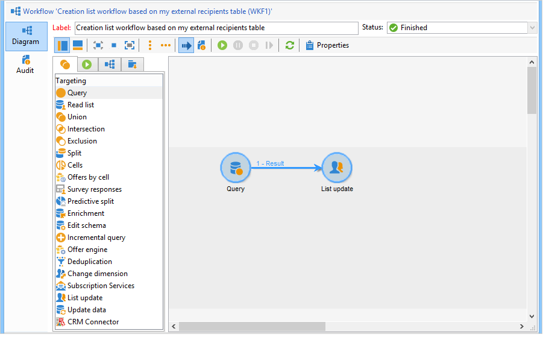

# 使用工作流创建用户档案列表{#creating-a-profile-list-with-a-workflow}

创建 **[!UICONTROL List]** 根据新的收件人表键入列表，您需要创建将生成列表的定位工作流。

有关Campaign中列表的更多信息，请参阅 [此部分](../../platform/using/creating-and-managing-lists.md#about-lists-in-adobe-campaign).

 [在视频中发现此功能](../../platform/using/creating-and-managing-lists.md#create-list-in-a-wf-video)

要在自定义收件人表中创建定位工作流并更新收件人，请执行以下步骤：

1. 转到 **[!UICONTROL Profiles and Targets > Jobs > Targeting workflows]** 资源管理器的节点。
1. 创建新的定位工作流。
1. 放置 **查询** 活动后跟 **列表更新** 活动。

   

1. 双击 **查询** 活动，然后单击 **[!UICONTROL Edit the query]** 要根据新收件人表的架构选择定向维度，请执行以下操作： **个人**)。 单击 **[!UICONTROL Finish]** 确认。

   

1. 双击 **列表更新** 活动，然后选择 **[!UICONTROL Create the list if necessary (Computed name)]** 按钮。

   

1. 为新列表选择创建文件夹。
1. 执行工作流以创建列表。
1. 在树的节点中查看结果，在 **[!UICONTROL List update]** 活动。

   功能板指定列表所基于的架构，如下所示：

   
