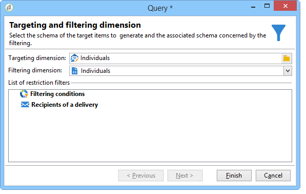

# 使用工作流创建轮廓列表{#creating-a-profile-list-with-a-workflow}

要基于新的收件人表创建&#x200B;**[!UICONTROL List]**&#x200B;类型列表，您需要创建将生成该列表的定向工作流。

有关Campaign中列表的详细信息，请参阅[此部分](../../platform/using/creating-and-managing-lists.md#about-lists-in-adobe-campaign)。

 [通过观看视频了解此功能](../../platform/using/creating-and-managing-lists.md#create-list-in-a-wf-video)

要在自定义收件人表中创建定位工作流并更新收件人，请执行以下步骤：

1. 转到资源管理器的&#x200B;**[!UICONTROL Profiles and Targets > Jobs > Targeting workflows]**&#x200B;节点。
1. 创建新的定位工作流。
1. 放置&#x200B;**查询**&#x200B;活动，然后放置&#x200B;**列表更新**&#x200B;活动。

   

1. 双击&#x200B;**查询**&#x200B;活动，然后单击&#x200B;**[!UICONTROL Edit the query]**&#x200B;以根据新收件人表的架构选择定向维度（在我们的示例中：**个人**）。 单击 **[!UICONTROL Finish]** 确认。

   

1. 双击&#x200B;**列表更新**&#x200B;活动，然后选择&#x200B;**[!UICONTROL Create the list if necessary (Computed name)]**&#x200B;单选按钮。

   

1. 为新列表选择创建文件夹。
1. 执行工作流以创建列表。
1. 在&#x200B;**[!UICONTROL List update]**&#x200B;活动期间选择的树节点中查看结果。

   仪表板指定列表所基于的架构，如下所示：

   
