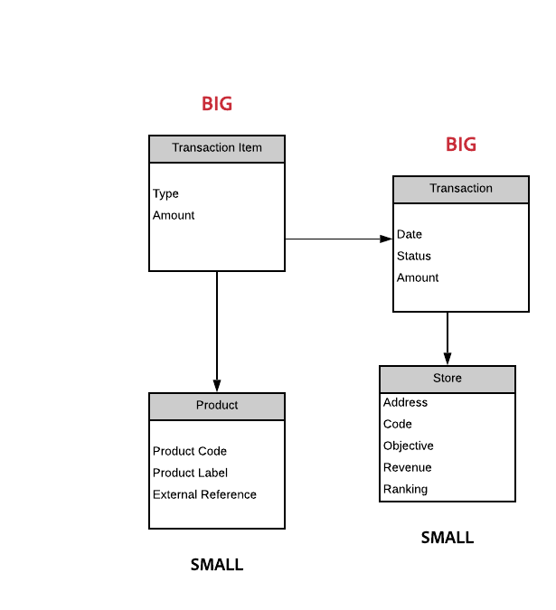

# 数据模型最佳实践{#data-model-best-practices}

本文档概述了设计Adobe Campaign数据模型时的主要建议。

要更好地了解Campaign内置表及其交互，请参阅[此部分](../../configuration/using/about-data-model.md)一节。

阅读[本文档](../../configuration/using/about-schema-reference.md)以开始使用Campaign模式。 了解如何配置扩展架构以在[本文档](../../configuration/using/about-schema-edition.md)中扩展Adobe Campaign数据库的概念数据模型。

## 概述 {#overview}

Adobe Campaign系统极其灵活，可以扩展到初始实施之外。 但是，尽管可能性是无限的，但做出明智决策并建立坚实的基础以开始设计数据模型至关重要。

本文档提供了常见用例和最佳实践，以了解如何正确构建Adobe Campaign工具。

## 数据模型架构 {#data-model-architecture}

Adobe Campaign是一款功能强大的跨渠道活动管理系统，可帮助您调整线上和线下策略以创建个性化的客户体验。

### 以客户为中心的方法 {#customer-centric-approach}

虽然大多数电子邮件服务提供商都在通过以列表为中心的方法与客户通信，但Adobe Campaign依赖关系数据库来利用客户及其属性的更广泛视图。

下图显示了这种以客户为中心的方法。 灰色的&#x200B;**Recipient**&#x200B;表表示正在构建所有内容的主要客户表：

要访问每个表的说明，请转到&#x200B;**[!UICONTROL Admin > Configuration > Data schemas]**，从列表中选择资源，然后单击&#x200B;**[!UICONTROL Documentation]**&#x200B;选项卡。

Adobe Campaign默认数据模型在[本文档](../../configuration/using/data-model-description.md)中介绍。

>[!NOTE]
>
>Adobe Campaign Classic允许构建自定义客户表。 但是，在大多数情况下，建议使用标准[收件人表](../../configuration/using/about-data-model.md#default-recipient-table)，该表已预先构建了其他表和功能。

### Adobe Campaign数据 {#data-for-campaign}

应将哪些数据发送到Adobe Campaign? 确定营销活动所需的数据至关重要。

>[!NOTE]
>
>Adobe Campaign既不是data warehouse，也不是报告工具。 因此，请不要尝试将所有可能的客户及其关联信息导入Adobe Campaign，或导入仅用于构建报表的数据。

要决定是否需要某个属性在Adobe Campaign，请问自己是否属于以下类别之一：

* 用于&#x200B;**segmentation**&#x200B;的属性
* 用于&#x200B;**数据管理进程**&#x200B;的属性（例如聚合计算）
* 用于&#x200B;**personalization**&#x200B;的属性

如果不属于这些属性中的任何一个，您很可能在Adobe Campaign中不需要此属性。

### 数据类型选择 {#data-types}

为确保系统的良好架构和性能，请按照以下最佳实践在Adobe Campaign中设置数据。

* 大表通常应具有数字字段，并包含指向引用表的链接（使用值列表时）。
* **expr**&#x200B;属性允许将架构属性定义为计算字段，而不是表中的物理集值。 这样，就可以以不同格式（例如，年龄和出生日期）访问信息，而无需同时存储这两个值。 这是避免复制字段的好方法。 例如，收件人表使用域的表达式，该表达式已在电子邮件字段中存在。
* 但是，当表达式计算比较复杂时，不建议使用&#x200B;**expr**&#x200B;属性作为即时计算，这可能会影响查询的性能。
* **XML**&#x200B;类型是避免创建过多字段的好方法。 但是，当它使用数据库中的CLOB列时，它也会占用磁盘空间。 它还可能导致复杂的SQL查询，并可能影响性能。
* **string**&#x200B;字段的长度应始终使用列进行定义。 默认情况下，Adobe Campaign中的最大长度为255，但是如果您已经知道字段的大小不会超过较短的长度，则Adobe建议将字段保持较短。
* 如果您确定源系统中的字段大小被高估，并且无法达到，则可以将Adobe Campaign中的字段短于源系统中的字段。 这可能表示Adobe Campaign中的字符串较短或整数较小。

### 字段选择 {#choice-of-fields}

如果字段具有定位或个性化目的，则需要将其存储在表中。 换言之，如果某个字段未用于发送个性化电子邮件或用作查询中的标准，则会占用磁盘空间，而它却毫无用处。

对于混合和内部部署实例，FDA（联合数据访问，一种允许访问外部数据的可选功能）涵盖在营销活动过程中需要“即时”添加字段。 如果您具有FDA，则无需导入所有内容。 有关更多信息，请参阅[关于联合数据访问](../../installation/using/about-fda.md)。

### 键选择 {#choice-of-keys}

除了在大多数表中默认定义的&#x200B;**autopk**&#x200B;之外，您还应考虑添加一些逻辑或业务密钥（帐号、客户端号等）。 它稍后可用于导入/协调或数据包。 有关更多信息，请参阅[Identifiers](#identifiers)。

高效的键对性能至关重要。 数值数据类型应始终作为表的键值的首选。

对于SQLServer数据库，如果需要性能，可以考虑使用“群集索引”。 由于Adobe不处理此问题，因此您需要在SQL中创建它。

### 专用表空间 {#dedicated-tablespaces}

方案中的表空间属性允许您为表指定专用表空间。

安装向导允许您按类型（数据、临时和索引）存储对象。

专用表空间更适合于分区、安全规则，并允许流畅、灵活的管理、更好的优化和性能。

## 标识符 {#identifiers}

Adobe Campaign资源具有三个标识符，并且可以添加其他标识符。

下表介绍了这些标识符及其用途。

| 标识符 | 说明 | 最佳实践 |
|--- |--- |--- |
| Id | <ul><li>ID是Adobe Campaign表的物理主键。 对于现成表，它是从序列中生成的32位数</li><li>此标识符通常对特定Adobe Campaign实例是唯一的。 </li><li>自动生成的ID可在架构定义中可见。 搜索&#x200B;*autopk=&quot;true&quot;*&#x200B;属性。</li></ul> | <ul><li>自动生成的标识符不应用作工作流或包定义中的引用。</li><li>不应假定ID将始终为递增数。</li><li>现成表中的id是32位数字，不应更改此类型。 此编号取自同名部分中涵盖的“序列”。</li></ul> |
| 名称（或内部名称） | <ul><li>此信息是表中记录的唯一标识符。 此值可手动更新，通常使用生成的名称。</li><li>此标识符在部署到其他Adobe Campaign实例时会保留其值，它不应为空。</li></ul> | <ul><li>如果要将Adobe Campaign生成的对象从环境部署到另一个环境，请重命名该记录名称。</li><li>当对象具有命名空间属性（例如&#x200B;*schema*）时，此通用命名空间将用于所有创建的自定义对象。 不应使用某些保留的命名空间：*nms*、*xtk*、*nl*、*ncl*、*crm*、*xxl*。</li><li>当对象没有任何命名空间（例如&#x200B;*workflow*&#x200B;或&#x200B;*delivery*）时，将添加此命名空间概念作为内部名称对象的前缀：*namespaceMyObjectName*。</li><li>请勿使用特殊字符，如空格“”、半列“：”或连字符“ — ”。 所有这些字符都将替换为下划线“_”（允许的字符）。 例如，“abc-def”和“abc:def”将存储为“abc_def”并相互覆盖。</li></ul> |
| 标签 | <ul><li>标签是Adobe Campaign中对象或记录的业务标识符。</li><li>此对象允许使用空格和特殊字符。</li><li>它不保证记录的唯一性。</li></ul> | <ul><li>建议确定对象标签的结构。</li><li>这是用于为Adobe Campaign用户标识记录或对象的最易用的解决方案。</li></ul> |

## 自定义内部键 {#custom-internal-keys}

在Adobe Campaign中创建的每个表都需要使用主键。

大多数组织正在从外部系统导入记录。 虽然Recipient表的物理键是“id”属性，但也可以确定自定义键。

此自定义键值是外部系统馈送Adobe Campaign时的实际记录主键。

当现成表同时具有自动键和内部键时，内部键将设置为物理数据库表中的唯一索引。

创建自定义表时，有两个选项：
* 自动生成键(id)和内部键（自定义）的组合。 如果您的系统键是复合键或不是整数，则此选项很有趣。 整数在大表中提供更高的性能，并与其他表连接。
* 使用主键作为外部系统主键。 此解决方案通常比较首选，因为它通过不同系统之间一致的键简化了数据导入和导出的方法。 如果键名为“id”，并且应使用外部值填充（而非自动生成），则应禁用Autopk。

>[!IMPORTANT]
>
>在工作流中，不应将创作用作引用。

## 序列 {#sequences}

Adobe Campaign主键是所有现成表的自动生成id，对于自定义表，它可以是相同的。 有关更多信息，请参阅[此章节](#identifiers)。

此值取自称为&#x200B;**sequence**&#x200B;的对象，该对象是用于生成数字序列的数据库对象。

序列有两种类型：
* **共享**:多个表会从同一序列中选取其ID。这意味着如果一个表使用了ID“X”，则共享同一序列的其他表将没有具有该ID“X”的记录。 **** XtkNewId是Adobe Campaign中提供的默认共享序列。
* **专用**:只有一个表从序列中提取其id。序列名称通常包含表名称。

>[!IMPORTANT]
>
>该序列是一个32位的整数值，其可用值的最大数量有限：21.4亿。 达到最大值后，序列将返回0，以便回收ID。
>
>如果未清除旧数据，则结果将是唯一键违规，这将成为平台运行状况和使用的阻止程序。 Adobe Campaign将无法发出通信（当它影响到投放日志表时），并且性能将受到严重影响。

因此，如果客户每年发送60亿封电子邮件，其日志的保留期为180天，则该客户的ID将在4个月内耗尽。 要防止出现此类问题，请确保根据卷设置清除设置。 有关更多信息，请参阅[此章节](#data-retention)。

当在Adobe Campaign中使用主键as a autoPK创建自定义表时，应将自定义专用序列与该表系统地关联。

默认情况下，自定义序列的值介于+1,000到+2.1BB之间。 从技术上讲，通过启用负ID，可以获得4BB的完整范围。 这应当谨慎使用，在从负数跨越到正数时，将丢失一个ID:在生成的SQL查询中，记录0通常被Adobe Campaign忽略。

**相关主题：**
* 有关&#x200B;**序列自动生成**&#x200B;功能的更多信息，请参阅[此文档](https://helpx.adobe.com/cn/campaign/kb/sequence_auto_generation.html)。
* 有关序列耗尽的更多信息，请观看[此视频](https://helpx.adobe.com/customer-care-office-hours/campaign/sequences-exhaustion-campaign-classic.html)。

## 索引 {#indexes}

索引对性能至关重要。 在架构中声明键后，Adobe将自动在键的字段上创建索引。 您还可以为不使用键的查询声明更多索引。

Adobe建议定义其他索引，因为这可能会提高性能。

但是，请记住以下事项：

* 索引使用情况已绑定到您的访问模式。 优化索引通常是数据库设计中的关键部分，必须由专家处理。 添加索引通常是附加到数据库维护的迭代工作流。 它会随着时间的推移逐步完成，以解决发生时的性能问题。
* 索引会增加表的整体大小（以存储索引本身）。
* 在列上添加索引可以提高数据读取访问(SELECT)的性能，但会降低数据写入访问(UPDATE)的性能。
* 由于这会影响数据插入期间的性能，因此索引的大小和数量应受到限制。
* 如果不需要，请勿添加索引。 确保它是必需的，并且可以提高查询的整体性能（测试和学习）。
* 通常，如果您知道自己的查询不会返回超过10%的记录，则索引是有效的。
* 请仔细选择需要定义的索引。
* 请勿从现成表中删除本机索引。

<!--When you are performing an initial import with very high volumes of data insert in Adobe Campaign database, it is recommended to run that import without custom indexes at first. It will allow to accelerate the insertion process. Once you’ve completed this important import, it is possible to enable the index(es).-->

### 示例

管理索引可能会变得非常复杂，因此了解索引的工作方式非常重要。 为了说明这种复杂性，我们举一个基本示例，例如，通过对名字和姓氏进行筛选来搜索收件人。 操作步骤：
1. 转到列出数据库中所有收件人的文件夹。 有关更多信息，请参阅[管理用户档案](../../platform/using/managing-profiles.md)。
1. 右键单击&#x200B;**[!UICONTROL First name]**&#x200B;字段。
1. 选择 **[!UICONTROL Filter on this field]**。

   

1. 对&#x200B;**[!UICONTROL Last name]**&#x200B;字段重复此操作。

屏幕顶部会添加两个相应的过滤器。

现在，您可以根据各种筛选条件对&#x200B;**[!UICONTROL First name]**&#x200B;和&#x200B;**[!UICONTROL Last name]**&#x200B;字段执行搜索筛选。

现在，要加快对这些过滤器的搜索速度，您可以添加索引。 但应该使用哪些索引？

>[!NOTE]
>
>此示例适用于使用PostgreSQL数据库的托管客户。

下表显示了在哪些情况下，根据第一列中显示的访问模式是否使用下面描述的三个索引。

| 搜索条件 | 索引1（名字+姓氏） | 索引2（仅名字） | 索引3（仅姓氏） | 评论 |
|--- |--- |--- |--- |--- |
| 名字等于“强尼” | 已使用 | 已使用 | 未使用 | 由于名字在索引1中位于首位，因此仍将使用它：无需为姓氏添加标准。 |
| 名字等于“Johnny”，姓氏等于“Smith” | 已使用 | 未使用 | 未使用 | 由于两个属性在同一查询中搜索，因此将只使用组合这两个属性的索引。 |
| 姓氏等于“Smith” | 未使用 | 未使用 | 已使用 | 索引中属性的顺序会被考虑在内。 如果不匹配此顺序，则可能不会使用索引。 |
| 名字以“Joh”开头 | 已使用 | 已使用 | 未使用 | “左搜索”将启用索引。 |
| 名字以“nny”结尾 | 未使用 | 未使用 | 未使用 | “正确搜索”将禁用索引，并执行完整扫描。 某些特定的索引类型可以处理此用例，但在Adobe Campaign中默认不提供这些索引类型。 |
| 名字包含“John” | 未使用 | 未使用 | 未使用 | 这是“left”和“right”搜索的组合。 由于后者，它将禁用索引，并执行完全扫描。 |
| 名字等于“john” | 未使用 | 未使用 | 未使用 | 索引区分大小写。 要使其不区分大小写，应创建一个特定索引，该索引包含诸如“upper(firstname)”之类的SQL函数。 您应该对其他数据转换执行相同的操作，如“unaccent(firstname)”。 |

## 链接和基数 {#links-and-cardinality}

### 链接 {#links}

请注意大型表格上的“自己”完整性。 如果删除具有“自有”完整性的宽表的记录，则可以停止实例。 表已锁定，删除内容逐个删除。 因此，最好在具有大量子的子表格上使用“中性”完整性。

将链接声明为外部连接不利于性能。 零ID记录模拟外部连接功能。 如果链接使用自动连接，则无需声明外部连接。

虽然可以连接工作流中的任何表，但Adobe建议直接在数据结构定义中定义资源之间的通用链接。

链接的定义应与表中的实际数据保持一致。 错误的定义可能会影响通过链接检索到的数据，例如意外复制记录。

使用表名称始终如一地命名链接：链接名称应有助于了解远程表格的内容。

请勿将链接命名为后缀为“id”。 例如，将其命名为“transaction”，而不是“transactionId”。

默认情况下，Adobe Campaign将使用外部表的主键创建链接。 为了更清楚地了解，最好在链接定义中显式定义连接。

索引将添加到链接中使用的属性中。

的   “创建者”和“上次修改者”链接在许多表中都存在。 如果企业未使用此信息，则可以在链接上使用属性noDbIndex来禁用索引。

### 基数 {#cardinality}

在设计链接时，请确保在声明1-1关系后目标记录是唯一的。 否则，当只需要一条记录时，连接可能会返回多条记录。 当“查询返回的行数多于预期值”时，这会在投放准备期间导致错误。 将链接名称设置为与目标架构相同的名称。

在(1)侧的架构中定义具有基数(1-N)的链接。 例如，应在事务架构中定义“收件人(1)-(N)事务”关系。

请注意，链接的反向基数默认为(N)。 可以通过向链接定义添加revCardinality=&#39;single&#39;属性来定义链接(1-1)。

如果用户看不到反向链接，则可以使用链接定义revLink=&#39;_NONE_&#39;来隐藏该链接。 这的一个好用例是，例如，定义从收件人到完成的最后一个交易的链接。 您只需查看从收件人到最后一个交易的链接，而无需从交易表中查看反向链接。

执行外部连接(1-0.1)的链接应当谨慎使用，因为它将影响系统性能。

## 数据保留 — 清理和清除 {#data-retention}

Adobe Campaign既不是data warehouse，也不是报告工具。 因此，为确保Adobe Campaign解决方案的良好性能，数据库增长应保持可控。 要实现此目的，请遵循以下一些最佳实践，这可能会有所帮助。

默认情况下，Adobe Campaign投放和跟踪日志的保留期为180天。 清除过程会运行以删除之前的任何日志。

* 如果要延长日志保留时间，应根据数据库大小和发送的消息量仔细做出此决定。 请注意，Adobe Campaign序列是一个32位整数。
* 建议在这些表中一次不要有超过10亿条记录（在21.4亿个可用ID中约占50%），以限制使用所有可用ID的风险。 这要求某些客户将保留期限缩短到180天以下。

在[Campaign隐私和安全准则](../../platform/using/privacy-and-recommendations.md)中了解有关数据保留的更多信息。

在此部分](../../production/using/database-cleanup-workflow.md)中了解有关Campaign数据库清理工作流[的更多信息。

>[!IMPORTANT]
>
>自定义表不会使用标准清理过程清除。 虽然在第1天可能不需要执行此操作，但请不要忘记为自定义表构建清除流程，因为这可能会导致性能挑战。

在Adobe Campaign中，有几种解决方案可最大程度地减少对记录的需求：
* 在Adobe Campaign以外的data warehouse中导出数据。
* 生成聚合值，在满足您的营销实践需求的同时，使用较少的空间。 例如，您不需要Adobe Campaign中具有完整的客户交易历史记录即可跟踪上次购买。

您可以在架构中声明“deleteStatus”属性。 将记录标记为已删除，然后在清理任务中推迟删除更为有效。

## 性能 {#performance}

为确保在任何时间都获得更好的性能，请遵循以下最佳实践。

### 一般建议 {#general-recommendations}

* 避免在查询中使用“包含”等操作。 如果您知道预期内容并希望过滤对象，请使用“等于”或其他特定过滤器运算符应用相同的条件。
* 在工作流中构建数据时，请避免使用未索引的字段进行连接。
* 尝试确保在工作时间完成导入和导出等过程。
* 确保有所有日常活动的时间表，并遵守时间表。
* 如果一个或几个日常进程失败，并且如果必须在同一天运行它，请确保在启动手动进程时没有运行冲突的进程，因为这可能影响系统性能。
* 确保在导入过程或执行任何手动过程期间均未运行任何每日营销活动。
* 使用一个或多个引用表，而不是在每个行中复制字段。 使用键/值对时，最好选择数字键。
* 短字符串仍可接受。 如果外部系统中已有引用表，则重用该表将有助于与Adobe Campaign进行数据集成。

### 一对多关系 {#one-to-many-relationships}

* 数据设计会影响可用性和功能。 如果您设计的数据模型具有许多一对多关系，则用户在应用程序中构建有意义的逻辑会比较困难。 对于非技术营销人员而言，一对多过滤逻辑可能很难正确构建和理解。
* 将所有基本字段都放在一个表中是件好事，因为这样用户就可以更轻松地构建查询。 有时，如果在表中复制某些字段以避免连接，则在性能上也会很好。
* 某些内置功能将无法引用一对多关系，例如选件加权公式和投放。

## 大表 {#large-tables}

Adobe Campaign依赖第三方数据库引擎。 根据提供商的不同，为较大的表优化性能可能需要特定的设计。

以下是在使用大型表和复杂连接设计数据模型时应遵循的一些常见最佳实践。

* 使用其他自定义收件人表时，请确保每个投放映射都有一个专用的日志表。
* 减少列数，特别是通过标识未使用的列数。
* 通过避免复杂的连接（如多个条件和/或多个列上的连接）来优化数据模型关系。
* 对于连接键，请始终使用数字数据而不是字符串。
* 尽量减少日志保留的深度。 如果需要更深的历史记录，您可以聚合计算和/或处理自定义日志表以存储更大的历史记录。

### 表的大小 {#size-of-tables}

表大小是记录数和每个记录列数的组合。 这两种方法都会影响查询的性能。

* **small-size**&#x200B;表与Delivery表类似。
* **中等大小**&#x200B;表与收件人表的大小相同。 每个客户有一个记录。
* **large-size**表与Broad日志表类似。 每个客户有许多记录。
例如，如果您的数据库包含1000万个收件人，则“广泛”日志表包含大约1亿到2亿条消息，而“投放”表包含几千条记录。

在PostgreSQL上，行不应超过8KB，以避免[TOAST](https://wiki.postgresql.org/wiki/TOAST)机制。 因此，请尽量减少列数和每行的大小，以保持系统（内存和CPU）的最佳性能。

行数也会影响性能。 Adobe Campaign数据库并非用于存储未主动用于定位或个性化目的的历史数据 — 这是一个操作数据库。

要防止与行数高相关的任何性能问题，请仅在数据库中保留必要的记录。 任何其他记录都应导出到第三方data warehouse，并从Adobe Campaign操作数据库中删除。

以下是有关表大小的一些最佳实践：

* 设计字段较少且数字数据较多的大型表。
* 请勿使用大量类型的列(例如：Int64)来存储小数字，如布尔值。
* 从表定义中删除未使用的列。
* 请勿在Adobe Campaign数据库中保留历史数据或不活动数据（导出和清理）。

示例如下：

在此示例中：
* *事务*&#x200B;和&#x200B;*事务项*&#x200B;表较大：超过一千万。
* *Product*&#x200B;和&#x200B;*Store*&#x200B;表较小：不到一万。
* 产品标签和引用已放在&#x200B;*Product*&#x200B;表中。
* *事务项*&#x200B;表仅具有指向&#x200B;*产品*&#x200B;表的链接，该表是数字表。

<!--For more detailed best practices on how to optimize the database design for larger volumes, see [Campaign Classic Data model Best practices](https://helpx.adobe.com/campaign/kb/acc-data-model-best-practices.html).-->
