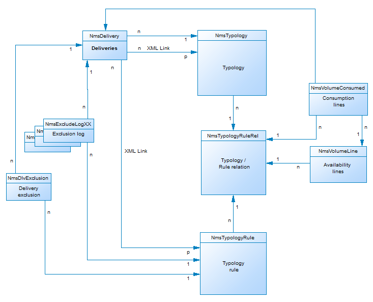

# Campaign数据模型描述{#data-model-description}

Adobe Campaign 提供了预定义的数据模型。本节详细介绍Adobe Campaign数据模型的内置表及其交互。

要访问每个表的说明，请转到 **[!UICONTROL Admin > Configuration > Data schemas]**，从列表中选择资源，然后单击 **[!UICONTROL Documentation]** 选项卡。

>[!NOTE]
>
>应用中所承载数据的物理和逻辑结构以 XML 格式进行描述。它遵循 Adobe Campaign 特有的语法，称为模式。有关Adobe Campaign模式的更多信息，请参阅 [此部分](../../configuration/using/about-schema-reference.md).

## 主表的描述 {#description-main-tables}

Adobe Campaign依赖于包含已链接在一起的表的关系数据库。

下图显示了Adobe Campaign数据模型的主要业务表与每个主字段之间的联接。

<!---->

预定义的Adobe Campaign数据模型包括下面列出的主表。

### NmsRecipient {#NmsRecipient}

此表与 **nms:recipient** 架构。

它是 **投放收件人**. 因此，它包含通过各种渠道投放所需的信息：

* 电子邮件：电子邮件地址。
* iEmailFormat:电子邮件的首选格式(1表示文本，2表示HTML,0（如果未定义）。
* sAddress1、sAddress2、sAddress3、sAddress4、sZipCode、sCity用于构建邮政地址（与1997年5月的XPZ 10-011 AFNOR标准相一致）。
* sPhone、sMobilePhone、sFax分别包含手机、手机和传真号码。
* iBlackList是用于用户档案的默认选择退出标记（1表示“已退订”，0表示其他情况）。

iFolderId字段是将收件人链接到其执行文件夹的外键。 有关此内容的更多信息，请参阅 [XtkFolder](#XtkFolder).

sCountryCode字段是与收件人关联的国家/地区的3166-1 Alpha 2 ISO代码（2个字符）。 此字段实际上是国家/地区参考表(NmsCountry)上的外键，其中包含国家/地区标签和其他国家/地区代码数据。 如果未填充国家/地区，则会存储值“XX”（并用来代替零ID记录）。

有关Recipient表的更多信息，请参阅 [此部分](../../configuration/using/about-data-model.md#default-recipient-table).

### NmsGroup {#NmsGroup}

此表与 **nms:group** 架构。

它使您能够创建 **统计收件人组**. 收件人和组之间存在多对多关系。 例如，一个收件人可以属于多个组，而一个组可以包含多个收件人。 可以通过导入或投放定位手动创建群组。 组通常用作投放目标。 字段上有一个唯一索引，表示sName组的内部名称。 该组已链接到文件夹（键值为iFolderId）。 有关此内容的更多信息，请参阅 [XtkFolder](#XtkFolder))。

### NmsRcpGrpRel {#NmsRcpGrpRel}

NmsRcpGrpRel关系表仅包含与iRecipientId和iGroupId链接表的标识符对应的两个字段。

### NmsService {#NmsService}

此表与 **nms:service** 架构。

在Adobe Campaign中，您可以创建和管理信息服务订阅（主题）。 NmsService表存储您为收件人提供的订阅信息服务（主题）的定义（例如新闻稿）。

服务是与组（静态收件人分组）类似的实体，不同之处在于它们可循环更多信息，并通过表单轻松管理订阅和退订。

字段上有一个唯一索引，表示sName服务的内部名称。 该服务已链接到文件夹（键为iFolderId）。 有关此内容的更多信息，请参阅 [XtkFolder](#XtkFolder))。 最后， iType字段指定此服务的投放渠道（0表示电子邮件，1表示短信，2表示电话，3表示直邮，4表示传真）。

### NmsSubscription {#NmsSubscription}

此表与 **nms:subscription** 架构。

它使您能够管理信息服务的收件人订阅。

### NmsSubHisto {#NmsSubHisto}

此表与 **nms:subHisto** 架构。

如果使用Web窗体或应用程序的界面管理订阅，则所有订阅和退订都将在NmsSubHisto表中历史化。 iAction字段指定对存储在tsDate字段中的日期执行的操作（退订为0，订阅为1）。

### NmsDelivery {#NmsDelivery}

此表与 **nms:delivery** 架构。

此表中的每个记录表示 **投放操作** 或 **投放模板**. 它包含执行投放所需的所有参数（目标、内容等）。 投放（广播）日志(NmsBroadLog)和关联的跟踪URL(NmsTrackingUrl)是在分析阶段创建的（有关这两个表的更多详细信息，请参阅下文）。

字段上有一个唯一索引，用于表示sInternalName投放或方案的内部名称。 投放已链接到执行文件夹（外键为iFolderProcessId）。 有关此内容的更多信息，请参阅 [XtkFolder](#XtkFolder))。

### XtkFolder {#XtkFolder}

它包含 **树中的所有文件夹** 可见 **导航** 选项卡。

键入文件夹：sModel字段的值指定可包含在文件夹中的数据类型。 此字段还使客户端控制台能够使用相应的表单正确显示数据。 此字段的可能值在navTree中定义。

树由iParentId和iChildCount字段管理。 sFullName字段提供树中文件夹的完整路径。 最后，字段上有一个唯一索引，表示sName文件夹的内部名称。

## 投放和跟踪 {#delivery-and-tracking}

这组表链接到 **投放** 模块，用于监控投放以及发送消息时遇到的最终问题。 有关此内容的更多信息，请参阅 [监控投放](../../delivery/using/about-delivery-monitoring.md). 有关跟踪的更多信息，请参阅 [跟踪消息](../../delivery/using/about-message-tracking.md).

**NmsBroadLogMsg**:此表与 **nms:broadLogMsg** 架构。 它是投放日志表的扩展。

## 营销活动管理 {#campaign-management}

这组表链接到 **营销活动** 模块，用于定义、优化、执行和分析通信和营销活动。 有关此内容的更多信息，请参阅 [关于营销活动](../../campaign/using/designing-marketing-campaigns.md).

* **NmsOperation**:此表与 **nms：操作** 架构。 它包含营销活动的数据。
* **NmsDeliveryOutline**:此表与 **nms:deliveryOutline** 架构。 它包含投放的扩展属性（投放大纲）。
* **NmsDlvOutlineItem**:此表与 **nms:dlvOutlineItem** 架构。 其中包含投放大纲的文章。
* **NmsDeliveryCustomization**:此表与 **nms:deliveryCustomization** 架构。 它包含投放的个性化字段。
* **NmsBudget**:此表与 **nms:budget** 架构。 它包含营销策划、计划、项目、任务和/或投放的预算数据。
* **NmsDocument**:此表与 **nms:document** 架构。 它以文件（图像、excel或word文件等）的形式包含营销活动的营销文档
* **XtkWorkflow**:此表与 **xtk:workflow** 架构。 它包含营销活动定位。
* **NmsTask**:此表与 **nms:task** 架构。 它包含营销任务的定义。
* **NmsAsset**:此表与 **nms:asset** 架构。 它包含营销资源的定义。

## 通信一致性 {#communication-consistency}

这组表链接到 **促销活动优化** 模块，用于控制、过滤和监视投放的发送。 有关此内容的更多信息，请参阅 [关于活动类型](../../campaign-opt/using/about-campaign-typologies.md).

* **NmsTypologyRule**:此表与 **nms:typologyRule** 架构。 其中包含根据分类应用于投放的规则。
* **Nms类型**:此表与 **nms：类型** 架构。 它包含要应用于与分类匹配的投放的规则集。
* **NmsTypologyRuleRel**:此表与 **nms:typologyRuleRel** 架构。 它包含分类与其规则之间的关系。
* **NmsVolumeLine**:此表与 **nms:volumeLine** 架构。 它包含容量规则的可用性行集。
* **NmsVolumeConsed**:此表与 **nms:volumeConsed** 架构。 它包含能力规则的所有冲减行。

## 响应管理 {#response-management}

这组表链接到 **响应管理器** 模块，用于衡量营销活动的成功和盈利能力，或为所有通信渠道提供建议。 有关此内容的更多信息，请参阅 [关于响应管理器](../../response/using/about-response-manager.md).

### NmsRema假设 {#NmsRemaHypothesis}

此表与 **nms:remaHexiship** 架构。 它包含测量假设的定义。

此表包含以XML存储的重要信息，包括：

**执行上下文（存储在XML中的信息）**

执行上下文填充要考虑测量计算的表和字段，即：
* nms:remaMatchRcp反应日志存储模式。
* 事务表架构（例如购买）。
* 查询架构，用于定义假设条件的起始表。
* 指向个人的链接，使您能够根据查询架构识别个人。
* 交易日期。 此字段不是强制字段，但我们建议您使用它来限制计算周长。
* 交易金额：它是一个可选字段，用于自动计算收入指标。

**假设周长（存储在XML中的信息）**

假设周界是基于查询模式表对假设进行过滤的。

**假设验证过载脚本（存储在XML中的信息）**

假设验证过载脚本是一个JavaScript代码，可让您在执行期间过载假设验证的内容。

**测量指标**

在假设验证执行期间，会自动更新以下指标：

* 反应数： **iTransaction**. 反应日志表中的行数。
* 联系人数： **iContactRenacted**. 假设中目标联系人的不同数量。
* 控制组计数： **iProofRemanted**. 假设中目标控制组联系人的不同数量。
* 联系的响应率： **dContactRenatedRate**. 假设中目标联系的响应率。
* 控制组的响应率： **dProofRenatedRate**. 假设控制组的响应率。
* 联系的总人口收入： **dContactRenactedTotalAmount**. 假设中目标联系人的总收入。
* 控制组的平均收入： **dContactRenactedAvgAmount**. 假设中目标控制组联系人的平均收入。
* 控制组的总收入： **dProofRenactedTotalAmount**. 假设控制组的总收入。
* 控制组的平均收入： **dProofRenactedAvgAmount**. 假设控制组的平均收入。
* 每个联系人的毛利总额： **dContactRenactedTotalMargin**. 假设中定位的每个联系人的总利润。
* 每个联系人的平均利润： **dContactRenactedAvgMargin**. 假设中定位的每个联系人的平均毛利。
* 控制组的毛利总额： **dProofRenactedTotalMargin**. 在假设中定位的控制组的总利润。
* 控制组的平均利润： **dProofRenactedAvgMargin**. 在假设中定位的控制组的平均边距。
* 额外收入： **dAdditionalAmount**. （联系人的平均收入 — 控制组的平均收入）*联系人数。
* 附加边距： **dAdditionalMargin**. （联系的平均利润率 — 控制组的平均利润率）/联系的次数。
* 每个联系人的平均成本（SQL表达式）。 交付的计算成本/联系的次数。
* ROI（SQL表达式）。 交货的计算成本/联系的总利润。
* 有效ROI（SQL表达式）。 交货的计算成本/附加利润。
* 显着性： **iAmprivativy** （SQL表达式）。 包含0到3之间的值，具体取决于营销活动的显着性。

### NmsRemaMatchRcp {#NmsRemaMatchRcp}

此表与 **nms:remaMatchRcp** 架构。

它包含一个记录，表示个人对给定假设的反应。 这些记录是在假设验证执行期间创建的。

## 模拟和交付 {#simulation-and-delivery}

这组表链接到 **模拟** 模块，用于在向收件人发送建议之前，测试属于类别或环境的选件的分发。 有关此内容的更多信息，请参阅 [关于优惠模拟](../../interaction/using/about-offers-simulation.md).

* **NmsSimulation**:此表与 **nms：模拟** 架构。 它表示一组针对给定群体的投放或选件的模拟。
* **NmsDlvSimulationRel**:此表与 **nms:dlvSimulationRel** 架构。 其中包含模拟中考虑的投放列表。 模拟的范围以XML形式存储。
* **NmsOfferSimulationRel**:此表与 **nms:offerSimulationRel** 架构。 它允许您将模拟与选件关联。

## 交互模块 {#interaction-module}

这组表链接到 **互动** 模块，该模块允许在与给定联系人的交互过程中，通过使其成为单个或多个自适应选件进行实时响应。 有关此内容的更多信息，请参阅 [互动和优惠管理](../../interaction/using/interaction-and-offer-management.md).

* **NmsOffer**:此表与 **nms:offer** 架构。 其中包含每个营销选件的定义。
* **NmsCampationRcp**:此表与 **nms:campationRcp** 架构。 它包含发送给每个人的营销建议的跨渠道日志。 在准备或有效地向个人提出建议时，将创建记录。
* **NmsOfferSpace**:此表与 **nms:offerSpace** 架构。 它包含提出建议的位置的定义。
* **NmsOfferContext**:此表与 **nms:offerContext** 架构。 它包含关于命题适用性的附加标准以及权重计算公式的定义。
* **NmsOfferView**:此表与 **nms:offerView**. 它包含选件表示法。
* **NmsOfferCategory**:此表与 **nms:offerCategory**. 它包含选件类别。
* **NmsOfferEnv**:此表与 **nms:offerEnv**. 它包含选件环境。

## 消息中心模块 {#message-center-module}

以下一组表链接到 **事务型消息传递** （消息中心）模块，用于管理发送给用户并从信息系统触发的事件生成的个人和独特通信。 有关此内容的更多信息，请参阅 [关于事务型消息传递](../../message-center/using/about-transactional-messaging.md).

### NmsRtEvent {#NmsRtEvent}

此表与 **nms:rtEvent** 架构。 它包含实时事件的定义。

### NmsBatchEvent {#NmsBatchEvent}

此表与 **nms:batchEvent** 架构。 它包含按批次划分的事件定义。

<!--## Microsites Module {#microsites-module}

This set of tables is linked to the **Web applications** functionality, which allows to create and publish dynamic and interactive web applications with data from the database and content adapted to the rights of the connected user. For more on this, see [About web applications](../../web/using/about-web-applications.md).

* **NmsTrackingUrl**: This table matches the **nms:trackingUrl** schema.

* **NmsPurl**: This table matches the **nms:purl** schema.-->

## NMAC模块 {#nmac-module}

这组表链接到 **移动设备应用程序渠道**，允许通过应用程序向iOS和Android终端发送个性化通知。 有关此内容的更多信息，请参阅 [关于移动应用程序渠道](../../delivery/using/about-mobile-app-channel.md).

* **NmsMobileApp**:此表与 **nms:mobileApp** 架构。 它包含在Adobe Campaign中定义的移动应用程序。
* **NmsAppSubscription**:此表与 **nms:appSubscription** 架构。 它包含有关一个或多个应用程序的订阅者信息。
* **NmsAppSubscriptionRcp**:此表与 **nms:appSubscriptionRcp** 架构。 它允许您将订阅了应用程序的访客与收件人表关联起来。
* **NmsExcludeLogAppSubRcp**:此表与 **nms:excludeLogAppSubRcp** 架构。
* **NmsTrackingLogAppSubRcp**:此表与 **nms:trackingLogAppSubRcp** 架构。
* **NmsBroadLogAppSubRcp**:此表与 **nms:broadLogAppSubRcp** 架构。

## 社交营销模块 {#social-marketing-module}

这组表链接到 **管理社交网络** 模块，允许通过Facebook和Twitter与客户和潜在客户进行交互。 有关此内容的更多信息，请参阅 [关于社交营销](../../social/using/about-social-marketing.md).

* **NmsVisitor**:此表与 **nms:visitor** 架构。 其中包含有关访客的信息。
* **NmsVisitorSub**:此表与 **nms:visitorSub** 架构。 它允许您将访客关联到他们订阅的服务(Twitter或Facebook)。
* **NmsFriendShipRel**:此表与 **nms:friendshipRel** 架构。 它允许您在Facebook服务的上下文中将访客与其朋友关联。
* **NmsVisitorInterestRel**:此表与 **nms:visitorInterestRel** 架构。 它允许您关联访客及其兴趣。
* **NmsInterest**:此表与 **nms:interest** 架构。 它包含每个访客的兴趣列表。
