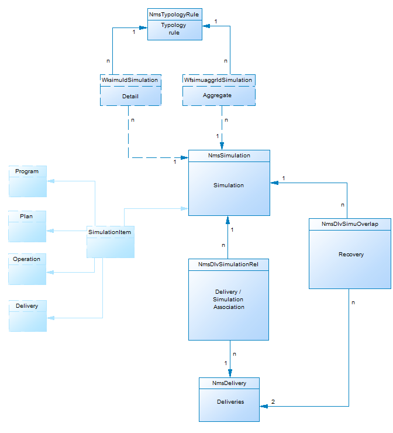

# 营销活动数据模型说明{#data-model-description}

Adobe Campaign附带预定义的数据模型。 本节提供有关Adobe Campaign数据模型的内置表及其交互的一些详细信息。

要访问每个表的说明，请转到 **[!UICONTROL Admin > Configuration > Data schemas]**，从列表中选择一个资源，然后单击选 **[!UICONTROL Documentation]** 项卡。

>[!NOTE]
>
>XML描述了应用程序中所承载数据的物理和逻辑结构。 它遵循Adobe Campaign特有的语法（称为架构）。 有关Adobe Campaign架构的更多信息，请阅读此 [部分](../../configuration/using/about-schema-reference.md)。

## 主表的说明 {#description-main-tables}

Adobe Campaign依赖于包含链接在一起的表的关系数据库。

下图显示了Adobe Campaign数据模型的主要业务表与每个主要字段之间的连接。

<!---->

预定义的Adobe Campaign数据模型包括以下主表。

### NmsRecipient {#NmsRecipient}

此表与nms:recipient **架构匹配** 。

它是用于分发收件人的 **默认表**。 因此，它包含通过各种渠道进行分发所需的信息：

* 电子邮件：电子邮件地址。
* iEmailFormat:首选电子邮件格式（1表示文本，2表示HTML,0表示未定义）。
* sAddress1、sAddress2、sAddress3、sAddress4、sZipCode、sCity用于构建邮政地址（与1997年5月起的XPZ 10-011 AFNOR标准一致）。
* sPhone、sMobilePhone、sFax分别包含电话、手机和传真号码。
* iBlackList是用于配置文件的默认退出标记（1表示“取消订阅”，否则为0）。

iFolderId字段是将收件人链接到其执行文件夹的外键。 有关此内容的详细信息，请参 [阅XtkFolder](#XtkFolder)。

sCountryCode字段是与收件人关联的国家／地区的3166-1 Alpha 2 ISO代码（2个字符）。 此字段实际上是国家／地区参考表(NmsCountry)上的外键，它包含国家／地区标签和其他国家／地区代码数据。 如果未填充国家／地区，则存储值“XX”（并用于代替零ID记录）。

有关“收件人”表格的详细信息，请参阅此 [部分](../../configuration/using/about-data-model.md#default-recipient-table)。

### NmsGroup {#NmsGroup}

此表与 **nms:group架构匹配** 。

它允许您创建 **静态收件人组**。 收件人和用户组之间存在多对多关系。 例如，一个收件人可以属于多个用户组，而一个用户组可以包含多个收件人。 可以通过导入或交付定位手动创建组。 组通常用作交付目标。 字段上有一个唯一的索引，它表示sName组的内部名称。 该组链接到一个文件夹（键为iFolderId）。 有关详细信息，请参阅 [XtkFolder](#XtkFolder))。

### NmsRcpGrpRel {#NmsRcpGrpRel}

NmsRcpGrpRel关系表只包含与iRecipientId和iGroupId链接表的标识符相对应的两个字段。

### NmsService {#NmsService}

此表与 **nms:service架构匹配** 。

服务是与组（静态收件人组）类似的实体，只是它们会传播更多信息，并通过表单轻松管理订阅和取消订阅。

在表示sName服务的内部名称的字段上有一个唯一的索引。 服务链接到一个文件夹（键为iFolderId）。 有关详细信息，请参阅 [XtkFolder](#XtkFolder))。 最后，iType字段指定此服务的传送渠道（0表示电子邮件，1表示SMS,2表示电话，3表示直邮，4表示传真）。

### Nms订阅 {#NmsSubscription}

此表与 **nms:subscription架构匹配** 。

它允许您管理信息服务的收件人订阅。

### NmsSubHisto {#NmsSubHisto}

此表与nms:subHisto **架构匹配** 。

如果订阅是使用Web表单或应用程序的界面管理的，则所有订阅和取消订阅都会在NmsSubHisto表中历史记录。 iAction字段指定在tsDate字段中存储的日期执行的操作（取消订阅为0，订阅为1）。

### NmsDelivery {#NmsDelivery}

此表与 **nms:delivery架构匹配** 。

此表中的每条记录都表示一 **个提交操作** 或一个 **提交模板**。 它包含执行分发所需的所有参数（目标、内容等）。 分析阶段将创建交付（广播）日志(NmsBroadLog)和关联的跟踪URL(NmsTrackingUrl)（有关这两个表的进一步详细信息，请参见下文）。

字段上有一个唯一的索引，它表示sInternalName交付或方案的内部名称。 交付链接到执行文件夹(外键为iFolderProcessId。 有关详细信息，请参阅 [XtkFolder](#XtkFolder))。

### XtkFolder {#XtkFolder}

它包含 **控制台的“导航** ”选项卡中 **可见的树中的所** 有文件夹。

键入文件夹：sModel字段的值指定可包含在文件夹中的数据类型。 此字段还使客户端控制台能够正确显示包含相应表单的数据。 此字段的可能值在navTree中定义。

树由iParentId和iChildCount字段管理。 sFullName字段提供树中文件夹的完整路径。 最后，在表示sName文件夹内部名称的字段上有一个唯一的索引。

## 交付和跟踪 {#delivery-and-tracking}

**NmsBroadLogMsg**:此表与 **nms:broadLogMsg架构匹配** 。 它是交付日志表的扩展。

## 营销活动管理 {#campaign-management}

* **NmsOperation**:此表与 **nms:operation架构匹配** 。 它包含营销活动的数据。
* **NmsDeliveryOutline**:此表与 **nms:deliveryOutline架构匹配** 。 它包含交付（交付大纲）的扩展属性。
* **NmsDlvOutlineItem**:此表与 **nms:dlvOutlineItem架构匹配** 。 它包含交付大纲的文章。
* **NmsDelivery自定义**:此表与 **nms:deliveryCustomization架构匹配** 。 它包含分发的个性化字段。
* **NmsBudget**:此表与 **nms:budget架构匹配** 。 它包含营销活动、计划、方案、任务和／或交付的预算数据。
* **NmsDocument**:此表与 **nms:document架构匹配** 。 它以文件（图像、Excel或Word文件等）的形式包含营销活动的营销文档
* **XtkWorkflow**:此表与 **xtk:workflow架构匹配** 。 它包含营销活动定位。
* **NmsTask**:此表与 **nms:task架构匹配** 。 它包含营销任务的定义。
* **NmsAsset**:此表与 **nms:asset架构匹配** 。 它包含营销资源的定义。

## 通信一致性 {#communication-consistency}

* **NmsTypology规则**:此表与 **nms:typologyRule架构匹配** 。 它包含根据类型应用于交付的规则。
* **Nms类型**:此表与nms: **类型学架构匹配** 。 它包含要应用于与类型学匹配的交付的规则集。
* **NmsTypologyRuleRel**:此表与 **nms:typologyRuleRel架构匹配** 。 它包含字体与其规则之间的关系。
* **NmsVolumeLine**:此表与 **nms:volumeLine架构匹配** 。 它包含容量规则的可用行集。
* **NmsVolumeUspended**:此表与nms:volumeUnsed **架构匹配** 。 它包含容量规则的所有消耗行。

## 响应管理 {#response-management}

### NmsRemaHextions {#NmsRemaHypothesis}

此表与nms:remaHexposition **架构一致** 。 它包含测量假设的定义。

此表包含存储在XML中的重要信息，包括：

**执行上下文（XML中存储的信息）**

执行上下文填充要考虑到的表和字段，用于计算度量，即：
* nms:remaMatchRcp反应日志存储架构。
* 事务表架构（例如购买）。
* 查询架构，用于定义假设条件的起始表。
* 指向个人的链接，通过这些链接，您可以基于查询架构识别个人。
* 事务处理日期。 此字段不是必填字段，但建议您使用它来限制计算周长。
* 事务处理金额：它是用于自动计算收入指标的可选字段。

**假设周长（XML中存储的信息）**

假设周界包括基于查询模式表的假设过滤。

**假设过载脚本（XML中存储的信息）**

假设过载脚本是JavaScript代码，它使您能够在执行过程中使假设的内容过载。

**测量指标**

在假设执行期间，将自动更新以下指示符：

* 反应数： **iTransaction**。 反应日志表中的行数。
* 联系人数： **iContactRenacted**。 假设中目标接触的不同数量。
* 控制组计数： **iProofResanted**。 假设中目标控制组接触的不同数量。
* 联系的响应率： **dContactRenadedRate**。 假设中目标接触的响应率。
* 控制组的响应率： **dProofRenatedRate**。 假设控制组的响应率。
* 联系人口总收入： **dContactRenadedTotalAmount**。 假设中目标联系人的总收入。
* 控制组平均收入： **dContactRenactedAvgAmount**。 假设中目标控制组的平均收入。
* 控制组的总收益： **dProofRenadedTotalAmount**。 假设控制组的总收入。
* 控制组平均收入： **dProofRenactedAvgAmount**。 假设控制组的平均收入。
* 每个联系人的总利润： **dContactRenactedTotalMargin**。 假设中的目标每次接触的总边距。
* 每个联系人的平均边距： **dContactRenactedAvgMargin**。 假设中的每次接触的平均边距。
* 控制组的毛利总额： **dProofRenatedTotalMargin**。 假设中目标的控制组的总边距。
* 控制组的平均利润： **dProofRenactedAvgMargin**。 假设中目标控制组的平均边距。
* 额外收入： **dAdditionalAmount**。 （联系的平均收入——控制组的平均收入）*联系的人数。
* 附加利润： **dAdditionalMargin**。 （已联系的平均边距——控制组的平均边距）/已联系人数。
* 每个联系人的平均成本（SQL表达式）。 已计算的交付成本／联系人数。
* ROI（SQL表达式）。 已计算交货成本／联系的总利润。
* 有效ROI（SQL表达式）。 交货的计算成本／附加利润。
* 重要性： **iAvertivaty** （SQL表达式）。 包含0到3之间的值，具体取决于营销活动的重要性。

### NmsRemaMatchRcp {#NmsRemaMatchRcp}

此表与 **nms:remaMatchRcp架构匹配** 。

它包含表示个人对给定假设的反应的记录。 这些记录是在假设执行期间创建的。

## 模拟和交付 {#simulation-and-delivery}

* **NmsSimulation**:此表与 **nms:simulation架构匹配** 。 它表示一组给定人群的交付或选件的模拟。
* **NmsDlvSimulationRel**:此表与 **nms:dlvSimulationRel架构匹配** 。 它包含模拟中考虑的提交列表。 模拟的范围以XML格式存储。
* **NmsOfferSimulationRel**:此表与 **nms:offerSimulationRel架构匹配** 。 它允许您将模拟与选件关联起来。

## 交互模块 {#interaction-module}

* **NmsOffer**:此表与 **nms:offer架构匹配** 。 它包含每个营销推广信息的定义。
* **NmsCompationRcp**:此表与 **nms:compationRcp架构匹配** 。 它包含发送给每位客户的跨渠道营销建议日志。 记录是在准备或有效地向个人提出建议时创建的。
* **NmsOfferSpace**:此表与 **nms:offerSpace架构匹配** 。 它包含提出建议的位置的定义。
* **NmsOfferContext**:此表与 **nms:offerContext架构匹配** 。 它包含关于该命题适用性的附加准则以及权重计算公式的定义。
* **NmsOfferView**:此表与 **nms:offerView匹配**。 它包含选件表示。
* **NmsOfferCategory**:此表与 **nms:offerCategory匹配**。 它包含选件类别。
* **NmsOfferEnv**:此表与 **nms:offerEnv匹配**。 它包含选件环境。

## 消息中心模块 {#message-center-module}

### NmsRtEvent {#NmsRtEvent}

此表与 **nms:rtEvent架构匹配** 。 它包含实时事件的定义。

### NmsBatchEvent {#NmsBatchEvent}

此表与 **nms:batchEvent架构匹配** 。 它包含按批量对事件的定义。

## Microsites模块 {#microsites-module}

* **NmsTrackingUrl**:此表与 **nms:trackingUrl架构匹配** 。

* **NmsPurl**:此表与 **nms:purl架构匹配** 。

## NMAC模块 {#nmac-module}

* **NmsMobileApp**:此表与nms:mobileApp **架构匹配** 。 它包含在Adobe Campaign中定义的移动应用程序。
* **NmsAppSubscription**:此表与nms:appSubscription **架构匹配** 。 它包含关于一个或多个应用程序的订户信息。
* **NmsAppSubscriptionRcp**:此表与 **nms:appSubscriptionRcp架构匹配** 。 它允许您将订阅应用程序的访客与收件人表关联起来。
* **NmsExcludeLogAppSubRcp**:此表与 **nms:excludeLogAppSubRcp架构匹配** 。
* **NmsTrackingLogAppSubRcp**:此表与 **nms:trackingLogAppSubRcp架构匹配** 。
* **NmsBroadLogAppSubRcp**:此表与 **nms:broadLogAppSubRcp架构匹配** 。

## 社交营销模块 {#social-marketing-module}

* **NmsVisitor**:此表与 **nms:visitor架构匹配** 。 它包含有关访客的信息。
* **NmsVisitorSub**:此表与 **nms:visitorSub架构匹配** 。 它允许您将访客关联到他们订阅的服务（Twitter或Facebook）。
* **NmsFriendShipRel**:此表与 **nms:friendshipRel架构匹配** 。 它允许您在Facebook服务的上下文中将访客与其朋友关联起来。
* **NmsVisitorInterestRel**:此表与 **nms:visitorInterestRel架构匹配** 。 它使您能够将访客及其兴趣关联起来。
* **NmsInterest**:此表与 **nms:interest架构匹配** 。 它包含每个访客的兴趣列表。