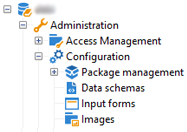

# 数据模式{#data-schemas}

## 原则{#principles}

要编辑、创建和配置模式，请单击Adobe Campaign客户端控制台的&#x200B;**[!UICONTROL Administration > Configuration > Data schemas]**&#x200B;节点。

>[!NOTE]
>
>开箱即用模式只能由您的Adobe Campaign Classic控制台的管理员删除。



编辑字段显示源模式的XML内容：


>[!NOTE]
>
>通过“名称”编辑控件，您可以输入由名称和模式组成的命名空间键。 命名空间的根元素的“name”和“模式”属性在模式的XML编辑区域中自动更新。

预览会自动生成扩展模式:


>[!NOTE]
>
>保存源模式时，将自动启动扩展模式的生成。

如果需要检查模式的完整结构，可以使用预览选项卡。 如果模式已扩展，您就能够可视化其所有扩展。 作为补充，“文档”选项卡显示所有模式属性和元素及其属性（SQL字段、类型／长度、标签、说明）。 “文档”选项卡仅适用于生成的模式。 有关详细信息，请参阅[重新生成模式](../../configuration/using/regenerating-schemas.md)部分。

## 示例：创建合同表{#example--creating-a-contract-table}

在以下示例中，我们要为Adobe Campaign库的数据库模型中的&#x200B;**contracts**&#x200B;创建新表。 此表允许您存储每个合同的持有人和共同持有人的姓名和姓氏以及电子邮件地址。

为此，您需要创建表的模式并更新数据库结构以生成相应的表。 应用以下阶段：

1. 编辑Adobe Campaign树的&#x200B;**[!UICONTROL Administration > Configuration > Data schemas]**&#x200B;节点，然后单击&#x200B;**[!UICONTROL New]**。
1. 选择&#x200B;**[!UICONTROL Create a new table in the data model]**&#x200B;选项，然后单击&#x200B;**[!UICONTROL Next]**。

   

1. 指定表和命名空间的名称。

   

   >[!NOTE]
   >
   >默认情况下，用户创建的模式存储在“自定义”命名空间中。 有关详细信息，请参阅[模式的标识](../../configuration/using/about-schema-reference.md#identification-of-a-schema)。

1. 创建表的内容。 我们建议使用输入向导来确保没有缺少设置。 要执行此操作，请单击&#x200B;**[!UICONTROL Insert]**&#x200B;按钮并选择要添加的设置类型。

   

1. 定义合同表的设置：

   ```
   <srcSchema desc="Active contracts" img="ncm:channels.png" label="Contracts" labelSingular="Contract" mappingType="sql" name="Contracts" namespace="cus" xtkschema="xtk:srcSchema">
     <element desc="Active contracts" img="ncm:channels.png" label="Contracts" labelSingular="Contract"
              name="Contracts" autopk="true">
              <attribute name="holderName" label="Holder last name" type="string"/>
              <attribute name="holderFirstName" label="Holder first name" type="string"/>
              <attribute name="holderEmail" label="Holder email" type="string"/>
              <attribute name="co-holderName" label="Co-holder last name" type="string"/>           
              <attribute name="co-holderFirstName" label="Co-holder first name" type="string"/>           
              <attribute name="co-holderEmail" label="Co-holder email" type="string"/>    
              <attribute name="date" label="Subscription date" type="date"/>     
              <attribute name="noContract" label="Contract number" type="long"/>  
     </element>
   </srcSchema>
   ```

   添加合同类型，并在合同编号上添加索引。

   ```
   <srcSchema _cs="Contracts (cus)" desc="Active contracts" entitySchema="xtk:srcSchema" img="ncm:channels.png"
              label="Contracts" labelSingular="Contract" name="Contracts" namespace="cus" xtkschema="xtk:srcSchema">
     <enumeration basetype="byte" name="typeContract">
       <value label="Home" name="home" value="0"/>
       <value label="Car" name="car" value="1"/>
       <value label="Health" name="health" value="2"/>
       <value label="Pension fund" name="pension fund" value="2"/>
     </enumeration>
     <element autopk="true" desc="Active contracts" img="ncm:channels.png" label="Contracts"
              labelSingular="Contract" name="Contracts">
       <attribute label="Holder last name" name="holderName" type="string"/>
       <attribute label="Holder first name" name="holderFirstName" type="string"/>
       <attribute label="Holder email" name="holderEmail" type="string"/>
       <attribute label="Co-holder last name" name="co-holderName" type="string"/>
       <attribute label="Co-holder first name" name="co-holderFirstName" type="string"/>
       <attribute label="Co-holder email" name="co-holderEmail" type="string"/>
       <attribute label="Subscription date" name="date" type="date"/>
      <attribute desc="Type of contract" enum="cus:Contracts:typeContract" label="Type of contract"
                  name="type" type="byte"/>
       <attribute label="Contract number" name="noContract" type="long"/>
       <dbindex name="noContract" unique="true">
         <keyfield xpath="@noContract"/>
       </dbindex>
     </element>
   </srcSchema>
   ```

1. 保存模式以生成结构：

   

1. 更新模式库结构以创建要链接到的表。 有关详细信息，请参阅[更新数据库结构](../../configuration/using/updating-the-database-structure.md)。

