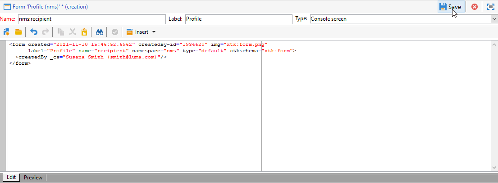

# 编辑表单{#editing-forms}


## 概述

营销人员和运营人员使用输入表单创建、修改和预览记录。 Forms显示信息的可视表示形式。

您可以创建和修改输入表单：

* 您可以修改默认提交的工厂输入表单。 工厂输入表单基于工厂数据架构。
* 您可以根据定义的数据架构创建自定义输入表单。

Forms是 `xtk:form` 类型。 您可以在 `xtk:form` 架构。 要查看此架构，请选择 **[!UICONTROL Administration]** > **[!UICONTROL Configuration]** > **[!UICONTROL Data schemas]** 中。 有关更多信息 [窗体结构](form-structure.md).

要访问输入表单，请选择 **[!UICONTROL Administration]> [!UICONTROL Configuration] >[!UICONTROL Input forms]** 从菜单：


要设计表单，请在XML编辑器中编辑XML内容：


[阅读更多](form-structure.md#formatting)。

要预览表单，请单击 **[!UICONTROL Preview]** 选项卡：


## 表单类型

您可以创建不同类型的输入表单。 表单类型决定用户在表单中导航的方式：

* 控制台屏幕

   这是默认的表单类型。 表单包含单页。

   

* 内容管理

   使用此表单类型进行内容管理。 请参阅 [用例](../../delivery/using/use-case--creating-content-management.md).

   

* 向导

   该表单包括多个按特定顺序排列的浮动屏幕。 用户从一个屏幕导航到下一个屏幕。 [阅读更多](form-structure.md#wizards)。

* Iconbox

   此表单包含多个页面。 要导航表单，用户需选择表单左侧的图标。

   

* 笔记本

   此表单包含多个页面。 要导航表单，用户需选择表单顶部的选项卡。

   

* 垂直窗格

   此窗体显示导航树。

* 水平窗格

   此表单显示项目列表。

## 容器

在表单中，您可以将容器用于各种目的：

* 在表单中组织内容
* 定义对输入字段的访问权限
* 将表单嵌套在其他表单中

[阅读更多](form-structure.md#containers)。

### 组织内容

使用容器组织表单中的内容：

* 您可以将字段分组为多个部分。
* 您可以将页面添加到多页面表单。

要插入容器，请使用 `<container>` 元素。 [阅读更多](form-structure.md#containers)。

#### 组字段

使用容器将输入字段分组为有组织的部分。

要在表单中插入部分，请使用以下元素： `<container type="frame">`. （可选）要添加节标题，请使用 `label` 属性。

语法： `<container type="frame" label="`*section_title*`"> […] </container>`

在本例中，容器定义 **创建** 部分，包括 **[!UICONTROL Created by]** 和 **[!UICONTROL Name]** 输入字段：

```xml
<form _cs="Coupons (nms)" entitySchema="xtk:form" img="xtk:form.png" label="Coupons"
      name="coupon" namespace="nms" type="default" xtkschema="xtk:form">
  <input xpath="@code"/>
  <input xpath="@type"/>
  <container label="Creation" type="frame">
    <input xpath="createdBy"/>
    <input xpath="createdBy/@name"/>
  </container>
</form>
```


#### 将页面添加到多页面表单

对于多页面表单，请使用容器创建表单页面。

此示例显示 **常规** 和 **详细信息** 表单页面：

```xml
<container img="ncm:book.png" label="General">
[…]
</container>
<container img="ncm:detail.png" label="Details">
[…]
</container>
```

### 定义对字段的访问权限

使用容器定义可见内容并定义对字段的访问权限。 您可以打开或关闭字段组。

### 嵌套表单

使用容器将表单嵌套在其他表单中。 [阅读更多](#add-pages-to-multipage-forms)。

## 对图像的引用

要查找图像，请选择 **[!UICONTROL Administration]** > **[!UICONTROL Configuration]** > **[!UICONTROL Images]** 中。

要将图像与表单中的元素（例如图标）关联，您可以添加对图像的引用。 使用 `img` 属性，例如 `<container>` 元素。

语法: `img="`*`namespace`*`:`*`filename`*`.`*`extension`*`"`

此示例显示对 `book.png` 和 `detail.png` 图像 `ncm` 命名空间：

```xml
<container img="ncm:book.png" label="General">
[…]
</container>
<container img="ncm:detail.png" label="Details">
[…]
</container>
```

这些图像用于用户单击以导航多页面表单的图标：


## 创建简单表单 {#create-simple-form}

要创建表单，请执行以下步骤：

1. 从菜单中，选择 **[!UICONTROL Administration]** > **[!UICONTROL Configuration]** > **[!UICONTROL Input forms]**.
1. 单击 **[!UICONTROL New]** 按钮。

   

1. 指定表单属性：

   * 指定表单名称和命名空间。

      表单名称和命名空间可以匹配相关数据架构。  此示例显示 `cus:order` 数据架构：

      ```xml
      <form entitySchema="xtk:form" img="xtk:form.png" label="Order" name="order" namespace="cus" type="iconbox" xtkschema="xtk:form">
        […]
      </form>
      ```

      或者，您也可以在 `entity-schema` 属性。

      ```xml
      <form entity-schema="cus:stockLine" entitySchema="xtk:form" img="xtk:form.png" label="Stock order" name="stockOrder" namespace="cus" xtkschema="xtk:form">
        […]
      </form>
      ```

   * 指定要在表单上显示的标签。
   * （可选）指定表单类型。 如果未指定表单类型，则默认使用控制台屏幕类型。

      

      如果要设计多页面表单，则可以在 `<form>` 元素，并在容器中指定类型。

1. 单击 **[!UICONTROL Save]**。

1. 插入表单元素。

   例如，要插入输入字段，请使用 `<input>` 元素。 设置 `xpath` 属性作为XPath表达式。 [阅读更多](schema-structure.md#referencing-with-xpath)。

   此示例显示基于 `nms:recipient` 架构。

   ```xml
   <input xpath="@firstName"/>
   <input xpath="@lastName"/>
   ```

1. 如果表单基于特定架构类型，则可以查找此架构的字段：

   1. 单击 **[!UICONTROL Insert]** > **[!UICONTROL Document fields]**.

      

   1. 选择字段并单击 **[!UICONTROL OK]**.

      

1. （可选）指定字段编辑器。

   默认的字段编辑器与每个数据类型关联：
   * 对于日期类型字段，表单显示输入日历。
   * 对于枚举类型字段，表单会显示选择列表。

   您可以使用以下字段编辑器类型：

   | 字段编辑器 | 表单属性 |
   | --- | --- |
   | 单选按钮 | `type="radiobutton"` |
   | 复选框 | `type="checkbox"` |
   | 编辑树 | `type="tree"` |

   有关更多信息 [内存列表控件](form-structure.md#memory-list-controls).

1. （可选）定义对以下字段的访问权限：

   | 元素 | 属性 | 说明 |
   | --- | --- | --- |
   | `<input>` | `read-only:"true"` | 提供对字段的只读访问权限 |
   | `<container>` | `type="visibleGroup" visibleIf="`*edit-expr*`"` | 有条件地显示一组字段 |
   | `<container>` | `type="enabledGroup" enabledIf="`*edit-expr*`"` | 有条件地启用一组字段 |

   示例:

   ```xml
   <container type="enabledGroup" enabledIf="@gender=1">
     […]
   </container>
   <container type="enabledGroup" enabledIf="@gender=2">
     […]
   </container>
   ```

1. （可选）使用容器将字段分组为多个部分。

   ```xml
   <container type="frame" label="Name">
      <input xpath="@firstName"/>
      <input xpath="@lastName"/>
   </container>
   <container type="frame" label="Contact details">
      <input xpath="@email"/>
      <input xpath="@phone"/>
   </container>
   ```

   

## 创建多页面表单 {#create-multipage-form}

您可以创建多页面表单。 您还可以将表单嵌套在其他表单中。

### 创建 `iconbox` 表单

使用 `iconbox` 表单类型，用于在表单左侧显示图标，使用户转到表单中的不同页面。


将现有表单的类型更改为 `iconbox`，请执行以下步骤：

1. 更改 `type` 属性 `<form>` 元素 `iconbox`:

   ```xml
   <form […] type="iconbox">
   ```

1. 为每个表单页面设置一个容器：

   1. 添加 `<container>` 元素作为的子项 `<form>` 元素。
   1. 要为图标定义标签和图像，请使用 `label` 和 `img` 属性。

      ```xml
      <form entitySchema="xtk:form" name="Service provider" namespace="nms" type="iconbox" xtkschema="xtk:form">
          <container img="xtk:properties.png" label="General">
              <input xpath="@label"/>
              <input xpath="@name"/>
              […]
          </container>
          <container img="nms:msgfolder.png" label="Details">
              <input xpath="@address"/>
              […]
          </container>
          <container img="nms:supplier.png" label="Services">
              […]
          </container>
      </form>
      ```
   或者，移除 `type="frame"` 属性 `<container>` 元素。

### 创建笔记本表单

使用 `notebook` 表单类型，用于在表单顶部显示选项卡，可将用户引导至不同的页面。


将现有表单的类型更改为 `notebook`，请执行以下步骤：

1. 更改 `type` 属性 `<form>` 元素 `notebook`:

   ```xml
   <form […] type="notebook">
   ```

1. 为每个表单页面添加一个容器：

   1. 添加 `<container>` 元素作为的子项 `<form>` 元素。
   1. 要定义图标的标签和图像，请使用 `label` 和 `img` 属性。

   ```xml
     <form entitySchema="xtk:form" name="Service provider" namespace="nms" type="notebook" xtkschema="xtk:form">
         <container label="General">
             <input xpath="@label"/>
             <input xpath="@name"/>
             […]
         </container>
         <container label="Details">
             <input xpath="@address"/>
             […]
         </container>
         <container label="Services">
             […]
         </container>
     </form>
   ```

   或者，移除 `type="frame"` 属性 `<container>` 元素。

### 嵌套表单 {#nest-forms}

您可以将表单嵌套在其他表单中。 例如，您可以在iconbox表单中嵌套笔记本表单。

嵌套级别控制导航。 用户可以向下展开到子表单。

要将表单嵌套在另一个表单中，请插入 `<container>` 元素并设置 `type` 属性。 对于顶级表单，您可以在外部容器或 `<form>` 元素。

### 示例

此示例显示了一个复杂的表单：

* 顶级表单是一个iconbox表单。 此表单包含两个标有 **常规** 和 **详细信息**.

   因此，外部窗体会显示 **常规** 和 **详细信息** 页面。 要访问这些页面，用户需单击表单左侧的图标。

* 子表单是嵌套在 **常规** 容器。 该子表单包括两个被标记的容器 **名称** 和 **联系人**.

```xml
<form _cs="Profile (nms)" entitySchema="xtk:form" img="xtk:form.png" label="Profile" name="profile" namespace="nms" xtkschema="xtk:form">
  <container type="iconbox">
    <container img="ncm:general.png" label="General">
      <container type="notebook">
        <container label="Name">
          <input xpath="@firstName"/>
          <input xpath="@lastName"/>
        </container>
        <container label="Contact">
          <input xpath="@email"/>
        </container>
      </container>
    </container>
    <container img="ncm:detail.png" label="Details">
      <input xpath="@birthDate"/>
    </container>
  </container>
</form>
```

因此， **常规** 外部表单的页面显示 **名称** 和 **联系人** 选项卡。


## 修改工厂输入表单 {#modify-factory-form}

要修改工厂表单，请执行以下步骤：


