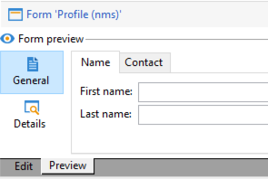

# 编辑表单{#editing-forms}

## 概述

营销人员和操作员使用输入表单来创建、修改和预览记录。 Forms显示信息的可视化表示形式。

您可以创建和修改输入表单：

* 您可以修改默认提供的出厂输入表单。 工厂输入表单基于工厂数据架构。
* 您可以根据定义的数据架构创建自定义输入表单。

Forms是`xtk:form`类型的实体。 您可以在`xtk:form`架构中查看输入表单结构。 要查看此架构，请从菜单中选择&#x200B;**[!UICONTROL Administration]** > **[!UICONTROL Configuration]** > **[!UICONTROL Data schemas]**。 阅读有关[窗体结构](form-structure.md)的更多信息。

要访问输入表单，请从菜单中选择&#x200B;**[!UICONTROL Administration]> [!UICONTROL Configuration] >[!UICONTROL Input forms]**：


要设计表单，请在XML编辑器中编辑XML内容：


[了解更多信息](form-structure.md#formatting)。

要预览表单，请单击&#x200B;**[!UICONTROL Preview]**&#x200B;选项卡：


## 表单类型

您可以创建不同类型的输入表单。 表单类型决定了用户如何在表单中导航：

* 控制台屏幕

  这是默认表单类型。 该表单包含一个页面。

  

* 内容管理

  使用此表单类型进行内容管理。 查看此[用例](../../delivery/using/use-case-creating-content-management.md)。

  

* 助理

  此形式包括按特定顺序排序的多个浮动屏幕。 用户从一个屏幕导航到下一个屏幕。 [了解更多信息](form-structure.md#wizards)。

* 图标框

  此表单包含多个页面。 要导航表单，用户请选择表单左侧的图标。

  

* 笔记本

  此表单包含多个页面。 要导航表单，用户请选择表单顶部的选项卡。

  

* 垂直窗格

  此窗体显示导航树。

* 水平窗格

  此窗体显示项目列表。

## 容器

在表单中，您可以将容器用于各种目的：

* 在表单中整理内容
* 定义对输入字段的访问权限
* 在其他表单中嵌套表单

[了解更多信息](form-structure.md#containers)。

### 组织内容

使用容器在表单中整理内容：

* 您可以将字段分组为多个部分。
* 您可以将页面添加到多页面表单。

要插入容器，请使用`<container>`元素。 [了解更多信息](form-structure.md#containers)。

#### 组字段

使用容器将输入字段分组为有组织的部分。

要将节插入窗体，请使用此元素： `<container type="frame">`。 或者，若要添加节标题，请使用`label`属性。

语法： `<container type="frame" label="`*section_title*`"> […] </container>`

在此示例中，容器定义了&#x200B;**Creation**&#x200B;部分，该部分包含&#x200B;**[!UICONTROL Created by]**&#x200B;和&#x200B;**[!UICONTROL Name]**&#x200B;输入字段：

```xml
<form _cs="Coupons (nms)" entitySchema="xtk:form" img="xtk:form.png" label="Coupons"
      name="coupon" namespace="nms" type="default" xtkschema="xtk:form">
  <input xpath="@code"/>
  <input xpath="@type"/>
  <container label="Creation" type="frame">
    <input xpath="createdBy"/>
    <input xpath="createdBy/@name"/>
  </container>
</form>
```


#### 将页面添加到多页面表单

对于多页面表单，请使用容器创建表单页面。

此示例显示表单的&#x200B;**常规**&#x200B;和&#x200B;**详细信息**&#x200B;页面的容器：

```xml
<container img="ncm:book.png" label="General">
[…]
</container>
<container img="ncm:detail.png" label="Details">
[…]
</container>
```

### 定义对字段的访问权限

使用容器定义可见内容并定义对字段的访问权限。 您可以打开或关闭字段组。

### 嵌套表单

使用容器将表单嵌套在其他表单中。 [了解更多信息](#add-pages-to-multipage-forms)。

## 对图像的引用

若要查找图像，请从菜单中选择&#x200B;**[!UICONTROL Administration]** > **[!UICONTROL Configuration]** > **[!UICONTROL Images]**。

要将图像与表单中的元素（例如图标）相关联，可以添加对图像的引用。 例如，在`<container>`元素中使用`img`特性。

语法： `img="`*`namespace`*`:`*`filename`*`.`*`extension`*`"`

此示例显示对`ncm`命名空间中的`book.png`和`detail.png`图像的引用：

```xml
<container img="ncm:book.png" label="General">
[…]
</container>
<container img="ncm:detail.png" label="Details">
[…]
</container>
```

这些图像用于用户单击以导航多页表单的图标：




## 创建简单表单 {#create-simple-form}

要创建表单，请执行以下步骤：

1. 从菜单中选择&#x200B;**[!UICONTROL Administration]** > **[!UICONTROL Configuration]** > **[!UICONTROL Input forms]**。
1. 单击列表右上角的&#x200B;**[!UICONTROL New]**&#x200B;按钮。

   

1. 指定表单属性：

   * 指定表单名称和命名空间。

     表单名称和命名空间可以与相关数据架构匹配。  此示例显示了`cus:order`数据架构的表单：

     ```xml
     <form entitySchema="xtk:form" img="xtk:form.png" label="Order" name="order" namespace="cus" type="iconbox" xtkschema="xtk:form">
       […]
     </form>
     ```

     或者，您可以在`entity-schema`属性中显式指定数据架构。

     ```xml
     <form entity-schema="cus:stockLine" entitySchema="xtk:form" img="xtk:form.png" label="Stock order" name="stockOrder" namespace="cus" xtkschema="xtk:form">
       […]
     </form>
     ```

   * 指定要在表单上显示的标签。
   * （可选）指定表单类型。 如果未指定表单类型，则默认使用控制台屏幕类型。

     

     如果您设计的是多页面表单，则可以省略`<form>`元素中的表单类型，并在容器中指定类型。

1. 单击 **[!UICONTROL Save]**。

1. 插入表单元素。

   例如，要插入输入字段，请使用`<input>`元素。 将字段引用的`xpath`属性设置为XPath表达式。 [了解更多信息](schema-structure.md#referencing-with-xpath)。

   此示例显示基于`nms:recipient`架构的输入字段。

   ```xml
   <input xpath="@firstName"/>
   <input xpath="@lastName"/>
   ```

1. 如果表单基于特定的架构类型，则可以查找此架构的字段：

   1. 单击&#x200B;**[!UICONTROL Insert]** > **[!UICONTROL Document fields]**。

      

   1. 选择字段并单击&#x200B;**[!UICONTROL OK]**。

      

1. （可选）指定字段编辑器。

   默认字段编辑器与每种数据类型相关联：
   * 对于日期类型字段，该表单会显示输入日历。
   * 对于枚举类型字段，该表单会显示一个选择列表。

   您可以使用以下字段编辑器类型：

   | 字段编辑器 | 表单属性 |
   | --- | --- |
   | 单选按钮 | `type="radiobutton"` |
   | 复选框 | `type="checkbox"` |
   | 编辑树 | `type="tree"` |

   阅读有关[内存列表控件](form-structure.md#memory-list-controls)的详细信息。

1. （可选）定义对字段的访问权限：

   | 元素 | 属性 | 说明 |
   | --- | --- | --- |
   | `<input>` | `read-only="true"` | 提供对字段的只读访问权限 |
   | `<container>` | `type="visibleGroup" visibleIf="`*edit-expr*`"` | 有条件地显示一组字段 |
   | `<container>` | `type="enabledGroup" enabledIf="`*edit-expr*`"` | 有条件地启用一组字段 |

   例如：

   ```xml
   <container type="enabledGroup" enabledIf="@gender=1">
     […]
   </container>
   <container type="enabledGroup" enabledIf="@gender=2">
     […]
   </container>
   ```

1. （可选）使用容器将字段分组为多个部分。

   ```xml
   <container type="frame" label="Name">
      <input xpath="@firstName"/>
      <input xpath="@lastName"/>
   </container>
   <container type="frame" label="Contact details">
      <input xpath="@email"/>
      <input xpath="@phone"/>
   </container>
   ```

   

## 创建多页表单 {#create-multipage-form}

您可以创建多页面表单。 还可以将表单嵌套在其他表单中。

### 创建`iconbox`表单

使用`iconbox`表单类型在表单左侧显示图标，这些图标会将用户引导至表单中的不同页面。


要将现有表单的类型更改为`iconbox`，请执行以下步骤：

1. 将`<form>`元素的`type`属性更改为`iconbox`：

   ```xml
   <form […] type="iconbox">
   ```

1. 为每个表单页面设置一个容器：

   1. 添加`<container>`元素作为`<form>`元素的子项。
   1. 要定义图标的标签和图像，请使用`label`和`img`属性。

      ```xml
      <form entitySchema="xtk:form" name="Service provider" namespace="nms" type="iconbox" xtkschema="xtk:form">
          <container img="xtk:properties.png" label="General">
              <input xpath="@label"/>
              <input xpath="@name"/>
              […]
          </container>
          <container img="nms:msgfolder.png" label="Details">
              <input xpath="@address"/>
              […]
          </container>
          <container img="nms:supplier.png" label="Services">
              […]
          </container>
      </form>
      ```

   或者，从现有`<container>`元素中删除`type="frame"`特性。

### 创建笔记本表单

使用`notebook`表单类型在表单顶部显示选项卡，这些选项卡会将用户引导至不同的页面。


要将现有表单的类型更改为`notebook`，请执行以下步骤：

1. 将`<form>`元素的`type`属性更改为`notebook`：

   ```xml
   <form […] type="notebook">
   ```

1. 为每个表单页面添加一个容器：

   1. 添加`<container>`元素作为`<form>`元素的子项。
   1. 要定义图标的标签和图像，请使用`label`和`img`属性。

   ```xml
     <form entitySchema="xtk:form" name="Service provider" namespace="nms" type="notebook" xtkschema="xtk:form">
         <container label="General">
             <input xpath="@label"/>
             <input xpath="@name"/>
             […]
         </container>
         <container label="Details">
             <input xpath="@address"/>
             […]
         </container>
         <container label="Services">
             […]
         </container>
     </form>
   ```

   或者，从现有`<container>`元素中删除`type="frame"`特性。

### 嵌套表单

您可以将表单嵌套在其他表单中。 例如，可以将笔记本表单嵌套在iconbox表单中。

嵌套级别控制导航。 用户可以向下钻取到子表单。

若要将表单嵌套在另一个表单中，请插入一个`<container>`元素并将`type`属性设置为表单类型。 对于顶级表单，您可以在外部容器或`<form>`元素中设置表单类型。

### 示例

此示例显示了一个复杂的形式：

* 顶级表单是iconbox表单。 此表单包含两个标记为&#x200B;**常规**&#x200B;和&#x200B;**详细信息**&#x200B;的容器。

  因此，外部表单在顶层显示&#x200B;**常规**&#x200B;和&#x200B;**详细信息**&#x200B;页面。 要访问这些页面，请单击表单左侧的图标。

* 子表单是嵌套在&#x200B;**常规**&#x200B;容器中的笔记本表单。 子表单包含两个标记为&#x200B;**Name**&#x200B;和&#x200B;**Contact**&#x200B;的容器。

```xml
<form _cs="Profile (nms)" entitySchema="xtk:form" img="xtk:form.png" label="Profile" name="profile" namespace="nms" xtkschema="xtk:form">
  <container type="iconbox">
    <container img="ncm:general.png" label="General">
      <container type="notebook">
        <container label="Name">
          <input xpath="@firstName"/>
          <input xpath="@lastName"/>
        </container>
        <container label="Contact">
          <input xpath="@email"/>
        </container>
      </container>
    </container>
    <container img="ncm:detail.png" label="Details">
      <input xpath="@birthDate"/>
    </container>
  </container>
</form>
```

因此，外部表单的&#x200B;**常规**&#x200B;页面显示&#x200B;**名称**&#x200B;和&#x200B;**联系人**&#x200B;选项卡。


若要将表单嵌套在另一个表单中，请插入一个`<container>`元素并将`type`属性设置为表单类型。 对于顶级表单，您可以在外部容器或`<form>`元素中设置表单类型。

### 示例

此示例显示了一个复杂的形式：

* 顶级表单是iconbox表单。 此表单包含两个标记为&#x200B;**常规**&#x200B;和&#x200B;**详细信息**&#x200B;的容器。

  因此，外部表单在顶层显示&#x200B;**常规**&#x200B;和&#x200B;**详细信息**&#x200B;页面。 要访问这些页面，请单击表单左侧的图标。

* 子表单是嵌套在&#x200B;**常规**&#x200B;容器中的笔记本表单。 子表单包含两个标记为&#x200B;**Name**&#x200B;和&#x200B;**Contact**&#x200B;的容器。

```xml
<form _cs="Profile (nms)" entitySchema="xtk:form" img="xtk:form.png" label="Profile" name="profile" namespace="nms" xtkschema="xtk:form">
  <container type="iconbox">
    <container img="ncm:general.png" label="General">
      <container type="notebook">
        <container label="Name">
          <input xpath="@firstName"/>
          <input xpath="@lastName"/>
        </container>
        <container label="Contact">
          <input xpath="@email"/>
        </container>
      </container>
    </container>
    <container img="ncm:detail.png" label="Details">
      <input xpath="@birthDate"/>
    </container>
  </container>
</form>
```

因此，外部表单的&#x200B;**常规**&#x200B;页面显示&#x200B;**名称**&#x200B;和&#x200B;**联系人**&#x200B;选项卡。


## 修改工厂输入表单 {#modify-factory-form}

要修改出厂表单，请执行以下步骤：

1. 修改工厂输入表单：

   1. 从菜单中选择&#x200B;**[!UICONTROL Administration]** > **[!UICONTROL Configuration]** > **[!UICONTROL Input forms]**。
   1. 选择输入表单并修改它。

   您可以扩展工厂数据架构，但不能扩展工厂输入表单。 我们建议您直接修改出厂输入表单，而无需重新创建它们。 在软件升级期间，工厂输入表单中的修改将与升级合并。 如果自动合并失败，您可以解决冲突。 [了解更多信息](../../production/using/upgrading.md#resolving-conflicts)。

   例如，如果使用附加字段扩展工厂模式，则可以将此字段添加到相关的工厂表单。

## 验证表单 {#validate-forms}

您可以在表单中包含验证控件。

### 授予对字段的只读访问权限

要授予对字段的只读访问权限，请使用`readOnly="true"`属性。 例如，您可能希望显示记录的主键，但具有只读访问权限。 [了解更多信息](form-structure.md#non-editable-fields)。

在此示例中，`nms:recipient`架构的主键(`iRecipientId`)以只读访问权限显示：

```xml
<value xpath="@iRecipientId" readOnly="true"/>
```

### 检查必填字段

您可以检查必需信息：

* 为必填字段使用`required="true"`属性。
* 使用`<leave>`节点检查这些字段并显示错误消息。

在此示例中，需要电子邮件地址，如果用户未提供此信息，则会显示错误消息：

```xml
<input xpath="@email" required="true"/>
<leave>
  <check expr="@email!=''">
    <error>The email address is required.</error>
  </check>
</leave>
```

阅读有关[表达式字段](form-structure.md#expression-field)和[表单上下文](form-structure.md#context-of-forms)的更多信息。

### 验证值

您可以使用JavaScript SOAP调用从控制台验证表单数据。 使用这些调用进行复杂验证，例如，根据授权值列表检查值。 [了解更多信息](form-structure.md#soap-methods)。

1. 在JS文件中创建验证函数。

   例如：

   ```js
   function nms_recipient_checkValue(value)
   {
     logInfo("checking value " + value)
     if (…)
     {
       logError("Value " + value + " is not valid")
     }
     return 1
   }
   ```

   在此示例中，函数名为`checkValue`。 此函数用于检查`nms`命名空间中的`recipient`数据类型。 将记录正在检查的值。 如果该值无效，则会记录一条错误消息。 如果该值有效，则返回值1。

   您可以使用返回值修改表单。

1. 在表单中，将`<soapCall>`元素添加到`<leave>`元素。

   在此示例中，SOAP调用用于验证`@valueToCheck`字符串：

   ```xml
   <form name="recipient" (…)>
   (…)
     <leave>
       <soapCall name="checkValue" service="nms:recipient">
         <param exprIn="@valueToCheck" type="string"/>
       </soapCall>
     </leave>
   </form>
   ```

   在此示例中，使用了`checkValue`方法和`nms:recipient`服务：

   * 服务是命名空间和数据类型。
   * 方法是函数名称。 名称区分大小写。

   同步执行调用。

   将显示所有例外。 如果您使用`<leave>`元素，则在验证输入的信息之前，用户无法保存表单。

此示例说明如何在表单中进行服务调用：

```xml
<enter>
  <soapCall name="client" service="c4:ybClient">
    <param exprIn="@id" type="string"/>
    <param type="boolean" xpathOut="/tmp/@count"/>
  </soapCall>
</enter>
```

在此示例中，输入是一个ID，它是一个主键。 当用户填写此ID的表单时，将会使用此ID作为输入参数进行SOAP调用。 输出是写入此字段的布尔值： `/tmp/@count`。 您可以在表单内使用此布尔值。 阅读有关[表单上下文](form-structure.md#context-of-forms)的更多信息。
