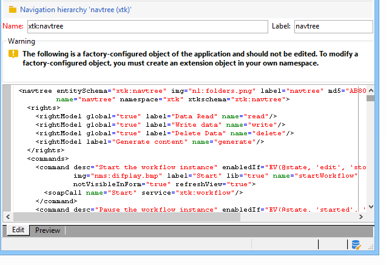

# 编辑Campaign Explorer导航树{#edition}

可通过&#x200B;**[!UICONTROL Administration > Configuration > Navigation hierarchies]**&#x200B;节点访问用于创建和配置导航层次结构配置文档的屏幕：

导航层次结构配置分为多个XML文档。 它遵循与模式扩展类似的原则：将合并所有文档以生成包含整个配置的单个文档。 无法编辑此文档，该文档通过“预览”选项卡显示。

编辑字段提供XML文档的内容：

>[!NOTE]
>
>“名称”编辑控件允许您输入包含名称和命名空间的文档键。 **`<navtree>`**&#x200B;元素的“name”和“namespace”属性会在架构的XML编辑字段中自动更新。

预览会自动生成包含完整配置的合并文档：

