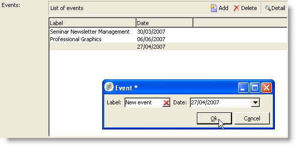

# 窗体结构{#form-structure}


表单的描述是遵循表单架构语法的结构化XML文档 **xtk：form**.

输入表单的XML文档必须包含 `<form>` 具有的根元素 **name** 和 **命名空间** 属性填充表单名称和命名空间。

```xml
<form name="form_name" namespace="name_space">
…
</form>
```

默认情况下，表单与具有相同名称和命名空间的数据架构关联。 要将表单与其他名称相关联，请设置 **entity-schema** 的属性 `<form>` 元素到架构键的名称。 为了说明输入表单的结构，让我们使用“cus：recipient”示例模式描述一个接口：

```xml
<srcSchema name="recipient" namespace="cus">
  <enumeration name="gender" basetype="byte">    
    <value name="unknown" label="Not specified" value="0"/>    
    <value name="male" label="Male" value="1"/>   
    <value name="female" label="Female" value="2"/>   
  </enumeration>

  <element name="recipient">
    <attribute name="email" type="string" length="80" label="Email" desc="Email address of recipient"/>
    <attribute name="birthDate" type="datetime" label="Date"/>
    <attribute name="gender" type="byte" label="Gender" enum="gender"/>
  </element>
</srcSchema>
```

基于示例架构的输入表单：


```xml
<form name="recipient" namespace="cus">
  <input xpath="@gender"/>
  <input xpath="@birthDate"/>
  <input xpath="@email"/>
</form>
```

编辑控件的说明从 `<form>` 根元素。 编辑控件输入于 **`<input>`** 元素和 **xpath** 包含字段在其架构中的路径的属性。

编辑控件会自动适应对应的数据类型，并使用架构中定义的标签。

>[!NOTE]
>
>您可以通过添加 **标签** 归因于 `<input>` 元素：\
>`<input label="Email address" xpath="@name" />`

默认情况下，每个字段显示在一行中，并占用所有可用空间，具体取决于数据类型。

## 格式化 {#formatting}

控件的布局类似于HTML表中使用的布局，可以将控件划分为若干列、交错元素或指定可用空间的占用。 但是，请记住，格式设置仅允许您按比例划分区域；您不能为对象指定固定维度。

要以两列显示上述示例的控件，请执行以下操作：


```xml
<form name="recipient" namespace="cus">
  <container colcount="2">
    <input xpath="@gender"/>
    <input xpath="@birthDate"/>
    <input xpath="@email"/>
  </container>
</form>
```

此 **`<container>`** 元素和 **colcount** 属性允许将子控件的显示强制到两列上。

此 **colspan** 控件的属性按其值中输入的列数来扩展控件：


```xml
<form name="recipient" namespace="cus">
  <container colcount="2">
    <input xpath="@gender"/>
    <input xpath="@birthDate"/>
    <input xpath="@email" colspan="2"/>
  </container>
</form> 
```

通过填充 **type=&quot;frame&quot;** 属性，容器会在子控件周围添加一个框架，其标签包含在 **标签** 属性：


```xml
<form name="recipient" namespace="cus">
  <container colcount="2" type="frame" label="General">
    <input xpath="@gender"/>
    <input xpath="@birthDate"/>
    <input xpath="@email" colspan="2"/>
  </container>
</form>
```

A **`<static>`** 元素可用于设置输入表单的格式：


```xml
<form name="recipient" namespace="cus">
  <static type="separator" colspan="2" label="General"/>
  <input xpath="@gender"/>
  <input xpath="@birthDate"/>
  <input xpath="@email" colspan="2"/>
  <static type="help" label="General information about recipient with date of birth, gender, and email address." colspan="2"/>
</form>
```

此 **`<static>`** 标记和 **分隔符** type用于添加分隔条，其标签包含在 **标签** 属性。

帮助文本已使用 `<static>` 标记和帮助类型。 文本的内容输入于 **标签** 属性。

## 容器 {#containers}

容器允许您对一组控件进行分组。 他们由 **`<container>`** 元素。 上面使用它们来格式化跨越多个列的控件。

此 **xpath** 上的属性 `<container>` 允许您简化子控件的引用。 然后，控件的引用将相对于父项 `<container>` 元素。

不带“xpath”的容器示例：

```xml
<container colcount="2">
  <input xpath="location/@zipCode"/>
  <input xpath="location/@city"/>
</container>
```

将“xpath”添加到名为“location”的元素中的示例：

```xml
<container colcount="2" xpath="location">
  <input xpath="@zipCode"/>
  <input xpath="@city"/>
</container>
```

### 容器类型 {#types-of-container}

容器用于使用一组在页面中格式化的字段构建复杂的控件。

#### 选项卡容器 {#tab-container}

选项卡容器可格式化通过选项卡访问的页面中的数据。


```xml
<container type="notebook">
  <container colcount="2" label="General">
    <input xpath="@gender"/>
    <input xpath="@birthDate"/>
    <input xpath="@email" colspan="2"/>
  </container>
  <container colcount="2" label="Location">
    …
  </container>
</container>
```

主容器由 **type=&quot;notebook&quot;** 属性。 选项卡在子容器中进行声明，选项卡的标签填充自 **标签** 属性。


>[!NOTE]
>
>A **style=&quot;down|up**（默认情况下）**&quot;** 特征强制将标签标签垂直定位在控件下方或上方。 此功能属于可选功能。
>`<container style="down" type="notebook">  … </container>`

#### 图标列表 {#icon-list}

此容器显示一个垂直图标栏，允许您选择要显示的页面。


```xml
<container type="iconbox">
  <container colcount="2" label="General" img="xtk:properties.png">
    <input xpath="@gender"/>
    <input xpath="@birthDate"/>
    <input xpath="@email" colspan="2"/>
  </container>
  <container colcount="2" label="Location" img="nms:msgfolder.png">
    …
  </container>
</container>
```

主容器由 **type=&quot;iconbox&quot;** 属性。 在子容器中声明与图标关联的页面。 图标的标签填充自 **标签** 属性。

页面的图标填充自 `img="<image>"` 属性，其中 `<image>` 是与由名称和命名空间组成的键对应的图像的名称（例如“xtk：properties.png”）。

这些图像可从 **[!UICONTROL Administration > Configuration > Images]** 节点。

#### 可见性容器 {#visibility-container}

您可以通过动态条件遮罩一组控件。

此示例说明了“性别”字段值上的控件可见性：

```xml
<container type="visibleGroup" visibleIf="@gender=1">
  …
</container>
<container type="visibleGroup" visibleIf="@gender=2">
  …
</container>
```

可见性容器由属性定义 **type=&quot;visibleGroup&quot;**. 此 **visibleIf** 属性包含可见性条件。

条件语法的示例：

* **visibleIf=&quot;@email=&#39;peter.martinezATneeolane.net&#39;&quot;**：测试字符串类型数据的相等性。 比较值必须用引号括起来。
* **visibleIf=&quot;@gender >= 1和@gender！= 2英寸**：数字值的条件。
* **visibleIf=&quot;@boolean1=true或@boolean2=false&quot;**：测试布尔字段。

#### 正在启用容器 {#enabling-container}

通过此容器，您可以启用或禁用动态条件中的一组数据。 禁用控件会阻止对其进行编辑。 以下示例说明了如何从“性别”字段的值启用控件：

```xml
<container type="enabledGroup" enabledIf="@gender=1">
  …
</container>
<container type="enabledGroup" enabledIf="@gender=2">
  …
</container>
```

启用容器由定义 **type=&quot;enabledGroup&quot;** 属性。 此 **enabledIf** 属性包含激活条件。

## 编辑链接 {#editing-a-link}

请记住，在数据模式中声明了链接，如下所示：

```xml
<element label="Company" name="company" target="cus:company" type="link"/>
```

链接在其输入表单中的编辑控件如下：


```xml
<input xpath="company"/>
```

可通过编辑字段访问目标选择。 通过提前键入辅助输入，以便可以轻松地从输入的前几个字符找到目标元素。 然后，搜索将基于 **计算字符串** 在目标架构中定义。 如果架构在控件中验证后不存在，则会显示即时目标创建的确认消息。 确认会在目标表中创建新记录并将其与链接关联。

下拉列表用于从已创建的记录列表中选择目标元素。

此 **[!UICONTROL Modify the link]** （文件夹）图标启动一个选择表单，其中包含目标元素列表和筛选区域：


此 **[!UICONTROL Edit link]** （放大镜）图标将启动链接元素的编辑表单。 默认情况下，使用的形式是在目标架构的键上推导的。 此 **表单** 属性允许您强制使用编辑表单的名称（例如“cus：company2”）。

您可以通过添加 **`<sysfilter>`** 元素（位于输入表单的链接定义中）：

```xml
<input xpath="company">
  <sysFilter>
    <condition expr="[location/@city] =  'Newton"/>
  </sysFilter>
</input>
```

您还可以使用对列表进行排序 **`<orderby>`** 元素：

```xml
<input xpath="company">
  <orderBy>
    <node expr="[location/@zipCode]"/>
  </orderBy>
</input>
```

### 控件属性 {#control-properties}

* **noAutoComplete**：禁用提前键入（值为“true”）
* **createMode**：如果链接不存在，则即时创建该链接。 可能的值包括：

   * **无**：禁用创建。 如果链接不存在，则显示错误消息
   * **内嵌**：在编辑字段中创建包含内容的链接
   * **版本**：在链接上显示编辑表单。 验证表单后，数据即会保存（默认模式）

* **noZoom**：链接上无编辑表单（值为“true”）
* **表单**：重载目标元素的编辑表单

## 链接列表 {#list-of-links}

在数据架构中作为收集元素(unbound=&quot;true&quot;)输入的链接必须通过列表才能查看与其关联的所有元素。

其原理在于显示具有优化数据加载的链接元素列表（通过数据批次下载，仅当列表可见时执行列表）。

模式中的收藏集链接示例：

```xml
<element label="Events" name="rcpEvent" target="cus:event" type="link" unbound="true">
…
</element>
```

其输入形式中的列表：


```xml
 <input xpath="rcpEvent" type="linklist">
  <input xpath="@label"/>
  <input xpath="@date"/>
</input>
```

列表控件由 **type=&quot;linklist&quot;** 属性。 列表路径必须引用收藏集链接。

列是通过 **`<input>`** 列表中的元素。 此 **xpath** 属性是指目标架构中字段的路径。

带有标签（在架构中的链接上定义）的工具栏会自动置于列表上方。

列表可通过以下方式过滤 **[!UICONTROL Filters]** 按钮并配置为添加和排序列。

此 **[!UICONTROL Add]** 和 **[!UICONTROL Delete]** 按钮允许您添加和删除链接中的收藏集元素。 默认情况下，添加元素会启动目标架构的编辑表单。

此 **[!UICONTROL Detail]** 按钮添加时机 **zoom=&quot;true&quot;** 属性完成于 **`<input>`** 列表的标记：用于启动所选行的编辑表单。

在加载列表时可以应用筛选和排序：

```xml
 <input xpath="rcpEvent" type="linklist">
  <input xpath="@label"/>
  <input xpath="@date"/>
  <sysFilter>
    <condition expr="@type = 1"/>
  </sysFilter>
  <orderBy>
    <node expr="@date" sortDesc="true"/>
  </orderBy>
</input>
```

### 关系表 {#relationship-table}

关系表允许您链接两个具有N-N基数的表。 关系表仅包含指向两个表的链接。

因此，将元素添加到列表应允许您从关系表中的两个链接之一完成列表。

架构中关系表的示例：

```xml
<srcSchema name="subscription" namespace="cus">
  <element name="recipient" type="link" target="cus:recipient" label="Recipient"/>
  <element name="service" type="link" target="cus:service" label="Subscription service"/>
</srcSchema>
```

例如，我们先从“cus：recipient”模式的输入表单开始。 该列表必须显示与服务订阅的关联，并且必须允许您通过选择现有服务来添加订阅。


```xml
<input type="linklist" xpath="subscription" xpathChoiceTarget="service" xpathEditTarget="service" zoom="true">
  <input xpath="recipient"/>
  <input xpath="service"/>
</input>
```

此 **Xpatchoicetarget** 属性允许您从输入的链接启动选择表单。 创建关系表记录将自动更新指向当前收件人和所选服务的链接。

>[!NOTE]
>
>此 **xpathEditTarget** 属性允许您在输入的链接上强制编辑所选行。

### 列表属性 {#list-properties}

* **noToolbar**：隐藏工具栏（值为“true”）
* **toolbarCaption**：重载工具栏标签
* **toolbarAlign**：修改工具栏的垂直或水平几何（可能的值：“垂直”|“水平”）
* **img**：显示与列表关联的图像
* **表单**：重载目标元素的编辑表单
* **缩放**：添加 **[!UICONTROL Zoom]** 按钮以编辑目标元素
* **xpathEditTarget**：在输入的链接上设置编辑
* **Xpatchoicetarget**：此外，会在输入的链接上启动选择表单

## 内存列表控件 {#memory-list-controls}

内存列表允许您使用列表数据预加载来编辑收集元素。 无法筛选或配置此列表。

这些列表用于XML映射的集合元素或低容量链接。

### 列列表 {#column-list}

此控件显示可编辑的列列表，工具栏包含添加和删除按钮。


```xml
<input xpath="rcpEvent" type="list">
  <input xpath="@label"/>
  <input xpath="@date"/>
</input>
```

列表控件必须填写 **type=&quot;list&quot;** 属性，且列表的路径必须引用收集要素。

这些列在子项中声明 **`<input>`** 列表的标记。 列标签和大小可以使用 **标签** 和 **colSize** 属性。

>[!NOTE]
>
>排序顺序箭头会在 **ordered=&quot;true&quot;** 属性将添加到数据架构的收藏集元素中。

工具栏按钮可以水平对齐：


```xml
<input nolabel="true" toolbarCaption="List of events" type="list" xpath="rcpEvent" zoom="true">
  <input xpath="@label"/>
  <input xpath="@date"/>
</input>
```

此 **toolbarCaption** 属性强制水平对齐工具栏并输入列表上方的标题。

#### 放大列表 {#zoom-in-a-list}

在列表中插入和编辑数据可在单独的编辑表单中输入。



```xml
<input nolabel="true" toolbarCaption="List of events" type="list" xpath="rcpEvent" zoom="true" zoomOnAdd="true">
  <input xpath="@label"/>
  <input xpath="@date"/>

  <form colcount="2" label="Event">
    <input xpath="@label"/>
    <input xpath="@date"/>
  </form>
</input>
```

编辑表单的完成日期为 `<form>` 个元素。 其结构与输入表单的结构相同。 此 **[!UICONTROL Detail]** 按钮会在 **zoom=&quot;true&quot;** 属性完成于 **`<input>`** 列表的标记。 此属性允许您启动所选行的编辑表单。

>[!NOTE]
>
>添加 **zoomOnAdd=&quot;true&quot;** 属性强制在插入列表元素时调用编辑表单。

### 列表属性 {#list-properties-1}

* **noToolbar**：隐藏工具栏（值为“true”）
* **toolbarCaption**：重载工具栏标签
* **toolbarAlign**：修改工具栏的位置（可能的值： &quot;vertical&quot;|&quot;horizontal&quot;）
* **img**：显示与列表关联的图像
* **表单**：重载目标元素的编辑表单
* **缩放**：添加 **[!UICONTROL Zoom]** 按钮以编辑目标元素
* **zoomOnAdd**：启动添加项的编辑表单
* **Xpatchoicetarget**：此外，会在输入的链接上启动选择表单

## 不可编辑的字段 {#non-editable-fields}

要显示字段并阻止编辑它，请使用 **`<value>`** 标记或完成 **readOnly=&quot;true&quot;** 上的属性 **`<input>`** 标记之前。

“性别”字段示例：


```xml
<value value="@gender"/>
<input xpath="@gender" readOnly="true"/>
```

## 单选按钮 {#radio-button}

单选按钮允许您从多个选项中进行选择。 此 **`<input>`** 标记用于列出可能的选项，以及 **checkedvalue** attribute指定与选项关联的值。

“性别”字段示例：

```xml
<input type="RadioButton" xpath="@gender" checkedValue="0" label="Choice 1"/>
<input type="RadioButton" xpath="@gender" checkedValue="1" label="Choice 2"/>
<input type="RadioButton" xpath="@gender" checkedValue="2" label="Choice 3"/>
```


## 复选框 {#checkbox}

复选框反映布尔状态（选中或未选中）。 默认情况下，此控件由“Boolean”(true/false)字段使用。 接受默认值0或1的变量可以与此按钮关联。 此值可以通过 **checkvalue** 属性。

```xml
<input xpath="@boolean1"/>
<input xpath="@field1" type="checkbox" checkedValue="Y"/>
```


## 明细列表 {#enumeration}

<!-- to be completed -->

## 导航层次结构编辑 {#navigation-hierarchy-edit}

此控件在要编辑的一组字段上构建树。

要编辑的控件将分组在 **`<container>`** 输入于 **`<input>`** 树控件的标记：

```xml
<input nolabel="true" type="treeEdit">
  <container label="Text fields">
    <input xpath="@text1"/>
    <input xpath="@text2"/>
  </container>
  <container label="Boolean fields">
    <input xpath="@boolean1"/>
    <input xpath="@boolean2"/>
  </container>
</input>
```


## 表达式字段 {#expression-field}

表达式字段通过表达式动态更新字段； **`<input>`** 标记用于 **xpath** 属性，输入要更新的字段的路径以及 **expo** 包含更新表达式的属性。

```xml
<!-- Example: updating the boolean1 field from the value contained in the field with path /tmp/@flag -->
<input expr="Iif([/tmp/@flag]=='On', true, false)" type="expr" xpath="@boolean1"/>
<input expr="[/ignored/@action] == 'FCP'" type="expr" xpath="@launchFCP"/>
```

## 表单的上下文 {#context-of-forms}

输入表单的执行初始化包含正在编辑的实体数据的XML文档。 本文档代表表单的上下文，可用作工作区。

### 更新上下文 {#updating-the-context}

要修改表单的上下文，请使用 `<set expr="<value>" xpath="<field>"/>` 标记，其中 `<field>` 是目标字段，并且 `<value>` 是更新表达式或值。

使用示例 `<set>` 标记：

* **`<set expr="'Test'" xpath="/tmp/@test" />`**：将“Test”值放置在临时位置/tmp/@test1
* **`<set expr="'Test'" xpath="@lastName" />`**：使用“Test”值更新“lastName”属性上的实体
* **`<set expr="true" xpath="@boolean1" />`**：将“boolean1”字段的值设置为“true”
* **`<set expr="@lastName" xpath="/tmp/@test" />`**：使用“lastName”属性的内容进行更新

通过初始化和关闭表单时，可以更新表单的上下文 **`<enter>`** 和 **`<leave>`** 标记之间。

```xml
<form name="recipient" namespace="cus">
  <enter>
    <set…
  </enter>
  …
  <leave>
    <set…
  </leave>
</form>
```

>[!NOTE]
>
>此 `<enter>` 和 `<leave>` 标记可用于 `<container>` （“notebook”和“iconbox”类型）。

### 表达式语言 {#expression-language-}

可以在表单定义中使用宏语言来执行条件测试。

此 **`<if expr="<expression>" />`** 如果验证了表达式，则标记执行在标记下指定的指令：

```xml
<if expr="([/tmp/@test] == 'Test' or @lastName != 'Doe') and @boolean2 == true">
  <set xpath="@boolean1" expr="true"/>
</if>
```

此 **`<check expr="<condition>" />`** 标记与 **`<error>`** 标记阻止表单验证，如果不满足以下条件，则显示错误消息：

```xml
<leave>
  <check expr="/tmp/@test != ''">
    <error>You must populate the 'Test' field!</error> 
  </check>
</leave>
```

<!-- changer exemple par un exemple plus parlant. cf. vidéo validation 02:27. noter aussi l'attribut required dans l'exemple de la vidéo. -->

## 向导 {#wizards}

向导会以页面的形式引导您完成一系列数据输入步骤。 验证表单时，会保存输入的数据。

向导具有以下结构：

```xml
<form type="wizard" name="example" namespace="cus" img="nms:rcpgroup32.png" label="Wizard example" entity-schema="nms:recipient">
  <container title="Title of page 1" desc="Long description of page 1">
    <input xpath="@lastName"/>
    <input xpath="comment"/>
  </container>
  <container title="Title of page 2" desc="Long description of page 2">
    …
  </container>
  …
</form>
```


存在 **type=&quot;wizard&quot;** 上的属性 `<form>` 元素允许您在表单构建中定义向导模式。 页面完成日期为 `<container>` 元素，是的子项 `<form>` 元素。 此 `<container>` 页面的元素使用标题的标题属性和描述进行填充，以在页面标题下显示描述。 此 **[!UICONTROL Previous]** 和 **[!UICONTROL Next]** 会自动添加按钮以允许在不同页面之间浏览。

此 **[!UICONTROL Finish]** 按钮保存输入的数据并关闭表单。

### SOAP方法 {#soap-methods}

SOAP方法执行可以从填充的 **`<leave>`** 标签进行标记。

此 **`<soapcall>`** 标记包含对方法的调用，并具有以下输入参数：

```xml
<soapCall name="<name>" service="<schema>">
  <param  type="<type>" exprIn="<xpath>"/>  
  …
</soapCall>
```

服务的名称及其实施架构可通过以下方式输入 **name** 和 **服务** 属性 **`<soapcall>`** 标记之前。

有关输入参数的说明，请参见 **`<param>`** 下的元素 **`<soapcall>`** 标记之前。

参数类型必须通过 **type** 属性。 可能的类型如下所示：

* **字符串**：字符串
* **布尔型**：布尔型
* **字节**：8位整数
* **短**：16位整数
* **长**：32位整数
* **短**：16位整数
* **多次**：双精度浮点数
* **圆顶元素**：元素类型节点

此 **exprIn** 属性包含作为参数传递的数据的位置。

**示例**：

```xml
<leave>
  <soapCall name="RegisterGroup" service="nms:recipient">         
    <param  type="DOMElement"    exprIn="/tmp/entityList"/>         
    <param  type="DOMElement"    exprIn="/tmp/choiceList"/>         
    <param  type="boolean"       exprIn="true"/>       
  </soapCall>
</leave>
```
