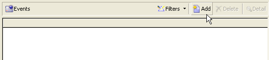
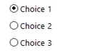

# 表单结构{#form-structure}

表单的描述是一个结构化XML文档，它观察表单架构 **xtk:form的语法**。

输入表单的XML文档必须包含根元素，其 `<form>` 中包含name **** 和namespace **** 属性，以填充表单名称和namespace。

```
<form name="form_name" namespace="name_space">
...
</form>
```

默认情况下，表单与具有相同名称和命名空间的数据架构相关联。 要将表单与其他名称关联，请将元 **素的entity-schema**`<form>` 属性设置为架构键的名称。 为了说明输入表单的结构，让我们使用“cus:recipient”示例架构描述一个界面：

```
<srcSchema name="recipient" namespace="cus">
  <enumeration name="gender" basetype="byte">    
    <value name="unknown" label="Not specified" value="0"/>    
    <value name="male" label="Male" value="1"/>   
    <value name="female" label="Female" value="2"/>   
  </enumeration>

  <element name="recipient">
    <attribute name="email" type="string" length="80" label="Email" desc="E-mail address of recipient"/>
    <attribute name="birthDate" type="datetime" label="Date"/>
    <attribute name="gender" type="byte" label="Gender" enum="gender"/>
  </element>
</srcSchema>
```

基于示例架构的输入表单：


```
<form name="recipient" namespace="cus">
  <input xpath="@gender"/>
  <input xpath="@birthDate"/>
  <input xpath="@email"/>
</form>
```

编辑控件的描述从根元素开 `<form>` 始。 在元素中输入编辑控 **`<input>`** 件，该元素的 **** xpath属性包含该字段在其架构中的路径。

编辑控件自动适应相应的数据类型并使用架构中定义的标签。

>[!NOTE]
>
>您可以通过向元素添加标签属性来使其数据架构中定义 **的标签** 过载 `<input>` :\
>`<input label="E-mail address" xpath="@name" />`

默认情况下，每个字段都显示在一行上，并根据数据类型占用所有可用空间。

## 格式化 {#formatting}

控件的布局与HTML表中使用的布局类似，可将控件分为几列、交错元素或指定可用空间的占用。 但是，记住，格式只允许您按比例将区域分成若干组；不能为对象指定固定尺寸。

要在两列中显示上述示例的控件，请执行以下操作：


```
<form name="recipient" namespace="cus">
  <container colcount="2">
    <input xpath="@gender"/>
    <input xpath="@birthDate"/>
    <input xpath="@email"/>
  </container>
</form>
```

具 **`<container>`** 有colcount属性的元 **素** ，允许您将子控件的显示强制显示到两列上。

控 **件上的colspan** 属性按值中输入的列数扩展控件：


```
<form name="recipient" namespace="cus">
  <container colcount="2">
    <input xpath="@gender"/>
    <input xpath="@birthDate"/>
    <input xpath="@email" colspan="2"/>
  </container>
</form> 
```

通过填充 **type=&quot;frame&quot;属性** ，容器在子控件周围添加一个帧，标签属性中包含 **标签** :


```
<form name="recipient" namespace="cus">
  <container colcount="2" type="frame" label="General">
    <input xpath="@gender"/>
    <input xpath="@birthDate"/>
    <input xpath="@email" colspan="2"/>
  </container>
</form>
```

元 **`<static>`** 素可用于格式化输入表单：


```
<form name="recipient" namespace="cus">
  <static type="separator" colspan="2" label="General"/>
  <input xpath="@gender"/>
  <input xpath="@birthDate"/>
  <input xpath="@email" colspan="2"/>
  <static type="help" label="General information about recipient with date of birth, gender, and e-mail address." colspan="2"/>
</form>
```

具有 **`<static>`** separator类型的标 **签允许您添加分隔符栏，其标签包含在标签属** 性中 **** 。

使用带有帮助类型的标 `<static>` 记添加了帮助文本。 文本的内容在标签属性中 **输入** 。

## 容器 {#containers}

容器可让您对一组控件进行分组。 它们由元素表 **`<container>`** 示。 上面使用它们设置多列控件的格式。

通过 **的xpath** 属性 `<container>` 可简化子控件的引用。 控件的引用随后会相对于父级 `<container>` 控件。

不带“xpath”的容器的示例：

```
<container colcount="2">
  <input xpath="location/@zipCode"/>
  <input xpath="location/@city"/>
</container>
```

例如，在名为“location”的元素中添加了“xpath”:

```
<container colcount="2" xpath="location">
  <input xpath="@zipCode"/>
  <input xpath="@city"/>
</container>
```

### 容器类型 {#types-of-container}

容器用于使用在页面中格式化的一组字段来构造复杂控件。

#### Tab容器 {#tab-container}

制表符容器可以格式化页面中的数据，这些页面可以通过制表符访问。


```
<container type="notebook">
  <container colcount="2" label="General">
    <input xpath="@gender"/>
    <input xpath="@birthDate"/>
    <input xpath="@email" colspan="2"/>
  </container>
  <container colcount="2" label="Location">
    ...
  </container>
</container>
```

主容器由type=&quot; **notebook&quot;属性定义** 。 子容器中声明了选项卡，标签的标签会从标签属性中填 **充** 。

>[!NOTE]
>
>样 **式=&quot;down|up**（默认）**** &quot;功能强制选项卡标签在控件下方或控件上方的垂直位置。 此功能是可选的。
>
>`<container style="down" type="notebook">  ... </container>`

#### 图标列表 {#icon-list}

此容器显示一个垂直图标栏，通过该图标栏可选择要显示的页面。


```
<container type="iconbox">
  <container colcount="2" label="General" img="xtk:properties.png">
    <input xpath="@gender"/>
    <input xpath="@birthDate"/>
    <input xpath="@email" colspan="2"/>
  </container>
  <container colcount="2" label="Location" img="nms:msgfolder.png">
    ...
  </container>
</container>
```

主容器由type=&quot;iconbox&quot; **属性定义** 。 与图标关联的页面在子容器中声明。 图标的标签将从标签属性中填 **充** 。

页面的图标会从属性中填充 `img="<image>"` ，其中 `<image>` 是与图像的键相对应的名称，该键由名称和命名空间组成（例如，“xtk:properties.png”）。

这些图像可从节点获 **[!UICONTROL Administration > Configuration > Images]** 得。

#### 可见性容器 {#visibility-container}

您可以通过动态条件遮罩一组控件。

此示例说明了控件对“性别”字段值的可见性：

```
<container type="visibleGroup" visibleIf="@gender=1">
  ...
</container>
<container type="visibleGroup" visibleIf="@gender=2">
  ...
</container>
```

可见性容器由属性 **type=&quot;visibleGroup&quot;定义**。 visibleIf **属性包含** visibility条件。

条件语法示例：

* **visibleIf=&quot;@email=&#39;peter.martinezATneeolane.net&#39;&quot;**:测试字符串类型数据的等同性。 比较值必须用引号引起来。
* **visibleIf=&quot;@gender >= 1和@gender != 2&quot;**:条件。
* **visibleIf=&quot;@boolean1==true或@boolean2==false&quot;**:测试布尔字段。

#### 启用容器 {#enabling-container}

此容器允许您从动态条件启用或禁用一组数据。 禁用控件可阻止编辑它。 以下示例说明了如何从“性别”字段的值启用控件：

```
<container type="enabledGroup" enabledIf="@gender=1">
  ...
</container>
<container type="enabledGroup" enabledIf="@gender=2">
  ...
</container>
```

启用容器由 **type=&quot;enabledGroup&quot;属性定义** 。 enabledIf **属性包含** 激活条件。

## 编辑链接 {#editing-a-link}

请记住，数据架构中声明了以下链接：

```
<element label="Company" name="company" target="cus:company" type="link"/>
```

链接在其输入表单中的编辑控制如下：


```
<input xpath="company"/>
```

可通过编辑字段访问目标选择。 输入由提前键入辅助，以便从输入的前几个字符中轻松找到目标元素。 然后，搜索将基于目标架构 **中定义的** “计算”字符串。 如果在控件中进行验证后该架构不存在，则会显示即时创建目标的确认消息。 确认会在目标表中创建新记录，并将其与链接关联。

下拉列表用于从已创建的记录列表中选择目标元素。

(文 **[!UICONTROL Modify the link]** 件夹)图标将启动一个选择表单，其中包含目标元素列表和筛选区域：


(放 **[!UICONTROL Edit link]** 大镜)图标将启动链接元素的编辑表单。 默认情况下，所使用的形式由目标架构的键推导。 通过 **表单** 属性，您可以强制使用编辑表单的名称(例如，“cus:company2”)。

您可以通过在输入表单的链接定义中添加元 **`<sysfilter>`** 素来限制目标元素的选择：

```
<input xpath="company">
  <sysFilter>
    <condition expr="[location/@city] =  'Newton"/>
  </sysFilter>
</input>
```

您还可以使用元素对列表进行 **`<orderby>`** 排序：

```
<input xpath="company">
  <orderBy>
    <node expr="[location/@zipCode]"/>
  </orderBy>
</input>
```

### 控制属性 {#control-properties}

* **noAutoComplete**:禁用预先键入（值为“true”）
* **createMode**:如果链接不存在，则立即创建该链接。 可能的值包括：

   * **none**:禁用创建。 如果链接不存在，则显示错误消息
   * **内联**:创建与编辑字段中的内容的链接
   * **edition**:在链接上显示编辑表单。 验证表单后，将保存数据（默认模式）

* **noZoom**:链接上没有编辑表单（带有值“true”）
* **表单**:过载目标元素的编辑表单

## 链接列表 {#list-of-links}

作为集合元素(unboind=&quot;true&quot;)在数据架构中输入的链接必须经过一个列表才能查看与其关联的所有元素。

该原则包括显示链接元素列表，并优化数据加载（通过数据批量下载，仅当列表可见时执行）。

架构中的集合链接示例：

```
<element label="Events" name="rcpEvent" target="cus:event" type="link" unbound="true">
...
</element>
```

其输入表单中的列表：



```
 <input xpath="rcpEvent" type="linklist">
  <input xpath="@label"/>
  <input xpath="@date"/>
</input>
```

列表控件由 **type=&quot;linklist&quot;属性定义** 。 列表路径必须引用集合链接。

列通过列表的元 **`<input>`** 素声明。 xpath **属性引用** 目标架构中字段的路径。

带有标签的工具栏（在架构中的链接上定义）会自动放置在列表上方。

可以通过按钮过滤列 **[!UICONTROL Filters]** 表，并配置为添加列和对列排序。

通过 **[!UICONTROL Add]** 和 **[!UICONTROL Delete]** 按钮可以在链接上添加和删除集合元素。 默认情况下，添加元素会启动目标架构的编辑表单。

当列 **[!UICONTROL Detail]** 表标记上的 **zoom=&quot;true&quot;属性完成时** ，将自动添 **`<input>`** 加按钮：它允许您启动选定行的编辑表单。

加载列表时，可以应用筛选和排序：

```
 <input xpath="rcpEvent" type="linklist">
  <input xpath="@label"/>
  <input xpath="@date"/>
  <sysFilter>
    <condition expr="@type = 1"/>
  </sysFilter>
  <orderBy>
    <node expr="@date" sortDesc="true"/>
  </orderBy>
</input>
```

### 关系表 {#relationship-table}

关系表允许您将两个表与N-N基数链接。 关系表只包含指向两个表的链接。

因此，向列表添加元素应允许您从关系表中的两个链接之一完成列表。

架构中关系表的示例：

```
<srcSchema name="subscription" namespace="cus">
  <element name="recipient" type="link" target="cus:recipient" label="Recipient"/>
  <element name="service" type="link" target="cus:service" label="Subscription service"/>
</srcSchema>
```

对于我们的示例，我们从“cus:recipient”架构的输入表单开始。 该列表必须显示与服务订阅的关联，并且必须允许您通过选择现有服务来添加订阅。


```
<input type="linklist" xpath="subscription" xpathChoiceTarget="service" xpathEditTarget="service" zoom="true">
  <input xpath="recipient"/>
  <input xpath="service"/>
</input>
```

通过 **xpathChoiceTarget属性** ，您可以从输入的链接中启动选择表单。 创建关系表记录将自动更新指向当前收件人和选定服务的链接。

>[!NOTE]
>
>通 **过xpathEditTarget** 属性，您可以在输入的链接上强制编辑选定的行。

### 列表属性 {#list-properties}

* **noToolbar**:隐藏工具栏（值为“true”）
* **toolbarCaption**:过载工具栏标签
* **工具栏对齐**:修改工具栏的垂直或水平几何(可能的值：&quot;vertical&quot;|&quot;horizontal&quot;)
* **img**:显示与列表关联的图像
* **表单**:过载目标元素的编辑表单
* **缩放**:添加用 **[!UICONTROL Zoom]** 于编辑目标元素的按钮
* **xpathEditTarget**:设置对所输入链接的编辑
* **xpathChoiceTarget**:此外，在输入的链接上启动选择表单

## 内存列表控件 {#memory-list-controls}

内存列表允许您使用列表数据预加载来编辑集合元素。 无法过滤或配置此列表。

这些列表用于XML映射的集合元素或低容量链接。

### 列列表 {#column-list}

此控件显示可编辑的列列表，其中包含“添加”和“删除”按钮的工具栏。


```
<input xpath="rcpEvent" type="list">
  <input xpath="@label"/>
  <input xpath="@date"/>
</input>
```

必须使用 **type=&quot;list&quot;属性填充列表控件** ，并且列表的路径必须引用集合元素。

列在列表的子标 **`<input>`** 记中声明。 列标签和大小可以强制使用 **label****和colSize属** 性。

>[!NOTE]
>
>将 **ordered=&quot;true&quot;属性添加到数据架构中的集合元素时** ，会自动添加排序箭头。

工具栏按钮可以水平对齐：


```
<input nolabel="true" toolbarCaption="List of events" type="list" xpath="rcpEvent" zoom="true">
  <input xpath="@label"/>
  <input xpath="@date"/>
</input>
```

工 **具栏Caption** 属性强制工具栏的水平对齐方式，并在列表上方输入标题。

#### 放大列表 {#zoom-in-a-list}

可以在单独的编辑表单中输入列表中数据的插入和编辑操作。


```
<input nolabel="true" toolbarCaption="List of events" type="list" xpath="rcpEvent" zoom="true" zoomOnAdd="true">
  <input xpath="@label"/>
  <input xpath="@date"/>

  <form colcount="2" label="Event">
    <input xpath="@label"/>
    <input xpath="@date"/>
  </form>
</input>
```

编辑表单是从列表定义的元 `<form>` 素中完成的。 其结构与输入形式相同。 当列 **[!UICONTROL Detail]** 表标记上的 **zoom=&quot;true&quot;属性完成时** ，将自动添 **`<input>`** 加按钮。 此属性允许您启动选定行的编辑表单。

>[!NOTE]
>
>添加 **** zoomOnAdd=&quot;true&quot;属性会强制在插入列表元素时调用编辑表单。

### 列表属性 {#list-properties-1}

* **noToolbar**:隐藏工具栏（值为“true”）
* **toolbarCaption**:过载工具栏标签
* **工具栏对齐**:修改工具栏的位置(可能的值：&quot;vertical&quot;|&quot;horizontal&quot;)
* **img**:显示与列表关联的图像
* **表单**:过载目标元素的编辑表单
* **缩放**:添加用 **[!UICONTROL Zoom]** 于编辑目标元素的按钮
* **zoomOnAdd**:在添加的
* **xpathChoiceTarget**:此外，在输入的链接上启动选择表单

## 不可编辑的字段 {#non-editable-fields}

要显示字段并防止其被编辑，请使用标 **`<value>`** 签或完成标 **签上的readOnly=&quot;true** &quot;属 **`<input>`** 性。

“性别”字段示例：


```
<value value="@gender"/>
<input xpath="@gender" readOnly="true"/>
```

## 单选按钮 {#radio-button}

单选按钮可让您从多个选项中进行选择。 标记 **`<input>`** 用于列出可能的选项，且checkedValue属 **** 性指定与选项关联的值。

“性别”字段示例：

```
<input type="RadioButton" xpath="@gender" checkedValue="0" label="Choice 1"/>
<input type="RadioButton" xpath="@gender" checkedValue="1" label="Choice 2"/>
<input type="RadioButton" xpath="@gender" checkedValue="2" label="Choice 3"/>
```



## 复选框 {#checkbox}

复选框反映布尔状态（无论是否已选中）。 默认情况下，此控件由“Boolean”(true/false)字段使用。 默认值为0或1的变量可与此按钮关联。 此值可以通过checkValue属性 **过载** 。

```
<input xpath="@boolean1"/>
<input xpath="@field1" type="checkbox" checkedValue="Y"/>
```


## 导航层次编辑 {#navigation-hierarchy-edit}

此控件在一组要编辑的字段上构建树。

要编辑的控件按树控件标 **`<container>`** 记下输入的 **`<input>`** 内容进行分组：

```
<input nolabel="true" type="treeEdit">
  <container label="Text fields">
    <input xpath="@text1"/>
    <input xpath="@text2"/>
  </container>
  <container label="Boolean fields">
    <input xpath="@boolean1"/>
    <input xpath="@boolean2"/>
  </container>
</input>
```


## 表达式字段 {#expression-field}

表达式字段会从表达式动态更新字段；标记 **`<input>`** 与 **xpath属性一起使用，以输入要更新的字段的路径和包含更新表达式** 的expr **** 属性。

```
<!-- Example: updating the boolean1 field from the value contained in the field with path /tmp/@flag -->
<input expr="Iif([/tmp/@flag]=='On', true, false)" type="expr" xpath="@boolean1"/>
<input expr="[/ignored/@action] == 'FCP'" type="expr" xpath="@launchFCP"/>
```

## 表单的上下文 {#context-of-forms}

输入表单的执行初始化包含被编辑实体数据的XML文档。 此文档表示表单的上下文，并可用作工作区。

### 更新上下文 {#updating-the-context}

要修改表单的上下文，请使用标 **`<set expr="<value>" xpath="<field>"/>`** 签，其中是目 **`<field>`** 标字段， **`<value>`** 是更新表达式或值。

标记的使用示 **`<set>`** 例：

* **`<set expr="'Test'" xpath="/tmp/@test" />`**:将“测试”值放在临时位置/tmp/@test1
* **`<set expr="'Test'" xpath="@lastName" />`**:使用“Test”值更新“lastName”属性上的实体
* **`<set expr="true" xpath="@boolean1" />`**:将“boolean1”字段的值设置为“true”
* **`<set expr="@lastName" xpath="/tmp/@test" />`**:使用“lastName”属性的内容进行更新

在通过和标签初始化和关闭表单时，可以更新表单的上 **`<enter>`** 下文 **`<leave>`** 。

```
<form name="recipient" namespace="cus">
  <enter>
    <set...
  </enter>
  ...
  <leave>
    <set...
  </leave>
</form>
```

>[!NOTE]
>
>和 `<enter>` 标记 `<leave>` 可用于页面(“笔记本” `<container>` 和“iconbox”类型)。

### 表达语言 {#expression-language-}

可以在表单定义中使用宏语言来执行条件测试。

如果 **`<if expr="<expression>" />`** 验证了表达式，则标记将执行在标记下指定的指令：

```
<if expr="([/tmp/@test] == 'Test' or @lastName != 'Doe') and @boolean2 == true">
  <set xpath="@boolean1" expr="true"/>
</if>
```

与标 **`<check expr="<condition>" />`** 签组合的标签可 **`<error>`** 以阻止对表单的验证，并在条件不满足时显示错误消息：

```
<leave>
  <check expr="/tmp/@test != ''">
    <error>You must populate the 'Test' field!</error> 
  </check>
</leave>
```

## 奇才队 {#wizards}

向导会指导您完成页面形式的一组数据输入步骤。 在验证表单时，将保存输入的数据。

向导具有以下结构：

```
<form type="wizard" name="example" namespace="cus" img="nms:rcpgroup32.png" label="Wizard example" entity-schema="nms:recipient">
  <container title="Title of page 1" desc="Long description of page 1">
    <input xpath="@lastName"/>
    <input xpath="comment"/>
  </container>
  <container title="Title of page 2" desc="Long description of page 2">
    ...
  </container>
  ...
</form>
```


元素中存 **在type=&quot;wizard&quot;** ，这 `<form>` 样您就可以在表单构造中定义向导模式。 这些页面是从元 `<container>` 素（元素的子元素）中完 `<form>` 成的。 页面 `<container>` 的元素会填充标题的标题属性，并且desc会在页面标题下显示说明。 将自 **[!UICONTROL Previous]** 动添 **[!UICONTROL Next]** 加这些和按钮以允许在页面之间浏览。

该按 **[!UICONTROL Finish]** 钮保存输入的数据并关闭表单。

### SOAP方法 {#soap-methods}

可以从页面结尾的已填充标 **`<leave>`** 签启动SOAP方法执行。

标 **`<soapcall>`** 签包含对具有以下输入参数的方法的调用：

```
<soapCall name="<name>" service="<schema>">
  <param type="<type>" exprIn="<xpath>"/>  
  ...
</soapCall>
```

服务的名称及其实现方案通过标签的名 **称****和服务属性输****`<soapcall>`** 入。

在标签下的元素上描述 **`<param>`** 了输入参 **`<soapcall>`** 数。

必须通过type属性指定参数 **类型** 。 可能的类型如下：

* **字符串**:字符串
* **boolean**:Boolean
* **字节**:8位整数
* **short**:16位整数
* **long**:32位整数
* **short**:16位整数
* **double**:双精度浮点数
* **DOMElement**:元素类型节点

exprIn **属性** 包含要作为参数传递的数据的位置。

**示例**:

```
<leave>
  <soapCall name="RegisterGroup" service="nms:recipient">         
    <param type="DOMElement" exprIn="/tmp/entityList"/>         
    <param type="DOMElement" exprIn="/tmp/choiceList"/>         
    <param type="boolean"    exprIn="true"/>       
  </soapCall>
</leave>
```

