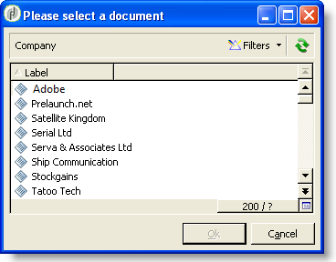

# 窗体结构{#form-structure}

表单的描述是一个结构化XML文档，它观察表单模式xtk: **form的语法**。

输入表单的XML文档必须包含 `<form>` 根元素，其 **名称****和命名空间属性** 才能填充表单名称和命名空间。

```
<form name="form_name" namespace="name_space">
...
</form>
```

默认情况下，表单与数据模式关联，名称和命名空间相同。 要将表单与其他名称关联，请 **将元素的** entity- `<form>` 模式属性设置为模式键的名称。 为了说明输入表单的结构，我们使用“cus:收件人”示例模式来描述一个接口：

```
<srcSchema name="recipient" namespace="cus">
  <enumeration name="gender" basetype="byte">    
    <value name="unknown" label="Not specified" value="0"/>    
    <value name="male" label="Male" value="1"/>   
    <value name="female" label="Female" value="2"/>   
  </enumeration>

  <element name="recipient">
    <attribute name="email" type="string" length="80" label="Email" desc="E-mail address of recipient"/>
    <attribute name="birthDate" type="datetime" label="Date"/>
    <attribute name="gender" type="byte" label="Gender" enum="gender"/>
  </element>
</srcSchema>
```

基于示例模式的输入表单：


```
<form name="recipient" namespace="cus">
  <input xpath="@gender"/>
  <input xpath="@birthDate"/>
  <input xpath="@email"/>
</form>
```

编辑控件开始的描述来自根 `<form>` 元素。 在元素中输入编辑控 **`<input>`** 件，该元 **素的xpath** 属性在其模式中包含字段的路径。

编辑控件自动适应相应的数据类型并使用在模式中定义的标签。

>[!NOTE]
>
>您可以通过向元素添加标签属性来使其数据模式中 **定义** 的标签过 `<input>` 载：\
>`<input label="E-mail address" xpath="@name" />`

默认情况下，每个字段都显示在一行上，并根据数据类型占用所有可用空间。

## 格式化 {#formatting}

控件的布局与HTML表中使用的布局类似，可以将控件分为几列、隔行扫描元素或指定占用可用空间。 但是，请记住，格式设置只允许您按比例将区域向上划分；不能为对象指定固定尺寸。

要在两列中显示上述示例的控件：


```
<form name="recipient" namespace="cus">
  <container colcount="2">
    <input xpath="@gender"/>
    <input xpath="@birthDate"/>
    <input xpath="@email"/>
  </container>
</form>
```

具 **`<container>`** 有colcount属性 **的元素** ，可强制将子控件显示到两列上。

控 **件上的** colspan属性按值中输入的列数扩展控件：


```
<form name="recipient" namespace="cus">
  <container colcount="2">
    <input xpath="@gender"/>
    <input xpath="@birthDate"/>
    <input xpath="@email" colspan="2"/>
  </container>
</form> 
```

通过填充 **type=&quot;frame&quot;属性** ,容器在子控件周围添加一个帧，标签属性中包含 **标签** :


```
<form name="recipient" namespace="cus">
  <container colcount="2" type="frame" label="General">
    <input xpath="@gender"/>
    <input xpath="@birthDate"/>
    <input xpath="@email" colspan="2"/>
  </container>
</form>
```

元 **`<static>`** 素可用于格式化输入表单：


```
<form name="recipient" namespace="cus">
  <static type="separator" colspan="2" label="General"/>
  <input xpath="@gender"/>
  <input xpath="@birthDate"/>
  <input xpath="@email" colspan="2"/>
  <static type="help" label="General information about recipient with date of birth, gender, and e-mail address." colspan="2"/>
</form>
```

具有 **`<static>`** 分隔符 **类型的标签** ，允许您添加带有标签的分隔条，该标签包含在标签 **属性中** 。

使用带帮助类型的标记 `<static>` 添加帮助文本。 文本的内容在标签属性 **中输** 入。

## 容器 {#containers}

容器允许您对一组控件进行分组。 它们由元素表 **`<container>`** 示。 上面使用它们设置对多个列的控制的格式。

通过 **的** xpath属性 `<container>` 可简化子控件的引用。 控件的引用随后相对于父项 `<container>` 进行。

不带“xpath”的容器示例：

```
<container colcount="2">
  <input xpath="location/@zipCode"/>
  <input xpath="location/@city"/>
</container>
```

在名为“location”的元素中添加“xpath”的示例：

```
<container colcount="2" xpath="location">
  <input xpath="@zipCode"/>
  <input xpath="@city"/>
</container>
```

### 容器类型 {#types-of-container}

容器用于使用页面格式的一组字段构建复杂控件。

#### 选项卡容器 {#tab-container}

制表符容器可从制表符访问的页面中的数据。


```
<container type="notebook">
  <container colcount="2" label="General">
    <input xpath="@gender"/>
    <input xpath="@birthDate"/>
    <input xpath="@email" colspan="2"/>
  </container>
  <container colcount="2" label="Location">
    ...
  </container>
</container>
```

主容器由type=&quot; **notebook&quot;属性定义** 。 在子容器中声明标签，标签的标签会从标签属性 **中填** 充。

>[!NOTE]
>
>样 **式=&quot;down|up**（默认）**** &quot;功能强制选项卡标签在控件下或控件上方的垂直位置。 此功能属于可选功能。
>
>`<container style="down" type="notebook">  ... </container>`

#### 图标列表 {#icon-list}

此容器显示一个垂直图标栏，允许您选择要显示的页面。


```
<container type="iconbox">
  <container colcount="2" label="General" img="xtk:properties.png">
    <input xpath="@gender"/>
    <input xpath="@birthDate"/>
    <input xpath="@email" colspan="2"/>
  </container>
  <container colcount="2" label="Location" img="nms:msgfolder.png">
    ...
  </container>
</container>
```

主容器由type=&quot;iconbox&quot; **属性定义** 。 与图标关联的页面在子容器中声明。 图标的标签将从标签属性 **填充** 。

页面的图标会从属 `img="<image>"` 性填充，其 `<image>` 中是与其由名称和命名空间（例如“xtk:properties.png”）组成的键相对应的图像名称。

可从节点访问 **[!UICONTROL Administration > Configuration > Images]** 图像。

#### 可见性容器 {#visibility-container}

您可以通过动态条件遮住一组控件。

此示例说明了对“性别”字段值的控件的可见性：

```
<container type="visibleGroup" visibleIf="@gender=1">
  ...
</container>
<container type="visibleGroup" visibleIf="@gender=2">
  ...
</container>
```

可见性容器由属性 **type=&quot;visibleGroup&quot;定义**。 visibleIf **属性** 包含可见性条件。

条件语法示例：

* **visibleIf=&quot;@email=&#39;peter.martinezATneeolane.net&#39;&quot;**:测试字符串类型数据上的相等。 比较值必须加引号。
* **visibleIf=&quot;@gender >= 1和@gender != 2&quot;**:条件。
* **visibleIf=&quot;@boolean1==true或@boolean2==false&quot;**:测试布尔字段。

#### 启用容器 {#enabling-container}

此容器允许您启用或禁用动态条件中的一组数据。 禁用控件可阻止编辑它。 以下示例说明了如何启用“性别”字段值中的控件：

```
<container type="enabledGroup" enabledIf="@gender=1">
  ...
</container>
<container type="enabledGroup" enabledIf="@gender=2">
  ...
</container>
```

启用容器由type=&quot;enabledGroup&quot; **属性定义** 。 enabledIf **属性** 包含激活条件。

## 编辑链接 {#editing-a-link}

请记住，链接在数据模式中声明如下：

```
<element label="Company" name="company" target="cus:company" type="link"/>
```

链接在其输入形式中的编辑控制如下：


```
<input xpath="company"/>
```

目标选择可通过编辑字段访问。 输入由预排文字辅助，以便从输入的前几个字符中轻松找到目标元素。 然后，搜索将基于目标模式 **中定义的** “计算”字符串。 如果模式在控件中验证后不存在，则会显示即时创建目标的确认消息。 确认将在目标表中创建新记录并将其与链接关联。

下拉列表用于从已创建的记录的列表中选择目标元素。

(文 **[!UICONTROL Modify the link]** 件夹)图标将启动一个选择表单，其中包含目标元素的列表和筛选区域：



(放 **[!UICONTROL Edit link]** 大镜)图标将启动链接元素的编辑表单。 默认情况下，所使用的形式会在目标模式的键上推导。 通过 **表单** 属性，您可以强制使用编辑表单的名称(例如，“cus:公司2”)。

您可以通过在输入表单中从链接定义 **`<sysfilter>`** 添加元素来限制目标元素的选择：

```
<input xpath="company">
  <sysFilter>
    <condition expr="[location/@city] =  'Newton"/>
  </sysFilter>
</input>
```

您还可以使用元素对列表进行 **`<orderby>`** 排序：

```
<input xpath="company">
  <orderBy>
    <node expr="[location/@zipCode]"/>
  </orderBy>
</input>
```

### 控制属性 {#control-properties}

* **noAutoComplete**:禁用预先键入（值为“true”）
* **createMode**:如果链接不存在，则立即创建该链接。 可能的值有：

   * **无**:禁用创建。 如果链接不存在，则显示错误消息
   * **内联**:创建与编辑字段中的内容的链接
   * **版本**:在链接上显示编辑表单。 验证表单后，将保存数据（默认模式）

* **noZoom**:链接上没有编辑表单（值为“true”）
* **表单**:过载目标元素的编辑表单

## 链接列表 {#list-of-links}

在数据模式中输入的作为收集元素的链接(unboind=&quot;true&quot;)必须经过列表，才能视图与其关联的所有元素。

其原理是显示链接元素的列表以及优化的数据加载(通过数据批下载，仅当列表可见时执行)。

模式中的集合链接示例：

```
<element label="Events" name="rcpEvent" target="cus:event" type="link" unbound="true">
...
</element>
```

列表输入形式：


```
 <input xpath="rcpEvent" type="linklist">
  <input xpath="@label"/>
  <input xpath="@date"/>
</input>
```

列表控件由 **type=&quot;linklist&quot;属性定** 义。 列表路径必须引用集合链接。

列通过列表的 **`<input>`** 元素声明。 xpath **属性** 指目标模式中字段的路径。

带有标签的工具栏(在模式中的链接上定义)会自动放置在列表上方。

列表可通过按钮进行筛 **[!UICONTROL Filters]** 选，并配置为添加列和对列进行排序。

通过 **[!UICONTROL Add]** 和 **[!UICONTROL Delete]** 按钮可以在链接上添加和删除集合元素。 默认情况下，添加元素会启动目标模式的编辑表单。

在 **[!UICONTROL Detail]** 列表的标记上完 **成zoom=&quot;true** &quot;属性时，会自 **`<input>`** 动添加按钮：它允许您启动所选行的编辑表单。

加载列表时，可以应用筛选和排序：

```
 <input xpath="rcpEvent" type="linklist">
  <input xpath="@label"/>
  <input xpath="@date"/>
  <sysFilter>
    <condition expr="@type = 1"/>
  </sysFilter>
  <orderBy>
    <node expr="@date" sortDesc="true"/>
  </orderBy>
</input>
```

### 关系表 {#relationship-table}

关系表允许您将两个表与N-N基数链接。 关系表只包含指向两个表的链接。

因此，向列表添加元素应允许您从关系表中的两个链接之一完成列表。

模式中关系表的示例：

```
<srcSchema name="subscription" namespace="cus">
  <element name="recipient" type="link" target="cus:recipient" label="Recipient"/>
  <element name="service" type="link" target="cus:service" label="Subscription service"/>
</srcSchema>
```

例如，我们使用“cus:收件人”模式的输入形式进行开始。 列表必须显示与订阅与服务的关联，并且必须允许您通过选择现有服务来添加订阅。


```
<input type="linklist" xpath="subscription" xpathChoiceTarget="service" xpathEditTarget="service" zoom="true">
  <input xpath="recipient"/>
  <input xpath="service"/>
</input>
```

通过 **xpathChoiceTarget** 属性，您可以从输入的链接中启动选择表单。 创建关系表记录将自动更新指向当前收件人和选定服务的链接。

>[!NOTE]
>
>通 **过xpathEditTarget** 属性，可以强制编辑输入的链接上的选定行。

### 列表属性 {#list-properties}

* **noToolbar**:隐藏工具栏（值为“true”）
* **toolbarCaption**:过载工具栏标签
* **工具栏对齐**:修改工具栏的垂直或水平几何(可能的值：&quot;vertical&quot;|&quot;horizontal&quot;)
* **img**:显示与列表关联的图像
* **表单**:过载目标元素的编辑表单
* **缩放**:添加用 **[!UICONTROL Zoom]** 于编辑目标元素的按钮
* **xpathEditTarget**:设置所输入链接的编辑
* **xpathChoiceTarget**:此外，在输入的链接上启动选择表单

## 内存列表控件 {#memory-list-controls}

内存列表允许您使用列表数据预加载来编辑集合元素。 无法筛选或配置此列表。

这些列表用于XML映射的集合元素或低容量链接。

### 列列表 {#column-list}

此控件显示可编辑的列列表，其工具栏包含“添加”和“删除”按钮。


```
<input xpath="rcpEvent" type="list">
  <input xpath="@label"/>
  <input xpath="@date"/>
</input>
```

列表控件必须用type=&quot; **列表&quot;属性填充** ,列表的路径必须引用集合元素。

列在列表的子标 **`<input>`** 记中声明。 列标签和大小可以强制使用 **label****和colSize属** 性。

>[!NOTE]
>
>在数据模式中向集合元素 **添加ordered=&quot;true** &quot;属性时，会自动添加排序顺序箭头。

工具栏按钮可以水平对齐：


```
<input nolabel="true" toolbarCaption="List of events" type="list" xpath="rcpEvent" zoom="true">
  <input xpath="@label"/>
  <input xpath="@date"/>
</input>
```

工 **具栏** Caption属性强制工具栏的水平对齐方式并在列表上方输入标题。

#### 放大列表 {#zoom-in-a-list}

在列表中插入和编辑数据可以在单独的编辑表单中输入。


```
<input nolabel="true" toolbarCaption="List of events" type="list" xpath="rcpEvent" zoom="true" zoomOnAdd="true">
  <input xpath="@label"/>
  <input xpath="@date"/>

  <form colcount="2" label="Event">
    <input xpath="@label"/>
    <input xpath="@date"/>
  </form>
</input>
```

编辑表单从列表定义的 `<form>` 元素中完成。 其结构与输入形式相同。 当 **[!UICONTROL Detail]** 列表标记上 **的zoom=&quot;true** &quot;属性完成时， **`<input>`** 将自动添加按钮。 此属性允许您启动选定行的编辑表单。

>[!NOTE]
>
>添加 **zoomOnAdd=&quot;true** &quot;属性会强制在插入列表元素时调用编辑表单。

### 列表属性 {#list-properties-1}

* **noToolbar**:隐藏工具栏（值为“true”）
* **toolbarCaption**:过载工具栏标签
* **工具栏对齐**:修改工具栏的位置(可能的值：&quot;vertical&quot;|&quot;horizontal&quot;)
* **img**:显示与列表关联的图像
* **表单**:过载目标元素的编辑表单
* **缩放**:添加用 **[!UICONTROL Zoom]** 于编辑目标元素的按钮
* **zoomOnAdd**:在添加项上启动编辑表单
* **xpathChoiceTarget**:此外，在输入的链接上启动选择表单

## 不可编辑字段 {#non-editable-fields}

要显示字段并防止其被编辑，请使 **`<value>`** 用标记或完 **成标记上的readOnly** =&quot;true&quot; **`<input>`** 属性。

“性别”字段示例：


```
<value value="@gender"/>
<input xpath="@gender" readOnly="true"/>
```

## 单选按钮 {#radio-button}

单选按钮允许您从多个选项中进行选择。 标记 **`<input>`** 用于列表可能的选项，且checkedValue属 **性指定** 与选项关联的值。

“性别”字段示例：

```
<input type="RadioButton" xpath="@gender" checkedValue="0" label="Choice 1"/>
<input type="RadioButton" xpath="@gender" checkedValue="1" label="Choice 2"/>
<input type="RadioButton" xpath="@gender" checkedValue="2" label="Choice 3"/>
```


## 复选框 {#checkbox}

复选框反映布尔状态（选中与否）。 默认情况下，此控件由“Boolean”(true/false)字段使用。 默认值为0或1的变量可以与此按钮关联。 此值可以通过checkValue属性 **重载** 。

```
<input xpath="@boolean1"/>
<input xpath="@field1" type="checkbox" checkedValue="Y"/>
```


## 导航层次结构编辑 {#navigation-hierarchy-edit}

此控件在要编辑的字段集上构建树。

要编辑的控件按树形控件标 **`<container>`** 签下输 **`<input>`** 入的内容进行分组：

```
<input nolabel="true" type="treeEdit">
  <container label="Text fields">
    <input xpath="@text1"/>
    <input xpath="@text2"/>
  </container>
  <container label="Boolean fields">
    <input xpath="@boolean1"/>
    <input xpath="@boolean2"/>
  </container>
</input>
```


## 表达式字段 {#expression-field}

表达式字段会从表达式动态更新字段；标记 **`<input>`** 与xpath属性 **一起使用** ，以输入要更新的字段的路径以及 **包含更新** 表达式的expr属性。

```
<!-- Example: updating the boolean1 field from the value contained in the field with path /tmp/@flag -->
<input expr="Iif([/tmp/@flag]=='On', true, false)" type="expr" xpath="@boolean1"/>
<input expr="[/ignored/@action] == 'FCP'" type="expr" xpath="@launchFCP"/>
```

## 表单的上下文 {#context-of-forms}

输入表单的执行初始化包含被编辑实体的文档的XML。 此文档表示表单的上下文，并可用作工作区。

### 更新上下文 {#updating-the-context}

要修改表单的上下文，请使 **`<set expr="<value>" xpath="<field>"/>`** 用标记，其 **`<field>`** 中是目标字段， **`<value>`** 也是更新表达式或值。

标记的使用示 **`<set>`** 例：

* **`<set expr="'Test'" xpath="/tmp/@test" />`**:将“测试”值定位在临时位置/tmp/@test1
* **`<set expr="'Test'" xpath="@lastName" />`**:使用“测试”值更新“lastName”属性上的实体
* **`<set expr="true" xpath="@boolean1" />`**:将“boolean1”字段的值设置为“true”
* **`<set expr="@lastName" xpath="/tmp/@test" />`**:使用“lastName”属性的内容进行更新

在初始化和关闭表单时，可以通过和标记更新表单的 **`<enter>`** 上 **`<leave>`** 下文。

```
<form name="recipient" namespace="cus">
  <enter>
    <set...
  </enter>
  ...
  <leave>
    <set...
  </leave>
</form>
```

>[!NOTE]
>
>和 `<enter>` 标记 `<leave>` 可用于页面( `<container>` “笔记本”和“iconbox”类型)。

### 表达式语 {#expression-language-}

在表单定义中可以使用宏语言来执行条件测试。

如 **`<if expr="<expression>" />`** 果验证了表达式，则标记将执行标记下指定的指令：

```
<if expr="([/tmp/@test] == 'Test' or @lastName != 'Doe') and @boolean2 == true">
  <set xpath="@boolean1" expr="true"/>
</if>
```

与标 **`<check expr="<condition>" />`** 签组合的标 **`<error>`** 签会阻止对表单的验证，并在条件不满足时显示错误消息：

```
<leave>
  <check expr="/tmp/@test != ''">
    <error>You must populate the 'Test' field!</error> 
  </check>
</leave>
```

## 向导 {#wizards}

向导将指导您完成页面形式的一组数据输入步骤。 验证表单时将保存输入的数据。

向导具有以下结构：

```
<form type="wizard" name="example" namespace="cus" img="nms:rcpgroup32.png" label="Wizard example" entity-schema="nms:recipient">
  <container title="Title of page 1" desc="Long description of page 1">
    <input xpath="@lastName"/>
    <input xpath="comment"/>
  </container>
  <container title="Title of page 2" desc="Long description of page 2">
    ...
  </container>
  ...
</form>
```


元素中存 **在type=&quot;wizard** &quot;属性 `<form>` 允许您在表单的构造中定义向导模式。 这些页面是从元 `<container>` 素（元素的子级）完 `<form>` 成的。 页面 `<container>` 的元素会填充标题的标题属性，并且desc会在页面标题下显示说明。 将自 **[!UICONTROL Previous]** 动添 **[!UICONTROL Next]** 加和按钮以允许在页面之间浏览。

按 **[!UICONTROL Finish]** 钮保存输入的数据并关闭表单。

### SOAP方法 {#soap-methods}

SOAP方法可从页面末尾的已 **`<leave>`** 填充标记启动执行。

标 **`<soapcall>`** 签包含对具有以下输入参数的方法的调用：

```
<soapCall name="<name>" service="<schema>">
  <param type="<type>" exprIn="<xpath>"/>  
  ...
</soapCall>
```

服务的名称及其实现模式通过标 **签的名****称****`<soapcall>`** 和服务属性输入。

输入参数在标签下 **`<param>`** 的元素上进 **`<soapcall>`** 行说明。

必须通过type属性指定参 **数类** 型。 可能的类型如下：

* **字符串**:字符串
* **布尔**:布尔值
* **字节**:8位整数
* **简短**:16位整数
* **长**:32位整数
* **简短**:16位整数
* **多次**:多次精度浮点数
* **DOMElement**:元素类型节点

exprIn **属性** 包含要作为参数传递的数据的位置。

**示例**:

```
<leave>
  <soapCall name="RegisterGroup" service="nms:recipient">         
    <param type="DOMElement" exprIn="/tmp/entityList"/>         
    <param type="DOMElement" exprIn="/tmp/choiceList"/>         
    <param type="boolean"    exprIn="true"/>       
  </soapCall>
</leave>
```

