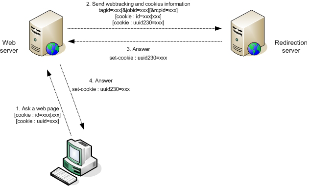

# 在站点中插入标记{#inserting-tags-in-your-site}

## 简单方法{#simple-method}

此方法包括通过在要跟踪的网页的HTML源代码中插入&#x200B;**``** HTML标记，向重定向服务器发送HTTP调用。

>[!IMPORTANT]
>
>此方法使用Web浏览器发送的Cookie来标识收件人，并且不是100%可靠。

**示例**:

```

  <...>
  <body>
  <script>
      document.write("");
    </script>
    <noscript>
     
    </noscript>
    <h1>My site</h1>
    <form action="http://localhost/amount.md">
      Quantity: <input type="text" name="quantity"/><br/><br/>
      Amount: <input type="text" name="amount"/><br/><br/>
      <input value="Save" type="submit">
    </form>
  </body>
</html>
```

在确认页面(“amount.md”)中插入TRANSACTION类型的Web跟踪标签。

```
<html>
  <body>
    <script>
      function getURLparam(name) 
      {
        var m = location.search.match new RegExp("[?&]" + name + "=([^&]+)"));
        return m ? unescape(m[1]) : "";
      }
 
       var params = "https://localhost/r/" + Math.random().toString() + "?tagid=amount&amount="
                      +getURLparam("amount")+"&article="+getURLparam("quantity");
       document.write("");
    </script>

    <h1>Approval confirmation</h1>
  </body>
</html>
```

### 动态生成Web跟踪标签{#dynamic-generation-of-web-tracking-tags}

动态生成网页时，您可以在页面生成时添加网页跟踪标签。

**示例**:Web 跟踪添加到JSP。

```
<%@page import="java.util.Random" %>
<html>
  <body>
    ?tagid=home'>
    <h1>My site</h1>
    <form action="https://localhost/amount.md">
      Quantity: <input type="text" name="quantity"/><br/><br/>
      Amount: <input type="text" name="amount"/><br/><br/>
      <input value="Save" type="submit">
    </form>
  </body>
</html>
```

```
<%@page import="java.util.Random" %>
<html>
  <body>
    <%  
      String strParams = new Random().nextInt() + "?tagid=amount";
      strParams += "&amount="+request.getParameter("amount");
      strParams += "&article="+request.getParameter("quantity");
    %>
    '>
    <h1>Approval confirmation</h1>
    </body>
</html>
```

## 最佳方法{#optimum-method-}

如果您希望控制发送到重定向服务器的信息，最可靠的方法是使用页面生成语言自行同步执行HTTP查询。

您构造的URL必须遵守[Web 跟踪标记中定义的语法规则：definition](../../configuration/using/web-tracking-tag--definition.md)。



>[!NOTE]
>
>重定向和Web跟踪使用Cookie，执行同步HTTP调用的Web服务器与重定向服务器位于同一域中非常重要。 各种HTTP交换必须传递“id”、“uuid”和“uuid230”cookie。

**示例**:在Java中动态生成，使用收件人的帐号进行身份验证。

```
[...]
  // Recipient account, amount and articles
  String strAccount = request.getParameter("account");
  String strAmount = request.getParameter("amount");
  String strArticle = request.getParameter("article");

  StringBuffer strCookies = new StringBuffer();
  String strSetCookie = null;

  // Get cookies from client request
  Cookie[] cookies = request.getCookies();
  for(int i=0; i< cookies.length; i++ )
  {
    Cookie c = cookies[i];
    String strName = c.getName();
    if( strName.equals("id") || strName.equals("uuid") || strName.equals("uuid230") )
      // Helper function to add cookies in string
      AddCookie(strCookies, c);
  }
  // Now perform a synchronous HTTP request to inform redirection server
  // Add a tagid in auto-discover mode, and a default jobId to use (in hexa)
  StringBuffer strURL = new StringBuffer("https://www.adobe.com/r/a?tagid=cmd_page%7Ct&jobid=27EE");
  if( strAccount != null )
    AddParameter(strURL, "rcpid", "saccount="+strAccount);
  if( strAmount != null )
    AddParameter(strURL, "amount", strAmount);
  if( strArticle != null )
    AddParameter(strURL, "article", strArticle);
  
  URL url = new URL(strURL.toString());
  HttpURLConnection connection = (HttpURLConnection)url.openConnection();
  // Add the client cookies
  if( strCookies.length() > 0 )
    connection.setRequestProperty("Cookie", strCookies.toString());

  int errcode = connection.getResponseCode();

  // Now add the Adobe Campaign cookies if the server returned one :
  if( errcode == 200 )
  {
    strSetCookie = connection.getHeaderField("Set-Cookie");
    if( strSetCookie != null && strSetCookie.length() > 0 )
      response.addHeader("Set-Cookie", strSetCookie);
  }
  [...]
```

