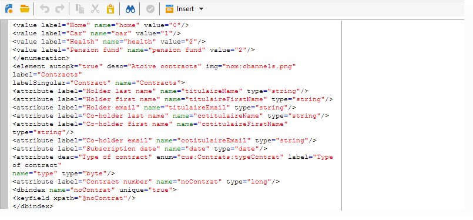

# 现有表的模式{#schema-of-an-existing-table}

## 概述 {#overview}

当应用程序需要访问现有表的数据、SQL视图或远程数据库中的数据时，请使用以下数据在Adobe Campaign中创建其模式：

* 表的名称：输入具有“sqltable”属性的表的名称（使用dblink时带有别名），
* 模式键：引用协调字段，
* 索引：用于生成查询，
* 字段及其在XML结构中的位置：仅填写应用程序中使用的字段，
* 链接：如果与基的其他表有连接。

## 实现 {#implementation}

要创建相应的方案，请应用以下阶段：

1. 编辑Adobe Campaign树的&#x200B;**[!UICONTROL Administration>Configuration>Data schemas]**&#x200B;节点，然后单击&#x200B;**[!UICONTROL New]** 。
1. 选择&#x200B;**[!UICONTROL Access data from an existing table or an SQL view]**&#x200B;选项并单击&#x200B;**[!UICONTROL Next]** 。

   

1. 选择表或现有视图：

   

1. 调整架构内容以满足您的需求。

   

   必须在`<srcSchema>`根元素上使用view=&quot;true&quot;属性填充架构，才能生成表创建SQL脚本。

**示例**：

```
<srcSchema name="recipient" namespace="cus" view="true">
  <element name="recipient" sqltable="dbsrv.recipient">
    <key name="email">
      <keyfield xpath="@email"/>
    </key>   
    <attribute name="email" type="string" length="80" sqlname="email"/>
  </element>
</srcSchema>
```

## 访问外部数据库 {#accessing-an-external-database}

通过&#x200B;**联合数据访问 — FDA**&#x200B;选项，您可以访问存储在外部数据库中的数据。

[此页面](../../installation/using/creating-data-schema.md)中详细描述了要用于架构访问外部数据库中的数据的配置。
