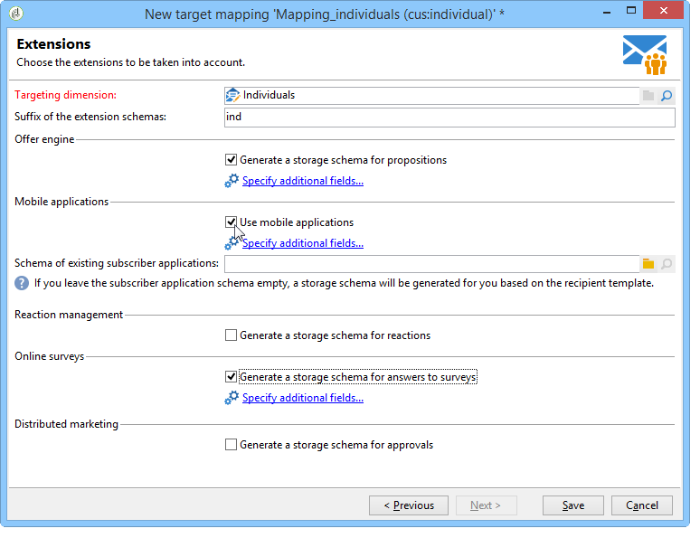

# 目标映射{#target-mapping}

在以下两种情况下，必须创建目标映射：

* 如果您使用的收件人表不是Adobe Campaign提供的收件人表，
* 如果在目标映射屏幕上配置了与标准定位维不同的筛选维。

目标映射创建向导将帮助您创建使用自定义表所需的所有架构。

## 创建和配置链接到自定义表的架构 {#creating-and-configuring-schemas-linked-to-the-custom-table}

在创建目标映射之前，Adobe Campaign必须进行多种配置才能使用新的收件人数据架构运行。

为此，请应用以下步骤：

1. 创建新的数据架构，该架构集成了要使用的自定义表的字段。

   有关详细信息，请参 [阅架构参考(xtk:srcSchema)](../../configuration/using/about-schema-reference.md)。

   在我们的示例中，我们将创建一个客户架构，一个包含以下字段的非常简单的表：ID，名，姓，电子邮件地址，手机号码。 其目的是能够向存储在此表中的个人发送电子邮件或短信通知。

   示例架构(cus:individual)

   ```
   <srcSchema name="individual" namespace="cus" label="Individuals">
     <element name="individual">
       <key name="id" internal="true">
         <keyfield xpath="@id"/>
       </key>
       <attribute name="id" type="long" length="32"/>
       <attribute name="lastName" type="string" length="100"/>
       <attribute name="firstName" type="string" length="100"/>
       <attribute name="email" type="string" length="100"/>
       <attribute name="mobile" type="string" length="100"/>
     </element>
   </srcSchema>
   ```

1. 使用=&quot;true&quot;属性将架构声明为外部视图。 请参阅 [视图属性](../../configuration/using/schema-characteristics.md#the-view-attribute)。

   ```
    <srcSchema desc="External recipient table" namespace="cus" view="true"....>
      ...
    </srcSchema>
   ```

1. 如果需要添加直邮地址，请使用以下类型的结构：

   ```
   <element advanced="true" name="postalAddress" template="nms:common:postalAddress">
        <attribute expr="SubString(JuxtWords(Smart([../infos/@firstname]), Upper([../infos/@name])), 1, 80)"
                   name="line1"/>
        <attribute expr="Upper([../address/@line2])" name="line2"/>
        <attribute expr="Upper([../address/@line])" name="line3"/>
        <attribute expr="Upper([../address/@line])" name="line4"/>
        <attribute expr="Upper([../address/@line])" name="line5"/>
        <attribute expr="Upper([../address/@line])" name="line6"/>
        <attribute _operation="delete" name="line7"/>
        <attribute _operation="delete" name="addrErrorCount"/>
        <attribute _operation="delete" name="addrQuality"/>
        <attribute _operation="delete" name="addrLastCheck"/>
        <element expr="@line1+'n'+@line2+'n'+@line3+'n'+@line4+'n'+@line5+'n'+@line6"
                 name="serialized"/>
        <attribute expr="AllNonNull2([../address/@line], [../infos/@name])" name="addrDefined"/>
      </element>
   ```

1. 单击节 **[!UICONTROL Administration > Campaign management > Target mappings]** 点。
1. 单击“ **新建** ”按钮以打开目标映射创建向导。
1. 输入标 **签字段** ，然后选择您刚在定位维字段中创建 **的架构** 。

   

1. 在“编 **辑地址表单** ”窗口中，选择与各种传送地址匹配的架构字段。 在这里，我们可以映射@email **和****@mobile** 字段。

   

1. 在以下“ **存储** ”窗口中，输入扩展架构的后缀字段 **** ，以将新架构与Adobe Campaign提供的现成架构区分开。

   单 **[!UICONTROL Define new additional fields]** 击以选择要在分发中定位的维。

   默认情况下，排除管理与消息存储在同一个表中。 如果要 **为链接到目标映射的跟踪配置存储** ，请选中“生成要跟踪的存储架构”复选框。

   

   >[!IMPORTANT]
   >
   >Adobe Campaign不支持链接到相同广播和／或跟踪日志架构的多个收件人架构（称为定位架构）。 否则，这可能导致以后数据协调中的异常。 有关此信息，请参阅建议和 [限制页](../../configuration/using/about-custom-recipient-table.md) 。

1. 在“扩 **展** ”窗口中，选择要生成的可选架构（可用架构列表取决于Adobe Campaign平台上安装的模块）。

   

1. 单击“ **保存** ”按钮以关闭向导。

   向导使用启动架构创建使新目标映射正常工作所需的所有其他架构。

   

## 使用目标映射 {#using-target-mapping}

有两种方法可以将新架构用作分发的目标：

* 根据映射创建一个或多个交付模板
* 在创建分发时在目标选择期间直接选择映射，如下所示：


**相关主题**

* [快速响应客户访问其数据的请求](https://helpx.adobe.com/campaign/kb/simplifying-campaign-management-acc.html#Quicklyrespondtocustomerrequeststoaccesstheirdata)