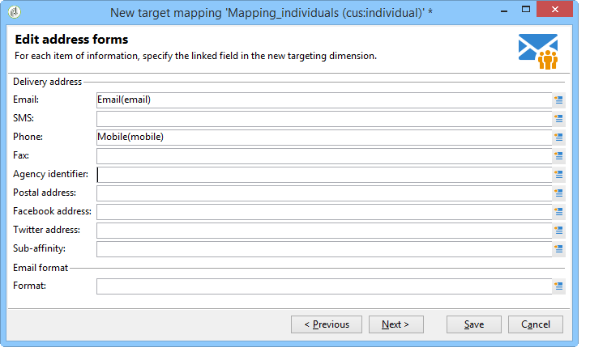

# 目标映射{#target-mapping}


在以下两种情况下，需要创建目标映射：

* 如果您使用的收件人表不是Adobe Campaign提供的表，
* 如果您配置的筛选维度与“目标映射”屏幕上的标准定向维度不同。

目标映射创建向导将帮助您创建使用自定义表所需的所有架构。

## 创建和配置链接到自定义表的架构 {#creating-and-configuring-schemas-linked-to-the-custom-table}

在创建目标映射之前，需要完成多个配置，以便Adobe Campaign能够与新的收件人数据架构一起运行。

要执行此操作，请应用以下步骤：

1. 创建一个新的数据架构，该架构集成了您要使用的自定义表的字段。

   欲知更多信息，请参见 [架构引用(xtk：srcSchema)](../../configuration/using/about-schema-reference.md).

   在我们的示例中，我们将创建一个客户模式，它是一个非常简单的表，包含以下字段：ID、名字、姓氏、电子邮件地址、手机号码。 目的是能够将电子邮件或短信警报发送给存储在此表中的个人。

   模式示例(cus：individual)

   ```
   <srcSchema name="individual" namespace="cus" label="Individuals">
     <element name="individual">
       <key name="id" internal="true">
         <keyfield xpath="@id"/>
       </key>
       <attribute name="id" type="long" length="32"/>
       <attribute name="lastName" type="string" length="100"/>
       <attribute name="firstName" type="string" length="100"/>
       <attribute name="email" type="string" length="100"/>
       <attribute name="mobile" type="string" length="100"/>
     </element>
   </srcSchema>
   ```

1. 使用=&quot;true&quot;属性将架构声明为外部视图。 请参阅 [视图属性](../../configuration/using/schema-characteristics.md#the-view-attribute).

   ```
    <srcSchema desc="External recipient table" namespace="cus" view="true"....>
      ...
    </srcSchema>
   ```

1. 如果您需要添加直邮地址，请使用以下类型的结构：

   ```
   <element advanced="true" name="postalAddress" template="nms:common:postalAddress">
        <attribute expr="SubString(JuxtWords(Smart([../infos/@firstname]), Upper([../infos/@name])), 1, 80)"
                   name="line1"/>
        <attribute expr="Upper([../address/@line2])" name="line2"/>
        <attribute expr="Upper([../address/@line])" name="line3"/>
        <attribute expr="Upper([../address/@line])" name="line4"/>
        <attribute expr="Upper([../address/@line])" name="line5"/>
        <attribute expr="Upper([../address/@line])" name="line6"/>
        <attribute _operation="delete" name="line7"/>
        <attribute _operation="delete" name="addrErrorCount"/>
        <attribute _operation="delete" name="addrQuality"/>
        <attribute _operation="delete" name="addrLastCheck"/>
        <element expr="@line1+'n'+@line2+'n'+@line3+'n'+@line4+'n'+@line5+'n'+@line6"
                 name="serialized"/>
        <attribute expr="AllNonNull2([../address/@line], [../infos/@name])" name="addrDefined"/>
      </element>
   ```

1. 单击 **[!UICONTROL Administration > Campaign management > Target mappings]** 节点。
1. 单击 **新** 按钮以打开目标映射创建向导。
1. 输入 **标签** 字段并选择之前在中创建的架构 **定位维度** 字段。

   

1. 在 **编辑地址表单** 窗口中，选择与各种投放地址匹配的架构字段。 在这里，我们可以映射 **@email** 和 **@mobile** 字段。

   

1. 在以下内容中 **存储** 窗口中，输入 **扩展架构的后缀** 用于区分Adobe Campaign提供的新架构和现成架构的字段。

   单击 **[!UICONTROL Define new additional fields]** 以选择要在投放中定位的维度。

   默认情况下，排除管理与消息存储在同一表中。

   查看 **生成存储架构以进行跟踪** 框（如果要为链接到目标映射的跟踪配置存储）。

   

   >[!IMPORTANT]
   >
   >Adobe Campaign不支持链接到同一broadlog和/或trackinglog架构的多个收件人架构（也称为定位架构）。 否则，这可能会导致以后数据协调出现异常。 有关详情，请参阅 [建议和限制](../../configuration/using/about-custom-recipient-table.md) 页面。

1. 在 **扩展** 窗口中，选择要生成的可选架构(可用架构列表取决于Adobe Campaign平台上安装的模块)。

   

1. 单击 **保存** 按钮以关闭向导。

   该向导使用启动架构来创建使新目标映射工作所需的所有其他架构。

   

## 使用目标映射 {#using-target-mapping}

可通过两种方式将新模式用作投放目标：

* 根据映射创建一个或多个投放模板
* 创建投放时，请在目标选择过程中直接选择映射，如下所示：


